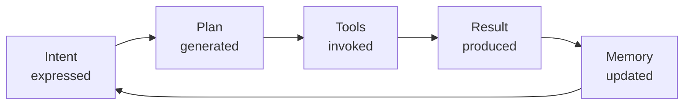

# NX-DOC-0005 — Product Philosophy

| Field | Value |
|-------|-------|
| **Document ID** | NX-DOC-0005 |
| **Title** | Product Philosophy |
| **Phase** | 1 — Master Blueprint |
| **Owner** | Product |
| **Status** | 🟢 Complete |
| **Version** | 0.1.0 |
| **Created** | 2026-06-30 |
| **Related** | NX-DOC-0004 (Core Principles), NX-DOC-0006 (AI-First Design Philosophy), NX-DOC-0007 (Audiences) |

---

## 1. Purpose

This document translates the 12 Core Principles into **product beliefs**: how we think about features, design, scope, and behavior. The PRD (Phase 2) descends from here.

## 2. The 7 product beliefs

### Belief 1 — The home screen is a question, not a destination

A traditional browser's home screen is a collection of links. NEXUS's home screen is a single prompt: *"What do you want accomplished?"*

The home screen never grows into a portal. It stays simple. Power surfaces — workspaces, marketplaces, settings — exist, but they are not the front door.

**Concretely:**
- Default home screen contains: a prompt, a recently-used workspaces row, and a "resume in-progress tasks" row.
- No more than 4 visible UI elements above the prompt.
- The prompt always owns the most visual weight.

### Belief 2 — Tabs are a low-level abstraction; Workspaces are the right one

Tabs were designed for static document viewing. NEXUS is designed for **goal-oriented work**. The unit of organization is the Workspace: a goal, its tabs, its notes, its files, its agents, and its memory.

**Concretely:**
- Every Workspace has a goal sentence.
- A Workspace persists across sessions, devices, and restarts.
- Cross-Workspace references are explicit, not implicit.
- The "tabs" of a Workspace are subordinate; closing a tab does not lose state.

### Belief 3 — Every command is reversible

The user should be able to try things without fear. "Cancel," "undo," and "what just happened?" are first-class operations.

**Concretely:**
- Every agent action that mutates state has a corresponding undo where possible.
- The Activity Log is searchable, filterable, and exportable.
- A "revert to this point" affordance exists on Workspaces and Cloud Browsers.
- Destructive confirmations name what will change, not just "Are you sure?"

### Belief 4 — The product should get smarter without asking

A user who has done something five times should not have to do it a sixth. Defaults adapt. Suggestions improve. The home screen should know what the user typically wants next.

**Concretely:**
- Memory Engine surfaces relevant context automatically.
- "Suggested next action" appears on Workspace home, based on recent activity.
- Recurring tasks surface at the right time without manual scheduling.
- The user can always turn this off — it is opt-in for each type of recommendation.

### Belief 5 — Latency is a feature

A 200ms response feels magical. A 3-second response feels broken. The product must be fast — not in benchmarks, but in the felt experience of the user.

**Concretely:**
- Every UI action has a perceived latency budget. The budget is in the design spec, not just the engineering spec.
- Streaming-first responses for AI outputs. Token-by-token rendering is the default.
- Skeleton states are honest. Loading text says what is happening.
- A command that requires long-running work is acknowledged in <500ms and then streamed.

### Belief 6 — Empty states are teaching moments

When a user first encounters a feature, they have no data, no history, no context. That moment is the most important teaching surface in the product. Empty states are not placeholders — they are the first conversation.

**Concretely:**
- Every first-time screen has a "show me how" affordance.
- Empty states suggest 2–3 example actions a user could try.
- Onboarding flows are short, contextual, and skippable.
- Sample workspaces and example agents exist to lower the activation barrier.

### Belief 7 — Features are removed, not just added

Every feature carries a maintenance, support, and cognitive cost. A feature that no longer serves a clear audience is removed — even if users complain. The product is shaped by subtraction as much as addition.

**Concretely:**
- A "deprecated features" review is a quarterly ritual.
- A feature must have a documented owner and at least 10% active usage in the prior 90 days, or it is flagged.
- The product roadmap has explicit "remove" slots equal to at least 20% of "add" slots.

## 3. The "intent lifecycle" — how a command flows through the product

The product is a continuous loop:

Every feature in NEXUS maps to a stage in this lifecycle. Features that do not map to any stage are rejected as scope creep.

| Stage | Product surface |
|-------|-----------------|
| Intent | Home screen, command bar, contextual prompts |
| Plan | Plan viewer (in AI Chat / Workspace) |
| Tools | Agent execution, Cloud Browsers, integrations |
| Result | Result panel, notifications, file outputs |
| Memory | Memory Engine, Activity Log, preferences |

## 4. Feature acceptance criteria

Every feature, before PRD, must satisfy:

1. **Intent.** What intent does this feature serve? Which persona? Which task?
2. **Lifecycle stage.** Where in the intent lifecycle does this feature live?
3. **Reversibility.** How does the user undo, cancel, or correct this feature?
4. **Latency budget.** What is the perceived-latency budget? Streaming? Skeleton?
5. **Empty state.** What does this look like when the user has zero history with it?
6. **Progressive disclosure.** What does the beginner see? What does the expert see?
7. **Permission scope.** What can this feature access? What does it need approval for?
8. **Memory footprint.** What does this feature remember? For how long?
9. **Failure modes.** What happens when the network is down, the model fails, the user has no data?
10. **Removal plan.** Under what conditions would this feature be deprecated?

A feature spec without answers to these ten questions is not approved.

## 5. What we will never build (product-level)

| Anti-feature | Reason |
|--------------|--------|
| A social feed inside NEXUS | We are not a social network |
| A news homepage | We are not a publisher |
| A comments section on web pages | We do not own third-party content |
| Popups or interstitials for marketing | Violates trust |
| A points / rewards / gamification system | We do not optimize for engagement |
| An in-browser game store | Out of scope |
| A photo editor | Out of scope (delegate to integrations) |
| A mail client built from scratch | Out of scope (delegate to integrations) |
| An ad network | Incompatible with privacy principle |

## 6. Voice and tone

The product speaks in a specific voice:

| We are | We are not |
|--------|-----------|
| Calm | Hype-y |
| Direct | Condescending |
| Specific | Vague |
| Confident | Cocky |
| Honest about uncertainty | Overpromising |
| Friendly without being cute | Cartoonish |

Microcopy rules:
- Use present tense. "Saving…" not "Will save…"
- Use second person. "Your workspace is ready." not "The workspace is ready."
- Avoid jargon in user-facing copy. "Sign in" not "Authenticate via OAuth provider."
- One sentence per idea. Break long sentences.

## 7. The product organization

The product function at NEXUS consists of:

1. **Product Manager (human + AI agent).** Owns the PRD, the roadmap, and the prioritization rubric.
2. **UX Researcher (human + AI agent).** Owns user research, persona validation, and journey maps.
3. **Designer (human + AI agent).** Owns the design system and screen specifications.
4. **Competitive Intelligence (AI agent).** Owns the competitive landscape document and monthly updates.
5. **Customer Success (AI agent).** Owns feedback aggregation, support themes, and churn signals.

Every product decision is generated through this organization, even when the human founder is the final voice.

## 8. Reading list

- **Core Principles** — NX-DOC-0004
- **AI-First Design Philosophy** — NX-DOC-0006
- **Target Audiences & Personas** — NX-DOC-0007
- **Long-Term Roadmap** — NX-DOC-0009
- **Goals & Metrics** — NX-DOC-0010

---

*End NX-DOC-0005.*