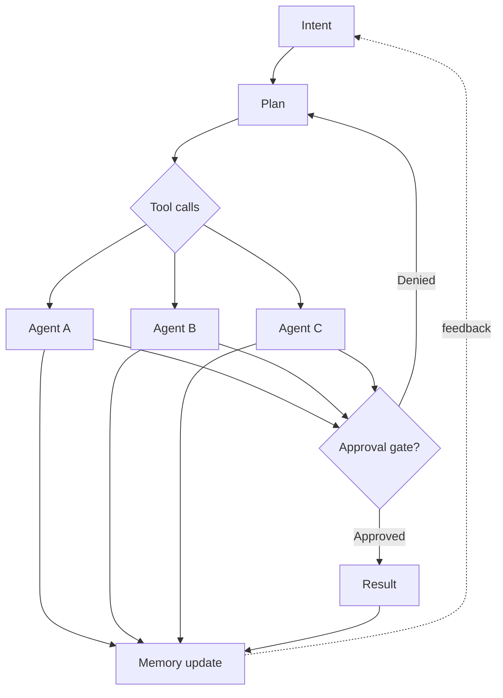

# NX-DOC-0006 — AI-First Design Philosophy

| Field | Value |
|-------|-------|
| **Document ID** | NX-DOC-0006 |
| **Title** | AI-First Design Philosophy |
| **Phase** | 1 — Master Blueprint |
| **Owner** | Product + AI |
| **Status** | 🟢 Complete |
| **Version** | 0.1.0 |
| **Created** | 2026-06-30 |
| **Related** | NX-DOC-0004 (Core Principles), NX-DOC-0005 (Product Philosophy), NX-DOC-0011 (Technical Principles) |

---

## 1. Purpose

"AI-first" is a phrase every company uses. It usually means "we added a chatbot." This document specifies what AI-first means **at NEXUS**, in concrete product, design, and engineering terms.

## 2. The definition

> **AI-first** means that the **default user interaction** is a natural-language intent, the **default execution model** is an autonomous agent acting on that intent, and the **default product surface** is the workspace where intent, planning, execution, and result converge.

A feature is AI-first if removing the AI from it would either make it useless or require a fundamentally different product. A feature that uses AI as decoration is not AI-first.

## 3. Five assertions that define AI-first at NEXUS

### Assertion 1 — Intent is the primary input

Not URLs. Not search queries. Not clicks. Intent — a sentence describing what the user wants accomplished — is the primary input across the entire product.

- The home screen's first element is an intent prompt.
- The command bar in every Workspace accepts intent.
- Contextual UI elements (right-click menus, button labels) can also generate intents, but the user always has the option to type freely.
- A URL bar exists as an escape hatch and is labeled as such.

### Assertion 2 — The system proposes, the user disposes

Agents operate autonomously within boundaries. For low-impact actions (reading, summarizing, drafting, organizing), agents proceed. For high-impact actions (sending, paying, deleting, posting, purchasing, changing credentials), agents pause for explicit human approval.

The default for low-impact is autonomy. The default for high-impact is approval. This is reversed from most products, where autonomy requires opt-in.

### Assertion 3 — Every AI action is observable and attributable

Every action taken by an AI agent is logged with:
- Which agent performed it
- What inputs it had
- What decision it made
- What outcome it produced
- How confident it was

The user can ask "what did you just do?" and get a plain-language answer. The Activity Log is a first-class UI surface, not a debug tool.

### Assertion 4 — The product knows the user

The Memory Engine retains:
- Preferences (writing style, defaults, sensitivities)
- Project state (active Workspaces, recurring tasks, recent decisions)
- History (browsing, conversations, agent actions — only when enabled)
- Style (formality, length preferences, language)

The product uses this memory to:
- Pre-fill defaults
- Suggest next actions
- Avoid asking the same question twice
- Adapt tone and format to the user's preferences

The user can inspect, edit, export, and delete any piece of memory.

### Assertion 5 — Models are interchangeable

NEXUS does not depend on any single AI model. The Model Gateway routes each task to the most appropriate model — local or cloud, cheap or premium, fast or strong — based on:
- Task requirements (reasoning depth, latency, cost ceiling)
- User preferences (local-only mode, provider preferences)
- Availability (rate limits, outages)
- Privacy constraints (data sensitivity)

A user can configure NEXUS to use only local models. The product must remain useful under this constraint.

## 4. What "AI-first" is NOT

| Misuse | Reality |
|--------|---------|
| A chatbot in the corner | A chatbot is one surface; intent is everywhere |
| Auto-complete on steroids | We don't suggest words; we produce outcomes |
| "Powered by GPT" badge | Model is implementation, not brand |
| Replacing humans in customer service | Replacing friction in user workflows |
| AI that hallucinates confidently | AI that says "I don't know" when it should |
| "Trust our AI" as a marketing claim | Trust is earned through observation over time |
| An AI that does whatever you say | An AI that operates within permissions |

## 5. The AI-first interaction primitives

The product has seven primitives. Every interaction in NEXUS is a composition of these.

### Primitive 1 — Intent
A natural-language expression of what the user wants.

### Primitive 2 — Plan
A structured sequence of steps the system proposes to fulfill the intent.

### Primitive 3 — Tool
A capability an agent can invoke: browser action, file operation, API call, code execution, search, model call, etc.

### Primitive 4 — Agent
An autonomous worker with a defined role, tools, memory access, and permission scope.

### Primitive 5 — Memory
A persistent store of facts about the user, projects, history, and the system's own actions.

### Primitive 6 — Result
The output of an executed plan: a file, a message, a change, a summary.

### Primitive 7 — Approval
A gate at which the user must explicitly allow or deny a high-impact action.

## 6. Design implications of being AI-first

### Implication 1 — Conversation is one interface, not the only one

Chat is appropriate when intent is fuzzy, when iteration is needed, or when explanation is required. It is NOT appropriate for structured choices, precise selection, or fast-iteration editing. NEXUS uses:
- Chat for open-ended intent
- Forms for structured parameters
- Buttons for one-click shortcuts
- Drag-and-drop for spatial organization

### Implication 2 — Output shapes are first-class

When an AI produces a result, the result has a shape: text, table, image, code, file, action. The product knows how to render, save, share, and re-edit each shape. The user is never trapped in a chat transcript.

### Implication 3 — Streaming is the default

Long-running AI operations stream tokens/results in real time. The user sees progress. The user can interrupt. The user can redirect.

### Implication 4 — Confidence is shown, not hidden

When the system is uncertain, it says so. Confidence indicators appear in plans, in suggestions, in auto-completions. The user can decide how to handle uncertainty.

### Implication 5 — Failures are recoverable

Every AI operation has a failure mode. NEXUS shows failures as recoverable events:
- "The model timed out. Retry?"
- "The agent didn't find the data. Try a different search?"
- "I produced a result, but I'm not confident. Verify?"

Failures are never silent. Failures are never blamed on the user.

## 7. The agent-as-colleague model

Agents in NEXUS are not tools. They are **colleagues** with explicit roles:

- A *Researcher* collects and synthesizes information.
- A *Planner* decomposes intents into plans.
- A *Coder* writes and edits code.
- A *Reviewer* critiques the output of other agents.
- A *Tester* validates correctness.
- A *Publisher* ships the result.

The user can see which agents are working, what they are doing, and what they have produced. The user can address an agent by name. The user can dismiss or replace an agent.

This model extends to the marketplace: a user can install a "Marketing Agent" the same way they would hire a freelancer — except it's available 24/7 and integrates with their data.

## 8. The cost and capability tradeoff

AI-first products face a tradeoff between capability and cost. NEXUS handles it explicitly:

| Tier | Capability | Cost |
|------|-----------|------|
| Local-only mode | Limited (depends on local model) | Free |
| Cloud standard | Strong (mid-tier models) | Included in subscription |
| Cloud premium | Strongest (frontier models) | Usage-based or subscription-upgraded |
| Cloud specialist | Domain-specific fine-tunes | Premium |

The user chooses. The product adapts. The choice is sticky per Workspace.

## 9. Anti-patterns in AI-first products we avoid

1. **The "magic black box"** — never reveal what the AI did. We always show.
2. **The "AI did it" hand-wave** — vague attributions. We name the agent and the action.
3. **The "hallucinated confidence"** — overconfident wrong answers. We show confidence.
4. **The "always-on assistant"** — agents running whether needed or not. We spawn on demand.
5. **The "one prompt to rule them all"** — trying to handle every case with text. We use the right primitive.
6. **The "training on user data without consent"** — never.
7. **The "AI replaces the user"** — AI amplifies the user; the user remains accountable.

## 10. Reading list

- **Core Principles** — NX-DOC-0004
- **Product Philosophy** — NX-DOC-0005
- **Technical Principles** — NX-DOC-0011
- **AI Platform** — Phase 4 (NX-AGENT-####)

---

*End NX-DOC-0006.*