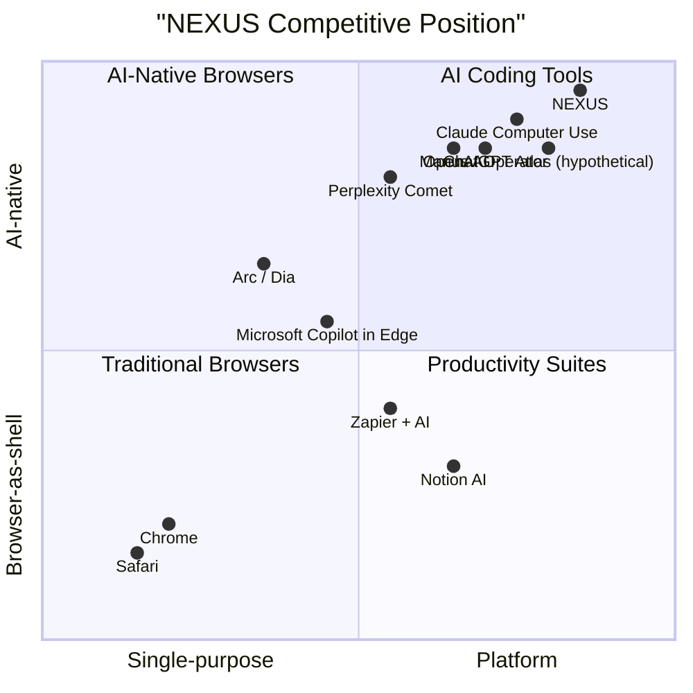

# NX-DOC-0008 — Competitive Landscape

| Field | Value |
|-------|-------|
| **Document ID** | NX-DOC-0008 |
| **Title** | Competitive Landscape |
| **Phase** | 1 — Master Blueprint |
| **Owner** | Strategy |
| **Status** | 🟢 Complete |
| **Version** | 0.1.0 |
| **Created** | 2026-06-30 |
| **Related** | NX-DOC-0007 (Audiences), NX-DOC-0012 (Business Strategy), NX-DOC-0009 (Roadmap) |

---

## 1. Purpose

This document maps the competitive landscape NEXUS enters. It is updated **quarterly** by the Competitive Intelligence agent and informs roadmap prioritization. NEXUS's competitive advantage is defined here so we can defend it deliberately.

## 2. The map

The market we enter has five overlapping categories. NEXUS competes in the intersection.

The diagram above is a strategic assertion, not a measured fact. It is the position we intend to occupy.

## 3. Category-by-category analysis

### Category 1 — Traditional browsers

| Competitor | Strength | Weakness | NEXUS differentiation |
|-----------|----------|----------|------------------------|
| Google Chrome | Default, ubiquitous, fast | Generic, no AI depth, locked to Google ecosystem | Intent-driven home screen; agent runtime |
| Apple Safari | Tight OS integration, privacy | Apple-only, conservative | Cross-platform; AI-first architecture |
| Microsoft Edge | Bundled with Windows, Copilot | Copilot is sidebar-only | AI is the product, not a sidebar |
| Mozilla Firefox | Open-source values | Limited resources, AI gaps | Open marketplace, extension-friendly |
| Brave | Privacy, crypto-native | Niche audience | Stronger productivity + AI agent story |

**Threat level: Medium.** Chrome is the elephant. We do not beat Chrome by being Chrome. We beat Chrome by being something Chrome cannot become without rewriting its DNA.

### Category 2 — Browser-improver products

| Competitor | Strength | Weakness | NEXUS differentiation |
|-----------|----------|----------|------------------------|
| Arc | Strong design, "spaces" model | Browser Business sold to Atlassian; uncertain future | Cloud Browsers + agent runtime + marketplace |
| Dia (Browser Company) | AI-first positioning | Early product, narrow scope | Full product, full platform |
| Opera | Long-running, sidebar AI | Limited innovation | Built-from-scratch Chromium + agent platform |
| Vivaldi | Power-user features | Small audience | Similar power-user depth, AI-first |

**Threat level: High.** Arc and Dia are the most direct competitors. They share our "AI-first browser" thesis. We differentiate on (a) deeper agent infrastructure and (b) marketplace + workflow builder.

### Category 3 — AI assistants that may become browsers

| Competitor | Strength | Weakness | NEXUS differentiation |
|-----------|----------|----------|------------------------|
| OpenAI Operator | Massive distribution, strong models | No persistent browser, no local mode | Real Chromium + persistent state + local mode |
| Perplexity Comet | Strong search-AI hybrid | Limited productivity integration | Cross-domain capability, not just search |
| Anthropic Claude (Computer Use) | Frontier reasoning | Not a browser product | We integrate Claude; we are not Claude |
| Manus AI | Agent-first positioning | Browser-only | Cloud Browser Fleet + Marketplace + Plugin SDK |
| ChatGPT (browser extensions) | Brand, distribution | Tab is generic | Full browser control |

**Threat level: Very high.** The frontier model companies can build a browser in 12 months. They may. NEXUS must build depth that cannot be matched by an extension to an existing model product — namely, the agent runtime, the marketplace, the Cloud Browser Fleet, and the workflow engine.

### Category 4 — Productivity and automation suites

| Competitor | Strength | Weakness | NEXUS differentiation |
|-----------|----------|----------|------------------------|
| Notion + AI | Document-first, popular with teams | Limited web automation | Browser-native; works with any web app |
| Zapier + AI | Largest automation ecosystem | No browser; web-only triggers | Browser-side automation + visual workflow builder |
| n8n | Open-source, self-hostable | Limited AI depth | AI-first design philosophy |
| Make (Integromat) | Visual workflows | UI complexity | Simpler AI-first workflow builder |
| Replit / Cursor | AI coding | Browser-automation is not the focus | Cross-domain (work, research, business) |

**Threat level: Medium.** These are partial substitutes. Users may keep Zapier and add NEXUS. We win by being the **only place** they need for browser-resident workflows.

### Category 5 — AI coding tools

| Competitor | Strength | Weakness | NEXUS differentiation |
|-----------|----------|----------|------------------------|
| Cursor | Best-in-class AI coding | No web automation; no business workflows | Cross-domain: code + business + research |
| Claude Code | Frontier coding assistant | CLI, not browser-integrated | Browser-resident |
| GitHub Copilot Workspace | GitHub-native, agentic | Locked to GitHub | Model-agnostic, browser-native |

**Threat level: Medium.** Coding is one of many domains NEXUS serves. We win by serving the *other* domains as well as we serve coding.

## 4. Direct competitors (deep dive)

### Dia (Browser Company)
- **Product:** AI-first browser, conversational interface, "skills."
- **Pricing:** Subscription tier expected.
- **Strengths:** Brand recognition, design quality, execution speed.
- **Weaknesses:** Limited marketplace, no workflow builder, no Cloud Browser.
- **Counter-strategy:** Beat them on depth of agent platform.

### Perplexity Comet
- **Product:** AI search browser.
- **Pricing:** Premium tier $200/month.
- **Strengths:** Strong search results, polished UX.
- **Weaknesses:** Limited productivity and business features.
- **Counter-strategy:** Beat them on business/research depth.

### OpenAI Operator
- **Product:** Agent that operates a browser on the user's behalf.
- **Pricing:** Bundled with ChatGPT Pro.
- **Strengths:** Best model access, brand, distribution.
- **Weaknesses:** No persistent browser, no local mode, no marketplace.
- **Counter-strategy:** Be a real browser, not an agent on top of Chrome.

## 5. Indirect competitors

- ChatGPT itself (general-purpose AI assistant)
- Claude.ai
- Google Gemini
- Microsoft Copilot
- Vertical AI tools (Harvey for law, Glean for enterprise search, etc.)
- RPA tools (UiPath, Automation Anywhere) — for enterprise automation

These do not directly compete with NEXUS the browser, but they compete for the user's "AI time" and budget.

## 6. NEXUS's defensible advantages

These are the moats we are building, in order of priority:

### Moat 1 — The agent runtime and orchestration platform
A real, production-grade multi-agent runtime with permissions, memory, planning, and tool execution. **Defensibility:** Engineering depth; community-built agents.

### Moat 2 — The marketplace
A network effect: more agents → more users → more agent creators → more agents. **Defensibility:** Network effects compound over time.

### Moat 3 — The Cloud Browser Fleet
Persistent, isolated browser containers that users can run scheduled tasks on. **Defensibility:** Infrastructure cost is high; competitor must replicate.

### Moat 4 — The Memory Engine
Years of personalized memory that make NEXUS uniquely useful to each user. **Defensibility:** Switching cost (memory portability partially mitigates, but the *trained* memory graph is hard to replicate).

### Moat 5 — Local-only mode
The ability to run entirely locally with local models. **Defensibility:** Privacy-conscious user segment; aligns with structural privacy principle.

### Moat 6 — Plugin and SDK depth
A rich developer platform for building agents, integrations, and themes. **Defensibility:** Developer mindshare; durable extension ecosystem.

## 7. What we will NOT compete on

- **Default browser for casual users.** We are not trying to replace Chrome on grandma's laptop.
- **Search engine.** We integrate with search; we do not build one.
- **Email client.** We integrate with email; we do not build a mail product from scratch.
- **Ad-supported free tier.** Violates principle 4.
- **Mobile-first.** Desktop first, mobile later (Phase 10).

## 8. Quarterly competitive review

The Competitive Intelligence agent runs a quarterly review that includes:
1. Each top-10 competitor's product changes (releases, pricing, marketing).
2. User sentiment analysis (Reddit, X, Hacker News, Product Hunt).
3. New entrants (Crunchbase, Product Hunt, HN launches).
4. Patent filings by competitors.
5. Hiring signals (LinkedIn, job boards).

Output: an updated version of this document with delta highlights.

## 9. Reading list

- **Audiences** — NX-DOC-0007
- **Long-Term Roadmap** — NX-DOC-0009
- **Business Strategy** — NX-DOC-0012

---

*End NX-DOC-0008.*