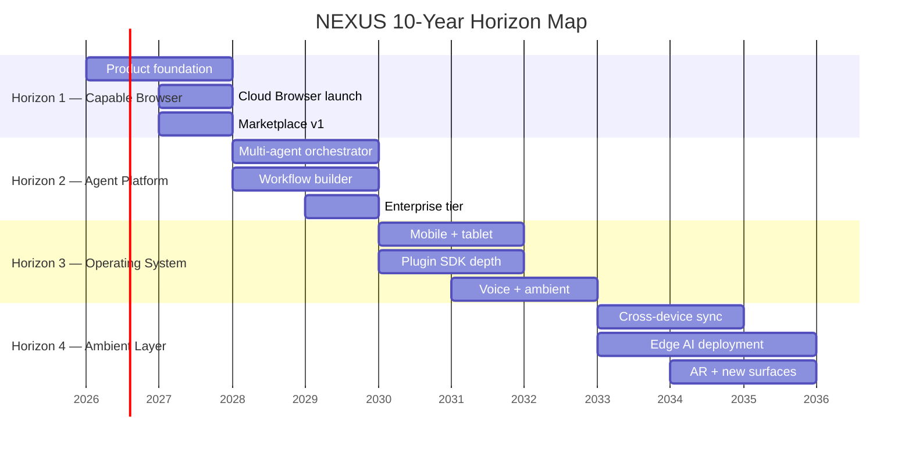

# NX-DOC-0009 — Long-Term Roadmap (10-Year Horizon)

| Field | Value |
|-------|-------|
| **Document ID** | NX-DOC-0009 |
| **Title** | Long-Term Roadmap (10-Year Horizon) |
| **Phase** | 1 — Master Blueprint |
| **Owner** | Product + Engineering |
| **Status** | 🟢 Complete |
| **Version** | 0.1.0 |
| **Created** | 2026-06-30 |
| **Related** | NX-DOC-0002 (Vision), NX-DOC-0010 (Goals & Metrics), NX-DOC-0012 (Business Strategy) |

---

## 1. Purpose

This document describes **what NEXUS becomes over the next 10 years**. It is not a sprint plan. It is a horizon map that lets us evaluate near-term decisions against long-term outcomes.

## 2. Horizon structure

We organize the roadmap into four horizons. Each horizon is roughly 2.5 years but the boundaries are flexible — we move to the next horizon when the current one's outcomes are achieved, not when the calendar permits.

| Horizon | Years | Anchor question | North star outcome |
|---------|-------|-----------------|--------------------|
| H1 — The Capable Browser | 0–2.5 | Can NEXUS be a credible daily-driver browser with AI depth? | 1M MAU, 100K paid |
| H2 — The Agent Platform | 2.5–5 | Can NEXUS become the default place users do AI-driven work? | 10M MAU, 1M paid workspaces |
| H3 — The Operating System | 5–7.5 | Can NEXUS become the platform that hosts agents, automations, and apps? | 100M MAU, 10M paid |
| H4 — The Ambient Layer | 7.5–10 | Can NEXUS become the layer through which humans and AI collaborate everywhere? | Ubiquitous presence on devices and surfaces |

## 3. Horizon 1 — The Capable Browser (2026–2028)

### Goals
- NEXUS becomes a **credible daily-driver browser** with a clear AI-native identity.
- The intent-driven home screen is recognizable and loved.
- The first agents ship in a marketplace.
- Cloud Browsers launch as a paid differentiator.

### Anchor metrics (target end of H1)
| Metric | Target |
|--------|--------|
| Monthly active users (MAU) | 1,000,000 |
| Paid subscribers | 100,000 |
| Marketplace agents published | 1,000 |
| Activation rate (D1 → D7) | 30% |
| 30-day retention | 35% |
| Crash-free sessions | 99.9% |
| Cold-start time | < 1.5s on reference hardware |

### Capability targets
- Chromium-based browser on macOS, Windows, Linux.
- Intent command bar in every Workspace.
- 1 local model + 2 cloud model providers supported.
- Marketplace with first-party and third-party agents.
- Cloud Browser Fleet (50 containers per Pro user; 500 per Team).
- Memory Engine: preferences, project state, recent activity.
- Permissioning system with audit log.
- Encryption-at-rest using hardware-backed keystore.

### Out of scope for H1 (deliberately)
- Mobile apps.
- Enterprise SSO (only basic auth).
- Voice interface.
- Cross-device sync beyond account-level.

### H1 risks
- **Competitor moves faster.** A frontier model company ships a comparable browser.
- **Cloud cost outruns revenue.** Cloud Browser Fleet is expensive.
- **Activation is too hard.** Users cannot figure out intent.
- **Marketplace is empty.** Insufficient third-party agents.

### H1 mitigations
- Differentiate on depth (orchestration, marketplace) — not on parity with Chrome.
- Cap Cloud Browser usage in lower tiers; price aggressively in upper tiers.
- Invest heavily in onboarding and example agents.
- Seed marketplace with first-party agents before opening third-party publishing.

## 4. Horizon 2 — The Agent Platform (2028–2030)

### Goals
- NEXUS becomes the **default environment** for AI-driven work.
- Users replace 5–10 SaaS tools with NEXUS Workspaces.
- The marketplace has thousands of agents, workflows, integrations.
- Developers build on NEXUS the way they build on AWS.

### Anchor metrics (target end of H2)
| Metric | Target |
|--------|--------|
| MAU | 10,000,000 |
| Paid workspaces | 1,000,000 |
| ARR | $100M |
| Marketplace agents | 50,000 |
| Marketplace creator earnings (top decile) | $50K+/year |
| Activation rate | 40% |
| 90-day retention | 45% |

### Capability targets
- Multi-agent orchestration with structured disagreement (Planner, Researcher, Reviewer, Tester, Publisher).
- Visual Workflow Builder with 200+ block types.
- Plugin SDK + extension API for AI-native extensions.
- Enterprise tier: SSO, audit log export, role-based access, SOC2 Type II.
- Mobile companion (read-only at first; full later).
- Voice interface in v1 (browser-level dictation + intent).
- Marketplace monetization: paid agents, agent subscriptions, usage-based billing.

### Out of scope for H2 (deliberately)
- AR/VR surfaces.
- On-prem deployment.
- Hardware (NEXUS-branded devices).
- Robotics integrations.

### H2 risks
- **Platform risk** if a hyperscaler bundles comparable capability for free.
- **Marketplace quality** becomes inconsistent at scale.
- **Enterprise sales motion** is much harder than prosumer.

### H2 mitigations
- Build community governance for marketplace quality.
- Invest in enterprise security, compliance, and customer success from H1.
- Lock in users through Memory Engine depth, not feature breadth.

## 5. Horizon 3 — The Operating System (2030–2033)

### Goals
- NEXUS becomes the **platform that hosts agents, automations, and applications**.
- The browser metaphor dissolves; NEXUS is the substrate.
- Workspaces evolve into full applications built on the agent runtime.
- Voice, mobile, and tablet become first-class.

### Anchor metrics (target end of H3)
| Metric | Target |
|--------|--------|
| MAU | 100,000,000 |
| Paid workspaces | 10,000,000 |
| ARR | $1B+ |
| Apps built on NEXUS runtime | 500,000 |
| Cross-device sessions per user | 3+ |

### Capability targets
- Mobile apps (iOS, Android) with full feature parity where feasible.
- Voice as a first-class input.
- Tablet-optimized UI.
- Cross-device sync of Workspaces, agents, memory.
- Public runtime API: third parties build apps hosted on NEXUS.
- "NEXUS Apps" — full applications built on the agent runtime.
- AR surface experiments.
- Edge AI: deployment to user-owned hardware.

### Out of scope for H3 (deliberately)
- Hardware products.
- Robotics integrations.

### H3 risks
- **Complexity explosion.** Operating-system scope requires careful pruning.
- **Mobile parity** is genuinely hard for AI-native products.
- **Public runtime API** invites platform risk (one bad actor).

### H3 mitigations
- Apply principle "Build for the long term" ruthlessly; do not chase every surface.
- Mobile may be read-only or scoped; document tradeoffs explicitly.
- Sandboxing and review process for third-party apps from day one.

## 6. Horizon 4 — The Ambient Layer (2033–2036)

### Goals
- NEXUS becomes the **ambient layer** between humans and AI collaboration.
- Surfaces include phones, tablets, desktops, vehicles, AR glasses, embedded devices.
- Agents operate across surfaces, with continuity.
- Local model execution is the default for privacy-sensitive workflows.

### Anchor metrics (target end of H4)
| Metric | Target |
|--------|--------|
| Active users across all surfaces | 500M+ |
| Paid workspaces | 50M+ |
| ARR | $5B+ |
| Devices with NEXUS | 1B+ (including OEM partnerships) |

### Capability targets
- NEXUS runs on phones, tablets, desktops, vehicles, AR glasses, embedded devices.
- Local models are first-class for privacy-conscious users.
- Cross-surface continuity: a Workspace on phone resumes on desktop seamlessly.
- Multi-device agent collaboration (e.g., phone agent + desktop agent + cloud agent for one task).
- NEXUS as an embedded runtime for third-party hardware.

### Out of scope for H4 (deliberately)
- Becoming a hyperscaler. We do not build data centers at planetary scale.
- Becoming a model lab. We use, route between, and contribute to model ecosystems.

### H4 risks
- **OEM partnerships** are politically and commercially complex.
- **Edge AI** requires significant investment in model compression and hardware.
- **Privacy regulation** becomes more complex across jurisdictions.

### H4 mitigations
- Pursue OEM partnerships only where NEXUS is clearly the better experience.
- Invest in model efficiency research from H3.
- Build privacy architecture that is jurisdiction-flexible from day one.

## 7. Cross-horizon principles

The following must hold across all horizons:

1. **Intent over navigation** — every new surface must accept intent as primary input.
2. **Memory continuity** — a user's memory must follow them across surfaces.
3. **Local-first where possible** — local execution default; cloud opt-in.
4. **Modular architecture** — replaceable components at every layer.
5. **Privacy structural** — never compromise for convenience.
6. **Honest disclosure** — agents are labeled agents, always.

## 8. Things that could invalidate the roadmap

| Trigger | Response |
|---------|----------|
| A frontier model company buys a major browser | Accelerate enterprise + marketplace moat |
| Local models exceed cloud in capability | Accelerate local-first architecture |
| Browser market consolidates to one vendor | Pivot to "agent runtime on top of any browser" |
| New device category emerges (e.g., neural interfaces) | Reserve capacity for surface experiments |
| Regulatory action restricts AI agents in browsers | Invest in safety, transparency, auditability |

## 9. Roadmap re-planning cadence

- **Quarterly:** H1 milestones reviewed and re-prioritized.
- **Bi-annually:** H2-H4 horizons reviewed for shifts.
- **Annually:** Full roadmap rewrite, published as v(N+1).0.

## 10. Reading list

- **Vision** — NX-DOC-0002
- **Goals & Metrics** — NX-DOC-0010
- **Business Strategy** — NX-DOC-0012
- **Audiences** — NX-DOC-0007

---

*End NX-DOC-0009.*