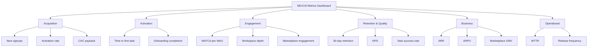

# NX-DOC-0010 — Product Goals & North Star Metrics

| Field | Value |
|-------|-------|
| **Document ID** | NX-DOC-0010 |
| **Title** | Product Goals & North Star Metrics |
| **Phase** | 1 — Master Blueprint |
| **Owner** | Product + Growth |
| **Status** | 🟢 Complete |
| **Version** | 0.1.0 |
| **Created** | 2026-06-30 |
| **Related** | NX-DOC-0009 (Roadmap), NX-DOC-0012 (Business Strategy), NX-DOC-0007 (Audiences) |

---

## 1. Purpose

This document defines how we measure success at NEXUS. It contains the **North Star Metric** plus a layered set of supporting metrics that diagnose health, growth, and quality.

If a metric here is not improving, the team investigates. If a metric cannot be measured reliably, the team instruments it.

## 2. North Star Metric

> **Weekly Active Tasks Completed with AI Assistance (WATCA)**

A "task" is defined as a discrete unit of work the user intended and NEXUS completed — autonomously or with human approval. Examples:
- "Generate 30 social media posts" → 1 task (multi-output counts as one task).
- "Apply to 12 jobs" → 1 task.
- "Research 50 SaaS ideas" → 1 task.
- "Reply to my inbox" → 1 task.

WATCA captures the **core promise of NEXUS**: turning intent into outcomes. Unlike engagement metrics, it measures outcomes directly. Unlike revenue, it captures value delivered regardless of pricing tier.

### WATCA targets by horizon

| Horizon | WATCA target (weekly, aggregated) |
|---------|-----------------------------------|
| H1 end | 1,000,000 |
| H2 end | 25,000,000 |
| H3 end | 500,000,000 |
| H4 end | 5,000,000,000 |

## 3. Why WATCA, not alternatives

We considered:

| Metric | Why not |
|--------|---------|
| MAU | Measures reach, not value delivered |
| Paid subscribers | Measures pricing, not usage quality |
| Daily active users | Favors sticky but low-value behaviors |
| Time spent | Optimizes engagement, not outcomes |
| Tasks attempted | Includes failures; doesn't distinguish signal |
| Tasks fully autonomous | Excludes healthy human-AI collaboration |
| Revenue | Lags value delivery by months |

WATCA rewards **outcomes the user actually wanted**. A user who completes 5 tasks/week is delivering more value than one who completes 0, regardless of subscription tier.

## 4. Supporting metrics — the 4 layers

WATCA is the headline. Below it are four diagnostic layers. Each layer contains 3–5 metrics.

### Layer 1 — Acquisition (do new users find us?)

| Metric | Definition | H1 target |
|--------|-----------|-----------|
| New signups per week | First-time account creations | 25,000/week at H1 end |
| Activation rate (D1→D7) | % of new users who complete ≥1 task in first 7 days | 30% |
| Source diversity | Number of distinct acquisition sources each contributing ≥5% | 4+ |
| CAC payback period | Months to recover customer acquisition cost | < 12 months |

### Layer 2 — Activation (do they get value quickly?)

| Metric | Definition | H1 target |
|--------|-----------|-----------|
| Time to first completed task | Median time from signup to first WATCA event | < 20 minutes |
| Onboarding completion rate | % completing the 5-step onboarding | 70% |
| First-Week WATCA | Tasks completed in week 1 | ≥ 3 |
| Setup-to-task conversion | % who complete any task within 30 minutes of install | 40% |

### Layer 3 — Engagement (do they keep using it?)

| Metric | Definition | H1 target |
|--------|-----------|-----------|
| WATCA per WAU | Weekly tasks per weekly active user | 5+ |
| Workspace depth | Median active Workspaces per WAU | 3+ |
| Marketplace engagement | % of WAU who installed ≥1 marketplace agent | 25% |
| Memory utilization | % of WAU with ≥1 active memory feature used | 60% |
| Cloud Browser utilization | Cloud browser hours per paid user per week | 20+ |

### Layer 4 — Retention & Quality (do they stay and stay satisfied?)

| Metric | Definition | H1 target |
|--------|-----------|-----------|
| 30-day retention | % of users active in week 4 | 35% |
| 90-day retention | % of users active in week 12 | 25% |
| Net Promoter Score | User survey, NPS standard | 40+ |
| Task success rate | % of tasks marked "successful" by user (or auto-validated) | 80% |
| Crash-free sessions | % of sessions without a crash | 99.9% |
| Trust incidents | Count of security or privacy incidents per 10K WAU | < 0.1 |

## 5. Business metrics (commercial health)

| Metric | Definition | H1 target |
|--------|-----------|-----------|
| ARR | Annualized recurring revenue | $5M |
| Paid conversion | % of WAU on paid tier | 10% |
| ARPU | Average revenue per user (paid) | $40/month |
| Gross margin | Revenue minus direct cost of delivery | 60%+ |
| Marketplace GMV | Total marketplace transactions | $500K/year |
| Marketplace take rate | NEXUS commission | 15% |

## 6. Operational metrics (delivery health)

| Metric | Definition | H1 target |
|--------|-----------|-----------|
| Mean time to recovery | MTTR for P0 incidents | < 1 hour |
| Release frequency | Production releases per week | 5+ |
| Test coverage | % of code covered by automated tests | 80%+ |
| Documentation coverage | % of features with current docs | 100% |
| Cloud Browser uptime | % uptime across the fleet | 99.5% |

## 7. Counter-metrics (what we will NOT optimize for)

These metrics exist but are explicitly **not** in the goal stack. If they improve while WATCA declines, something is wrong.

| Counter-metric | Why we don't optimize for it |
|----------------|------------------------------|
| Daily active users (DAU) | Can be inflated by notifications and nags |
| Time-on-task | Can be inflated by slow or confusing UX |
| Number of clicks | Not a value metric |
| Number of agent invocations | Quantity ≠ quality |
| Signups | Reach without activation is hollow |

## 8. Metrics cadence

| Cadence | Reviewed by | Output |
|---------|-------------|--------|
| Daily | On-call team | Anomaly alerts |
| Weekly | Product + Growth + Engineering leads | Trend dashboard |
| Monthly | Founders + AI exec team | Health memo |
| Quarterly | All stakeholders | Roadmap adjustment |

## 9. Instrumentation principles

1. **Measure outcomes, not proxies.** Where possible, measure whether the user got what they wanted.
2. **Sample, don't track everything.** Telemetry that touches user content is opt-in only.
3. **User-visible metrics.** Show the user their own WATCA. Make the metric a feature.
4. **Open methodologies.** Publish how metrics are computed.
5. **Version metrics.** When methodology changes, version it. Old reports stay comparable.

## 10. The metrics dashboard (sketch)

## 11. Anti-goals (what we will not do)

| Anti-goal | Reason |
|-----------|--------|
| Drive DAU through addictive patterns | Violates trust principle |
| Suppress churn signals | Hides product problems |
| Hide negative NPS | Prevents learning |
| Optimize for short-term ARR over long-term value | Violates long-term principle |
| Boost task count by counting low-value tasks | Dilutes WATCA |

## 12. Reading list

- **Roadmap** — NX-DOC-0009
- **Business Strategy** — NX-DOC-0012
- **Audiences** — NX-DOC-0007

---

*End NX-DOC-0010.*