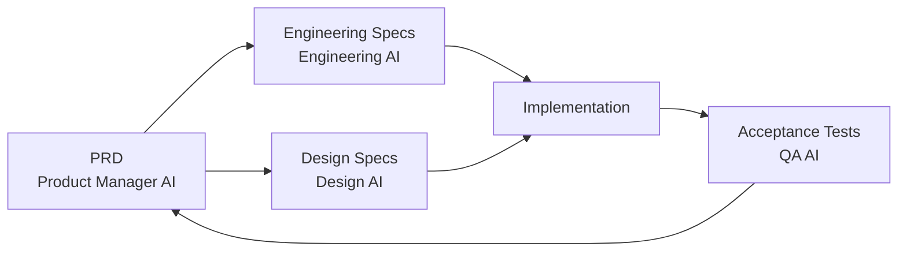

# NX-PRD-0001 — Master PRD

| Field | Value |
|-------|-------|
| **Document ID** | NX-PRD-0001 |
| **Title** | Master Product Requirements Document |
| **Phase** | 2 — Complete PRD |
| **Owner** | Product |
| **Status** | 🟢 Complete |
| **Version** | 0.1.0 |
| **Created** | 2026-06-30 |
| **Depends on** | NX-DOC-0002 (Vision), NX-DOC-0003 (Mission), NX-DOC-0004 (Core Principles), NX-DOC-0005 (Product Philosophy), NX-DOC-0007 (Audiences), NX-DOC-0008 (Competitive Landscape), NX-DOC-0009 (Roadmap), NX-DOC-0010 (Goals & Metrics), NX-DOC-0011 (Technical Principles), NX-DOC-0012 (Business Strategy) |

---

## 1. Purpose

This document is the **umbrella PRD** for NEXUS. It defines how the rest of Phase 2 is structured, what every PRD-level document must contain, the feature taxonomy, the acceptance-criteria template, and the change-management process.

If you read one Phase 2 document, read this one.

## 2. PRD scope

The Complete PRD (Phase 2) covers everything that defines **what NEXUS must do for users** in Horizon 1 (2026–2028). It does not cover:

- **How** NEXUS implements features — that's Phase 6 (Browser Architecture), Phase 7 (AI Infrastructure), and Phase 8 (Marketplace).
- **Why** features exist — that's Phase 1 (NX-DOC-0002 Vision, NX-DOC-0003 Mission, NX-DOC-0004 Core Principles).
- **When** features ship — that's NX-PRD-0006 (Roadmap).
- **UI specifics** — that's Phase 3 (UX Bible).

The PRD answers: **what does the user need, and what does the system do about it?**

## 3. Document structure

Phase 2 consists of:

| ID | Title | Purpose |
|----|-------|---------|
| NX-PRD-0001 | Master PRD (this doc) | Methodology, taxonomy, ID ranges, change process |
| NX-PRD-0002 | Persona × Feature Traceability Matrix | Every feature mapped to every persona |
| NX-PRD-0003 | User Journeys | 20 top journeys end-to-end |
| NX-PRD-0004 | Onboarding Specification | First-run, activation, education |
| NX-PRD-0005 | Subscription Model | Tier matrix, billing, overages, refunds |
| NX-PRD-0006 | H1 Roadmap | Quarterly milestones, dependencies, exit criteria |
| NX-FEAT-0001 | Feature Inventory | Complete NX-FEAT-#### catalog |
| NX-FEAT-0002 to NNNN | Per-feature specs | One document per major feature |
| NX-AT-0001 | Acceptance Test Suite | Verifies PRD criteria end-to-end |

## 4. Feature taxonomy

Every feature in NEXUS belongs to exactly one **feature area** (top-level grouping) and one **feature category** (secondary). Areas use the `NX-FEAT-A####` identifier pattern; categories use `NX-FEAT-C####`; leaf features use `NX-FEAT-L####`.

### 4.1 Feature areas (H1)

| Area ID | Name | Description |
|---------|------|-------------|
| NX-FEAT-A0001 | Browser Core | Tab management, address bar, history, downloads, bookmarks |
| NX-FEAT-A0002 | Workspaces | Goal-oriented workspaces replacing tabs |
| NX-FEAT-A0003 | AI Command Bar | Intent parsing, plan generation, command history |
| NX-FEAT-A0004 | AI Chat | Conversational interface for clarification, iteration |
| NX-FEAT-A0005 | Agent Orchestrator | Multi-agent runtime, planning, dispatch |
| NX-FEAT-A0006 | Agent Marketplace | Browse, install, create, monetize agents |
| NX-FEAT-A0007 | Cloud Browser Fleet | Persistent, isolated browser containers |
| NX-FEAT-A0008 | Memory Engine | Long-term user memory, knowledge graph |
| NX-FEAT-A0009 | Visual Workflow Builder | Drag-and-drop automation authoring |
| NX-FEAT-A0010 | Plugin SDK | Public developer platform |
| NX-FEAT-A0011 | Sync & Profiles | Account, sync, multi-device |
| NX-FEAT-A0012 | Permissions & Privacy | Permission system, encrypted vault |
| NX-FEAT-A0013 | Notifications & Activity | Activity log, notifications, alerts |
| NX-FEAT-A0014 | Integrations | Email, calendar, CRM, code, design tools |
| NX-FEAT-A0015 | Theming & Accessibility | Themes, motion, a11y |
| NX-FEAT-A0016 | Telemetry & Diagnostics | Crash reporting, performance, opt-in telemetry |
| NX-FEAT-A0017 | Local AI | Local model execution, offline capability |
| NX-FEAT-A0018 | Subscription & Billing | Tiers, billing, invoices, refunds |
| NX-FEAT-A0019 | Onboarding & Education | First-run, tutorials, sample content |
| NX-FEAT-A0020 | Enterprise Readiness | SSO, audit, compliance |

The complete area inventory is owned by NX-FEAT-0001 and may grow in H2.

### 4.2 Feature categories (per area)

Each area has 3–10 categories. Categories group related leaf features. Example for NX-FEAT-A0007 (Cloud Browser Fleet):

| Category ID | Name |
|-------------|------|
| NX-FEAT-A0007-C001 | Browser Container Lifecycle |
| NX-FEAT-A0007-C002 | Container State & Persistence |
| NX-FEAT-A0007-C003 | Container Networking & Proxy |
| NX-FEAT-A0007-C004 | Container Scheduling |
| NX-FEAT-A0007-C005 | Container Observability |
| NX-FEAT-A0007-C006 | Container Security |

### 4.3 Leaf features

Every leaf feature gets a stable ID and a spec. See Section 5 for the spec template. The complete catalog is in NX-FEAT-0001 (Feature Inventory).

## 5. Feature spec template

Every leaf-feature document MUST follow this template. The template enforces consistency and is what makes the repository executable by AI assistants.

```markdown
# NX-FEAT-#### — <Feature Name>

| Field | Value |
|-------|-------|
| Document ID | NX-FEAT-#### |
| Title | <Feature Name> |
| Area | NX-FEAT-A#### |
| Category | NX-FEAT-A####-C### |
| Owner | <Agent or Human> |
| Status | ⚪/🟡/🟢/🔵/🔴 |
| Priority (H1) | P0 / P1 / P2 / P3 |
| Horizon target | H1 / H2 / H3 / H4 |
| Estimated effort | S / M / L / XL |

---

## 1. Purpose
<One paragraph: what this feature is for.>

## 2. User stories
- As <persona>, I want <capability>, so that <outcome>.
- ...

## 3. Functional requirements
### FR-1: <Requirement title>
**Description:** <What the system must do.>
**Acceptance:**
- [ ] <Testable condition.>
- [ ] ...

### FR-2: ...

## 4. Non-functional requirements
### NFR-1: Performance
<Latency, throughput, scale targets.>

### NFR-2: Reliability
<Availability, recovery, error rates.>

### NFR-3: Security
<Auth, encryption, threat considerations.>

### NFR-4: Privacy
<Data handling, retention, user rights.>

### NFR-5: Accessibility
<WCAG level, screen reader, keyboard nav.>

## 5. UI surfaces
<Which screens, panels, or commands surface this feature. Cross-ref to Phase 3.>

## 6. Permissions
<What permissions this feature requires, what gates apply.>

## 7. Telemetry
<What events are emitted, opt-in vs. opt-out, retention.>

## 8. Failure modes
<What happens when network is down, model is unavailable, data is missing.>

## 9. Dependencies
<Other features, APIs, models, or external services required.>

## 10. Out of scope
<What this feature explicitly does NOT do.>

## 11. Acceptance criteria summary
<The 5–10 testable claims that prove the feature works.>

## 12. Open questions
<Unresolved design questions.>

## 13. Change log
```

## 6. Priority levels

| Priority | Meaning | H1 ship target |
|----------|---------|----------------|
| **P0** | Critical for product identity; ships in H1 alpha | Q1 2027 |
| **P1** | Important for H1 differentiation; ships in H1 beta | Q2 2027 |
| **P2** | Required for H1 launch; ships in H1 GA | Q3 2027 |
| **P3** | Nice-to-have for H1; may slip to H2 | Q4 2027 or later |
| **P4+** | H2+ scope; tracked but not scheduled in H1 | H2 onward |

A feature with no clear priority is incomplete. The Product Manager assigns priority before the feature enters the spec phase.

## 7. Acceptance criteria standard

Acceptance criteria must be:

1. **Testable.** A human or test script can verify pass/fail.
2. **Specific.** No words like "fast" or "good" without quantification.
3. **Independent.** Each criterion stands alone.
4. **Bounded.** Includes pre-conditions and post-conditions.

Examples of **good** acceptance criteria:

- "When the user submits an intent, the system displays an acknowledgment within 500ms."
- "A free-tier user can have at most 1 active Cloud Browser."
- "Every agent action is recorded in the Activity Log with timestamp, agent ID, action type, and result status."

Examples of **bad** acceptance criteria:

- "The command bar should feel responsive."
- "Agents should be smart."
- "Errors should be handled gracefully."

## 8. Cross-reference rules

A feature spec must cross-reference:

- All personas served (from NX-DOC-0007).
- All journeys it participates in (from NX-PRD-0003).
- All higher-level principles it derives from (NX-DOC-0004, NX-DOC-0005, NX-DOC-0006).
- Any other feature it depends on.

A feature that does not derive from a higher-level principle is **scope creep** and should be rejected.

## 9. Status lifecycle

```
⚪ Not started → 🟡 In progress → 🔵 In review → 🟢 Complete
                                      ↓
                                    🔴 Blocked
                                      ↓
                                ⚪ Deprioritized
```

| Status | Meaning | Update cadence |
|--------|---------|----------------|
| ⚪ Not started | Spec not yet authored | Reviewed weekly |
| 🟡 In progress | Spec being written or implemented | Reviewed daily |
| 🔵 In review | Awaiting sign-off | Reviewed on review schedule |
| 🟢 Complete | Shipped and accepted | Reviewed quarterly |
| 🔴 Blocked | Cannot proceed without resolution | Reviewed on incident schedule |
| ⚪ Deprioritized | Out of current horizon | Reviewed on horizon boundary |

## 10. Change management

PRD documents are versioned with semver (see NX-DOC-0001). Material changes require:

1. **An ADR** (Architecture Decision Record) if the change alters architecture.
2. **A change entry** in the document's change log.
3. **A notification** to all affected feature owners.
4. **Re-approval** by Product Manager if the change invalidates prior acceptance criteria.

The Change Log at `_assets/CHANGELOG.md` records cross-cutting changes that span multiple documents.

## 11. The PRD ↔ Engineering ↔ Design triangle

PRD does not exist in isolation. It is the contract between three agents:



- PRD defines **what** and **why**.
- Engineering defines **how**.
- Design defines **what it looks like**.
- Acceptance tests verify **that it works**.

Each role can propose changes upstream, but the PRD is the source of truth for product intent.

## 12. Estimating effort

Effort is sized S/M/L/XL relative to a small engineering team:

| Size | Definition |
|------|------------|
| **S** | 1–3 days of focused work |
| **M** | 1–2 weeks |
| **L** | 3–6 weeks |
| **XL** | 6+ weeks; must be broken down |

An XL feature is not "done" until decomposed into smaller features with their own IDs.

## 13. Out of scope for Phase 2

The following are explicitly not Phase 2 deliverables:

- Visual UI specifications (Phase 3).
- Internal agent prompts (Phase 4).
- Database schemas (Phase 7).
- API contracts (Phase 7).
- Security threat models (Phase 8).
- Marketplace billing flows (Phase 9).
- Mobile/tablet specifics (Phase 10).

If a PRD document needs to reference these, it does so by ID, not by content.

## 14. Reading list

- **Vision** — NX-DOC-0002
- **Mission** — NX-DOC-0003
- **Core Principles** — NX-DOC-0004
- **Product Philosophy** — NX-DOC-0005
- **Audiences** — NX-DOC-0007
- **Competitive Landscape** — NX-DOC-0008
- **Roadmap** — NX-DOC-0009
- **Goals & Metrics** — NX-DOC-0010
- **Technical Principles** — NX-DOC-0011
- **Business Strategy** — NX-DOC-0012

---

*End NX-PRD-0001.*