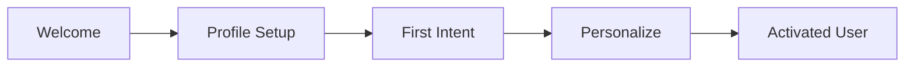

# NX-PRD-0004 — Onboarding Specification

| Field | Value |
|-------|-------|
| **Document ID** | NX-PRD-0004 |
| **Title** | Onboarding Specification |
| **Phase** | 2 — Complete PRD |
| **Owner** | Product + Frontend AI |
| **Status** | 🟢 Complete |
| **Version** | 0.1.0 |
| **Created** | 2026-06-30 |
| **Depends on** | NX-PRD-0002 (Persona Matrix), NX-PRD-0003 (User Journeys), NX-FEAT-2801-2810 |

---

## 1. Purpose

Onboarding is the **make-or-break moment** for activation. This document specifies the first-run experience, the educational moments that follow, and the metrics that tell us onboarding is working.

The primary success criterion is activation: **70% of new users complete a meaningful task within 15 minutes of install.**

## 2. Onboarding structure

NEXUS onboarding has four phases:

| Phase | Goal | Time budget | Skip allowed? |
|-------|------|-------------|---------------|
| **Welcome** | Orient the user to intent-first UX | 30 seconds | Yes |
| **Profile Setup** | Capture role + primary goal | 60 seconds | Yes (defaults applied) |
| **First Intent** | Complete one real task | 5 minutes | No |
| **Personalize** | Set preferences, style, integrations | 5 minutes | Yes |

Total: ≤15 minutes. Anyone can skip earlier phases; the First Intent cannot be skipped.

## 3. Phase 1 — Welcome

### 3.1 UX

- Full-screen welcome with NEXUS logo.
- Three panels, swipeable: "Intent," "AI," "Workspace."
- Each panel ≤5 seconds to read.
- Bottom: "Get Started" button (default focus).

### 3.2 Copy

- Panel 1 — "What do you want accomplished?"
  > NEXUS is built around what you want to do, not where you want to go. Type a goal. We'll figure out the rest.

- Panel 2 — "Your AI team"
  > Behind every command is a team of agents: a planner, a researcher, a reviewer, a tester. You stay in control.

- Panel 3 — "Your workspaces"
  > Group your work by goal, not by tab. Each workspace has its own memory, notes, and agents.

### 3.3 Acceptance criteria

- Welcome shows on first install only.
- Each panel is keyboard-navigable.
- Welcome can be skipped with Escape.
- Welcome is replayable from Settings → Help → "Replay onboarding."

## 4. Phase 2 — Profile Setup

### 4.1 Inputs captured

- **Role** (dropdown, optional): Founder, Developer, Researcher, Operator, Marketer, Designer, Other.
- **Primary goal** (free text, ≤140 chars): "What do you most want NEXUS to do for you?"
- **Email + password** or OAuth (Google, GitHub, Apple).
- **Passkey** offered as primary credential post-setup.

### 4.2 Defaults applied if skipped

- Role = "Other."
- Primary goal = "Help me get things done."
- Email field is still required (account must exist).
- Passkey can be added later.

### 4.3 UX

- Single screen, single column, large inputs.
- "Continue" button is enabled when email + goal are set.
- Privacy note: "Your goal helps NEXUS suggest relevant sample workspaces. It is never shared."

### 4.4 Acceptance criteria

- Account creation succeeds within 2 seconds (network normal).
- Goal is stored in memory as a preference.
- Role drives default Workspace template selection.
- OAuth providers: Google, GitHub, Apple available at launch.

## 5. Phase 3 — First Intent (cannot be skipped)

This is the activation moment. The user MUST complete one task.

### 5.1 Default suggested intents by role

| Role | Suggested intent |
|------|------------------|
| Founder | "Generate a week's content calendar for [your product]" |
| Developer | "Find and summarize 5 issues in my GitHub repo" |
| Researcher | "Build a dossier on [company or topic]" |
| Operator | "Show me how to monitor a website for changes" |
| Marketer | "Draft 3 emails for a re-engagement campaign" |
| Designer | "Generate 5 mood-board prompts for [project]" |
| Other | "What's something NEXUS can help me do right now?" |

### 5.2 UX flow

1. Screen shows: "Try your first command."
2. Pre-filled suggestion based on role (editable).
3. User can also type freely.
4. Clicks "Run."
5. Planner proposes a plan (≤3 steps visible).
6. User clicks "Approve."
7. Agent executes; result streams in.
8. Success state: "You just completed your first task. [Continue]."

### 5.3 Acceptance criteria

- First intent completes within 5 minutes for ≥80% of users.
- User can ask for help ("I don't know what to try") and get 3 suggestions.
- Failure modes are gentle: "Something didn't work. Want to try another?"
- Activity log records the first task.

### 5.4 Failure recovery

If first intent fails:
- Show a "Try one of these" list of 3 simpler intents.
- Offer "Skip for now — I'll explore myself" (lands on home screen).
- Do NOT block. Do NOT log out. Do NOT spam.

## 6. Phase 4 — Personalize

### 6.1 Customizations available

| Setting | Default | Note |
|---------|---------|------|
| Theme | System | Light / Dark / Sepia / Custom |
| Motion | System | Reduced / Standard / Enhanced |
| Tone | Neutral | Formal / Neutral / Casual |
| Output length | Standard | Brief / Standard / Detailed |
| Default Workspace | First created | Re-orderable |
| Integrations | None | Optional setup |
| Local AI | None | Optional install |

### 6.2 UX

- Settings panel with collapsible sections.
- Each setting has a 1-line explanation.
- "Apply" is implicit (auto-saves).
- "Skip" returns to home screen.

### 6.3 Acceptance criteria

- All preferences are stored to Memory Engine (NX-FEAT-1701).
- Preferences are accessible later via Settings → Preferences.
- Preferences can be exported (per NX-FEAT-1707).

## 7. The 7-day post-onboarding sequence

After onboarding, the user receives a sequence of in-product nudges (NOT emails by default) to deepen usage:

| Day | Nudge | Trigger |
|-----|-------|---------|
| 1 | "Create a second workspace for [goal]" | First workspace exists |
| 2 | "Try a marketplace agent" | No agent installed yet |
| 3 | "Schedule a recurring task" | No scheduled workflow |
| 4 | "Connect an integration" | No integration connected |
| 5 | "Customize your theme" | Default theme in use |
| 6 | "Explore your memory" | Memory unused |
| 7 | "Invite a teammate" (team plans only) | Single user |

Each nudge is dismissible; a dismissed nudge does not reappear.

## 8. Power user onboarding

For users who mark themselves as "advanced" or who skip the Welcome:

- Skip directly to home screen.
- Show a 60-second video tour (optional).
- Surface advanced features via tooltips on first encounter.
- Documentation link in Help → "Read the docs."

## 9. Team onboarding (Thea)

Team leads get a parallel onboarding:

1. Invite teammates (up to plan limit).
2. Choose a sample shared Workspace.
3. Assign roles (admin, member, viewer).
4. Set team-wide defaults (theme, motion, integrations).

Each team member then gets the standard onboarding, but lands in the shared Workspace instead of an empty home.

## 10. Re-onboarding

When a user has been away for 30+ days:

- A soft "Welcome back" panel on next visit.
- Quick summary of what changed.
- Memory review prompt: "Is this still accurate?"
- New feature highlights (up to 3).

Re-onboarding never auto-resets; it only suggests.

## 11. Localization

Onboarding is localized for H1 launch languages:

- English (primary)
- Spanish
- Portuguese (BR)
- French
- German
- Japanese
- Mandarin (Simplified)

Each locale has a native-speaker review before ship.

## 12. Accessibility

- All onboarding screens are WCAG 2.2 AA compliant.
- Screen reader narration is present.
- Keyboard-only navigation is fully supported.
- Reduced-motion users see static transitions.
- High-contrast users see theme overrides.

## 13. Metrics

| Metric | Target |
|--------|--------|
| Welcome completion rate | 95% |
| Profile setup completion rate | 90% |
| First Intent completion rate (activation) | 70% |
| Time to first task | < 15 min (median) |
| 7-day retention | 35% |
| 30-day retention | 25% |
| Onboarding completion rate (full path) | 50% |

Metrics tracked in NX-DOC-0010.

## 14. A/B testing plan

Initial tests (H1):

| Test | Variants | Hypothesis |
|------|----------|------------|
| Welcome vs. skip-to-home | A: full welcome, B: skip welcome | Welcome may slow activation |
| Suggested intent vs. free input | A: pre-filled by role, B: blank | Pre-fill may improve activation |
| Coachmark tour vs. video | A: in-product tooltips, B: 60s video | Tour may increase feature discovery |
| Default Workspace | A: Research, B: Business, C: Personal | Personal may have highest retention |

All A/B tests run ≥2 weeks before drawing conclusions.

## 15. Out of scope for H1

- Mobile onboarding (H3).
- Voice onboarding (H2).
- Group onboarding for 10+ users at once (H2).
- Custom onboarding flows for enterprise (H2).

## 16. Reading list

- **Audiences** — NX-DOC-0007
- **Persona × Feature Matrix** — NX-PRD-0002
- **User Journeys** — NX-PRD-0003 (J-07)
- **Feature Inventory** — NX-FEAT-0001 (NX-FEAT-2801-2810)

---

*End NX-PRD-0004.*