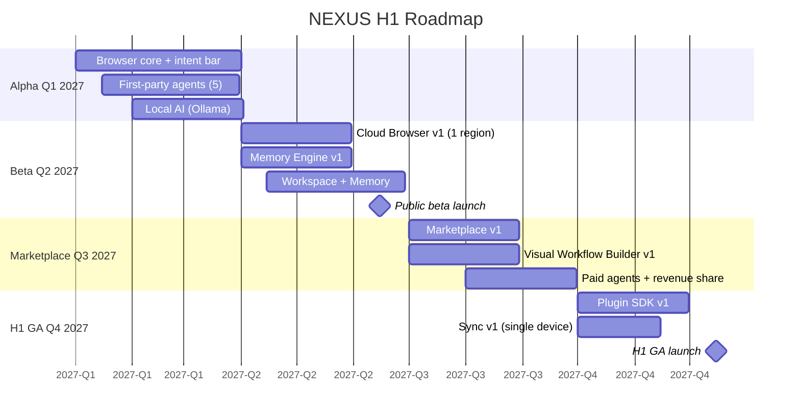

# NX-PRD-0006 — H1 Roadmap (Quarterly Milestones)

| Field | Value |
|-------|-------|
| **Document ID** | NX-PRD-0006 |
| **Title** | H1 Roadmap (Quarterly Milestones) |
| **Phase** | 2 — Complete PRD |
| **Owner** | Product + Engineering |
| **Status** | 🟢 Complete |
| **Version** | 0.1.0 |
| **Created** | 2026-06-30 |
| **Depends on** | NX-DOC-0009 (Long-Term Roadmap), NX-FEAT-0001 (Feature Inventory), NX-PRD-0005 (Subscription Model) |

---

## 1. Purpose

This document refines the H1 horizon of NX-DOC-0009 into **quarterly milestones** with concrete exit criteria, dependencies, and risk assessments. It is the engineering and product planning artifact for the next 9–12 months.

## 2. H1 calendar

| Quarter | Dates | Theme |
|---------|-------|-------|
| Q1 2027 | Jan–Mar | Alpha — internal and design partners |
| Q2 2027 | Apr–Jun | Beta — public beta with first Cloud Browsers |
| Q3 2027 | Jul–Sep | Marketplace GA — third-party agents and monetization |
| Q4 2027 | Oct–Dec | H1 GA — all P0/P1 features, mobile companion (read-only) |

## 3. Q1 2027 — Alpha

### 3.1 Theme
Build the **core browser + intent-first UX + first-party agents**. Validate that intent-as-primary-input works.

### 3.2 Capabilities delivered

| Capability | Owner | Anchor features |
|------------|-------|-----------------|
| Chromium-based browser (macOS, Windows, Linux) | Browser AI | NX-FEAT-1001, 1007, 1010-1013 |
| Intent command bar (basic parser) | Frontend AI | NX-FEAT-1201, 1202, 1208, 1209 |
| Workspace (basic) | Frontend AI | NX-FEAT-1101-1106, 1108 |
| AI Chat (basic) | Frontend AI | NX-FEAT-1301, 1302, 1308 |
| Planner agent (basic) | AI Platform AI | NX-FEAT-1401, 1402, 1412 |
| 5 first-party agents | Product AI | NX-FEAT-1506 |
| Local AI (Ollama) | AI Platform AI | NX-FEAT-2601-2604 |
| Permission prompts | Security AI | NX-FEAT-2101, 2103, 2107, 2109 |
| Activity Log | Backend AI | NX-FEAT-2205, 2206 |
| Free + Pro subscription | Backend AI | NX-FEAT-2701, 2702, 2704, 2705 |
| Onboarding v1 | Frontend AI | NX-FEAT-2801-2804, 2809 |

### 3.3 Exit criteria (Q1 → Q2)

- [ ] Alpha binary usable by 50 design partners without critical bugs.
- [ ] First Intent completes for 50%+ of new users.
- [ ] Cold start <3 seconds.
- [ ] Crash-free session rate >95%.
- [ ] All P0 features from NX-FEAT-0001 have a working implementation OR a written deferral rationale.

### 3.4 Dependencies and risks

| Dependency | Risk | Mitigation |
|------------|------|------------|
| Chromium integration | Substantial engineering effort | Hire 2 browser engineers; consider contractor help |
| Intent parser quality | Models may misunderstand intents | Build fallback to URL escape hatch; invest in eval |
| Ollama integration | Cross-platform packaging | Use Ollama app or embed llama.cpp directly |

### 3.5 Team shape

- 1 founder/CEO
- 2 browser engineers
- 1 frontend engineer
- 1 AI/platform engineer
- 1 designer
- 1 product/ops
- AI engineering org (CEO, CTO, Frontend, Backend, AI Platform, Security, QA, Documentation agents)

## 4. Q2 2027 — Beta

### 4.1 Theme
Ship **Cloud Browsers + Memory Engine** and open the public beta.

### 4.2 Capabilities delivered

| Capability | Owner | Anchor features |
|------------|-------|-----------------|
| Cloud Browser v1 (US region, 1 container/user) | Backend AI | NX-FEAT-1601-1604, 1610, 1612 |
| Memory Engine v1 (preferences, project state, conversation) | AI Platform AI | NX-FEAT-1701-1707, 1709, 1712 |
| Workflow Builder v1 (basic blocks) | Backend AI | NX-FEAT-1801-1804, 1810, 1811 |
| Integrations v1 (Email, Calendar, GitHub) | Backend AI | NX-FEAT-2301-2304, 2309 |
| Audit log + activity export | Backend AI | NX-FEAT-2104, 2207 |
| History + bookmarks (AI-enhanced) | Frontend AI | NX-FEAT-1003, 1004 |
| Notifications | Frontend AI | NX-FEAT-2201-2203 |
| Sync v0 (single device) | Backend AI | NX-FEAT-2005 |
| Telemetry + crash reporting | Backend AI | NX-FEAT-2501, 2502, 2504 |

### 4.3 Exit criteria (Q2 → Q3)

- [ ] Public beta with 5,000 users.
- [ ] 30% of users complete a Cloud Browser task.
- [ ] 50% of users have Memory Engine enabled and producing value.
- [ ] Cold start <2 seconds.
- [ ] Crash-free session rate >98%.
- [ ] Median task completion time <2 minutes.
- [ ] NPS ≥30.

### 4.4 Dependencies and risks

| Dependency | Risk | Mitigation |
|------------|------|------------|
| Cloud Browser infrastructure | High cost, complex | Start with single region; usage caps; aggressive metering |
| Memory accuracy | Users may distrust memory | Make memory transparent; allow per-item edit/delete |
| Integrations API stability | Third-party APIs change | Adapter pattern; health checks |

### 4.5 Team shape

- Add 1 infrastructure / SRE engineer
- Add 1 AI engineer
- Add 1 community / content person

## 5. Q3 2027 — Marketplace GA

### 5.1 Theme
**Marketplace, paid agents, and the agent economy.**

### 5.2 Capabilities delivered

| Capability | Owner | Anchor features |
|------------|-------|-----------------|
| Marketplace v1 (browse, install, rate) | Frontend AI | NX-FEAT-1501-1505, 1511, 1512 |
| Third-party publishing | Backend AI | NX-FEAT-1507 |
| Paid agents + revenue share | Backend AI | NX-FEAT-1509, 1510 |
| Agent marketplace policies + verification | Security AI | NX-FEAT-1512 |
| Plugin SDK v1 (developer preview) | Backend AI | NX-FEAT-1901-1909 |
| Developer documentation site | Documentation AI | NX-FEAT-1907 |
| Workflow marketplace publishing | Backend AI | NX-FEAT-1807 |
| Workflow templates | Frontend AI | NX-FEAT-1806 |
| Cloud Browser scheduled tasks | Backend AI | NX-FEAT-1608 |
| Team plan basics | Backend AI | NX-FEAT-1110 (sharing), 2709 |
| Custom themes (basic) | Frontend AI | NX-FEAT-2402 |

### 5.3 Exit criteria (Q3 → Q4)

- [ ] Marketplace with 100+ published agents (first + third party).
- [ ] ≥5 paid agents generating revenue.
- [ ] At least 1 creator earning >$1,000.
- [ ] Plugin SDK in developer preview with 50 active developers.
- [ ] Team plan sold to 50+ teams.
- [ ] NPS ≥40.

### 5.4 Dependencies and risks

| Dependency | Risk | Mitigation |
|------------|------|------------|
| Marketplace trust | Bad agents could harm users | Verified tier; review process; permissions enforcement |
| Revenue share payments | Stripe Connect setup | Use Stripe Connect Express; clear KYC |
| Plugin SDK adoption | Developer cold-start | Seed with first-party plugins; documentation |

## 6. Q4 2027 — H1 GA

### 6.1 Theme
**Polish, completeness, scale, and mobile companion.**

### 6.2 Capabilities delivered

| Capability | Owner | Anchor features |
|------------|-------|-----------------|
| Mobile companion (read-only, iOS + Android) | Frontend AI | Phase 10 (deferred to mobile doc) |
| Sync v1 (multi-device) | Backend AI | NX-FEAT-2005, 2007 |
| Business plan + lightweight SSO | Backend AI | NX-FEAT-2901 (P3 H1) |
| All remaining P0/P1 features | Multiple | See NX-FEAT-0001 backlog |
| Theme marketplace | Frontend AI | NX-FEAT-2403 |
| Diagnostics page | Frontend AI | NX-FEAT-2505 |
| Email digests | Backend AI | NX-FEAT-2204 |
| 10+ integrations | Backend AI | NX-FEAT-2305-2308, 2310, 2311 |
| Refined onboarding (post-A/B tests) | Frontend AI | NX-PRD-0004 |
| Polish across all surfaces | All | – |

### 6.3 Exit criteria (H1 GA)

- [ ] All 47 P0 features complete and stable.
- [ ] ≥90% of 56 P1 features complete.
- [ ] Cold start <1.5 seconds on reference hardware.
- [ ] Crash-free session rate >99.9%.
- [ ] 30-day retention >35%.
- [ ] 100,000 paid subscribers.
- [ ] NPS ≥40.
- [ ] Marketplace GMV ≥$500K/year.
- [ ] SOC2 Type I (Type II in H2).

### 6.4 Dependencies and risks

| Dependency | Risk | Mitigation |
|------------|------|------------|
| Mobile companion | Different platform, separate quality bar | Read-only MVP; no agent execution on mobile yet |
| SOC2 audit | Time-consuming | Start in Q3 |
| Multi-device sync | Conflict resolution complexity | Use last-write-wins for v1; add CRDT in H2 |

## 7. Cross-quarter metrics

| Metric | Q1 end | Q2 end | Q3 end | Q4 end |
|--------|--------|--------|--------|--------|
| MAU | 1,000 | 25,000 | 100,000 | 250,000 |
| Paid subscribers | 100 | 3,000 | 25,000 | 100,000 |
| Marketplace agents | 5 | 20 | 100 | 300 |
| 30-day retention | 25% | 30% | 32% | 35% |
| Cold start (s) | 3 | 2 | 1.8 | 1.5 |
| Crash-free rate | 95% | 98% | 99% | 99.9% |

## 8. Out of H1 scope

Explicitly deferred to H2+:

- Full multi-device sync with conflict-free merge (H2)
- Enterprise SSO + RBAC (H2)
- Voice interface (H2)
- Mobile write-capable (H3)
- AR surfaces (H4)
- Cross-region Cloud Browser fleet (H2)
- Custom enterprise model deployment (H2)

These are tracked in the long-term roadmap (NX-DOC-0009) but not in H1.

## 9. Resource plan

H1 cumulative team:

| Quarter | Human headcount | AI agent count |
|---------|----------------|----------------|
| Q1 | 7 | ~10 |
| Q2 | 10 | ~12 |
| Q3 | 14 | ~15 |
| Q4 | 20 | ~18 |

AI agents include: CEO AI, CTO AI, Research AI, Product AI, Frontend AI, Backend AI, Browser AI, AI Platform AI, Security AI, QA AI, DevOps AI, Documentation AI, Marketing AI, Finance AI.

## 10. Funding gates

| Round | When | Use |
|-------|------|-----|
| Bootstrap | Q4 2026 | Salaries, infrastructure |
| Pre-seed | Q1 2027 | Hires, Cloud infra setup |
| Seed | Q3 2027 | Beta → Marketplace scale |
| Series A | Q1 2028 (if needed) | GA launch, multi-region |

## 11. Risks across H1

| Risk | Probability | Impact | Mitigation |
|------|------------|--------|------------|
| Frontier model company ships competing browser | High | High | Differentiate on marketplace + agent platform |
| Cloud cost overruns | Medium | High | Aggressive metering; usage caps; pricing alignment |
| Marketplace fails to seed | Medium | Medium | First-party agents dominate until organic growth |
| Activation rate <50% | Medium | High | Iterative onboarding A/B tests |
| Privacy incident | Low | Critical | Defense-in-depth; security review pre-launch |

## 12. Reading list

- **Long-Term Roadmap** — NX-DOC-0009
- **Goals & Metrics** — NX-DOC-0010
- **Business Strategy** — NX-DOC-0012
- **Subscription Model** — NX-PRD-0005

---

*End NX-PRD-0006.*