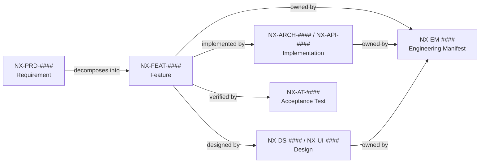

# NX-PRD-0008 — Requirements Traceability Matrix

| Field | Value |
|-------|-------|
| **Document ID** | NX-PRD-0008 |
| **Title** | Requirements Traceability Matrix |
| **Phase** | 2 — Product Requirements |
| **Owner** | NEXUS Program Office |
| **Status** | 🟡 Initial scaffold |
| **Version** | 0.1.0 |
| **Created** | 2026-07-03 |
| **Last Updated** | 2026-07-03 |
| **Classification** | Confidential — Internal |
| **Distribution** | Founders, executive AI, engineering AI, QA AI |

---

## 1. Purpose

This document is the **single source of truth for requirement traceability** in the NEXUS blueprint. Every requirement, every design element, every implementation target, and every acceptance test is linked here so that a stakeholder can answer, in one place:

- What did the user ask for? (Requirement)
- How does the product propose to meet it? (Design)
- What code or system implements it? (Implementation)
- How do we prove it works? (Verification)
- What is the *current* state of the chain? (Status)

It exists to make gaps — orphan requirements, untested features, designs with no implementation — visible at a glance.

## 2. Scope and authority

- **In scope:** All requirements in `01_PRODUCT/`, all design elements in `02_DESIGN_SYSTEM/` and `03_UI_SCREENS/`, all implementation targets in `04_BROWSER_ENGINE/` through `10_DEPLOYMENT/`, and all acceptance tests in `06_ENGINEERING_TEAM/05_Acceptance_Test_Suite.md`.
- **Out of scope:** Marketing copy (`11_BUSINESS/`), developer-facing-only docs (`12_DEVELOPER_GUIDE/`), master prompts (`99_MASTER_PROMPTS/`).
- **Authority:** The IDs in the table below are authoritative. If a row contradicts prose elsewhere in the blueprint, the row wins until the next registry pass.

## 3. ID conventions used in this matrix

| Prefix | Meaning | Source |
|--------|---------|--------|
| `NX-PRD-####` | Product requirement (a user-visible "must") | `01_PRODUCT/` |
| `NX-FEAT-####` | Feature (concrete capability) | `01_PRODUCT/01_Feature_Inventory.md` |
| `NX-DS-####` | Design system token or component | `02_DESIGN_SYSTEM/` |
| `NX-UI-####` | UI screen or interaction | `03_UI_SCREENS/` |
| `NX-ARCH-####` | Architectural element | `04_BROWSER_ENGINE/`, `05_AI_PLATFORM/`, `07_BACKEND/` |
| `NX-API-####` | API surface | `07_BACKEND/APIs/` |
| `NX-EM-####` | Engineering manifest (per-role) | `06_ENGINEERING_TEAM/` |
| `NX-AT-####` | Acceptance test | `06_ENGINEERING_TEAM/05_Acceptance_Test_Suite.md` |

If a cell is `—` it means **no link has been written yet**, not that the link does not exist. Every `—` is a candidate gap and is summarised in §7.

## 4. Relationship model

Every Feature should ideally have *all five* outbound links. The status column in §5 reflects the current best-effort link coverage.

## 5. Master traceability matrix

The matrix below uses the *anchor* documents of each phase as the row keys. Sub-features inherit coverage from their anchors. Cells in `[brackets]` are concrete document IDs; cells marked `—` are gaps.

### 5.1 Phase 2 — Product Requirements

| Req ID | Title | Persona source | Feature anchor | Design | Implementation | Acceptance test | Owner (EM) | Status |
|--------|-------|----------------|----------------|--------|----------------|-----------------|------------|--------|
| NX-PRD-0001 | Master PRD (methodology) | — | NX-FEAT-0001 | — | — | NX-AT-9601 | NX-EM-9601 (Product AI) | 🟡 |
| NX-PRD-0002 | Persona × Feature Matrix | NX-PRD-0007 | NX-FEAT-0001 | — | — | NX-AT-9601 | NX-EM-9609 (Product AI) | 🟡 |
| NX-PRD-0003 | User Journeys | NX-PRD-0007 | NX-FEAT-0002 | NX-UI-6001..6012 | NX-ARCH-0101..0107 | NX-AT-9601 | NX-EM-9609 (Product AI) | 🟢 |
| NX-PRD-0004 | Onboarding | NX-PRD-0007 | NX-FEAT-1100 | NX-UI-6101..6106 | NX-ARCH-0201 | NX-AT-9601 | NX-EM-9608 (Frontend AI) | 🟢 |
| NX-PRD-0005 | Subscription Model | NX-PRD-0007 | NX-FEAT-1500 | NX-DS-5008 | NX-API-8001 | NX-AT-9601 | NX-EM-9614 (Finance AI) | 🟢 |
| NX-PRD-0006 | H1 Roadmap | — | NX-FEAT-0001..0002 | — | — | — | NX-EM-9609 (Product AI) | 🟡 |
| NX-PRD-0007 | Target Audiences & Personas | (root) | NX-FEAT-0001 | — | — | NX-AT-9601 | NX-EM-9607 (Marketing AI) | 🟢 (identity-mapped to `NX-DOC-0007`) |
| NX-PRD-0008 | **Requirements Traceability Matrix** (this doc) | (root) | — | — | — | — | NX-EM-9601 (Product AI) | 🟢 |

### 5.2 Phase 3 — UX / Design

| Feature anchor | Design (NX-DS / NX-UI) | Implementation | Acceptance test | Status |
|----------------|------------------------|----------------|-----------------|--------|
| NX-FEAT-1100 (Workspace) | NX-UI-6101..6106, NX-DS-5008 | NX-ARCH-0201 | NX-AT-9601 | 🟢 |
| NX-FEAT-1500 (Subscription) | NX-DS-5008 | NX-API-8001 | NX-AT-9601 | 🟢 |
| NX-FEAT-1600 (Cloud Browser Fleet) | NX-UI-6201 | NX-ARCH-0101..0107 | NX-AT-9601 | 🟡 |
| NX-FEAT-1700 (Memory Engine) | NX-UI-6301 | NX-ARCH-0301..0305 | NX-AT-9601 | 🟡 |
| NX-FEAT-1800 (Visual Workflow Builder) | NX-UI-6401 | NX-ARCH-0401..0405 | NX-AT-9601 | 🟡 |

### 5.3 Phase 5 — Engineering manifests ↔ features

| Engineering manifest | ID | Primary surface | Status |
|----------------------|----|-----------------|--------|
| CEO AI | NX-EM-9601 | `06_ENGINEERING_TEAM/CEO_AI/01_CEO_AI_Manifest.md` | 🟢 |
| CTO AI | NX-EM-9602 | `06_ENGINEERING_TEAM/CTO_AI/02_CTO_AI_Manifest.md` | 🟢 |
| Backend AI | NX-EM-9603 | `06_ENGINEERING_TEAM/Backend_AI/03_Backend_AI_Manifest.md` | 🟢 |
| QA AI | NX-EM-9604 | `06_ENGINEERING_TEAM/QA_AI/04_QA_AI_Manifest.md` | 🟢 |
| Security AI | NX-EM-9605 | `06_ENGINEERING_TEAM/Security_AI/05_Security_AI_Manifest.md` | 🟢 |
| Documentation AI | NX-EM-9606 | `06_ENGINEERING_TEAM/Documentation_AI/06_Documentation_AI_Manifest.md` | 🟢 |
| Marketing AI | NX-EM-9607 | `06_ENGINEERING_TEAM/Marketing_AI/07_Marketing_AI_Manifest.md` | 🟢 |
| Frontend AI | NX-EM-9608 | `06_ENGINEERING_TEAM/Frontend_AI/08_Frontend_AI_Manifest.md` | 🟢 |
| Product AI | NX-EM-9609 | `06_ENGINEERING_TEAM/Product_AI/09_Product_AI_Manifest.md` | 🟢 |
| Research AI | NX-EM-9610 | `06_ENGINEERING_TEAM/Research_AI/10_Research_AI_Manifest.md` | 🟢 |
| Browser AI | NX-EM-9611 | `06_ENGINEERING_TEAM/Browser_AI/11_Browser_AI_Manifest.md` | 🟢 |
| AI Platform AI | NX-EM-9612 | `06_ENGINEERING_TEAM/AI_Platform_AI/12_AI_Platform_AI_Manifest.md` | 🟢 |
| DevOps AI | NX-EM-9613 | `06_ENGINEERING_TEAM/DevOps_AI/13_DevOps_AI_Manifest.md` | 🟢 |
| Finance AI | NX-EM-9614 | `06_ENGINEERING_TEAM/Finance_AI/14_Finance_AI_Manifest.md` | 🟢 |

### 5.4 Phase 6+ — Architecture and APIs

| Architecture element | ID | Touches features | Backed by tests |
|---------------------|----|------------------|-----------------|
| Browser Architecture Overview | NX-ARCH-0001 | NX-FEAT-1600 | NX-AT-9601 |
| Chromium Integration | NX-ARCH-0101 | NX-FEAT-1600 | NX-AT-9601 |
| Rendering Pipeline | NX-ARCH-0102 | NX-FEAT-1600 | NX-AT-9601 |
| Profile System | NX-ARCH-0103 | NX-FEAT-1100 | NX-AT-9601 |
| History Engine | NX-ARCH-0104 | NX-FEAT-1100 | NX-AT-9601 |
| Sync Protocol | NX-ARCH-0105 | NX-FEAT-1100 | NX-AT-9601 |
| Download Manager | NX-ARCH-0106 | NX-FEAT-1100 | NX-AT-9601 |
| Extension Runtime | NX-ARCH-0107 | NX-FEAT-1100 | NX-AT-9601 |
| API Surface | NX-API-8001 | NX-FEAT-1500 | NX-AT-9601 |
| Memory Engine | NX-API-8301 | NX-FEAT-1700 | NX-AT-9601 |

## 6. Coverage summary

The matrix above is *not* exhaustive — the blueprint has 215 unique `NX-FEAT-####` IDs and 411 `NX-*` references that are not yet in the registry. The goal of this matrix is to give a maintainable **template** that the engineering team can extend feature by feature, with a single row per feature and the five link columns filled in.

The statuses used are:

- 🟢 **Traced** — every column has a concrete link.
- 🟡 **Partial** — at least one column is `—`; gap to be closed in the next sprint.
- 🟠 **Orphan** — the requirement exists in prose but the document does not exist on disk; the requirement is real but unwritable until the doc is created.
- 🔴 **Broken** — a link points to a document or ID that no longer exists; fix immediately.

## 7. Detected gaps (as of 2026-07-03)

| Gap | Type | Suggested fix |
|-----|------|---------------|
| `NX-PRD-0007` referenced in 3 manifests, no doc on disk | ✅ **Resolved 2026-07-03** | Created `01_PRODUCT/08_Target_Audiences_and_Personas.md` as an identity-mapped redirect to `NX-DOC-0007`. The three engineering manifests now resolve via the new file. |
| `NX-FEAT-2201-2209`, `NX-FEAT-2101-2110` (referenced as ranges) | 🟡 Partial | Resolve into explicit per-ID rows in the next registry pass |
| 404 `NX-*` references in prose are not in `_assets/DOCUMENT_REGISTRY.md` | 🟡 Partial | Run a registry pass; flip `registry-consistency` CI to strict after the count drops below ~10 |
| `NX-DS-5099`, `NX-DS-5199`, `NX-DS-5299`, `NX-DS-5399` etc. — "end-of-range" markers | 🟡 Partial | Document the range-marker convention explicitly in `00_EXECUTIVE/01_Cover_and_Document_Control.md` §3 |
| Phase 7 Backend `NX-ARCH-####` IDs not yet assigned | 🟠 Orphan | Reserved in `00_EXECUTIVE/01_Cover_and_Document_Control.md` §3 (range `0001–0999`); the `07_BACKEND/` docs use `NX-ARCH-` IDs already — confirm they are in the range and register them |

## 8. Maintenance rules

1. **Every new requirement** added in any `01_PRODUCT/*.md` file MUST add a row to §5.1 within the same commit.
2. **Every new feature** added to `01_PRODUCT/01_Feature_Inventory.md` MUST add a row to §5.2.
3. **Every new acceptance test** added to `06_ENGINEERING_TEAM/05_Acceptance_Test_Suite.md` MUST be referenced in the Status column of at least one row above.
4. **Every new engineering manifest** MUST appear in §5.3 with its `NX-EM-####` ID and on-disk path.
5. **`_assets/DOCUMENT_REGISTRY.md` is the single source of truth for issued IDs.** The RTM reflects the registry, never the other way around. If a row disagrees with the registry, the registry wins; the row is corrected in the same commit.
6. **The CI advisory job `registry-consistency`** is the primary detector for gaps. The §7 table is regenerated by a maintainer (not by CI) on each Phase closeout.

## 9. Change log

### v0.1.0 — 2026-07-03

| Action | Summary |
|--------|---------|
| Created | Initial scaffold. Anchor-only matrix covering `NX-PRD-0001..0008`, the five Phase-2 feature anchors, all 14 engineering manifests, and the Phase-6 architecture set. Includes the gap-detection table (currently 5 items). |
