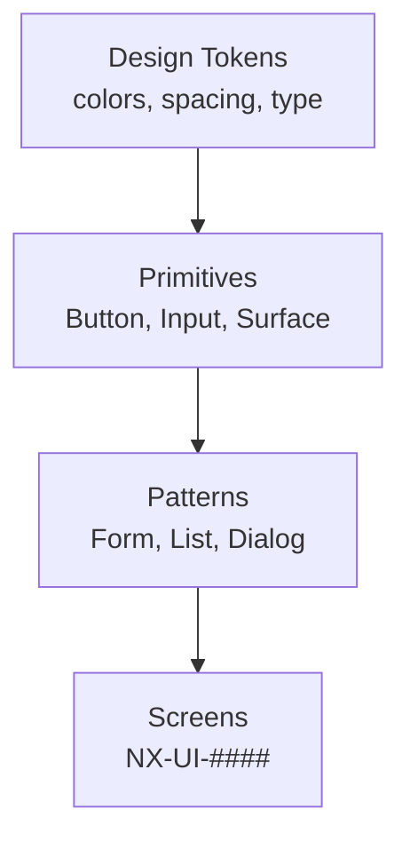
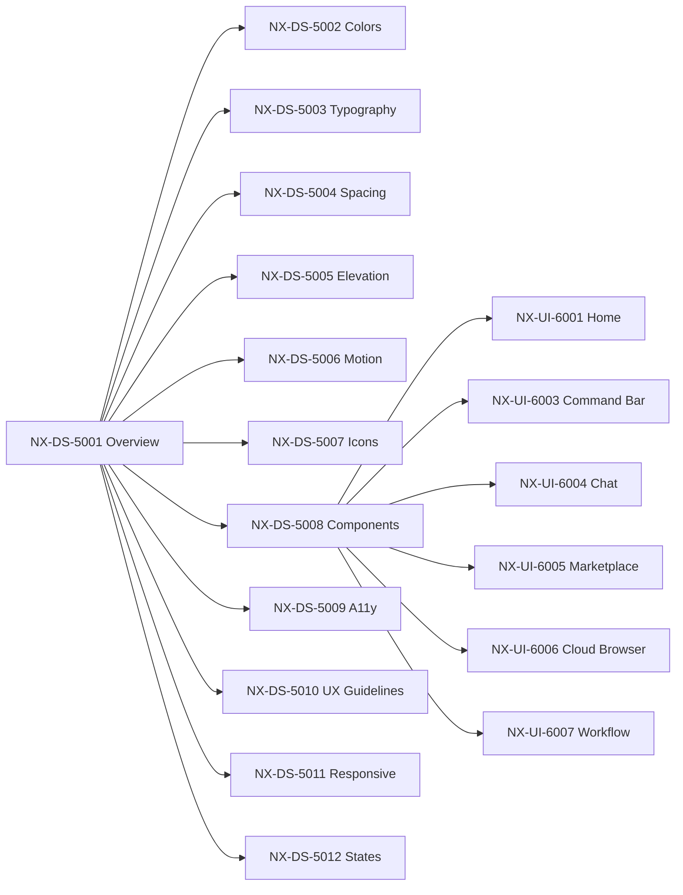

# NX-DS-5001 — Design System Overview

| Field | Value |
|-------|-------|
| **Document ID** | NX-DS-5001 |
| **Title** | Design System Overview |
| **Phase** | 3 — UX Bible |
| **Owner** | Design + Frontend AI |
| **Status** | 🟢 Complete |
| **Version** | 0.1.0 |
| **Created** | 2026-06-30 |
| **Depends on** | NX-DOC-0005 (Product Philosophy), NX-DOC-0006 (AI-First Design Philosophy), NX-PRD-0004 (Onboarding) |

---

## 1. Purpose

This document is the **table of contents** for the NEXUS Design System. It establishes the principles, the ID scheme, the layering, and how every other Phase 3 document relates to it.

If you read one design system document, read this one.

## 2. Design system principles

The NEXUS Design System follows six principles that descend from NX-DOC-0004 (Core Principles) and NX-DOC-0006 (AI-First Design Philosophy).

### Principle 1 — Calm by default
NEXUS is not loud. The interface should never compete with the work. Visual hierarchy is built through restraint, not embellishment.

### Principle 2 — Intent is the primary input
Design surfaces make it obvious how to express intent. URL bars exist but are not the front door. Every screen has a "what next" affordance.

### Principle 3 — Progressive disclosure
Beginner surfaces are simple. Power features are layered. A user never sees what they haven't earned the right to use.

### Principle 4 — Transparency is visible
Agent actions are labeled. Memory is inspectable. Activity is logged. Design makes these affordances obvious, not buried.

### Principle 5 — Accessibility is structural
WCAG 2.2 AA is the floor, not the ceiling. Every component ships with keyboard nav, screen reader support, contrast, and reduced-motion variants built in.

### Principle 6 — Performance is felt
Designs respect perceived latency. Streaming-first. Skeletons are honest. Cold-start budgets shape layout choices.

## 3. The 12 documents of the design system

| ID | Title | Purpose |
|----|-------|---------|
| NX-DS-5001 | Design System Overview (this doc) | TOC, principles, ID scheme |
| NX-DS-5002 | Color Tokens | Semantic + primitive color palette |
| NX-DS-5003 | Typography | Type scale, families, line-heights |
| NX-DS-5004 | Spacing & Layout | 4-pt grid, breakpoints, containers |
| NX-DS-5005 | Elevation & Shadow | Depth hierarchy |
| NX-DS-5006 | Motion & Animation | Easing, durations, choreography |
| NX-DS-5007 | Iconography | Stroke, sizing, library |
| NX-DS-5008 | Component Library | Buttons, inputs, surfaces, panels |
| NX-DS-5009 | Accessibility Foundations | Contrast, focus, screen reader, motion |
| NX-DS-5010 | UX Guidelines | Voice, tone, microcopy |
| NX-DS-5011 | Responsive Strategy | Breakpoints, layouts, density |
| NX-DS-5012 | Empty / Loading / Error States | Every state, every screen |

## 4. The screen specification set (NX-UI-####)

| ID | Screen |
|----|--------|
| NX-UI-6001 | Home Screen |
| NX-UI-6002 | Workspace Switcher |
| NX-UI-6003 | AI Command Bar |
| NX-UI-6004 | AI Chat |
| NX-UI-6005 | Agent Marketplace |
| NX-UI-6006 | Cloud Browser Fleet Dashboard |
| NX-UI-6007 | Visual Workflow Builder |
| NX-UI-6008 | Memory Inspector |
| NX-UI-6009 | Settings |
| NX-UI-6010 | Notifications & Activity Log |
| NX-UI-6011 | Onboarding |
| NX-UI-6012 | Plugin SDK / Developer |

Each screen spec uses the template defined in §6.

## 5. ID scheme

```
NX-DS-5001 ... NX-DS-5099   Design system foundations
NX-DS-5100 ... NX-DS-5199   Component library
NX-DS-5200 ... NX-DS-5299   Patterns (form layouts, list patterns, etc.)
NX-DS-5300 ... NX-DS-5399   Motion patterns
NX-DS-5400 ... NX-DS-5499   Accessibility patterns
NX-DS-5500 ... NX-DS-5599   Localization
NX-DS-5600 ... NX-DS-5699   Theming

NX-UI-6001 ... NX-UI-6099   Desktop screens (H1)
NX-UI-6100 ... NX-UI-6199   Desktop screens (H2+)
NX-UI-6200 ... NX-UI-6299   Modals, dialogs, popovers
NX-UI-6300 ... NX-UI-6399   Cloud Browser-specific
NX-UI-6400 ... NX-UI-6499   Memory-specific
NX-UI-6500 ... NX-UI-6599   Workflow Builder-specific
NX-UI-7000 ... NX-UI-7099   Tablet
NX-UI-8000 ... NX-UI-8099   Mobile
```

The number after the prefix is a stable ID. Adding new screens appends; never renumber.

## 6. Screen spec template

```markdown
# NX-UI-#### — <Screen name>

| Field | Value |
|-------|-------|
| Document ID | NX-UI-#### |
| Screen | <Name> |
| Owner | <Agent> |
| Status | ⚪/🟡/🟢/🔵/🔴 |
| Priority (H1) | P0/P1/P2/P3 |
| Touches journeys | <J-NN list>
| Touches features | <NX-FEAT list>

---

## 1. Purpose
<One paragraph: what this screen is for.>

## 2. When shown
<Triggers, preconditions.>

## 3. Layout (ASCII)
<ASCII wireframe showing zones.>

## 4. Component anatomy
<Each region with: dimensions, content, behavior.>

## 5. Interactions
<Click, keyboard, gesture.>

## 6. States
<Default, hover, active, focus, disabled, loading, empty, error.>

## 7. Animation
<Entrance, exit, micro.>

## 8. Accessibility
<ARIA, keyboard order, screen reader narrative.>

## 9. Telemetry
<Events emitted.>

## 10. Out of scope
<What this screen explicitly does not show.>

## 11. Open questions
```

## 7. Component composition model

Components compose upward: **Tokens → Primitives → Patterns → Screens**.



A change to a token propagates to all screens. A new primitive is added once and reused. Screens never invent bespoke components.

## 8. Theming

NEXUS supports themes that override tokens but never primitives.

| Theme | Status |
|-------|--------|
| Light (default) | Built-in |
| Dark (default) | Built-in |
| Sepia | Built-in |
| High Contrast | Built-in |
| Custom | User-defined |

System theme is respected by default; users can override per Workspace.

## 9. The 4-state model

Every interactive element has at least four states: **default, hover, active, focus**. Plus, every screen has at least: **loading, empty, error**. The 12th document (NX-DS-5012) defines each.

## 10. Cross-reference graph



## 11. Reading list

- **Product Philosophy** — NX-DOC-0005
- **AI-First Design Philosophy** — NX-DOC-0006
- **Onboarding** — NX-PRD-0004
- **All NX-DS-5002 to NX-DS-5012**
- **All NX-UI-6001 to NX-UI-6012**

---

*End NX-DS-5001.*