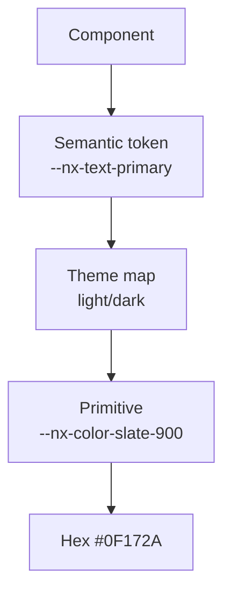

# NX-DS-5002 — Color Tokens

| Field | Value |
|-------|-------|
| **Document ID** | NX-DS-5002 |
| **Title** | Color Tokens |
| **Phase** | 3 — UX Bible |
| **Owner** | Design AI |
| **Status** | 🟢 Complete |
| **Version** | 0.1.0 |
| **Created** | 2026-06-30 |
| **Depends on** | NX-DS-5001 (Overview) |

---

## 1. Purpose

This document defines the **color tokens** that power every screen in NEXUS. It establishes the primitive palette (raw colors), the semantic tokens (purpose-named), and the dark / sepia / high-contrast derivations.

Tokens are referenced by every component and screen. Designers never use raw hex values.

## 2. Primitive palette

The primitive palette is the source. Semantic tokens consume primitives.

### 2.1 Neutrals (slate scale)

| Token | Hex | Usage |
|-------|-----|-------|
| `--nx-color-slate-0` | #FFFFFF | Pure white |
| `--nx-color-slate-50` | #F8FAFC | Subtle background |
| `--nx-color-slate-100` | #F1F5F9 | Surface |
| `--nx-color-slate-200` | #E2E8F0 | Border |
| `--nx-color-slate-300` | #CBD5E1 | Disabled text |
| `--nx-color-slate-400` | #94A3B8 | Placeholder |
| `--nx-color-slate-500` | #64748B | Secondary text |
| `--nx-color-slate-600` | #475569 | Body text |
| `--nx-color-slate-700` | #334155 | Primary text |
| `--nx-color-slate-800` | #1E293B | Strong text |
| `--nx-color-slate-900` | #0F172A | Inverse background |
| `--nx-color-slate-950` | #020617 | Deep dark |

### 2.2 Brand — Aurora (default accent)

| Token | Hex | Usage |
|-------|-----|-------|
| `--nx-color-aurora-50` | #EEF2FF | Tint |
| `--nx-color-aurora-100` | #E0E7FF | Tint strong |
| `--nx-color-aurora-300` | #A5B4FC | Hover accent |
| `--nx-color-aurora-500` | #6366F1 | Default accent |
| `--nx-color-aurora-600` | #4F46E5 | Active accent |
| `--nx-color-aurora-700` | #4338CA | Pressed accent |
| `--nx-color-aurora-900` | #312E81 | Deep accent |

### 2.3 Semantic state colors

| Token | Hex | Usage |
|-------|-----|-------|
| `--nx-color-success-500` | #10B981 | Success states |
| `--nx-color-success-700` | #047857 | Success strong |
| `--nx-color-warning-500` | #F59E0B | Warning states |
| `--nx-color-warning-700` | #B45309 | Warning strong |
| `--nx-color-danger-500` | #EF4444 | Destructive / error |
| `--nx-color-danger-700` | #B91C1C | Destructive strong |
| `--nx-color-info-500` | #3B82F6 | Info |
| `--nx-color-info-700` | #1D4ED8 | Info strong |

### 2.4 Agent role colors

| Token | Hex | Agent |
|-------|-----|-------|
| `--nx-color-agent-planner` | #8B5CF6 | Planner |
| `--nx-color-agent-researcher` | #06B6D4 | Researcher |
| `--nx-color-agent-coder` | #22C55E | Coder |
| `--nx-color-agent-reviewer` | #F59E0B | Reviewer |
| `--nx-color-agent-tester` | #EC4899 | Tester |
| `--nx-color-agent-publisher` | #6366F1 | Publisher |
| `--nx-color-agent-default` | #64748B | Default (custom) |

## 3. Semantic tokens

Semantic tokens map to primitives and are what components consume. They auto-switch in dark mode.

### 3.1 Surface tokens

| Token | Light | Dark | Usage |
|-------|-------|------|-------|
| `--nx-bg-app` | slate-50 | slate-950 | App background |
| `--nx-bg-canvas` | slate-0 | slate-900 | Primary surface |
| `--nx-bg-elevated` | slate-0 | slate-800 | Cards, popovers |
| `--nx-bg-overlay` | rgba(15,23,42,0.5) | rgba(0,0,0,0.6) | Modal scrim |
| `--nx-bg-hover` | slate-100 | slate-800 | Hover state |
| `--nx-bg-active` | slate-200 | slate-700 | Active state |
| `--nx-bg-selected` | aurora-100 | aurora-900/30 | Selected row |
| `--nx-bg-muted` | slate-100 | slate-800 | Muted surface |

### 3.2 Text tokens

| Token | Light | Dark | Usage |
|-------|-------|------|-------|
| `--nx-text-primary` | slate-900 | slate-50 | Primary text |
| `--nx-text-secondary` | slate-600 | slate-300 | Secondary text |
| `--nx-text-muted` | slate-500 | slate-400 | Muted / placeholder |
| `--nx-text-disabled` | slate-400 | slate-500 | Disabled |
| `--nx-text-inverse` | slate-0 | slate-900 | On accent surfaces |
| `--nx-text-link` | aurora-600 | aurora-300 | Links |
| `--nx-text-on-accent` | slate-0 | slate-0 | On aurora fills |

### 3.3 Border tokens

| Token | Light | Dark | Usage |
|-------|-------|------|-------|
| `--nx-border-subtle` | slate-200 | slate-800 | Subtle divider |
| `--nx-border-default` | slate-300 | slate-700 | Default border |
| `--nx-border-strong` | slate-400 | slate-600 | Strong border |
| `--nx-border-focus` | aurora-500 | aurora-300 | Focus ring |
| `--nx-border-danger` | danger-500 | danger-500 | Danger border |

### 3.4 Status tokens

| Token | Light | Dark |
|-------|-------|------|
| `--nx-status-success-bg` | success-500/10 | success-500/20 |
| `--nx-status-success-fg` | success-700 | success-500 |
| `--nx-status-warning-bg` | warning-500/10 | warning-500/20 |
| `--nx-status-warning-fg` | warning-700 | warning-500 |
| `--nx-status-danger-bg` | danger-500/10 | danger-500/20 |
| `--nx-status-danger-fg` | danger-700 | danger-500 |
| `--nx-status-info-bg` | info-500/10 | info-500/20 |
| `--nx-status-info-fg` | info-700 | info-500 |

## 4. Themes

### 4.1 Light (default)

Light is the default for new users. Background: `--nx-bg-app` (slate-50).

### 4.2 Dark

Inverted scale. Background: `--nx-bg-app` (slate-950). Accent colors adjusted for contrast.

### 4.3 Sepia

| Token | Value |
|-------|-------|
| `--nx-bg-app` | #FBF7F0 |
| `--nx-bg-canvas` | #F5EFE3 |
| `--nx-text-primary` | #3D2F1F |
| `--nx-text-secondary` | #6B5B45 |
| `--nx-border-default` | #D8C9A8 |
| `--nx-color-aurora-500` | #8B6914 |

### 4.4 High Contrast (a11y)

| Token | Value |
|-------|-------|
| `--nx-bg-app` | #000000 |
| `--nx-bg-canvas` | #000000 |
| `--nx-text-primary` | #FFFFFF |
| `--nx-text-secondary` | #FFFF00 |
| `--nx-border-default` | #FFFFFF |
| `--nx-border-focus` | #FFFF00 |
| `--nx-color-aurora-500` | #FFFF00 |

## 5. Color usage rules

1. **Never use primitives directly in components.** Always use semantic tokens.
2. **Contrast minimum.** Body text: 4.5:1. Large text: 3:1. UI elements: 3:1.
3. **Color is not the only signal.** Icons + text accompany color changes.
4. **Dark mode is not inverted light.** It's a tuned palette.
5. **Agent colors are fixed.** Don't override them per workspace.

## 6. Mermaid: token resolution

## 7. Acceptance criteria

The color system is complete when:

- [ ] Every component consumes only semantic tokens.
- [ ] Switching theme updates all surfaces without code changes.
- [ ] WCAG 2.2 AA contrast passes for all text/background pairs.
- [ ] Color-blind simulation (deuteranopia, protanopia, tritanopia) preserves information.
- [ ] High Contrast theme passes AAA contrast for primary text.

## 8. Reading list

- **Design System Overview** — NX-DS-5001
- **Typography** — NX-DS-5003
- **Component Library** — NX-DS-5008
- **Accessibility Foundations** — NX-DS-5009

---

*End NX-DS-5002.*