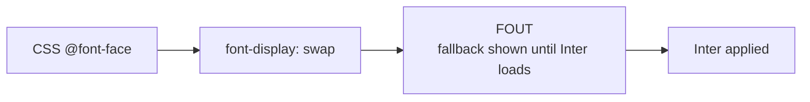

# NX-DS-5003 — Typography

| Field | Value |
|-------|-------|
| **Document ID** | NX-DS-5003 |
| **Title** | Typography |
| **Phase** | 3 — UX Bible |
| **Owner** | Design AI |
| **Status** | 🟢 Complete |
| **Version** | 0.1.0 |
| **Created** | 2026-06-30 |
| **Depends on** | NX-DS-5001 (Overview), NX-DS-5002 (Color Tokens) |

---

## 1. Purpose

NEXUS uses two type families — **Inter** for UI and **JetBrains Mono** for code — across a 9-step scale. This document defines the scale, the line-heights, the weights, and the usage rules.

## 2. Type families

| Family | Token | License | Usage |
|--------|-------|---------|-------|
| **Inter** | `--nx-font-sans` | OFL | UI, headings, body |
| **JetBrains Mono** | `--nx-font-mono` | OFL | Code, technical |
| **Inter Display** | `--nx-font-display` | OFL | Marketing surfaces only |

Inter is loaded with weights 400, 500, 600, 700. JetBrains Mono with weights 400, 500.

## 3. The type scale

A modular scale with ratio 1.2 (minor third) anchored at 16px.

| Token | Size (px) | Line-height | Weight | Usage |
|-------|-----------|-------------|--------|-------|
| `--nx-text-xs` | 12 | 16 | 400 | Captions, helper text |
| `--nx-text-sm` | 14 | 20 | 400 | Small body, labels |
| `--nx-text-base` | 16 | 24 | 400 | Body |
| `--nx-text-lg` | 18 | 28 | 400 | Large body |
| `--nx-text-xl` | 20 | 28 | 500 | Lead paragraph |
| `--nx-text-2xl` | 24 | 32 | 600 | Section heading |
| `--nx-text-3xl` | 30 | 38 | 600 | Page heading |
| `--nx-text-4xl` | 36 | 44 | 700 | Major heading |
| `--nx-text-display` | 48 | 56 | 700 | Hero / empty state |

## 4. Usage by surface

| Surface | Token |
|---------|-------|
| Home screen prompt | text-4xl |
| Page heading | text-3xl |
| Section heading | text-2xl |
| Card title | text-lg |
| Body | text-base |
| List item | text-sm |
| Button label | text-sm (weight 500) |
| Caption / meta | text-xs |
| Code | font-mono, text-sm |
| Empty state hero | text-display |

## 5. Line-height and letter-spacing

| Token | Value |
|-------|-------|
| `--nx-leading-tight` | 1.2 |
| `--nx-leading-snug` | 1.35 |
| `--nx-leading-normal` | 1.5 |
| `--nx-leading-relaxed` | 1.65 |

| Token | Value | Usage |
|-------|-------|-------|
| `--nx-tracking-tighter` | -0.02em | Display sizes |
| `--nx-tracking-tight` | -0.01em | Headings |
| `--nx-tracking-normal` | 0 | Body |
| `--nx-tracking-wide` | 0.02em | Caps |

## 6. Weight tokens

| Token | Weight | Usage |
|-------|--------|-------|
| `--nx-weight-regular` | 400 | Body |
| `--nx-weight-medium` | 500 | Labels, buttons |
| `--nx-weight-semibold` | 600 | Headings |
| `--nx-weight-bold` | 700 | Major headings |

## 7. Paragraph rhythm

- Default body uses `--nx-leading-normal` and 1em top/bottom margin.
- Lists use 0.5em between items.
- Headings have 1.5em top margin (or 2em above section level) and 0.5em bottom.

## 8. Code typography

| Token | Value |
|-------|-------|
| `--nx-font-mono` | "JetBrains Mono", ui-monospace, monospace |
| `--nx-text-code` | 14px / 22px / 400 |
| `--nx-bg-code` | slate-100 (light) / slate-900 (dark) |
| `--nx-text-code-fg` | aurora-700 (light) / aurora-300 (dark) |

Inline code: 0.875em, padding 0 0.25em, radius 4px, mono.
Block code: full-width container, padding 16px, max-height 480px with scroll.

## 9. Truncation

| Token | Behavior |
|-------|----------|
| `truncate-1` | Single-line ellipsis |
| `truncate-2` | Two-line clamp |
| `truncate-3` | Three-line clamp |
| `truncate-expand` | Truncated with "Show more" toggle |

Default truncate depth by surface:

| Surface | Default |
|---------|---------|
| List item title | 1 |
| Card title | 2 |
| List item description | 3 |
| Workspace goal | 2 |

## 10. Localization

- Latin scripts use Inter as primary.
- CJK falls back to system fonts (`-apple-system`, `BlinkMacSystemFont`, `PingFang SC`, etc.).
- RTL languages (Arabic, Hebrew) flip line-height and use the same Inter family.
- Monospace CJK: `Sarasa Mono SC` (OFL) for JetBrains Mono equivalent.

## 11. Acceptance criteria

The typography system is complete when:

- [ ] Every text style uses a token, never a raw px/em.
- [ ] All scales have line-heights that prevent clipping.
- [ ] WCAG 2.2 AA contrast passes for every text-on-background pair.
- [ ] JetBrains Mono renders correctly in all OS targets.
- [ ] Font loading does not block first paint (FOUT/FOIT strategy defined).
- [ ] Truncation is consistent across surfaces.
- [ ] CJK / RTL layouts work without manual adjustments.

## 12. Font loading strategy

Inter is loaded with `font-display: swap` to prevent invisible text. Preload `<link rel="preload">` for the 400 weight only; other weights load lazily.

## 13. Reading list

- **Overview** — NX-DS-5001
- **Color Tokens** — NX-DS-5002
- **Spacing & Layout** — NX-DS-5004
- **Accessibility Foundations** — NX-DS-5009

---

*End NX-DS-5003.*