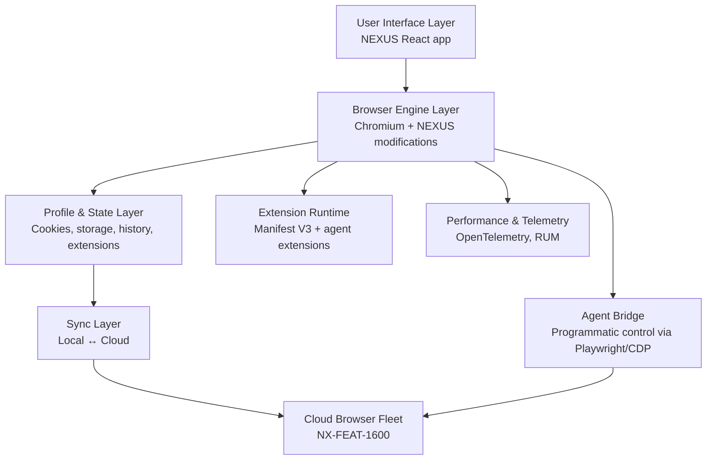
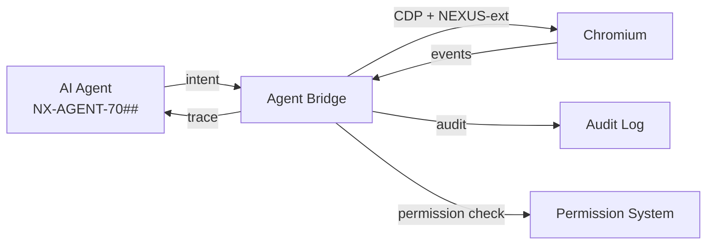

# NX-ARCH-0001 — Browser Architecture Overview

| Field | Value |
|-------|-------|
| **Document ID** | NX-ARCH-0001 |
| **Title** | Browser Architecture Overview |
| **Phase** | 6 — Browser Architecture |
| **Owner** | Browser AI (NX-AGENT-7056) |
| **Status** | 🟢 Complete |
| **Version** | 0.1.0 |
| **Created** | 2026-07-02 |
| **Depends on** | NX-DOC-0002 (Vision), NX-DOC-0011 (Technical Principles), NX-FEAT-1600 (Cloud Browser Fleet), NX-EM-9611 (Browser AI Manifest) |

---

## 1. Mission

Define the architecture of the NEXUS browser — local and cloud variants — so the system is fast, secure, observable, and supports the vision of the browser as an **active operator** rather than a passive document viewer.

## 2. Architectural principles

These principles are concrete instantiations of NX-DOC-0011 applied to the browser.

1. **Chromium is the substrate.** All NEXUS browser instances (local app, Cloud Browsers, headless automation) embed the same Chromium LTS build. One engine, one set of behaviors, one security model.
2. **Local-first, cloud-optional.** A user can use NEXUS entirely offline. Cloud features (sync, Cloud Browsers, scheduled tasks) are layered on top and degrade gracefully when unavailable.
3. **Profiles are isolated worlds.** A profile is a complete sandbox: cookies, storage, history, extensions, agent memory. Cross-profile leakage is a P0 incident.
4. **Agents are first-class extensions.** The extension API (NX-ARCH-0107) is designed so AI agents can drive the browser the same way users can, with appropriate permissioning.
5. **Every action is attributed.** Per NX-DOC-0011 P6 (observability), every browser action — user or agent — produces a structured log event.
6. **Performance is a feature.** Per NX-DOC-0011 P8, budgets are codified in NX-ARCH-0108 and regressions block release.

## 3. Layered architecture

Each layer has a dedicated architecture document:

| Layer | Doc | Doc ID |
|-------|-----|--------|
| Browser engine | Chromium Integration | NX-ARCH-0101 |
| Browser engine | Rendering Pipeline | NX-ARCH-0102 |
| State | Profile System | NX-ARCH-0103 |
| State | History Engine | NX-ARCH-0104 |
| Sync | Sync Protocol | NX-ARCH-0105 |
| State | Download Manager | NX-ARCH-0106 |
| Extension | Extension Runtime | NX-ARCH-0107 |
| Cross-cutting | Performance Architecture | NX-ARCH-0108 |

## 4. Two deployment shapes: local and cloud

NEXUS has two browser topologies, both built on the same Chromium base:

| Aspect | Local browser | Cloud browser |
|--------|---------------|---------------|
| Process | Runs in user's OS (Tauri shell) | Runs in a containerized VM in NEXUS infrastructure |
| Lifetime | Tied to app session | Persistent, 30+ days idle (NX-FEAT-1602) |
| State | Local disk (encrypted) | Cloud storage (S3-compatible, encrypted) |
| Agent control | Local agent bridge | Remote agent bridge via authenticated channel |
| Resource limits | User's hardware | Per-tier limits (NX-FEAT-1612) |
| Profile model | Same | Same |
| Sync | Bi-directional | Bi-directional (one of many ends) |
| Live view | n/a | Required (NX-FEAT-1607) |

The **profile** is the unit of identity and isolation that travels between the two.

## 5. The agent bridge

A first-class architectural concern: AI agents need to drive the browser the same way humans do, but with different permissioning and observability. NX-ARCH-0107 (Extension Runtime) describes the surface; this section describes the bridge.

The agent bridge:

- Exposes Chromium DevTools Protocol (CDP) plus a NEXUS extension protocol for higher-level actions ("navigate to URL", "fill form", "screenshot").
- Mediates every action through the permission system (NX-AGENT-7015) — agents do not have free run of the browser.
- Emits structured audit events for every action, attributable to the agent ID, run ID, and user.
- Rate-limits per agent and per user (prevents accidental runaway loops).

## 6. What this phase does NOT cover

- **Browser product surface (tabs, address bar, etc.)** — that's Phase 2 (NX-FEAT-1600 et al).
- **AI platform substrate** — Phase 4 (NX-AGENT-7011, NX-AGENT-7010).
- **Cloud-side orchestration** — Phase 7 (07_BACKEND) and Phase 8 (09_MARKETPLACE).
- **Per-leaf feature behavior** — Phase 2 (NX-FEAT-1601..1614).

## 7. Acceptance criteria for the phase

- [ ] All 8 leaf architecture documents (NX-ARCH-0101..0108) complete.
- [ ] All decisions have rationale traced to NX-DOC-0011 or NX-DOC-0002.
- [ ] Cross-references to NX-FEAT-1600..1614 (where applicable) are explicit.
- [ ] No architectural claim contradicts a leaf feature spec.

## 8. Reading list

- **Vision** — NX-DOC-0002
- **Technical Principles** — NX-DOC-0011
- **Cloud Browser Fleet** — NX-FEAT-1600
- **Browser AI Manifest** — NX-EM-9611
- **All 8 leaf architecture docs** — NX-ARCH-0101..0108

---

*End NX-ARCH-0001.*
