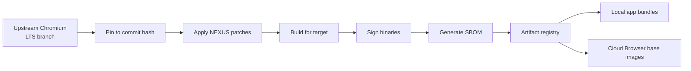
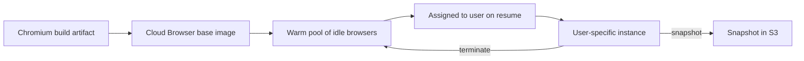

# NX-ARCH-0101 — Chromium Integration

| Field | Value |
|-------|-------|
| **Document ID** | NX-ARCH-0101 |
| **Title** | Chromium Integration |
| **Phase** | 6 — Browser Architecture |
| **Owner** | Browser AI (NX-AGENT-7056) |
| **Status** | 🟢 Complete |
| **Version** | 0.1.0 |
| **Created** | 2026-07-02 |
| **Depends on** | NX-ARCH-0001 (Overview), NX-DOC-0011 (Tech Principles), NX-EM-9611 (Browser AI) |

---

## 1. Mission

Embed Chromium as NEXUS's browser engine across all surfaces (local app, Cloud Browsers, headless automation) with a controlled, secure, and versioned integration.

## 2. Why Chromium

Per NX-DOC-0011 §5 (browser engine), Chromium is the canonical choice. Rationale:

- **Standards compliance.** Same engine as 70%+ of the web's users; sites that work in Chrome work in NEXUS.
- **Active security program.** Chromium's security team ships CVE patches within hours.
- **CDP availability.** The DevTools Protocol gives us a well-documented automation surface that the agent bridge (NX-ARCH-0001 §5) is built on.
- **Talent pool.** Every browser engineer knows Chromium.

Trade-offs accepted:

- **Memory footprint.** Chromium is large (~150MB resident minimum). Addressed via per-profile resource limits (NX-FEAT-1612) and Chromium's own memory-saving flags.
- **Upstream drift.** When Chromium changes a feature we depend on, we follow. (Mitigation: pin to LTS, plan upgrades per §6.)

## 3. Embedding model

NEXUS uses Chromium in three embedding shapes, all backed by the same upstream LTS build:

| Shape | Used by | Process model |
|-------|---------|---------------|
| **WebView (Tauri)** | Local NEXUS desktop app | In-process, inside Tauri Rust shell |
| **Headless Chromium** | Cloud Browsers, automation, screenshots | Separate OS process, headless by default |
| **Headed Chromium** | Cloud Browser live view, user opt-in headed mode | Separate OS process, headed |

All three share the same Chromium version (per §6), the same patch policy, and the same build flags (per §5). The differences are in *how* we spawn and connect, not in *what* we spawn.

## 4. Build pipeline

NEXUS **patches Chromium minimally** — only where we need behavior upstream won't provide (e.g., NEXUS-specific audit hooks, custom agent-bridge protocol). Every patch is reviewed, has a removal plan, and is tracked in the patch manifest (`_assets/chromium_patches.md`).

The build pipeline is reproducible (per NX-DOC-0011 P10: document the decision): every binary has an SBOM and can be rebuilt from the same inputs.

## 5. Build flags (canonical)

These flags are applied to every NEXUS Chromium build, both local and cloud. Documented here so any change requires an explicit ADR.

| Flag | Value | Reason |
|------|-------|--------|
| `--enable-features=...` | NEXUS_AUDIT_HOOK, NEXUS_AGENT_BRIDGE | Internal feature gates |
| `--disable-background-networking` | true | No automatic connections; all actions attributed |
| `--disable-component-updater` | true | We control the update channel |
| `--disable-default-apps` | true | No surprise default apps |
| `--disable-extensions-except=<path>` | per profile | Whitelist mode (NX-ARCH-0107) |
| `--metrics-recording-only` | true | No upstream telemetry |
| `--no-pings` | true | No upstream pings |
| `--site-per-process` | true | Strong site isolation by default |
| `--enable-features=PartitionAllocBackgroundMemoryReclaim` | true | Memory hygiene |
| `--js-flags=--max-old-space-size=<tier>` | per tier | Memory cap per profile |

## 6. Version strategy

**Pin to Chromium LTS.** We do not chase the latest version. The policy:

- **LTS baseline** chosen at the start of each H1 (matches a Chromium extended-support branch).
- **Quarterly:** apply security patches only. Tested in staging Cloud Browsers for 1 week before local app rollout.
- **Annual:** consider major version bump. Bumps require an ADR with migration plan and a 3-month deprecation window for any removed APIs the NEXUS agent bridge depends on.
- **Emergency:** CVE severity > 7.0 can trigger an out-of-band patch.

LTS is documented in `_assets/chromium_lts.md` (a small file pinning the commit hash and the planned patch schedule).

## 7. Agent bridge integration

The agent bridge (NX-ARCH-0001 §5) is implemented as:

- A NEXUS-specific Chromium extension loaded in **every** profile (whitelisted via `--disable-extensions-except`).
- This extension exposes a CDP bridge plus NEXUS-specific RPC methods (e.g., `nexus.fillForm`, `nexus.assertVisible`).
- The extension runs with maximum privileges; this is intentional — it IS NEXUS.

Permission to install this extension is gated at the binary level (the build always includes it); user-level permissioning happens at the agent-action layer (NX-AGENT-7015).

## 8. Cloud Browser image lifecycle

For Cloud Browsers, the Chromium build becomes the base image:

The warm pool is sized to expected demand; per NX-FEAT-1600, idle browsers are kept warm for 30+ days at 50% billing rate.

## 9. Security considerations

- **Binary signing.** All Chromium binaries are signed; signature verified at app launch and at Cloud Browser boot.
- **SBOM tracking.** Every artifact has an SBOM; consumers can verify what they're running.
- **Patch isolation.** Patches are applied in a dedicated build environment; production binaries are never modified in place.
- **Upstream notification.** Subscribe to Chromium security advisories; on-call rotation gets paged for severity > 7.0.
- **No third-party Chromium builds.** We always build from upstream source, never use a vendor's pre-built binary.

## 10. Performance budget

See NX-ARCH-0108 §5 (Chromium-specific budgets). Headline: cold start < 1.5s on reference hardware; idle memory < 200MB; 50 tabs in < 1.5GB.

## 11. Open questions

- Q: When Chromium deprecates Manifest V2, when do we drop MV2 extension support in Cloud Browsers? (See NX-ARCH-0107 §11.)
- Q: Should NEXUS ship its own Chromium fork as a public project, or stay as a private build?
- Q: How aggressively do we adopt Chromium's "Origin Trials" features in NEXUS?

## 12. Reading list

- **Overview** — NX-ARCH-0001
- **Technical Principles** — NX-DOC-0011
- **Browser AI Manifest** — NX-EM-9611
- **Extension Runtime** — NX-ARCH-0107
- **Performance Architecture** — NX-ARCH-0108
- **Cloud Browser Fleet** — NX-FEAT-1600

---

*End NX-ARCH-0101.*
