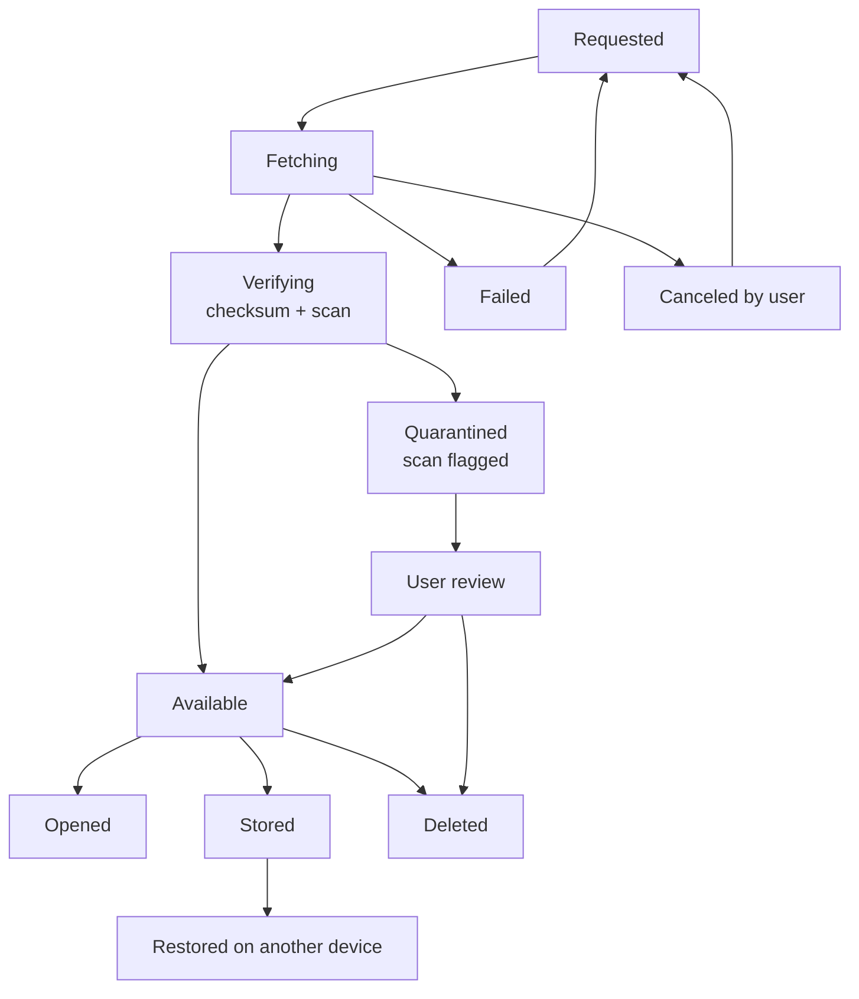

# NX-ARCH-0106 — Download Manager

| Field | Value |
|-------|-------|
| **Document ID** | NX-ARCH-0106 |
| **Title** | Download Manager |
| **Phase** | 6 — Browser Architecture |
| **Owner** | Browser AI (NX-AGENT-7056) |
| **Status** | 🟢 Complete |
| **Version** | 0.1.0 |
| **Created** | 2026-07-02 |
| **Depends on** | NX-ARCH-0001, NX-ARCH-0103 (Profile), NX-AGENT-7058 (Security AI) |

---

## 1. Mission

Manage the lifecycle of file downloads in NEXUS — for users and for agents — so downloads are fast, safe, observable, and resumable across devices and Cloud Browsers.

## 2. Lifecycle

A download in NEXUS moves through these states:



**Requested** — a user or agent initiates a download.
**Fetching** — the bytes are coming in, possibly resumable.
**Verifying** — checksum, content-type sniff, malware scan (per §6).
**Available** — verified, ready to use.
**Quarantined** — scan flagged; held for user review.
**Stored** — saved to a permanent location; out of the default download area.
**Opened** — opened by an application handler.
**Deleted** — removed by user or policy.
**Restored** — synced to another device, picked up there.

## 3. Storage

Three storage tiers, picked by user/agent preference:

| Tier | Where | Lifetime | Use case |
|------|-------|----------|----------|
| **Ephemeral** | `~/.nexus/profiles/<id>/downloads/ephemeral/` | Until profile suspended | Normal downloads |
| **Persistent** | User-chosen folder (local) or S3 (cloud) | Until user deletes | Long-term storage |
| **Workspace** | Workspace-scoped S3 prefix | Per workspace retention policy | Team-shared downloads |

Cloud Browser downloads default to workspace storage unless the user opts to download to local.

## 4. Resumability

Downloads are resumable. The download manager:

- Tracks byte ranges transferred.
- On reconnect (network blip), resumes from the last byte.
- On user pause, persists the partial state; resume within 7 days.
- On user close (NEXUS quit), persists the partial state; resume on next launch.
- On Cloud Browser idle/snapshot, persists to S3; resume on the same or a different Cloud Browser.

Resume uses HTTP `Range` requests when supported, or a custom delta protocol (per §9) when not.

## 5. File handling

After download:

- **Open with default app** — registered per file type at the OS level.
- **Open in NEXUS** — for files NEXUS can render natively (PDF, images, Markdown, code).
- **Save to a workspace** — for team-shared files.
- **Pass to an agent** — for files the agent will process further (H2; agents can read the download via the agent bridge).

The user can pre-configure default behavior per file type. Agents can also specify behavior (e.g., "always pass PDF downloads to the research agent for extraction").

## 6. Security

Download security is critical. Per NX-AGENT-7058 (Security AI), every download is:

- **Scanned** by the local malware scanner (ClamAV or vendor equivalent).
- **Content-sniffed** — the actual content type, not just the URL-suggested one.
- **Hash-checked** — the checksum is computed and (when available) compared to a published checksum.
- **Quarantined** on any flag (scan, hash mismatch, suspicious origin) until user review.
- **Origin-recorded** — the URL, referrer, and active profile/agent are stored with the download for audit.

### 6.1 Cloud Browser downloads

Cloud Browser downloads add:

- **Same scanning** as local.
- **Antivirus scan** server-side, in addition to client.
- **Network egress scan** — file transfer from Cloud Browser to user's device is scanned at egress.
- **Storage encryption** — at rest in S3.
- **Audit log** — every download is logged with origin, target, size, and hash.

### 6.2 Agent-driven downloads

When an agent initiates a download (H2; flagged for review today):

- The agent must declare intent and target before the download starts.
- User can require explicit approval per download, per session, or per agent.
- The download is attributed to the agent in the audit log.
- Failed/malicious downloads block the agent run and surface a finding.

## 7. Sync

Downloads are sync units (per NX-ARCH-0105). The default policy:

- **Local downloads** do not sync by default (often large, often temporary).
- **Workspace downloads** always sync.
- **Persistent-tagged downloads** sync by user opt-in.

A user can "send to another device" for any download — that becomes a sync push.

## 8. Telemetry

Per download, emit:

- `download.started` (id, url, size, profile, agent_or_user, timestamp)
- `download.progress` (id, bytes_transferred, percent) — sampled, not per byte
- `download.completed` (id, final_size, duration_ms, hash, scan_result)
- `download.failed` (id, error_code, stage)
- `download.quarantined` (id, reason)
- `download.opened` (id, app_handler)
- `download.deleted` (id, by_user_or_policy)

Aggregate metrics (per NX-ARCH-0108): download success rate, average duration, scan-trigger rate, sync latency.

## 9. Protocol details

NEXUS uses a delta-based protocol for resumable downloads when HTTP `Range` is not supported:

```
CLIENT → SERVER: GET /download/<id>?from=<byte>
SERVER → CLIENT: 200 OK
                Content-Type: application/octet-stream
                X-Nexus-Resume-Token: <token>
                X-Nexus-Total-Size: <bytes>
                <bytes>
```

The resume token is a server-side opaque handle that authorizes resumption; it expires in 7 days.

## 10. Cloud Browser download flow

For a Cloud Browser download:

1. Agent or user initiates in Cloud Browser.
2. File is fetched by the Cloud Browser, stored in profile's ephemeral storage.
3. Scan runs in Cloud Browser.
4. If user wants local, file is transferred to local over the agent bridge.
5. If user wants workspace, file is uploaded to workspace S3.
6. If user wants persistent, file is uploaded to user's S3 prefix.

Bandwidth limits per NX-FEAT-1611 apply to transfers.

## 11. Open questions

- Q: Do we ship a built-in PDF reader, or always defer to OS default? (H2 candidate: a NEXUS-native reader for workspace PDFs.)
- Q: How aggressive should the malware scanner be? (False positives are a UX cost; we lean toward conservative quarantine.)
- Q: Should we support torrent or other peer-to-peer downloads? (Probably no, for security and legal reasons; defer H3+.)
- Q: Do we expose a download API to extensions? (Yes, with permission; see NX-ARCH-0107 §6.)

## 12. Reading list

- **Overview** — NX-ARCH-0001
- **Profile System** — NX-ARCH-0103
- **Sync Protocol** — NX-ARCH-0105
- **Cloud Browser Fleet** — NX-FEAT-1600
- **Bandwidth controls** — NX-FEAT-1611
- **Security AI Manifest** — NX-EM-9605
- **Extension Runtime** — NX-ARCH-0107

---

*End NX-ARCH-0106.*
