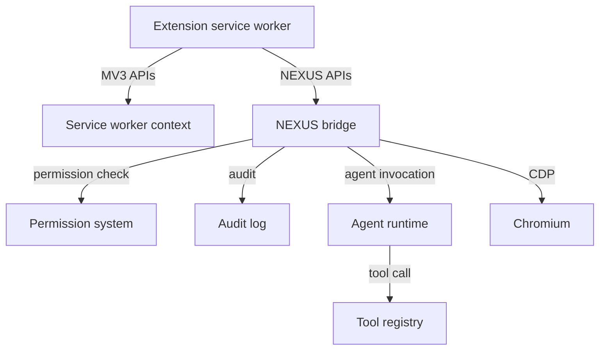
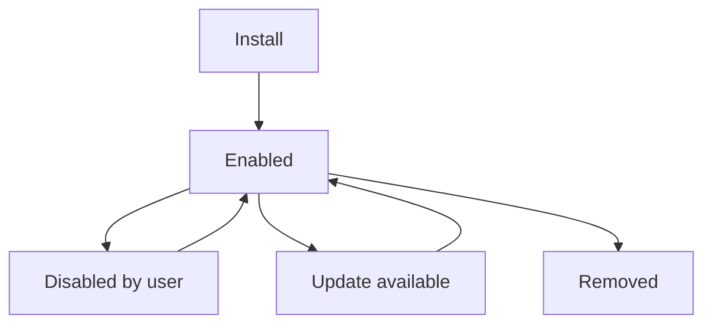

# NX-ARCH-0107 — Extension Runtime

| Field | Value |
|-------|-------|
| **Document ID** | NX-ARCH-0107 |
| **Title** | Extension Runtime |
| **Phase** | 6 — Browser Architecture |
| **Owner** | Browser AI (NX-AGENT-7056) + AI Platform AI (NX-AGENT-7057) |
| **Status** | 🟢 Complete |
| **Version** | 0.1.0 |
| **Created** | 2026-07-02 |
| **Depends on** | NX-ARCH-0001, NX-ARCH-0103 (Profile), NX-AGENT-7015 (Guardrails), NX-EM-9605 (Security AI) |

---

## 1. Mission

Run extensions — including a first-class extension type for AI agents — in NEXUS, with strong isolation, clear permissioning, and integration with the NEXUS audit and permission system.

## 2. Why extensions matter in NEXUS

A traditional browser's extension model is for users. In NEXUS, **agents are also extensions** — they get the same isolated runtime, the same permissioning surface, and the same audit trail. Treating agents as extensions has two benefits:

1. **Security uniformity.** All third-party code (and all agent code) runs through the same sandbox and permissioning; no special carve-outs.
2. **Composability.** Extensions can build on agents; agents can use extensions. The marketplace (Phase 8) treats them uniformly.

## 3. Manifest format

NEXUS supports **Chromium Manifest V3** for compatibility, plus a NEXUS-extended manifest for agent features.

### 3.1 MV3 compatibility

Standard MV3 extensions work. NEXUS imposes:

- Service worker (background script) model.
- No remote-hosted code (per Chromium).
- NEXUS-side permission check (we do *not* trust the extension to self-enforce).

### 3.2 NEXUS extensions

A NEXUS extension manifest adds:

```yaml
nexus:
  type: extension | agent_extension
  scopes:                       # permissions per NX-AGENT-7015
    - read:history
    - write:cookies
    - fill:forms
    - submit:forms
    - purchase       # user_approval_required_for (NX-ARCH-0103 §7)
  agent:                        # only for agent_extensions
    agent_id: NX-AGENT-70##     # which agent this implements
    model: claude-opus-4-7      # or ollama/llama.cpp local
    memory: scoped | global | none
    tools:                      # tools this agent exposes
      - id: search
      - id: navigate
  audit: standard | verbose
  rate_limit:
    requests_per_minute: 60
```

NEXUS extensions without a `nexus` block are treated as standard MV3 extensions with no agent integration.

## 4. Runtime



The extension runs in Chromium's service worker context (per MV3). The NEXUS bridge is a privileged NEXUS-side component that mediates all NEXUS API calls.

The extension never has direct access to the agent runtime; it goes through the bridge, which enforces permissioning, rate limits, and audit.

## 5. Permissioning

Per NX-AGENT-7015, every extension action passes through the NEXUS permission system. The model:

```typescript
interface ExtensionAction {
  extension_id: string;
  agent_id?: string;          // for agent extensions
  profile_id: string;
  user_id: string;
  action: string;             // e.g., "history.read"
  resource: string;           // e.g., the URL or memory id
  context: any;               // action-specific
}
```

The permission system returns: `allow | deny | require_user_approval`.

The user can:

- **Approve per session** — for this action now.
- **Approve per profile** — for this class of action on this profile.
- **Approve per extension** — blanket approval (rare; audited heavily).
- **Deny** — always denied, logged.

The user is prompted for `require_user_approval` actions, with a clear UI showing the extension, the action, the resource, and the risk level.

## 6. APIs exposed to extensions

Standard MV3 APIs work. NEXUS adds:

| API | Purpose | Permission |
|-----|---------|-----------|
| `nexus.history.read` | Read history for the active profile | `read:history` |
| `nexus.cookies.read/write` | Access cookies for the active profile | `read:cookies` / `write:cookies` |
| `nexus.tabs.list/open/close` | Manage tabs | `tabs:manage` |
| `nexus.forms.fill` | Programmatically fill a form (per agent bridge) | `fill:forms` |
| `nexus.forms.submit` | Submit a form (per agent bridge) | `submit:forms` |
| `nexus.downloads.read/write` | List and manage downloads | `downloads:manage` |
| `nexus.screenshots.capture` | Capture tab screenshot | `screenshots:read` |
| `nexus.memory.read/write` | Read/write memory items | `memory:read` / `memory:write` |
| `nexus.agents.invoke` | Invoke another agent | `agents:invoke` (rare) |
| `nexus.events.subscribe` | Subscribe to events (navigation, errors, etc.) | `events:subscribe` |

All APIs are namespaced under `nexus.*`. The extension calls them via the NEXUS bridge; calls are logged.

## 7. Lifecycle



- **Install.** Per-profile by default; user can mark global. Review screen shows permissions before install.
- **Enabled.** Extension active; APIs callable.
- **Disabled.** Extension installed but APIs blocked. Useful for troubleshooting.
- **Update.** Manifest change triggers re-permissioning if scopes changed.
- **Removed.** Cleanup of extension state. (Audit log retained.)

## 8. Per-profile vs. global

Extensions in NEXUS are scoped to a **profile** by default. The user can mark an extension as **global**, in which case it runs in all profiles (with a separate per-profile permission grant).

A user might globally install a password manager, but it would only activate in profiles where the user has granted `read:passwords` permission. This is similar to how Firefox's extension permissions work, but more explicit per profile.

## 9. Agent extensions

Agent extensions are extensions that implement an agent. They get:

- An agent ID (NX-AGENT-70##) — must be registered with the AI Platform (Phase 4) first.
- A model assignment (cloud or local).
- A memory scope (per the manifest).
- A tool list.

When the agent is invoked, the extension's service worker is loaded (or warmed, if recently used) and the agent's `invoke` handler runs. Tools are defined by the extension via the standard tool schema (NX-AGENT-7011).

**Critical:** the agent extension runs in the service worker, not the page context. This is intentional — it limits the attack surface and keeps the page DOM inaccessible to the agent directly. The agent interacts with the page via the agent bridge (NX-ARCH-0001 §5), which is permissioned.

## 10. Audit

Every extension action is audited:

- `extension.installed`
- `extension.removed`
- `extension.updated`
- `extension.action.called` (with args, redacted for sensitive fields)
- `extension.permission.granted`
- `extension.permission.denied`
- `extension.user_approval.requested`
- `extension.user_approval.granted/denied`

Audit logs are retained per the user's audit-retention setting (90 days default; up to 7 years for compliance profiles).

## 11. Security considerations

- **Default-deny.** Every extension starts with zero permissions; the user grants.
- **Least privilege.** Permissions are granular (see §6); no broad "all" grants.
- **No remote code.** Extensions cannot load code from outside their bundle (Chromium default; we don't relax it).
- **Signed extensions.** The NEXUS extension store requires signing; sideloaded extensions are flagged.
- **Update verification.** Updates are signed and verified; no silent privilege escalation.
- **MV2 deprecation.** When Chromium fully removes MV2, NEXUS does the same. We do not maintain MV2 indefinitely.
- **Extension crashes are isolated.** A crash in one extension does not affect the browser or other extensions.

## 12. Performance

- **Service worker start time:** < 100ms warm, < 500ms cold.
- **Permission check latency:** < 5ms (cached after first lookup).
- **API call overhead:** < 2ms added latency for `nexus.*` calls.
- **Memory cost per installed extension:** < 20MB resident (target).

## 13. Open questions

- Q: Do we ship a NEXUS-native extension SDK separate from MV3, or just document NEXUS extensions as MV3+? (TBD; SDK is H2.)
- Q: How do we handle extension permission grants when a profile is shared? (See NX-ARCH-0103 §10 on shared profiles.)
- Q: Should NEXUS have a "verified extension" program (like Chrome's Featured extensions)?

## 14. Reading list

- **Overview** — NX-ARCH-0001
- **Profile System** — NX-ARCH-0103
- **Chromium Integration** — NX-ARCH-0101
- **Agent Contract Specification** — NX-AGENT-7001
- **Tool Schema** — NX-AGENT-7011
- **Memory Schema** — NX-AGENT-7010
- **Guardrails & Safety** — NX-AGENT-7015
- **Security AI Manifest** — NX-EM-9605
- **Multi-Agent Composition** — NX-AGENT-7014

---

*End NX-ARCH-0107.*
