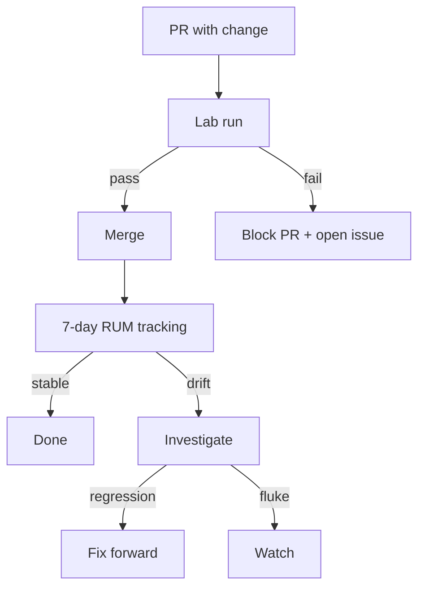

# NX-ARCH-0108 — Performance Architecture

| Field | Value |
|-------|-------|
| **Document ID** | NX-ARCH-0108 |
| **Title** | Performance Architecture |
| **Phase** | 6 — Browser Architecture |
| **Owner** | Browser AI (NX-AGENT-7056) + DevOps AI (NX-AGENT-7060) |
| **Status** | 🟢 Complete |
| **Version** | 0.1.0 |
| **Created** | 2026-07-02 |
| **Depends on** | NX-ARCH-0001, NX-ARCH-0101, NX-ARCH-0102, NX-DOC-0011 (P8) |

---

## 1. Mission

Make NEXUS fast — and keep it fast — by defining measurable performance budgets, the instrumentation to track them, the regression-detection system, and the process for acting on regressions.

## 2. The performance budget doctrine

Per NX-DOC-0011 P8 (Performance is a feature), every part of NEXUS has a budget. A budget is:

- A **measurable target** with units (e.g., "cold start < 1.5s").
- A **measurement method** (how we measure it in CI and production).
- A **threshold** (the number above which we consider the budget violated).
- A **remediation owner** (who is responsible if it's violated).

Budgets are not aspirational. They are the **gating criteria** for releases (per NX-WF-9003 Gate 6 / 9).

## 3. The seven core budgets

These are the budgets that matter most to user-perceived performance.

| # | Budget | Target | Threshold | Measured by | Owner |
|--:|--------|-------:|----------:|-------------|-------|
| 1 | **Cold start** (launch to first paint) | < 1.5s | > 2.0s | Lab + RUM | Browser AI |
| 2 | **Warm start** (resume from suspended) | < 0.5s | > 1.0s | Lab + RUM | Browser AI |
| 3 | **Page load (median)** | < 2.5s | > 4.0s | RUM | Browser AI |
| 4 | **Time to interactive** (per page) | < 3.5s | > 5.0s | RUM | Browser AI |
| 5 | **Frame rate** (interactive mode) | 60 fps median | < 50 fps median over 5s | RUM | Browser AI |
| 6 | **Memory footprint** (per profile, idle) | < 200MB | > 350MB | Lab | Browser AI |
| 7 | **Cloud Browser resume** | < 5s | > 10s | RUM | Browser AI + Backend |

All targets are on reference hardware (defined in §6).

## 4. The full budget catalog

The seven above are user-perceived. The complete catalog (lives in `_assets/perf_budgets.md` for reference) also includes:

- **Build pipeline** (Chromium rebuild time, CI cycle time)
- **Sync** (cold sync, warm sync delta, push notification latency)
- **Downloads** (throughput, scan latency)
- **History** (search latency)
- **Extensions** (service worker start, API call overhead)
- **Memory** (per-profile, per-tab, per-extension)
- **CPU** (idle, page-load, scroll, agent action)
- **Network** (per-action bytes, sync bytes, telemetry bytes)
- **Storage** (disk usage per profile, growth rate)
- **Battery** (mobile, when we ship mobile — H2+)
- **Cloud Browser cold start** (image boot, agent attach)
- **Live view** (end-to-end latency, frame rate, bandwidth)

## 5. Measurement infrastructure

Three sources of truth:

| Source | What | Where | Sample rate |
|--------|------|-------|-------------|
| **Lab** | Reference hardware, scripted scenarios | CI on every PR; nightly full run | All budgets |
| **RUM** (Real User Monitoring) | Real users, real hardware | Production NEXUS | 10% sampled, opt-out |
| **Synthetic** | Cloud Browser fleet health | Per Cloud Browser | All Cloud Browsers, 1% of the time |

The three cross-check each other:

- Lab is the *gate* — budgets are enforced in CI.
- RUM is the *reality* — what users actually see.
- Synthetic is the *cloud* — Cloud Browser health, isolated from user network.

### 5.1 Telemetry

Per NX-DOC-0011 P6, telemetry is OpenTelemetry-based. Browser events:

- `browser.cold_start` (duration_ms, hardware_tier, profile_count)
- `browser.warm_start` (duration_ms, profile_id)
- `page.load` (url, duration_ms, profile_id, hardware_tier)
- `page.interactive` (url, tti_ms, profile_id)
- `frame.long_task` (duration_ms, page_url, tab_id)
- `memory.profile_idle` (bytes, profile_id)
- `cloud_browser.resume` (duration_ms, browser_id, region)
- `cloud_browser.live_view.fps` (fps, browser_id, viewer_id)
- `agent.action.duration` (action, duration_ms, agent_id)
- `agent.snapshot.duration` (page, duration_ms, agent_id)

These feed the budget dashboards.

### 5.2 Dashboards

- **Real-time overview** (Grafana): all budgets, last 24h, color-coded.
- **Per-release** (Looker / Metabase): budgets by release, regression indicators.
- **Per-user** (support tool): user's RUM data when debugging.
- **Per-region** (Cloud Browser): health by region.

## 6. Reference hardware

Budgets are measured against reference hardware. The set:

| Tier | Hardware | Used for |
|------|----------|----------|
| **Low** | M1 / Ryzen 5 5600, 8GB RAM, SSD | "Minimum supported" budgets |
| **Mid** | M2 Pro / Ryzen 7 7700, 16GB RAM, SSD | Headline budgets |
| **High** | M3 Max / Ryzen 9 7950X, 32GB RAM, NVMe | Performance ceiling checks |
| **Mobile** | iPhone 14 / Pixel 7 (H2+) | Mobile budgets |

When a budget is "X ms on Mid hardware", that's the canonical target. Low-tier budgets are documented separately and are typically 1.5-2x the Mid target.

## 7. Regression detection

A regression is detected when:

1. A budget is violated in CI on a PR — blocks merge.
2. A budget drifts > 10% from baseline over a 7-day window in RUM — opens an issue.
3. A budget is violated in a release — rolls back the release (per NX-WF-9003 Gate 9).

The 7-day RUM tracking uses statistical process control (mean ± 3σ) — small noise doesn't trigger false alarms.

## 8. Optimization playbook

When a budget is violated, the playbook is:

1. **Profile first.** Use the lab trace, the RUM trace, and the synthetic trace to identify the bottleneck. Don't guess.
2. **Look for the cheap wins.** Memory leaks, redundant work, unnecessary network. These are usually 80% of the issue.
3. **Then look at architecture.** Major rewrites are last resort; they introduce risk.
4. **A/B test when possible.** Cloud Browser config changes can be A/B tested; local changes need a staged rollout.
5. **Document the fix.** ADRs (Architecture Decision Records) for any non-trivial change; the decision log lives at `_assets/adr/`.

## 9. Performance culture

Performance is a habit, not a project. Practices:

- **Performance is reviewed in every PR.** Not blocking, but expected.
- **Performance is a sprint deliverable.** Every sprint ships at least one perf improvement.
- **Performance is celebrated.** "This PR cut cold start by 200ms" goes in the changelog.
- **Performance regressions are investigated, not dismissed.** "It's a flake" must be proven, not assumed.

## 10. Open questions

- Q: Do we ship a "Lite" mode for low-end hardware, with a thinner UI? (H2+.)
- Q: How do we measure performance on Cloud Browsers fairly when the user's network varies? (Use both client-side and server-side timing; cross-reference.)
- Q: Should we expose performance budgets to the user (e.g., "NEXUS is using X% of your memory")? (H2+; could be a privacy concern.)

## 11. Reading list

- **Overview** — NX-ARCH-0001
- **Chromium Integration** — NX-ARCH-0101
- **Rendering Pipeline** — NX-ARCH-0102
- **Profile System** — NX-ARCH-0103
- **Sync Protocol** — NX-ARCH-0105
- **Technical Principles** — NX-DOC-0011 (P6, P8)
- **Cloud Browser Fleet** — NX-FEAT-1600
- **Quality Gates** — NX-WF-9003

---

*End NX-ARCH-0108.*
