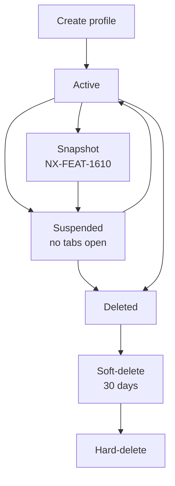

# NX-ARCH-0103 — Profile System

| Field | Value |
|-------|-------|
| **Document ID** | NX-ARCH-0103 |
| **Title** | Profile System |
| **Phase** | 6 — Browser Architecture |
| **Owner** | Browser AI (NX-AGENT-7056) |
| **Status** | 🟢 Complete |
| **Version** | 0.1.0 |
| **Created** | 2026-07-02 |
| **Depends on** | NX-ARCH-0001, NX-FEAT-1600, NX-AGENT-7015 (Guardrails & Safety) |

---

## 1. Mission

Define the profile model — the unit of identity and isolation in NEXUS — so that users can have multiple, fully separated browsing identities within one NEXUS install, and so that agents can act *on behalf of* a profile without leaking across profiles.

## 2. What is a profile

A **profile** in NEXUS is a complete, isolated browsing identity. Each profile has its own:

- Cookies and cookie store.
- Local storage, session storage, IndexedDB.
- Service workers.
- Caches (HTTP, image, etc.).
- History (per NX-ARCH-0104).
- Extensions (per NX-ARCH-0107; with per-profile permission overrides).
- Saved passwords, autofill data, payment methods.
- **Agent context** — which agents may act on this profile, with what scopes.
- **Sync state** — what is synced from this profile to the cloud (per NX-ARCH-0105).

Profiles are **fully isolated**: there is no shared state between profiles. Per NX-ARCH-0001 §2.3, cross-profile leakage is a P0 incident.

## 3. Profile lifecycle



- **Create:** user-initiated or Cloud Browser creation.
- **Active:** at least one tab open, resources allocated.
- **Suspended:** no tabs, state on disk, no resource cost.
- **Snapshot:** a point-in-time image, storable in S3.
- **Deleted:** soft-delete (recoverable for 30 days) → hard-delete.

## 4. Storage layout

Local profile state lives under `~/.nexus/profiles/<profile-id>/`:

```
profile/
├── cookies.sqlite
├── storage/
│   ├── local-storage/
│   ├── session-storage/
│   └── indexed-db/
├── cache/
│   ├── http/
│   └── image/
├── history.sqlite
├── extensions/        # per-profile extension install
├── agent/             # agent context, scopes, audit log mirror
│   ├── scopes.json
│   └── audit.log
├── sync/              # sync state and pending operations
└── metadata.json      # name, created, last used, color, etc.
```

Cloud Browser profiles use the same logical layout, with `~/.nexus/profiles/...` replaced by an S3 prefix.

The metadata file is encrypted at rest (AES-256, key derived from the user's NEXUS credentials). The user can configure per-profile encryption keys (H2) for high-sensitivity profiles.

## 5. Profile identity

Each profile has:

- A **profile ID** (UUID v7, time-ordered).
- A **display name** (user-chosen; per workspace unique).
- A **color** (UI affordance; helps the user visually distinguish profiles).
- An **icon** (optional; user-chosen or auto-generated).
- A **fingerprint profile** (per NX-FEAT-1606; controls how the profile appears to sites).
- A **proxy assignment** (per NX-FEAT-1605; H2 feature for local profiles).

The fingerprint and proxy are the primary "outward" identity of the profile; everything else is internal.

## 6. Multi-account patterns

NEXUS supports several multi-account patterns out of the box:

| Pattern | Profile count | Use case |
|---------|---------------|----------|
| Single user, multiple contexts | 2–5 | Work / personal separation |
| Many accounts on one service | 5–20 | Agencies managing many clients |
| Cross-region testing | 3–10 | Devs testing geo behavior |
| Privacy segmentation | 2–10 | Compartmentalized identities |
| Team sharing | 1 shared + N individual | Small team shared workspace (NX-FEAT-1609) |

The UI surfaces profile count and offers quick-switch; the agent bridge routes actions to the active profile.

## 7. Agent scope per profile

A profile has an associated **agent scope policy** that defines which agents may act on the profile and what they may do:

```typescript
interface ProfileAgentScope {
  profile_id: string;
  agents: {
    [agent_id: string]: {
      enabled: boolean;
      permissions: AgentPermission[];  // e.g., "read", "write", "submit", "purchase"
      rate_limit?: { requests_per_minute: number };
      audit?: 'standard' | 'verbose';
    };
  };
  default_deny: string[];   // permissions no agent gets by default
  user_approval_required_for: string[];  // e.g., "purchase", "send_message"
}
```

This is the **profile-level** layer; the **action-level** layer is NX-AGENT-7015 (Guardrails & Safety). The two compose: an agent must be enabled on the profile *and* have the action-level permission.

## 8. Cross-profile operations

The only sanctioned cross-profile operations are:

- **Switch active profile** (user action only).
- **Copy link/tab from one profile to another** (user action; explicit confirm).
- **Transfer cookies** (user action; one-time, explicit, audit-logged).
- **Compare profiles** (read-only view, agent-mediated, no writes).

**Forbidden:**

- Sharing cookies implicitly.
- Background cross-profile data access.
- Agent-initiated cross-profile reads without explicit user grant.

## 9. Cloud Browser profile relationship

When a Cloud Browser is created (NX-FEAT-1601), the user chooses:

- **Use an existing profile** (sync to cloud) — profile state is copied; cloud becomes the active runtime.
- **Create a new profile** (cloud-only) — a fresh identity that lives in the cloud.
- **Mirror an existing profile** (bi-directional sync) — local and cloud share state.

These correspond to NX-ARCH-0105's sync modes. Critical: even in the "mirror" case, **at most one runtime holds write state at a time** to avoid conflicts. Active runtime is exclusive.

## 10. Deletion and recovery

- **Soft-delete:** profile hidden from UI, state preserved, recoverable for 30 days.
- **30-day window:** user can restore from any signed-in device.
- **Hard-delete:** after 30 days, or on explicit user action with confirmation. All state, including cloud snapshots, is purged. The action is irreversible.
- **Cloud Browser snapshot on hard-delete:** user is warned; snapshot becomes orphaned, separately deletable.
- **Audit trail:** profile deletion is logged in the account activity log (retained even after profile deletion, for security and compliance).

## 11. Security considerations

- **Profile encryption keys** are derived from user credentials; NEXUS cannot decrypt profile data without the user's key.
- **Cross-profile isolation is enforced at the OS process level** where possible (separate Chromium profiles = separate processes).
- **No shared memory** between profiles; not even within a single NEXUS process.
- **Profile takeover** (another device, agent on the profile) requires the same auth as the user.
- **Audit log is profile-local** and replicated to the account-level audit (per NX-AGENT-7015).

## 12. Performance considerations

- **Profile load time** is a hot path. Target: < 500ms to first usable state.
- **Memory cost per profile** is bounded; budget defined in NX-ARCH-0108.
- **Profile count** has no hard limit, but UI surfaces the cost: "you have 47 profiles, that's 4.7GB of disk and 9.4GB of RAM if you open them all."
- **Lazy loading:** suspended profiles are not loaded into memory.

## 13. Open questions

- Q: Do we support profile templates (pre-configured fingerprint, proxy, extensions) in H1 or H2?
- Q: Should profile sharing (NX-FEAT-1609) include a "view-only" mode where the user can watch but not interact?
- Q: Do we ship a "profile marketplace" for users to share their profile configurations? (Probably H3+.)

## 14. Reading list

- **Overview** — NX-ARCH-0001
- **Cloud Browser Fleet** — NX-FEAT-1600
- **Cloud Browser creation** — NX-FEAT-1601
- **Per-browser cookies & storage** — NX-FEAT-1604
- **Per-browser proxy** — NX-FEAT-1605
- **Per-browser fingerprint profile** — NX-FEAT-1606
- **Multi-user collaboration** — NX-FEAT-1609
- **Sync Protocol** — NX-ARCH-0105
- **Extension Runtime** — NX-ARCH-0107
- **Guardrails & Safety** — NX-AGENT-7015

---

*End NX-ARCH-0103.*
