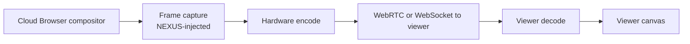

# NX-ARCH-0102 — Rendering Pipeline

| Field | Value |
|-------|-------|
| **Document ID** | NX-ARCH-0102 |
| **Title** | Rendering Pipeline |
| **Phase** | 6 — Browser Architecture |
| **Owner** | Browser AI (NX-AGENT-7056) |
| **Status** | 🟢 Complete |
| **Version** | 0.1.0 |
| **Created** | 2026-07-02 |
| **Depends on** | NX-ARCH-0001, NX-ARCH-0101, NX-ARCH-0108 (Performance) |

---

## 1. Mission

Define how the NEXUS browser renders pages — both for users (interactive) and for agents (headless, often with extraction) — so the rendering path is fast, predictable, and observable.

## 2. Rendering model

NEXUS uses Chromium's standard Blink + V8 + Skia/Canvas rendering pipeline. We do not fork the renderer. The value we add is:

- **Tuned build flags** for our use cases (NX-ARCH-0101 §5).
- **A NEXUS-injected metrics layer** that emits frame timing, paint timing, and long-task signals to our observability stack.
- **An "agent-render" mode** that produces a structured DOM+accessibility snapshot for agent consumption (used by the agent bridge).
- **A "live view" rendering path** for Cloud Browsers that streams the composited framebuffer to the viewer (NX-FEAT-1607).

## 3. Three render modes

| Mode | Used by | Headless? | Output | Frame budget |
|------|---------|-----------|--------|--------------|
| **Interactive** | Local NEXUS, headed Cloud Browser | No | Compositor framebuffer → display | 16.6ms (60Hz) |
| **Live view** | Cloud Browser, viewer connected | No (synthetic frames) | Compressed frame stream → viewer | 33ms (30Hz target, 10fps fallback) |
| **Agent render** | Agent bridge, automation, screenshots | Yes | DOM snapshot, accessibility tree, optional screenshot | N/A (off the frame budget) |

Each mode has a dedicated code path in the NEXUS extension / agent bridge; the underlying Chromium renderer is the same.

## 4. The agent-render snapshot

Agents don't need pixels; they need *meaning*. The agent-render mode produces a structured representation:

```typescript
interface AgentSnapshot {
  url: string;
  title: string;
  timestamp: number;
  accessibility_tree: A11yNode[];   // full ARIA tree
  dom: SerializedDOM;              // semantic subset
  form_fields: FormField[];        // ready-to-fill structure
  links: Link[];                    // nav candidates
  text: string;                     // visible text, in reading order
  metadata: { viewport: Size; user_agent: string; };
}
```

Snapshots are produced on demand by the agent bridge. They are typically much smaller than screenshots and far more useful to an LLM acting on the page.

## 5. GPU and compositor

NEXUS prefers GPU-accelerated rendering when available. Decision policy:

- **Hardware acceleration on** by default on local app (the user's GPU is the user's GPU).
- **Software fallback** in Cloud Browsers when GPU is not available in the container (most common today; H2 may add GPU-backed Cloud Browser tier).
- **GPU process sandboxing** enforced (Chromium default; we don't relax it).
- **No GPU fingerprinting avoidance** in H1 (H2 candidate; see NX-FEAT-1606).

## 6. Frame timing and observability

Per NX-DOC-0011 P6, every render produces metrics:

- **Paint timing** (First Paint, First Contentful Paint, Largest Contentful Paint) — emitted to OpenTelemetry.
- **Long tasks** (>50ms) — emitted as events with stack trace.
- **Frame drops** (interactive mode) — counter, with thresholds.
- **Live view frame size + latency** — emitted to per-session metrics.
- **Agent-render snapshot duration** — emitted per call.

These feed the performance budgets in NX-ARCH-0108.

## 7. Caching

| Cache | Location | Invalidation |
|-------|----------|--------------|
| HTTP cache | Per-profile disk | Standard HTTP semantics |
| Service worker cache | Per-profile | Per SW lifecycle |
| Memory cache | Per-renderer-process | Per process |
| Image cache | Per-profile disk | Standard HTTP semantics |
| Agent snapshot cache | In-memory, per agent run | TTL 60s; invalidated on navigation |

NEXUS does not introduce a custom page cache; Chromium's is sufficient and trusted.

## 8. JavaScript execution

Standard V8. Constraints:

- **Same V8 in all three modes.** No mode-specific V8 tuning beyond memory cap.
- **Memory cap** per profile (NX-FEAT-1612); V8 reports back when limit approached.
- **Cooperative scheduling** enabled — long-running scripts yield.
- **No NEXUS-injected JS in page context.** NEXUS extensions use isolated worlds; agents interact via CDP + the agent bridge, not by injecting into the page. (This is a security boundary: NX-AGENT-7015.)

## 9. Streaming and live view

Cloud Browser live view (NX-FEAT-1607) is a separate render path:



Frame rate auto-degrades (60 → 30 → 15 → 10 fps) when the viewer is on a constrained network or the cloud browser is under load. Targets defined in NX-ARCH-0108 §5.

## 10. Accessibility

Every render produces an accessibility tree (used internally by Chromium, exposed via the agent-render snapshot, and surfaced in the DevTools panel). NEXUS commits to:

- All NEXUS UI surfaces produce semantic, navigable accessibility trees (per NX-DS-5009).
- The agent-render snapshot always includes the accessibility tree; agents are encouraged to use it rather than parsing HTML.
- The Chrome accessibility panel works in NEXUS without modification (Chromium feature, no NEXUS changes needed).

## 11. Performance budgets

See NX-ARCH-0108. Headline:

- Cold-start time-to-first-paint < 1.5s (reference hardware).
- Page load (median web page) < 2.5s on local.
- Live view end-to-end latency < 200ms on healthy network.
- Agent snapshot < 500ms for 95th percentile of pages.

## 12. Open questions

- Q: When WebGPU stabilizes across sites, do we enable it by default? (Currently off; H2 candidate.)
- Q: Do we need a NEXUS-specific "page summarization" hook at the render layer for the agent bridge?
- Q: How do we handle pages that intentionally break the accessibility tree?

## 13. Reading list

- **Overview** — NX-ARCH-0001
- **Chromium Integration** — NX-ARCH-0101
- **Performance Architecture** — NX-ARCH-0108
- **Extension Runtime** — NX-ARCH-0107
- **Live remote view** — NX-FEAT-1607
- **Accessibility Foundations** — NX-DS-5009

---

*End NX-ARCH-0102.*
