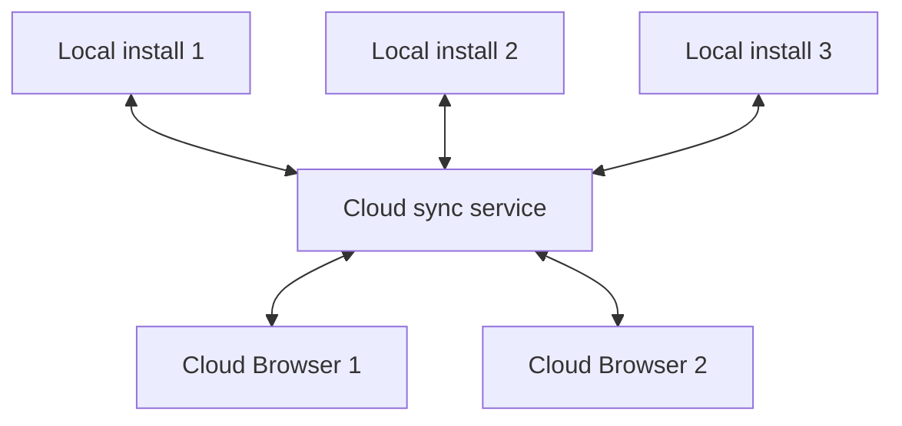

# NX-ARCH-0105 — Sync Protocol

| Field | Value |
|-------|-------|
| **Document ID** | NX-ARCH-0105 |
| **Title** | Sync Protocol |
| **Phase** | 6 — Browser Architecture |
| **Owner** | Browser AI (NX-AGENT-7056) + Backend AI (NX-AGENT-7055) |
| **Status** | 🟢 Complete |
| **Version** | 0.1.0 |
| **Created** | 2026-07-02 |
| **Depends on** | NX-ARCH-0001, NX-ARCH-0103 (Profile), NX-ARCH-0104 (History), NX-DOC-0011 (P9 Idempotency) |

---

## 1. Mission

Define how browser state — cookies, history, extensions, agent context, and more — is synchronized between local NEXUS installs and Cloud Browsers, so the user has a coherent identity across devices and a single source of truth for their data.

## 2. Sync scope

A profile's state is composed of **sync units**. Each unit can be independently enabled, disabled, or configured for sync.

| Sync unit | What it covers | Default |
|-----------|----------------|---------|
| `history` | Per NX-ARCH-0104 | On |
| `bookmarks` | Per NX-DS-5008 / future spec | On |
| `passwords` | Saved credentials | On (end-to-end encrypted) |
| `autofill` | Form values, addresses | On (end-to-end encrypted) |
| `extensions` | Per-profile extension install + config | On |
| `agent_scopes` | Per-profile agent policy (NX-ARCH-0103 §7) | On |
| `agent_memory` | Memory items written by agents on this profile | On (end-to-end encrypted) |
| `cookies` | Cookie store | On |
| `preferences` | Per-profile settings | On |
| `fingerprint` | Per NX-FEAT-1606 (proxy + UA + etc.) | On |
| `proxy` | Per NX-FEAT-1605 | Off by default (often device-specific) |
| `tabs` | Currently open tabs | Off (session-local) |

End-to-end encryption: required for sensitive units (passwords, autofill, agent_memory). The cloud stores ciphertext; only the user's NEXUS credentials (and authorized device keys) can decrypt.

## 3. Topology



The cloud sync service is the **coordinator**, not the source of truth. The source of truth is the *latest version vector* across all endpoints. The cloud holds the canonical version vectors and the encrypted blobs.

**At any time, at most one runtime holds "active" state per profile** (NX-ARCH-0103 §9). All other endpoints see a snapshot. When the active runtime closes, the cloud promotes a new active (typically the next device to resume).

## 4. The protocol

NEXUS sync is a custom protocol built on top of authenticated WebSocket, with the following properties:

- **Authenticated** — mTLS between client and cloud; user identity is asserted via NEXUS session token.
- **Versioned** — every sync unit has a version vector; updates are vector-stamped.
- **Idempotent** — operations carry a request ID; the server dedupes (per NX-DOC-0011 P9).
- **Delta-based** — updates carry only the changed fields, not the whole state.
- **Compressed** — zstd for blobs; Protobuf for structured payloads.
- **End-to-end encrypted** — sensitive units (per §2) are encrypted client-side; cloud never sees plaintext.

### 4.1 Operations

| Op | Direction | Purpose |
|----|-----------|---------|
| `sync.pull` | client → cloud | Get changes since version vector |
| `sync.push` | client → cloud | Apply local changes |
| `sync.subscribe` | client → cloud | Receive push notifications of changes from other clients |
| `sync.conflict` | cloud → client | Surface a conflict requiring user resolution |
| `sync.heartbeat` | client → cloud | Liveness, every 30s while connected |
| `sync.snapshot` | client → cloud | Upload a full snapshot (rare; on profile creation, on schema change) |

### 4.2 Version vectors

Each sync unit has a `(client_id, counter)` vector. The cloud merges by taking the max counter per client. Conflicts (concurrent writes to the same field) follow §6.

```typescript
type VersionVector = Record<ClientId, number>;
```

### 4.3 Payloads

Encrypted units use:

```
{
  "version": <counter>,
  "client_id": "<uuid>",
  "ciphertext": "<base64>",
  "nonce": "<base64>",
  "ad": "<associated data, e.g. unit name>"
}
```

Encryption: XChaCha20-Poly1305; key derived per user via Argon2id over the user's NEXUS passphrase; key wrapped to each authorized device.

## 5. Conflict resolution

Three conflict classes, three strategies:

| Class | Strategy | Example |
|-------|----------|---------|
| **Disjoint** (different fields) | Auto-merge | One device adds a bookmark; another adds a password. Both kept. |
| **Concurrent same-field** | Last-writer-wins *with* user-visible history | Both devices edit the same bookmark title. Most recent wins, but the prior value is preserved in a "history of this field" log. |
| **Structural** (e.g., same cookie set on different sites) | User resolution required | Both devices logged into the same site with different accounts. The user picks the canonical session per site. |

User resolutions are remembered (per device, per conflict class) so we don't ask twice.

## 6. Network behavior

- **Always-online assumption: false.** The local browser works fully offline; sync resumes when network returns. Operations queue locally with bounded buffer (10,000 ops, oldest dropped if full).
- **Retry policy.** Exponential backoff, jittered, cap 5 minutes. On retry, the client re-asserts the version vector and lets the server reconcile.
- **Bandwidth budget.** 100MB/day per profile by default; configurable. Sync pauses if budget exceeded; user notified.
- **Compression.** Always on; we expect 5-10x compression on typical sync payloads.
- **Push vs. pull.** When the user is active on one device, other devices receive push notifications of metadata changes; full content pull is on demand.

## 7. Per-sync-unit details

### 7.1 Cookies

- **Granularity:** per-domain.
- **Conflict:** two devices login to the same site, different accounts. The "structural conflict" case (§5 row 3). User picks.
- **Cloud storage:** encrypted blob; only the user's devices can decrypt.

### 7.2 History

- **Granularity:** per-visit.
- **Conflict:** rare; visits are append-only. Reordering is auto-resolved by timestamp.
- **Cloud storage:** plain (history is not sensitive by default; user can mark sensitive).

### 7.3 Extensions

- **Granularity:** per-extension, per-permission-state.
- **Conflict:** two devices install different extensions. Auto-merged; both installed.
- **Cloud storage:** extension manifest URLs and config; not the extension binaries (those are fetched from the extension store).

### 7.4 Agent memory

- **Granularity:** per-memory-item (per NX-AGENT-7010).
- **Conflict:** two agents on different devices write the same item. Last-writer-wins, but the memory schema tracks provenance, so we can see the conflict and surface it if needed.
- **Cloud storage:** encrypted (sensitive).

## 8. Security considerations

- **End-to-end encryption** for sensitive units; cloud cannot see plaintext.
- **Forward secrecy** — session keys derived per sync session, not reused.
- **Device authorization** — adding a new device requires an existing device or a recovery key.
- **Audit log** of all sync operations, retained for 90 days.
- **No silent resets.** A factory reset of a device does not affect cloud; cloud reset requires explicit user action with confirmation.
- **Replay protection** — request IDs + timestamps + nonces; the server rejects stale requests.

## 9. Failure modes

| Failure | Behavior |
|---------|----------|
| Network down | Queue locally; sync on reconnect |
| Cloud unreachable for >24h | User notified; sync continues to queue |
| Cloud storage corruption | Restore from a recent snapshot (per NX-FEAT-1610) |
| User account compromised | Sync keys rotated; all devices must re-auth |
| Conflict storm (many concurrent edits) | User resolution UI; we never silently drop |
| Encryption key lost | Recovery via recovery key (one-time setup) or account reset (data loss acknowledged) |

## 10. Performance budgets

- **Cold sync (first device, 10K history items, 200 passwords, 50 extensions):** < 60s.
- **Warm sync delta (typical session):** < 1s end-to-end.
- **Push notification latency** to subscribed devices: < 2s on healthy network.
- **Conflict resolution UI response:** < 100ms.

See NX-ARCH-0108 for the global performance budget.

## 11. Open questions

- Q: Should we support profile export to a portable format (for users switching browsers)? (H3+; out of scope.)
- Q: How do we handle sync when a user has the same profile open on two devices simultaneously? (Currently: one is read-only; we should make this explicit.)
- Q: Should sync units be per-workspace rather than per-profile? (Probably per-profile; but workspace-level sharing needs its own model.)

## 12. Reading list

- **Overview** — NX-ARCH-0001
- **Profile System** — NX-ARCH-0103
- **History Engine** — NX-ARCH-0104
- **Technical Principles** — NX-DOC-0011 (P9 Idempotency)
- **Snapshot & restore** — NX-FEAT-1610
- **Memory Schema** — NX-AGENT-7010
- **Guardrails & Safety** — NX-AGENT-7015

---

*End NX-ARCH-0105.*
