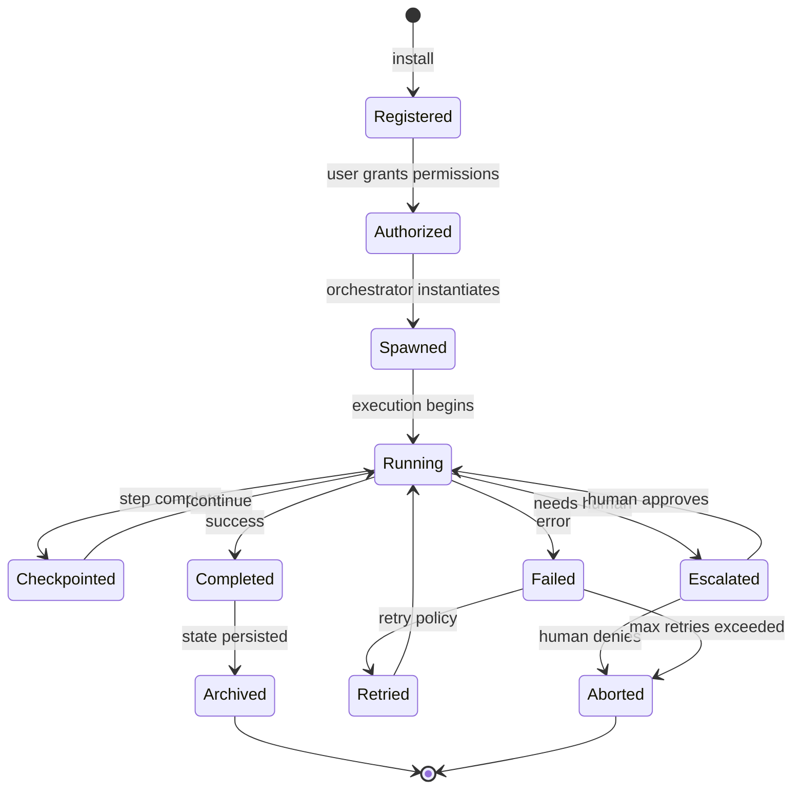

# NX-AGENT-7001 — Agent Contract Specification

| Field | Value |
|-------|-------|
| **Document ID** | NX-AGENT-7001 |
| **Title** | Agent Contract Specification |
| **Phase** | 4 — AI Brain |
| **Owner** | AI Platform AI |
| **Status** | 🟢 Complete |
| **Version** | 0.1.0 |
| **Created** | 2026-06-30 |
| **Depends on** | NX-DOC-0006 (AI-First Design Philosophy), NX-PRD-0001 (Master PRD), NX-FEAT-1401-1414 (Agent Orchestrator leaves) |

---

## 1. Purpose

This document defines the **universal Agent Contract** — the schema that every agent in NEXUS, whether first-party or third-party, system-level or user-installed, must conform to. It is the binding specification for agent identity, capabilities, permissions, lifecycle, communication, and behavior.

If you build an agent for NEXUS, you build it to this contract.

## 2. Why a contract

Without a contract:
- Agents are incompatible; the orchestrator cannot dispatch.
- Permissions are inconsistent; trust is impossible.
- Tooling differs; user experience varies.

With a contract:
- Every agent plugs into the orchestrator identically.
- Permissions are auditable and consistent.
- The user experience is uniform.
- Agents can compose: a Researcher can hand work to a Coder reliably.

## 3. The contract at a glance

Every agent is described by a single JSON/YAML manifest that includes:

```yaml
id: string                 # globally unique
name: string               # human-readable
role: enum                 # planner | researcher | coder | reviewer | tester | publisher | custom
version: semver
description: string
owner: string              # creator identity
icon: string               # reference to design-system icon

capabilities:               # what the agent can DO
  intents: [string]         # intent patterns this agent handles
  tools: [string]           # tool IDs this agent can call
  models: [string]          # preferred model IDs
  languages: [string]       # ISO codes the agent supports

permissions:                # what the agent is ALLOWED to do
  scopes: [permission-scope]
  secrets: [secret-ref]     # explicit credential references

memory:
  read: [memory-scope]      # what memory this agent reads
  write: [memory-scope]     # what memory this agent writes

lifecycle:
  entrypoint: string        # how to invoke the agent
  timeout_ms: integer
  max_retries: integer
  max_cost_usd: number

communication:
  inbound: [channel]        # how this agent receives work
  outbound: [channel]       # how this agent emits results
  handoff: [agent-id]       # agents this agent can hand work to

guardrails:
  refusable: [string]       # actions this agent will refuse
  escalation: [trigger]     # conditions under which the agent escalates to user

evaluation:
  benchmarks: [benchmark-id]
  success_criteria: [criteria]
  last_evaluated: timestamp

telemetry:
  events: [event-name]      # what events this agent emits
```

## 4. Field-by-field specification

### 4.1 Identity

| Field | Type | Required | Notes |
|-------|------|----------|-------|
| `id` | string | ✅ | Reverse-DNS. Example: `nx.agent.researcher`. Unique forever. |
| `name` | string | ✅ | 1–60 chars. Display name. |
| `role` | enum | ✅ | One of: `planner`, `researcher`, `coder`, `reviewer`, `tester`, `publisher`, `custom`. See NX-AGENT-7002. |
| `version` | semver | ✅ | `MAJOR.MINOR.PATCH`. Breaking changes require major bump. |
| `description` | string | ✅ | Markdown allowed. ≥200 words for marketplace quality bar. |
| `owner` | string | ✅ | Creator's NEXUS user ID or organization ID. |
| `icon` | string | – | Reference to NX-DS-5007 icon library. |

### 4.2 Capabilities

| Field | Type | Required | Notes |
|-------|------|----------|-------|
| `intents` | string[] | – | Natural-language patterns this agent handles. Used by orchestrator to dispatch. |
| `tools` | string[] | – | Tool IDs from NX-AGENT-7011 this agent may invoke. |
| `models` | string[] | – | Model IDs from NX-AGENT-7018 this agent may use. |
| `languages` | ISO 639-1[] | – | Languages the agent supports. Empty = all. |

### 4.3 Permissions

Permissions are explicit and granular. They are checked at runtime by the orchestrator; an agent cannot exceed what is declared.

```yaml
permissions:
  scopes:
    - workspace.read
    - workspace.write
    - agent.message.send
    - browser.session.use
    - browser.session.spawn
    - cloud_browser.create
    - cloud_browser.use
    - file.read
    - file.write
    - email.read
    - email.send
    - calendar.read
    - calendar.write
    - shell.execute
    - network.http
    - memory.read
    - memory.write
    - workflow.create
    - workflow.execute
    - money.send            # requires re-authentication
    - credential.use       # requires explicit user grant
  secrets:
    - vault:github_pat
    - vault:openai_api_key
```

A permission not in the list is denied.

### 4.4 Memory

```yaml
memory:
  read:
    - workspace:acme-research       # scoped reads
    - user:preferences              # global reads
    - global:web                    # public memory
  write:
    - workspace:acme-research       # can write to active Workspace
    - user:style                    # can update style profile
```

Reads and writes are scoped. An agent cannot read memory outside its declared scope without an explicit `memory.read.elevation` grant.

### 4.5 Lifecycle

| Field | Type | Required | Notes |
|-------|------|----------|-------|
| `entrypoint` | string | ✅ | Identifier of how the agent is invoked. E.g., `planner.run`, `researcher.search`. |
| `timeout_ms` | integer | ✅ | Max execution time. Default: 30,000 (30s). |
| `max_retries` | integer | – | Default: 3. |
| `max_cost_usd` | number | – | Per-execution cost ceiling. Default: 0.50. |

### 4.6 Communication

```yaml
communication:
  inbound:
    - channel: plan-step          # can be called as a plan step
    - channel: agent-message      # can be messaged by other agents
    - channel: user-direct        # can be invoked directly by user
  outbound:
    - channel: plan-result        # emits results to plan viewer
    - channel: agent-message      # can message other agents
    - channel: notification       # can notify the user
  handoff:
    - researcher                  # can hand off to Researcher
    - coder                       # can hand off to Coder
```

### 4.7 Guardrails

```yaml
guardrails:
  refusable:
    - action: money.send
      reason: "Requires explicit human approval"
    - action: credential.use
      reason: "Requires explicit human approval"
  escalation:
    - when: confidence < 0.6
      action: ask_user
    - when: error_rate > 0.3
      action: pause_and_notify
    - when: cost > max_cost_usd * 0.8
      action: warn_user
```

### 4.8 Evaluation

```yaml
evaluation:
  benchmarks:
    - researcher.search-quality-v1
    - researcher.citation-accuracy-v1
  success_criteria:
    - "≥90% of citations are valid"
    - "Mean relevance score ≥4/5"
  last_evaluated: 2026-06-15T10:00:00Z
```

### 4.9 Telemetry

```yaml
telemetry:
  events:
    - agent.invoked
    - agent.completed
    - agent.failed
    - agent.escalated
```

## 5. The agent lifecycle

An agent has a strict lifecycle. Each transition is recorded.



| State | Description |
|-------|-------------|
| **Registered** | Manifest installed; not yet authorized |
| **Authorized** | User has granted permissions |
| **Spawned** | Orchestrator has instantiated an instance |
| **Running** | Actively executing |
| **Checkpointed** | Step complete; can resume |
| **Completed** | Successfully finished |
| **Failed** | Error; may retry |
| **Escalated** | Requires human decision |
| **Aborted** | Stopped by user or policy |
| **Archived** | State persisted for audit |

State transitions are atomic and durable. See NX-AGENT-7013 for full lifecycle.

## 6. The agent execution model

When the orchestrator runs an agent:

1. **Resolve model.** Pick a model from `capabilities.models` per NX-AGENT-7018 routing.
2. **Load memory.** Pull declared `memory.read` scopes into context.
3. **Bind tools.** Make declared `capabilities.tools` available.
4. **Execute.** Run agent loop with streaming.
5. **Checkpoint.** After each meaningful step, persist state.
6. **Complete or escalate.** Emit result or pause for human.
7. **Persist memory.** Write any new memory items.
8. **Emit telemetry.** Record events.

The full execution protocol is in NX-AGENT-7009 (Communication Protocol) and NX-AGENT-7013 (Lifecycle).

## 7. Agent contract validation

The contract is machine-validated by the orchestrator. Validation failures block installation.

| Validation | Failure mode |
|------------|--------------|
| Schema validity | Reject install |
| Permission scope validity | Reject install |
| Tool reference validity | Reject install |
| Model reference validity | Reject install |
| Capability overlap (duplicate intent patterns) | Warn |
| Memory scope validity | Reject install |
| Lifecycle entrypoint exists | Reject install |

Validation is also re-run on every update.

## 8. Versioning and breaking changes

- **Major** bump: contract changes (field added, semantic changed).
- **Minor** bump: new capability added; backward compatible.
- **Patch** bump: bug fix; no contract change.

Breaking changes require a migration path. NEXUS supports one major version back (deprecation window: 6 months).

## 9. First-party vs. third-party

The contract is the **same** for both. The differences:

| Aspect | First-party | Third-party |
|--------|-------------|-------------|
| Distribution | Bundled with NEXUS | Marketplace |
| Review | Internal | Marketplace review |
| Permissions | Curated defaults | User-approved |
| Telemetry | Internal + opt-in | Opt-in |
| Updates | Auto with NEXUS | Per NX-FEAT-1504 |

## 10. Examples

### 10.1 Minimal contract

```yaml
id: nx.agent.custom.greeter
name: Greeter
role: custom
version: 1.0.0
description: A simple greeter agent.
owner: nx
```

This is a valid but useless agent — no capabilities, no permissions.

### 10.2 Researcher

```yaml
id: nx.agent.researcher
name: Researcher
role: researcher
version: 1.2.0
description: |
  Searches the web and synthesizes findings into cited answers.
  Specializes in academic, journalistic, and competitive research.
owner: nx

capabilities:
  intents:
    - "research *"
    - "find information about *"
    - "summarize *"
  tools:
    - browser.search
    - browser.read
    - model.summarize
    - model.extract
  models:
    - claude-opus-4
    - gpt-5
  languages: [en, es, fr, de, ja, pt-BR, zh-CN]

permissions:
  scopes:
    - browser.session.use
    - workspace.read
    - memory.read
    - memory.write
    - file.write
  secrets: []

memory:
  read:
    - workspace:active
    - user:preferences
  write:
    - workspace:active

lifecycle:
  entrypoint: researcher.run
  timeout_ms: 120000
  max_retries: 2
  max_cost_usd: 1.00

communication:
  inbound: [plan-step, agent-message, user-direct]
  outbound: [plan-result, agent-message, notification]
  handoff: [planner, coder, publisher]

guardrails:
  refusable:
    - action: paywalled-content.access
      reason: "Requires explicit user permission"
  escalation:
    - when: source_count < 3
      action: ask_user
    - when: confidence < 0.7
      action: ask_user

evaluation:
  benchmarks: [researcher.search-quality-v1]
  success_criteria: ["≥90% valid citations", "relevance ≥4/5"]
  last_evaluated: 2026-06-15T10:00:00Z

telemetry:
  events: [agent.invoked, agent.completed, agent.failed]
```

## 11. Acceptance criteria

The contract is complete when:

- [ ] Every first-party agent has a manifest conforming to this spec.
- [ ] Every marketplace agent validates against this spec.
- [ ] Validation runs in CI on every PR.
- [ ] Documentation site references this spec.
- [ ] Migration guide exists for major version bumps.

## 12. Open questions

- Q: Should we support agent compositions (composite agents with sub-manifests) at the contract level?
- Q: Should the manifest be JSON, YAML, or both?
- Q: How do we handle capability drift (an agent that claims capability X but fails silently)?

## 13. Reading list

- **AI-First Design Philosophy** — NX-DOC-0006
- **Master PRD** — NX-PRD-0001
- **Agent Taxonomy** — NX-AGENT-7002
- **Communication Protocol** — NX-AGENT-7009
- **Tool Schema** — NX-AGENT-7011
- **Memory Schema** — NX-AGENT-7010
- **Lifecycle** — NX-AGENT-7013
- **Agent Orchestrator leaves** — NX-FEAT-1401-1414

---

*End NX-AGENT-7001.*