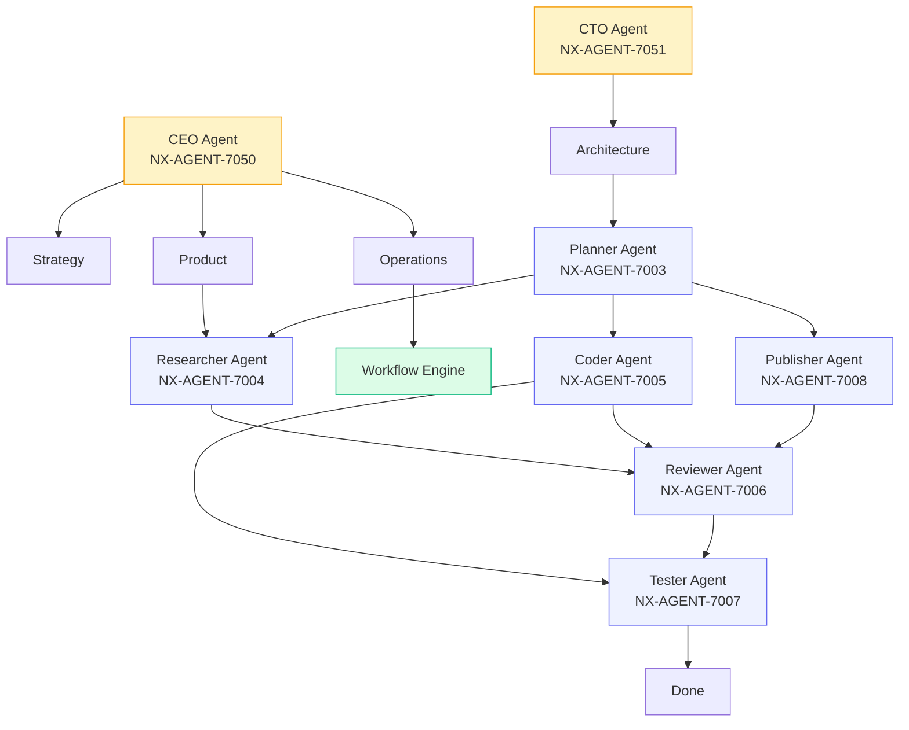
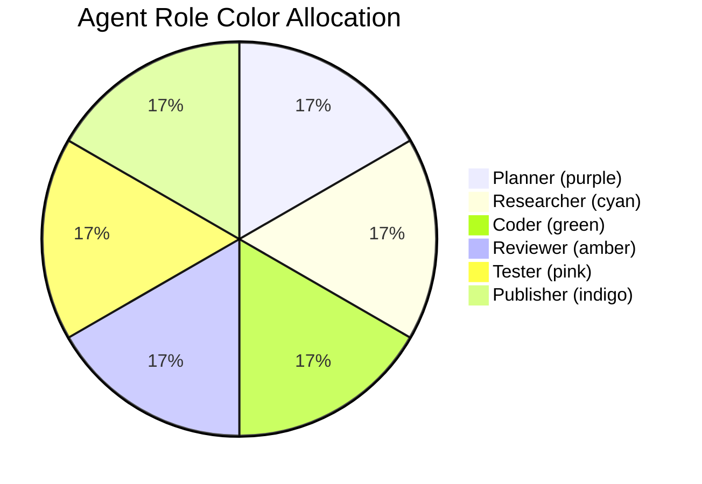

# NX-AGENT-7002 — Agent Taxonomy

| Field | Value |
|-------|-------|
| **Document ID** | NX-AGENT-7002 |
| **Title** | Agent Taxonomy |
| **Phase** | 4 — AI Brain |
| **Owner** | AI Platform AI |
| **Status** | 🟢 Complete |
| **Version** | 0.1.0 |
| **Created** | 2026-06-30 |
| **Depends on** | NX-AGENT-7001 (Contract) |

---

## 1. Purpose

This document classifies every agent in NEXUS into a **taxonomy** — the role hierarchy, the relationships between roles, and the canonical set of first-party agents. It is the reference for "what agents exist" and "what is each one's job."

## 2. The taxonomy



## 3. The six core agent roles

These are the canonical roles defined by NX-AGENT-7001's `role` enum. Each has a distinct purpose and a distinct color (per NX-DS-5002 §2.4).

### 3.1 Planner (`planner`)

**Purpose:** Convert natural-language intents into structured, executable plans.

**Inputs:** Intent + workspace context + memory.
**Outputs:** Ordered plan (steps, agents, parameters, confidence).
**Owns:** Plan lifecycle (per NX-AGENT-7009).
**Color:** `--nx-color-agent-planner` (#8B5CF6).
**Spec:** NX-AGENT-7003.

### 3.2 Researcher (`researcher`)

**Purpose:** Gather, verify, and synthesize information from external sources.

**Inputs:** Research question + scope + citations required.
**Outputs:** Synthesized findings with citations.
**Owns:** Source quality, citation accuracy.
**Color:** `--nx-color-agent-researcher` (#06B6D4).
**Spec:** NX-AGENT-7004.

### 3.3 Coder (`coder`)

**Purpose:** Write, edit, and refactor code.

**Inputs:** Code task + repository context + style.
**Outputs:** Code changes (diff), tests, commit.
**Owns:** Code correctness within scope; passes to Reviewer.
**Color:** `--nx-color-agent-coder` (#22C55E).
**Spec:** NX-AGENT-7005.

### 3.4 Reviewer (`reviewer`)

**Purpose:** Critique the output of other agents; surface improvements.

**Inputs:** Output to review + criteria.
**Outputs:** Approved / revisions requested / blocked.
**Owns:** Quality bar.
**Color:** `--nx-color-agent-reviewer` (#F59E0B).
**Spec:** NX-AGENT-7006.

### 3.5 Tester (`tester`)

**Purpose:** Validate that outputs work as intended.

**Inputs:** Output + acceptance criteria.
**Outputs:** Pass / fail with evidence.
**Owns:** Acceptance verification.
**Color:** `--nx-color-agent-tester` (#EC4899).
**Spec:** NX-AGENT-7007.

### 3.6 Publisher (`publisher`)

**Purpose:** Ship results: post, send, deploy, save, notify.

**Inputs:** Final approved output + destination.
**Outputs:** Confirmation of publication.
**Owns:** External side effects.
**Color:** `--nx-color-agent-publisher` (#6366F1).
**Spec:** NX-AGENT-7008.

## 4. First-party agents shipped at H1 GA

Beyond the six core roles, NEXUS ships specialized first-party agents:

| ID | Name | Domain | Status |
|----|------|--------|--------|
| NX-AGENT-7019 | Email Writer | Composes emails in user voice | P0 |
| NX-AGENT-7020 | Meeting Summarizer | Summarizes transcripts | P0 |
| NX-AGENT-7021 | Research Dossier | Produces long-form research reports | P0 |
| NX-AGENT-7022 | Price Monitor | Tracks website prices | P1 |
| NX-AGENT-7023 | GitHub Triage | Triages GitHub issues | P1 |
| NX-AGENT-7024 | Daily Briefing | Generates morning briefings | P1 |
| NX-AGENT-7025 | Code Reviewer | Reviews code for quality | P1 |
| NX-AGENT-7026 | Doc Writer | Writes technical documentation | P1 |
| NX-AGENT-7027 | Job Applier | Applies to jobs from a profile | P2 |
| NX-AGENT-7028 | Lead Enrichment | Enriches contact records | P2 |
| NX-AGENT-7029 | Content Calendar | Plans a week of social posts | P1 |
| NX-AGENT-7030 | Translation | Translates text across languages | P1 |
| NX-AGENT-7031 | Invoice Drafting | Drafts invoices from time logs | P2 |
| NX-AGENT-7032 | Scam Detector | Identifies phishing and scam sites | P2 |
| NX-AGENT-7033 | Travel Planner | Plans multi-day trips | P2 |
| NX-AGENT-7034 | Mood Tracker | Tracks and reflects on mood | P3 |
| NX-AGENT-7035 | Workout Planner | Plans weekly workouts | P3 |
| NX-AGENT-7036 | Meeting Prep | Pre-reads and briefs before meetings | P1 |
| NX-AGENT-7037 | LinkedIn Outreach | Personalized LinkedIn messages | P2 |
| NX-AGENT-7038 | Newsletter Curation | Curates weekly newsletters | P3 |

20 first-party agents at GA. Detailed specs in `05_AI_PLATFORM/Agent_Framework/First_Party/`.

## 5. System agents (always running)

NEXUS also has **system-level agents** that orchestrate the AI organization itself:

| ID | Name | Purpose |
|----|------|---------|
| NX-AGENT-7050 | CEO Agent | Sets direction; arbitrates priorities |
| NX-AGENT-7051 | CTO Agent | Architectural decisions; tech debt |
| NX-AGENT-7052 | Research Agent (org) | Market and competitive research |
| NX-AGENT-7053 | Product Agent | Roadmap and prioritization |
| NX-AGENT-7054 | Frontend Agent | UI/UX implementation |
| NX-AGENT-7055 | Backend Agent | API and infrastructure |
| NX-AGENT-7056 | Browser Agent | Chromium integration |
| NX-AGENT-7057 | AI Platform Agent | Agent framework itself |
| NX-AGENT-7058 | Security Agent | Threat model, permissions, audit |
| NX-AGENT-7059 | QA Agent | Tests, acceptance, regression |
| NX-AGENT-7060 | DevOps Agent | CI/CD, deployment, monitoring |
| NX-AGENT-7061 | Documentation Agent | All docs |
| NX-AGENT-7062 | Marketing Agent | GTM, content |
| NX-AGENT-7063 | Finance Agent | Pricing, billing |

These are defined in detail in **Phase 5** (NX-WF-9001 — Engineering Org Overview).

## 6. Relationship patterns

### 6.1 Sequential

```
Planner → Researcher → Coder → Reviewer → Publisher
```

Default for "do this task" intents.

### 6.2 Parallel fan-out

```
Planner → [Researcher, Researcher, Researcher] → Aggregator → Coder
```

Used for "research X, Y, Z" type intents.

### 6.3 Loop

```
Coder → Reviewer → Coder (revisions)
```

Used until Reviewer approves.

### 6.4 Branching

```
Coder → Tester
       ↓ pass           ↓ fail
    Publisher       Coder (retry)
```

### 6.5 Handoff

```
Researcher ────handoff────→ Coder
       (with structured input + context)
```

A handoff transfers context, not just state.

## 7. Role-specific colors (visual)

Per NX-DS-5002 §2.4:



## 8. Custom roles

Third-party agents can declare `role: custom` with a free-form sub-role label. The marketplace validates that the sub-role is non-empty.

Custom roles get the default agent color (`--nx-color-agent-default`).

## 9. Acceptance criteria

- [ ] All first-party agents conform to taxonomy.
- [ ] All marketplace agents reference a valid role.
- [ ] Visual color used consistently in plan viewer and activity log.
- [ ] Documentation site lists all first-party agents.

## 10. Open questions

- Q: Should we have role-specific UI affordances in the plan viewer?
- Q: Should role colors be customizable per Workspace?
- Q: How do we handle a role that doesn't fit any of the six (e.g., "Critic")?

## 11. Reading list

- **Agent Contract** — NX-AGENT-7001
- **Planner** — NX-AGENT-7003
- **Researcher** — NX-AGENT-7004
- **Coder** — NX-AGENT-7005
- **Reviewer** — NX-AGENT-7006
- **Tester** — NX-AGENT-7007
- **Publisher** — NX-AGENT-7008
- **Engineering Org** — NX-WF-9001 (Phase 5)

---

*End NX-AGENT-7002.*