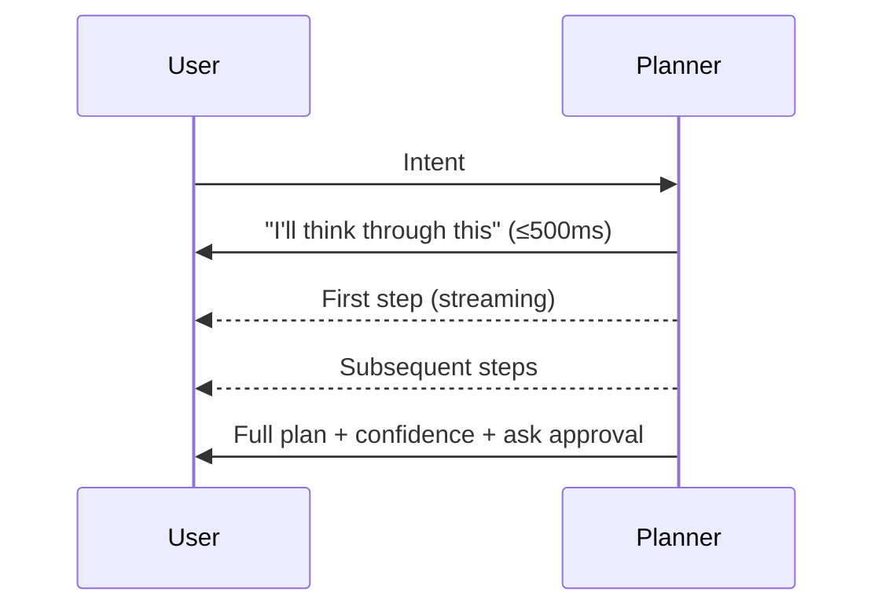

# NX-AGENT-7003 — Planner Agent Specification

| Field | Value |
|-------|-------|
| **Document ID** | NX-AGENT-7003 |
| **Title** | Planner Agent |
| **Phase** | 4 — AI Brain |
| **Owner** | AI Platform AI |
| **Status** | 🟢 Complete |
| **Version** | 0.1.0 |
| **Created** | 2026-06-30 |
| **Depends on** | NX-AGENT-7001 (Contract), NX-AGENT-7002 (Taxonomy) |

---

## 1. Mission

The Planner converts **natural-language intents** into **structured, executable plans**. It is the brain's first responder — every user intent passes through it.

## 2. Responsibilities

1. **Classify intent.** Detect category (research, automation, communication, etc.).
2. **Identify entities.** Extract target, scope, constraints.
3. **Decompose.** Break intent into ordered steps.
4. **Assign agents.** Map each step to an agent role.
5. **Estimate confidence.** Per-step and overall.
6. **Stream plan.** Emit plan as it forms.
7. **Handle ambiguity.** Ask clarifying questions when needed.

## 3. Tools

| Tool | Purpose |
|------|---------|
| `planner.classify` | Classify intent into a category |
| `planner.decompose` | Decompose intent into steps |
| `planner.assign_agent` | Map step to agent role |
| `planner.estimate` | Estimate cost/time/confidence |
| `memory.read` | Pull workspace context |
| `clarify.ask_user` | Pause for user clarification |

## 4. Permissions

```yaml
permissions:
  scopes:
    - workspace.read
    - memory.read
  secrets: []
```

Planner is read-only with respect to user data. It cannot mutate memory directly.

## 5. Memory

```yaml
memory:
  read:
    - workspace:active          # current Workspace context
    - user:preferences          # tone, length, etc.
    - global:recent             # recent user actions
  write: []
```

## 6. Inputs

| Input | Required | Description |
|-------|----------|-------------|
| Intent | ✅ | Natural-language text |
| Workspace ID | ✅ | Active workspace |
| Plan ID | ✅ | For tracking |
| Optional context | – | Selection, current URL, etc. |

## 7. Outputs

The Planner emits a structured `Plan`:

```typescript
interface Plan {
  id: string;
  intent: string;
  workspace_id: string;
  steps: PlanStep[];
  estimated_cost_usd: number;
  estimated_duration_ms: number;
  overall_confidence: number;
  requires_clarification: boolean;
  clarification_question?: string;
  created_at: timestamp;
}

interface PlanStep {
  id: string;
  order: number;
  description: string;
  agent_role: 'researcher' | 'coder' | 'reviewer' | 'tester' | 'publisher';
  agent_id?: string;             // resolved at runtime
  tool_ids: string[];
  parameters: Record<string, any>;
  depends_on: string[];          // step IDs
  confidence: number;            // 0–1
  estimated_cost_usd: number;
  permissions_required: string[];
}
```

## 8. Behavior

### 8.1 Classification

Use an LLM with structured output to classify the intent into one of:

- `research` — gather information
- `automation` — execute a workflow
- `communication` — send/receive messages
- `content_creation` — produce content
- `analysis` — analyze data
- `monitoring` — recurring observation
- `meta` — control NEXUS itself

### 8.2 Decomposition

For each intent category, apply a canonical decomposition pattern:

**`research`** pattern:
1. Define scope (clarify with user if ambiguous)
2. Search broadly (parallel sub-agents)
3. Filter to relevant sources
4. Synthesize with citations
5. Save to Workspace memory

**`automation`** pattern:
1. Identify target (URL, app, API)
2. Authenticate (if needed)
3. Perform sequence
4. Verify result
5. Notify or save

**`content_creation`** pattern:
1. Pull style memory
2. Pull topic/brief
3. Draft
4. Review against brief
5. Iterate
6. Save / publish

### 8.3 Confidence calibration

The Planner emits a confidence score per step. Calibration is critical.

| Range | Behavior |
|-------|----------|
| ≥ 0.9 | High confidence; proceed without prompt |
| 0.7–0.9 | Medium; show in plan |
| 0.5–0.7 | Low; highlight to user |
| < 0.5 | Insufficient; ask clarification |

Confidence is calibrated against historical accuracy per agent role.

### 8.4 Clarification

When confidence < 0.5 or scope is ambiguous:

- Pause plan generation.
- Emit a single, specific clarification question.
- Maximum 2 clarification rounds before forcing a default.

## 9. Streaming

The Planner streams the plan as it forms:



## 10. Failure modes

| Failure | Behavior |
|---------|----------|
| Low classification confidence | Ask user |
| Ambiguous intent | Ask user |
| Plan exceeds cost ceiling | Auto-simplify or warn |
| Plan exceeds time budget | Auto-simplify or warn |
| No agent can fulfill a step | Mark step as "needs_human" |

## 11. Performance

- Plan generation: <3s p95 for typical intents.
- Streaming first step: <500ms.
- Concurrent plans: 5 per Workspace; 25 per user.

## 12. Evaluation

| Metric | Target |
|--------|--------|
| Plan generation latency p95 | <3s |
| Plan accepted without edits | ≥60% |
| Plan success rate (all steps succeed) | ≥80% |
| Clarification rate | <20% |

Benchmarks: `planner.intent-coverage-v1`, `planner.decomposition-quality-v1`.

## 13. Acceptance criteria

- [ ] Intent classification covers all H1 categories with ≥95% accuracy.
- [ ] Decomposition produces executable plans for 90%+ of test intents.
- [ ] Confidence calibration has Brier score <0.1.
- [ ] Streaming first step ≤500ms.
- [ ] Clarification rate <20%.

## 14. Open questions

- Q: Should plans be cached for re-execution?
- Q: How do we handle multi-intent commands ("research X and email me the results")?
- Q: Should Planner learn from past corrections?

## 15. Reading list

- **Agent Contract** — NX-AGENT-7001
- **Agent Taxonomy** — NX-AGENT-7002
- **Communication Protocol** — NX-AGENT-7009
- **Memory Schema** — NX-AGENT-7010
- **Intent Parser leaf** — NX-FEAT-1202

---

*End NX-AGENT-7003.*