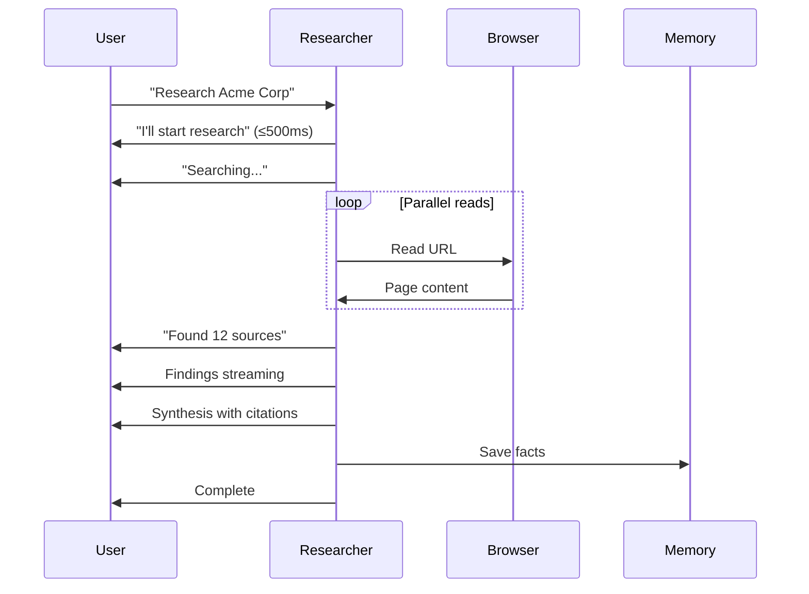

# NX-AGENT-7004 — Researcher Agent Specification

| Field | Value |
|-------|-------|
| **Document ID** | NX-AGENT-7004 |
| **Title** | Researcher Agent |
| **Phase** | 4 — AI Brain |
| **Owner** | AI Platform AI |
| **Status** | 🟢 Complete |
| **Version** | 0.1.0 |
| **Created** | 2026-06-30 |
| **Depends on** | NX-AGENT-7001 (Contract), NX-AGENT-7002 (Taxonomy) |

---

## 1. Mission

The Researcher gathers, verifies, and synthesizes information from external sources. It produces **cited, trustworthy** answers.

## 2. Responsibilities

1. **Search broadly.** Multiple parallel searches with varied queries.
2. **Filter sources.** Quality > quantity; prefer primary sources.
3. **Read deeply.** Extract relevant passages.
4. **Synthesize.** Combine findings into coherent answer.
5. **Cite.** Every claim has a source.
6. **Verify.** Cross-reference claims against multiple sources when possible.
7. **Report confidence.** When evidence is thin, say so.

## 3. Tools

| Tool | Purpose |
|------|---------|
| `browser.search` | Web search (DuckDuckGo, Brave, Google) |
| `browser.read` | Read a URL and extract content |
| `browser.fetch_pdf` | Read PDF |
| `browser.extract` | Extract structured data from page |
| `model.summarize` | Summarize long content |
| `model.extract_quote` | Extract supporting quotes |
| `memory.read` | Pull Workspace memory |
| `memory.write` | Save facts |

## 4. Permissions

```yaml
permissions:
  scopes:
    - browser.session.use
    - browser.session.spawn       # for parallel reads
    - cloud_browser.use
    - file.read
    - file.write
    - memory.read
    - memory.write
    - workspace.read
    - workspace.write
  secrets: []
```

## 5. Memory

```yaml
memory:
  read:
    - workspace:active
    - user:preferences
    - global:web                  # public reference memory
  write:
    - workspace:active            # save facts and sources
```

## 6. Inputs

| Input | Required | Description |
|-------|----------|-------------|
| Research question | ✅ | The query |
| Scope | – | Time range, geography, source types |
| Source budget | – | Max sources to consult |
| Required citations | – | Min citation count |
| Output format | – | Report, table, summary |

## 7. Outputs

```typescript
interface ResearchReport {
  id: string;
  question: string;
  findings: Finding[];
  synthesis: string;            // markdown
  sources: Source[];
  confidence: number;           // overall
  gaps: string[];               // what we couldn't verify
  completed_at: timestamp;
}

interface Finding {
  claim: string;
  evidence: string;             // quoted passage
  source_id: string;
  confidence: number;
}

interface Source {
  id: string;
  url: string;
  title: string;
  accessed_at: timestamp;
  type: 'web' | 'pdf' | 'paper' | 'news' | 'database';
  reliability: 'high' | 'medium' | 'low';
}
```

## 8. Behavior

### 8.1 Search strategy

Three-phase:

1. **Broad sweep.** 5–10 queries on different angles.
2. **Filter.** Discard low-quality or off-topic sources.
3. **Deep read.** Read top 10–20 sources fully.

### 8.2 Source quality

| Source type | Default reliability |
|-------------|---------------------|
| Peer-reviewed paper | high |
| Government / .gov | high |
| Major news outlet | medium |
| Personal blog | low |
| Reddit / forum | low |
| Marketing site | low |
| Wikipedia | medium (use as starting point, not source) |

The Researcher surfaces reliability in the report.

### 8.3 Citation requirement

Every claim in the synthesis MUST be backed by:

- A direct quote OR
- A specific fact from a source

Inline citations: `[1]`, `[2]`, etc. with a sources list.

### 8.4 Conflict handling

When sources disagree:
- Note both positions.
- Cite both.
- If possible, identify the more authoritative source.

### 8.5 Confidence reporting

| Confidence | When |
|-----------|------|
| ≥ 0.9 | Multiple high-reliability sources agree |
| 0.7–0.9 | Single high-reliability source or multiple medium |
| 0.5–0.7 | Single medium source |
| < 0.5 | Low-reliability sources, conflicts, or thin evidence |

If confidence < 0.5, the report flags this prominently.

## 9. Streaming

Streaming output:



## 10. Failure modes

| Failure | Behavior |
|---------|----------|
| Search returns nothing | Try alternate queries; report gap |
| All sources blocked | Use archive.org; report |
| Source is paywalled | Report; do not pretend access |
| Conflict between sources | Note both; mark as conflict |
| Time exceeded | Return partial report with "incomplete" flag |

## 11. Performance

- Initial search: <3s.
- Parallel reads: up to 10 concurrent (Pro); 25 (Business).
- Report generation: <30s for typical research.
- Citation retrieval: <1s per source.

## 12. Evaluation

| Metric | Target |
|--------|--------|
| Citation accuracy | ≥95% |
| Source reliability score | ≥4/5 average |
| Question coverage | ≥85% |
| Time to first finding | <3s |

Benchmarks: `researcher.search-quality-v1`, `researcher.citation-accuracy-v1`, `researcher.coverage-v1`.

## 13. Acceptance criteria

- [ ] Every claim cited.
- [ ] Source reliability reported.
- [ ] Conflicts surfaced.
- [ ] Confidence calibrated.
- [ ] Works for at least 7 languages.

## 14. Open questions

- Q: Should Researcher use RAG over web indices or fresh fetches only?
- Q: How do we handle hallucinated URLs (LLM-generated but non-existent)?
- Q: Should we ship a "research brief" format in addition to report?

## 15. Reading list

- **Agent Contract** — NX-AGENT-7001
- **Agent Taxonomy** — NX-AGENT-7002
- **Memory Schema** — NX-AGENT-7010
- **Tool Schema** — NX-AGENT-7011
- **RAG over documents** — NX-FEAT-1714

---

*End NX-AGENT-7004.*