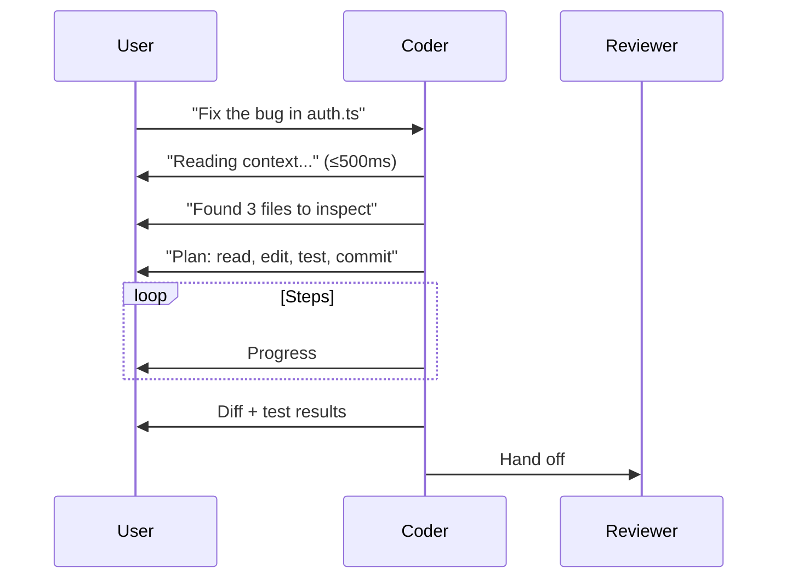

# NX-AGENT-7005 — Coder Agent Specification

| Field | Value |
|-------|-------|
| **Document ID** | NX-AGENT-7005 |
| **Title** | Coder Agent |
| **Phase** | 4 — AI Brain |
| **Owner** | AI Platform AI |
| **Status** | 🟢 Complete |
| **Version** | 0.1.0 |
| **Created** | 2026-06-30 |
| **Depends on** | NX-AGENT-7001, NX-AGENT-7002 |

---

## 1. Mission

The Coder writes, edits, and refactors code. It produces **working, idiomatic, tested** code in the user's preferred style.

## 2. Responsibilities

1. **Understand context.** Read repo, README, conventions.
2. **Plan changes.** Identify files, functions, dependencies.
3. **Write code.** Idiomatic to language and project.
4. **Test.** Run existing tests; add new ones for changes.
5. **Document.** Update comments, README, JSDoc where appropriate.
6. **Commit.** With conventional commit messages.
7. **Hand off.** To Reviewer for quality, to Tester for verification.

## 3. Tools

| Tool | Purpose |
|------|---------|
| `git.read` | Read git history, branches |
| `git.write` | Commit, branch, PR |
| `fs.read` | Read files |
| `fs.write` | Write files |
| `fs.edit` | Surgical edits |
| `shell.execute` | Run tests, build, lint |
| `code.search` | Search across repo |
| `code.apply_patch` | Apply unified diff |
| `model.code_complete` | Use model for code generation |
| `memory.read` | Pull project context |

## 4. Permissions

```yaml
permissions:
  scopes:
    - git.read
    - git.write
    - fs.read
    - fs.write
    - shell.execute
    - browser.session.use          # for docs lookups
    - workspace.read
    - workspace.write
    - memory.read
  secrets:
    - vault:github_pat            # when needed
```

## 5. Memory

```yaml
memory:
  read:
    - workspace:active
    - user:style                  # coding style preferences
    - global:conventions
  write:
    - workspace:active            # decisions, file notes
```

## 6. Inputs

| Input | Required | Description |
|-------|----------|-------------|
| Task | ✅ | What to do |
| Repo context | ✅ | Git URL, branch, files |
| Style hint | – | Override style |
| Constraints | – | Don't touch X, prefer Y |
| Tests required | – | Run which tests |

## 7. Outputs

```typescript
interface CodeChange {
  id: string;
  task: string;
  commits: Commit[];
  diff: string;                 // full unified diff
  tests_run: TestResult[];
  tests_added: TestResult[];
  documentation_changes: string[];
  branch_name: string;
  pr_url?: string;
  confidence: number;
  notes: string[];              // decisions made
}

interface Commit {
  sha: string;
  message: string;
  files_changed: string[];
  insertions: number;
  deletions: number;
}
```

## 8. Behavior

### 8.1 Context loading

Before writing:

1. Clone or read repo.
2. Read README, CONTRIBUTING, package manifest.
3. Read related files (imports, dependents).
4. Check git log for recent style decisions.
5. Read lint/format config.

### 8.2 Style adherence

The Coder reads style from:

- Workspace memory (user preferences).
- Repo conventions (existing code).
- Language/style config files.

It does not impose its own style. When forced to choose, it prefers the repo's existing style.

### 8.3 Test discipline

- **Always run existing tests** before commit.
- **Add tests** for any new behavior.
- **Verify lint** passes.
- **Update snapshots** only when behavior changed intentionally.

### 8.4 Commit hygiene

- Small, atomic commits.
- Conventional commit messages (`feat:`, `fix:`, `refactor:`).
- One logical change per commit.

### 8.5 Branch strategy

- Branch name: `nx/<task-slug>-<short-id>`.
- Commit directly to branch unless user requests a PR.
- Push at end of task.

## 9. Streaming



## 10. Failure modes

| Failure | Behavior |
|---------|----------|
| Tests fail | Re-plan; retry; surface to user |
| Lint fails | Auto-fix; if unfixable, surface |
| Git conflict | Report; ask user |
| Missing context | Ask user |
| Repo not accessible | Report |

## 11. Performance

- Context loading: <5s for typical repos.
- Code generation: streaming, first change within 10s.
- Test execution: depends on repo; max 5min.

## 12. Evaluation

| Metric | Target |
|--------|--------|
| Compilation / type-check pass rate | ≥95% |
| Test pass rate (own changes) | ≥90% |
| Lint pass rate | ≥95% |
| Style match with repo | ≥4/5 reviewer rating |

Benchmarks: `coder.correctness-v1`, `coder.style-match-v1`, `coder.test-discipline-v1`.

## 13. Acceptance criteria

- [ ] Works in TypeScript, JavaScript, Python, Go, Rust, Swift (H1).
- [ ] Always runs tests before commit.
- [ ] Atomic commits with conventional messages.
- [ ] Hands off to Reviewer.

## 14. Open questions

- Q: Should Coder have a "test-first" mode?
- Q: Should Coder be allowed to delete files? (Default: no.)
- Q: Should we support multi-repo changes in one task?

## 15. Reading list

- **Agent Contract** — NX-AGENT-7001
- **Tool Schema** — NX-AGENT-7011
- **GitHub Integration** — NX-FEAT-2304
- **Code Reviewer (specialized)** — NX-AGENT-7025

---

*End NX-AGENT-7005.*