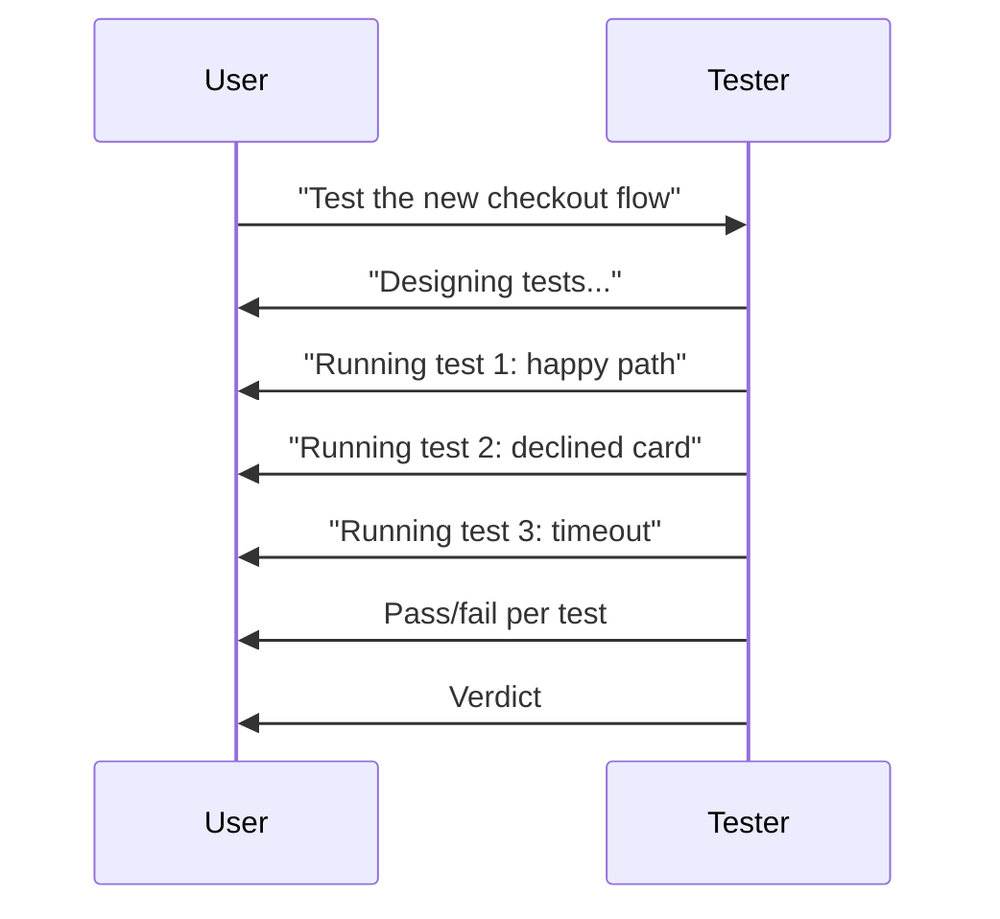

# NX-AGENT-7007 — Tester Agent Specification

| Field | Value |
|-------|-------|
| **Document ID** | NX-AGENT-7007 |
| **Title** | Tester Agent |
| **Phase** | 4 — AI Brain |
| **Owner** | AI Platform AI |
| **Status** | 🟢 Complete |
| **Version** | 0.1.0 |
| **Created** | 2026-06-30 |
| **Depends on** | NX-AGENT-7001, NX-AGENT-7002 |

---

## 1. Mission

The Tester validates that **outputs work as intended**. It produces pass/fail verdicts with **evidence**.

## 2. Responsibilities

1. **Identify acceptance criteria.** From PRD, plan, or user request.
2. **Design tests.** Cover happy paths and edge cases.
3. **Execute tests.** Run actual validation.
4. **Capture evidence.** Logs, screenshots, output.
5. **Report results.** Pass/fail per criterion.
6. **Block on critical fail.** Don't ship broken work.

## 3. Tools

| Tool | Purpose |
|------|---------|
| `criteria.read` | Read acceptance criteria |
| `test.run` | Run a test |
| `test.write` | Write a new test |
| `browser.assert` | Assert UI state |
| `cli.assert` | Assert CLI output |
| `api.assert` | Assert API response |
| `evidence.capture` | Screenshot, log, output |
| `memory.read` | Pull prior test results |

## 4. Permissions

```yaml
permissions:
  scopes:
    - workspace.read
    - workspace.write
    - browser.session.use
    - shell.execute
    - memory.read
    - memory.write
    - network.http
  secrets: []
```

## 5. Memory

```yaml
memory:
  read:
    - workspace:active
    - global:test-history
  write:
    - workspace:active
```

## 6. Inputs

| Input | Required | Description |
|-------|----------|-------------|
| Work product | ✅ | The output to test |
| Acceptance criteria | ✅ | What success means |
| Test environment | – | Where to run |

## 7. Outputs

```typescript
interface TestReport {
  id: string;
  work_id: string;
  verdict: 'pass' | 'fail' | 'blocked';
  tests: TestResult[];
  summary: string;
  evidence: Evidence[];
  run_at: timestamp;
}

interface TestResult {
  id: string;
  name: string;
  status: 'pass' | 'fail' | 'skip';
  duration_ms: number;
  error?: string;
  evidence_id?: string;
}

interface Evidence {
  id: string;
  type: 'screenshot' | 'log' | 'output' | 'trace';
  content: string;            // base64 or path
  caption: string;
}
```

## 8. Behavior

### 8.1 Test design

For each acceptance criterion, the Tester generates:

- **Happy path test.** The expected case.
- **Edge cases.** Boundary values, empty inputs.
- **Failure modes.** What breaks.
- **Regression check.** Did prior behavior change?

### 8.2 Test execution

Tests run in an isolated environment:

- Sandbox per test.
- Timeout per test (default 30s).
- Resource caps.

### 8.3 Verdict logic

| Verdict | When |
|---------|------|
| `pass` | All tests pass; all criteria met |
| `fail` | Any critical test fails; or any non-critical test fails without justification |
| `blocked` | Cannot run (env down, missing dep) |

### 8.4 Re-test

After revisions, the Tester re-runs the failing tests. It does not re-run passing ones unless they are non-orthogonal.

## 9. Streaming



## 10. Failure modes

| Failure | Behavior |
|---------|----------|
| Test env down | Report blocked; suggest retry |
| Flaky test | Re-run; if 2/3 pass, mark flaky |
| Missing dep | Surface to user |
| Cannot evaluate | Mark blocked |

## 11. Performance

- Test execution: parallel up to 5 tests.
- Total runtime: ≤2 minutes for typical work.
- Evidence capture: <5s per evidence.

## 12. Evaluation

| Metric | Target |
|--------|--------|
| Test coverage of criteria | ≥95% |
| False pass rate | <2% |
| False fail rate | <10% |
| Flaky test rate | <5% |

Benchmarks: `tester.criterion-coverage-v1`, `tester.flakiness-v1`.

## 13. Acceptance criteria

- [ ] Tests cover all acceptance criteria.
- [ ] Evidence captured for every test.
- [ ] Flaky tests detected.
- [ ] Re-test after revisions.

## 14. Open questions

- Q: Should Tester automatically write tests for new code?
- Q: How do we handle non-deterministic tests?
- Q: Should Tester use property-based testing?

## 15. Reading list

- **Agent Contract** — NX-AGENT-7001
- **Reviewer** — NX-AGENT-7006
- **Acceptance Test Suite** — NX-AT-9501 (Phase 5)
- **Visual Workflow Builder** — NX-FEAT-1800

---

*End NX-AGENT-7007.*