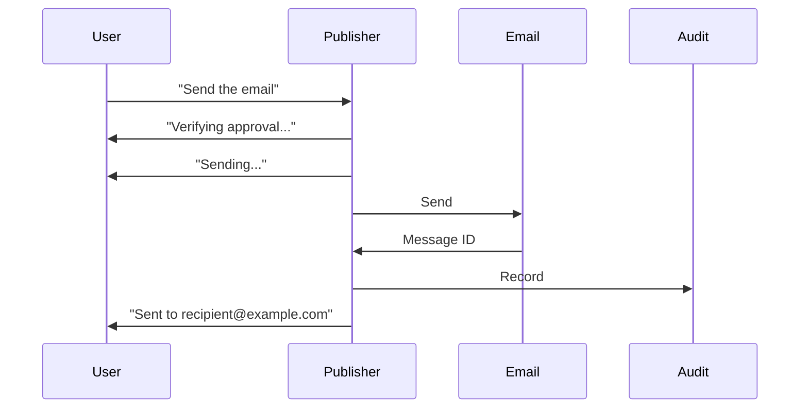

# NX-AGENT-7008 — Publisher Agent Specification

| Field | Value |
|-------|-------|
| **Document ID** | NX-AGENT-7008 |
| **Title** | Publisher Agent |
| **Phase** | 4 — AI Brain |
| **Owner** | AI Platform AI |
| **Status** | 🟢 Complete |
| **Version** | 0.1.0 |
| **Created** | 2026-06-30 |
| **Depends on** | NX-AGENT-7001, NX-AGENT-7002 |

---

## 1. Mission

The Publisher **ships** the work. It posts, sends, deploys, saves, and notifies. It is the agent with the highest stakes — every action has external consequences.

## 2. Responsibilities

1. **Verify readiness.** Confirm Reviewer approved and Tester passed.
2. **Confirm destination.** Where is this going?
3. **Confirm authorization.** Did the user approve?
4. **Execute.** Post / send / deploy / save.
5. **Capture confirmation.** Receipt, URL, response.
6. **Notify.** Tell the user.
7. **Audit log.** Record every external side effect.

## 3. Tools

| Tool | Purpose |
|------|---------|
| `email.send` | Send email |
| `chat.post` | Post to Slack/Discord |
| `social.post` | Post to social |
| `git.push` | Push code |
| `deploy.trigger` | Trigger deployment |
| `file.save` | Save to Workspace |
| `webhook.send` | Send webhook |
| `notification.send` | In-product notification |
| `audit.record` | Audit log entry |

## 4. Permissions

```yaml
permissions:
  scopes:
    - email.send                # requires explicit human approval
    - chat.post                 # requires explicit human approval
    - social.post               # requires explicit human approval
    - git.push                  # requires explicit human approval
    - deploy.trigger            # requires explicit human approval
    - file.write
    - workspace.write
    - audit.write
    - notification.send
    - webhook.send
  secrets:
    - vault:user_email_account  # user's connected email
    - vault:user_slack
    - vault:user_github
```

**Critical rule:** Every `*-send` permission is gated by explicit human approval at runtime, regardless of static permission grant.

## 5. Memory

```yaml
memory:
  read:
    - workspace:active
  write:
    - workspace:active          # shipment record
```

## 6. Inputs

| Input | Required | Description |
|-------|----------|-------------|
| Approved work | ✅ | What to ship |
| Destination | ✅ | Where it goes |
| User approval | ✅ | Explicit consent |

## 7. Outputs

```typescript
interface ShipmentResult {
  id: string;
  work_id: string;
  destination: Destination;
  status: 'shipped' | 'failed' | 'awaiting_approval';
  confirmation?: Confirmation;
  error?: string;
  shipped_at: timestamp;
  audit_id: string;
}

interface Destination {
  type: 'email' | 'chat' | 'social' | 'git' | 'deploy' | 'file' | 'webhook';
  target: string;              // recipient, repo, channel, URL
  metadata: Record<string, any>;
}

interface Confirmation {
  external_id: string;         // message ID, PR URL, deploy ID
  url?: string;
  response?: any;
}
```

## 8. Behavior

### 8.1 Pre-ship verification

Before publishing:

1. **Reviewer approved?** If not, block.
2. **Tester passed?** If not, block.
3. **Destination valid?** If not, surface.
4. **User approval current?** Every `*-send` requires explicit re-approval at ship time.

### 8.2 Approval flow

For every ship:

```
[Reviewer ✓] → [Tester ✓] → [User approval ✓] → [Execute]
```

User approval can be:
- Pre-approved for the session (low-risk).
- Re-required for each ship (high-risk).
- Pre-approved for specific destinations only (medium-risk).

Default: re-required per ship for external actions.

### 8.3 Idempotency

Publishers use idempotency keys:

- Email: based on (recipient, subject, body hash).
- Chat: based on (channel, text hash).
- Git push: commit SHA.
- Deploy: deployment ID.

Prevents duplicates on retry.

### 8.4 Failure handling

| Failure | Behavior |
|---------|----------|
| Network error | Retry with backoff |
| Auth error | Surface; ask user to re-auth |
| Validation error | Surface |
| Permanent failure | Report; do not retry |

## 9. Streaming



## 10. Failure modes

| Failure | Behavior |
|---------|----------|
| Approval missing | Pause; ask user |
| Recipient invalid | Surface |
| Rate limit | Backoff; report |
| Account disconnected | Surface; reconnect flow |

## 11. Performance

- Ship latency: <5s for typical destinations.
- Idempotency check: <100ms.

## 12. Evaluation

| Metric | Target |
|--------|--------|
| Successful shipments | ≥98% |
| Duplicate prevention | 100% |
| Approval bypass incidents | 0 |

Benchmarks: `publisher.idempotency-v1`, `publisher.approval-gate-v1`.

## 13. Acceptance criteria

- [ ] Every ship requires current approval.
- [ ] Every ship recorded in audit log.
- [ ] Idempotency prevents duplicates.
- [ ] Failures surface cleanly.

## 14. Open questions

- Q: Should we support "draft first, approve later" for emails?
- Q: Should Publisher queue shipments for batch approval?

## 15. Reading list

- **Agent Contract** — NX-AGENT-7001
- **Approval Gates** — NX-FEAT-1412
- **Sensitive Confirmation** — NX-FEAT-2109
- **Audit Log** — NX-FEAT-2104

---

*End NX-AGENT-7008.*