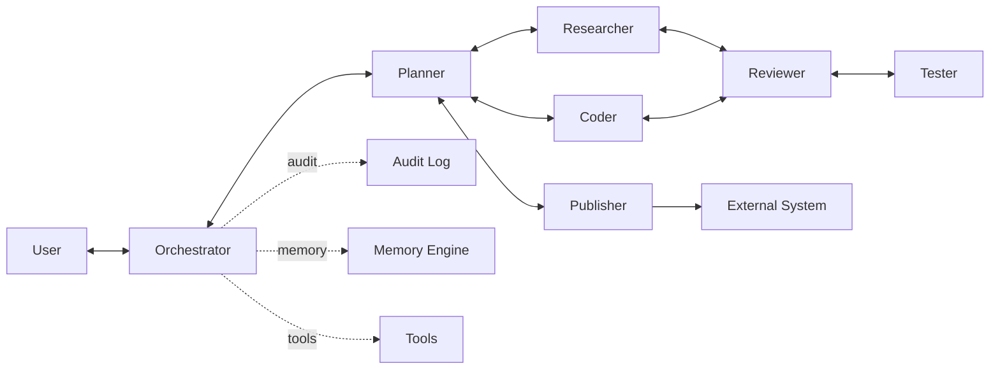
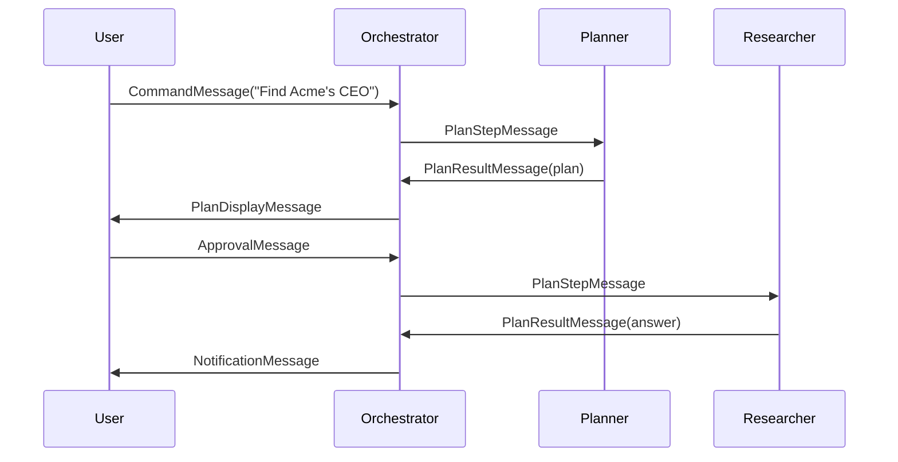
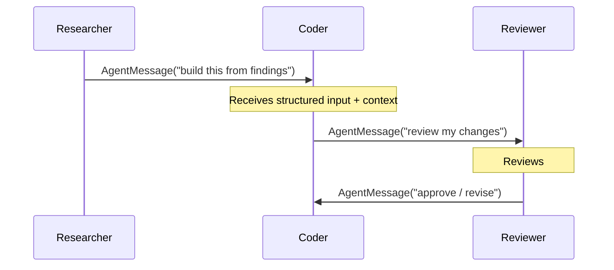

# NX-AGENT-7009 — Communication Protocol

| Field | Value |
|-------|-------|
| **Document ID** | NX-AGENT-7009 |
| **Title** | Communication Protocol |
| **Phase** | 4 — AI Brain |
| **Owner** | AI Platform AI |
| **Status** | 🟢 Complete |
| **Version** | 0.1.0 |
| **Created** | 2026-06-30 |
| **Depends on** | NX-AGENT-7001 (Contract) |

---

## 1. Purpose

This document defines how agents communicate — with each other, with the orchestrator, with the user, and with external systems. It is the **wire protocol** of the agent runtime.

## 2. Communication channels



Five channel types:

| Channel | Direction | Purpose |
|---------|-----------|---------|
| `user` | User ↔ Orchestrator | Commands, approval, questions |
| `plan-step` | Orchestrator → Agent | Step dispatch |
| `agent-message` | Agent ↔ Agent | Direct inter-agent messaging |
| `plan-result` | Agent → Orchestrator | Step results |
| `notification` | Agent → User | Notifications |

## 3. Message envelope

Every message on any channel uses this envelope:

```typescript
interface Message {
  id: string;                  // UUID v7
  type: string;                // command, response, event, error, etc.
  channel: Channel;
  from: Participant;
  to: Participant;
  thread_id?: string;          // for related messages
  plan_id?: string;
  step_id?: string;
  agent_id?: string;
  correlation_id?: string;     // request/response pairing
  timestamp: string;           // ISO 8601
  ttl_ms?: number;             // expiry
  payload: any;                // typed by type
  signature?: string;          // for trust
}

interface Participant {
  type: 'user' | 'orchestrator' | 'agent' | 'system';
  id: string;
  display_name?: string;
}
```

## 4. Message types

### 4.1 Commands (user → orchestrator)

```typescript
interface CommandMessage {
  type: 'command';
  payload: {
    intent: string;
    workspace_id: string;
    context?: Record<string, any>;
  };
}
```

### 4.2 Plan steps (orchestrator → agent)

```typescript
interface PlanStepMessage {
  type: 'plan_step';
  payload: {
    step: PlanStep;
    plan_id: string;
    previous_results?: Record<string, any>;
  };
}
```

### 4.3 Plan results (agent → orchestrator)

```typescript
interface PlanResultMessage {
  type: 'plan_result';
  payload: {
    step_id: string;
    status: 'success' | 'failure' | 'partial';
    output: any;
    artifacts?: Artifact[];
    metrics?: {
      tokens_used: number;
      cost_usd: number;
      duration_ms: number;
    };
  };
}
```

### 4.4 Agent messages (agent ↔ agent)

```typescript
interface AgentMessage {
  type: 'agent_message';
  payload: {
    intent: string;             // what the sending agent wants
    context: any;               // structured input
    expected_response_type?: string;
  };
}
```

### 4.5 Clarification requests (agent → user)

```typescript
interface ClarificationMessage {
  type: 'clarification';
  payload: {
    question: string;
    options?: string[];         // multiple choice
    context?: string;
    blocking: boolean;
  };
}
```

### 4.6 Approval requests (orchestrator → user)

```typescript
interface ApprovalMessage {
  type: 'approval_request';
  payload: {
    action: string;             // "send_email", "make_purchase"
    description: string;        // plain-language
    consequences: string[];     // what will happen
    agent_id: string;
    timeout_ms?: number;
  };
}
```

### 4.7 Notifications (agent → user)

```typescript
interface NotificationMessage {
  type: 'notification';
  payload: {
    severity: 'info' | 'success' | 'warning' | 'error';
    title: string;
    body?: string;
    action_url?: string;
  };
}
```

### 4.8 Errors

```typescript
interface ErrorMessage {
  type: 'error';
  payload: {
    code: string;
    message: string;
    retryable: boolean;
    context?: Record<string, any>;
  };
}
```

## 5. Channel semantics

### 5.1 User channel

- **Synchronous** within session.
- One user per session (multiple sessions allowed).
- Persists across agent lifecycles.

### 5.2 Plan-step channel

- **Asynchronous** (fire and wait for result).
- One step at a time per agent instance.
- Steps have deterministic IDs.

### 5.3 Agent-message channel

- **Asynchronous**.
- May span multiple plan steps.
- Tagged with correlation ID for conversation.

### 5.4 Plan-result channel

- **Asynchronous**.
- Always paired with a plan-step via step_id.
- Contains metrics for billing.

### 5.5 Notification channel

- **Fire-and-forget**.
- Delivered best-effort.
- Persisted to inbox for offline review.

## 6. Message flow examples

### 6.1 Single-agent command



### 6.2 Multi-agent handoff



## 7. Routing

Messages are routed by the orchestrator based on:

- `to` field
- Channel semantics
- Routing rules (e.g., escalation to user when agent is blocked)

Routing rules:

1. If recipient is the user → user channel.
2. If recipient is an agent in the active plan → agent-message channel.
3. If recipient is the orchestrator → internal queue.
4. If no recipient matches → error.

## 8. Persistence

Every message is persisted to the **message log** (a sub-component of the Activity Log, NX-FEAT-2104):

- Retention: 90 days default.
- Searchable.
- Exportable.

## 9. Security

- **All messages authenticated** via signed envelopes.
- **Cross-user isolation enforced** at the orchestrator.
- **Secrets never appear** in payloads — references only.
- **Replay protection** via monotonic IDs and timestamps.

## 10. Streaming protocol

For long-running operations:

- Server-Sent Events (SSE) for UI streaming.
- WebSocket for bi-directional (when needed).
- Heartbeat every 15s during long operations.

Streaming message format:

```typescript
interface StreamChunk {
  message_id: string;
  sequence: number;
  total?: number;             // when known
  data: string | object;
  done: boolean;
}
```

## 11. Failure modes

| Failure | Behavior |
|---------|----------|
| Recipient offline | Queue; retry; escalate after timeout |
| Channel unavailable | Fall back to alternative |
| Message lost | Re-send from persisted log |
| Auth failure | Reject; log |

## 12. Performance

- Routing latency: <10ms p95.
- Streaming first byte: <500ms.
- Throughput: 10K msg/sec.

## 13. Acceptance criteria

- [ ] All channels support required message types.
- [ ] All messages authenticated and persisted.
- [ ] Streaming works within latency budgets.
- [ ] Cross-user isolation verified.

## 14. Open questions

- Q: Should we support a shared message bus across Workspaces for team plans?
- Q: Should we expose a public agent-message API for third-party integrations?

## 15. Reading list

- **Agent Contract** — NX-AGENT-7001
- **Plan Streaming** — NX-FEAT-1406
- **Audit Log** — NX-FEAT-2104
- **Activity Log leaves** — NX-FEAT-2205-2209

---

*End NX-AGENT-7009.*