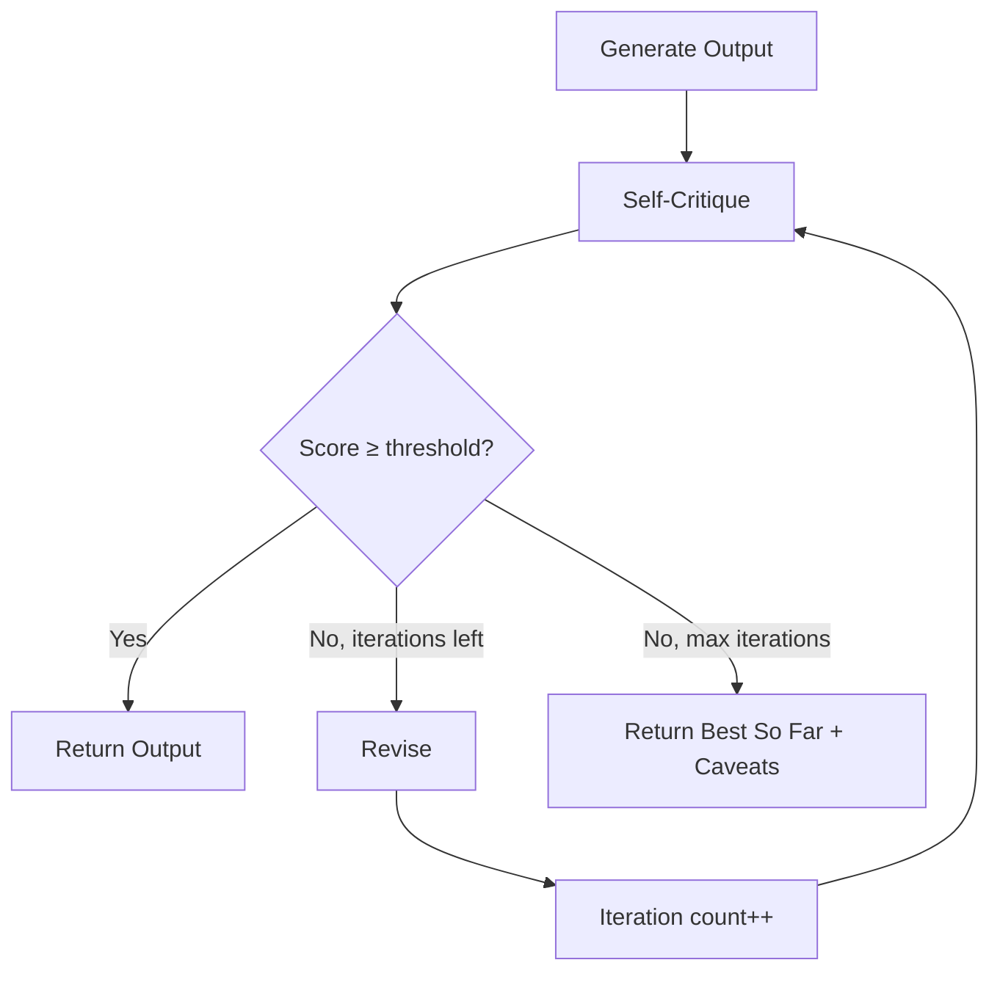
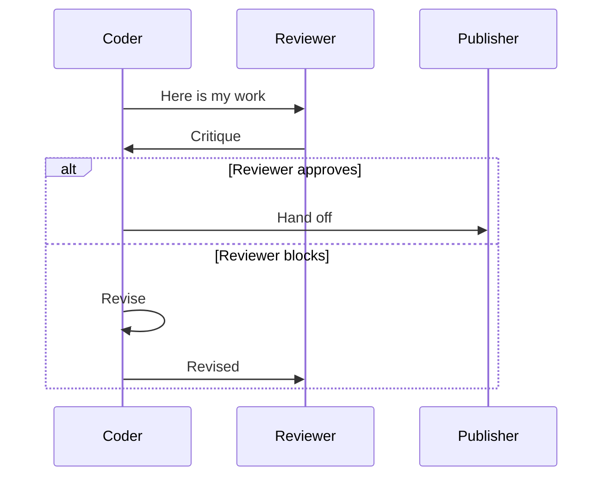

# NX-AGENT-7012 — Reflection & Self-Evaluation

| Field | Value |
|-------|-------|
| **Document ID** | NX-AGENT-7012 |
| **Title** | Reflection & Self-Evaluation |
| **Phase** | 4 — AI Brain |
| **Owner** | AI Platform AI |
| **Status** | 🟢 Complete |
| **Version** | 0.1.0 |
| **Created** | 2026-06-30 |
| **Depends on** | NX-AGENT-7001 (Contract) |

---

## 1. Purpose

This document defines how agents **reflect on their own outputs**, **evaluate quality**, and **iterate** before reporting completion. Reflection is the difference between "the model finished" and "the work is good."

## 2. Why reflection

Without it:
- Models produce first-draft quality.
- Mistakes propagate.
- Users waste time reviewing mediocre output.

With it:
- Models self-correct.
- Quality bar is enforced internally.
- Output converges on good before user sees it.

## 3. Reflection protocol

Every agent run has a **reflection budget**: a number of self-critique iterations before the work is handed back.

```typescript
interface ReflectionConfig {
  max_iterations: number;       // default 2
  reflection_model?: string;    // default same as agent
  self_critique_enabled: boolean; // default true
  pass_threshold: number;       // 0.7 default
  reflection_dimensions: string[]; // per agent
}
```

## 4. Reflection dimensions

Every agent has **dimensions** it critiques against.

### 4.1 Universal dimensions

All agents check:

| Dimension | Question |
|-----------|----------|
| Correctness | Is the output correct? |
| Completeness | Does it cover all required aspects? |
| Clarity | Is it understandable? |
| Conciseness | Is it as short as it can be without losing meaning? |
| Safety | Does it avoid harmful content? |
| Format | Does it match expected format? |

### 4.2 Role-specific dimensions

**Researcher:**
- Source quality
- Citation accuracy
- Coverage breadth

**Coder:**
- Compilation / type-correctness
- Test coverage
- Style match
- Security (no obvious vulnerabilities)

**Reviewer:**
- Criteria coverage
- Constructive tone
- Specificity

**Tester:**
- Coverage of acceptance criteria
- Edge cases
- Reproducibility

**Publisher:**
- Approval current
- Idempotency
- Confirmation captured

## 5. Self-critique prompt

```typescript
const REFLECTION_PROMPT = `
You have produced the following output for the task:
<task>
{task_description}
</task>

<output>
{output}
</output>

Critique your output against these dimensions:
{dimensions}

For each dimension:
1. Score: 0 (fails) to 1 (excellent)
2. Specific issue: [if any]
3. Suggested fix: [if any]

Then:
- If any dimension scores below {pass_threshold}, suggest a revised version.
- If all pass, return "PASS" with a brief justification.

Your critique must be specific and actionable. No vague feedback.
`;
```

## 6. Iteration loop



## 7. Reflection storage

Reflections are stored to memory:

```typescript
interface ReflectionItem extends MemoryItem {
  type: 'reflection';            // new memory type
  agent_id: string;
  task: string;
  iterations: ReflectionIteration[];
  final_score: number;
  learned: string[];             // insights for future
}

interface ReflectionIteration {
  iteration: number;
  scores: Record<string, number>;
  critique: string;
  revisions: string;
  score_after: number;
}
```

This allows agents to learn from past reflections.

## 8. Cross-agent reflection

For multi-agent plans, the system supports **structured disagreement** (per NX-FEAT-1411):



When Reviewer and Coder disagree:

- If after 2 rounds: escalate to user.
- If on safety: always defer to Reviewer.

## 9. Confidence calibration

Reflection produces a calibrated confidence per dimension. This confidence is what the Planner uses (NX-AGENT-7003 §8.3).

A confidence score reflects **how often** the agent has been correct in that dimension historically, not just how confident the LLM claims to be.

```typescript
interface CalibratedConfidence {
  raw_score: number;            // LLM self-reported
  calibrated_score: number;     // historical accuracy
  sample_size: number;          // history size
  last_calibrated: timestamp;
}
```

## 10. Failure modes

| Failure | Behavior |
|---------|----------|
| Reflection model unavailable | Skip reflection; rely on Reviewer |
| Infinite loop | Cap iterations; return best so far |
| Score never improves | Escalate to user |

## 11. Performance

- Reflection adds 1–5s per iteration.
- Default budget: 2 iterations.
- Total reflection overhead: <10s per agent call.

## 12. Acceptance criteria

- [ ] All agents reflect on universal dimensions.
- [ ] Role-specific dimensions configured per agent.
- [ ] Iterations capped at configurable max.
- [ ] Reflections stored to memory.
- [ ] Calibrated confidence reported.

## 13. Open questions

- Q: Should reflection be on by default for all agents, or opt-in?
- Q: How do we tune pass thresholds per dimension?
- Q: Should we use a separate (cheaper) model for reflection?

## 14. Reading list

- **Agent Contract** — NX-AGENT-7001
- **Memory Schema** — NX-AGENT-7010
- **Structured Disagreement** — NX-FEAT-1411
- **Confidence Reporting** — NX-FEAT-1409

---

*End NX-AGENT-7012.*