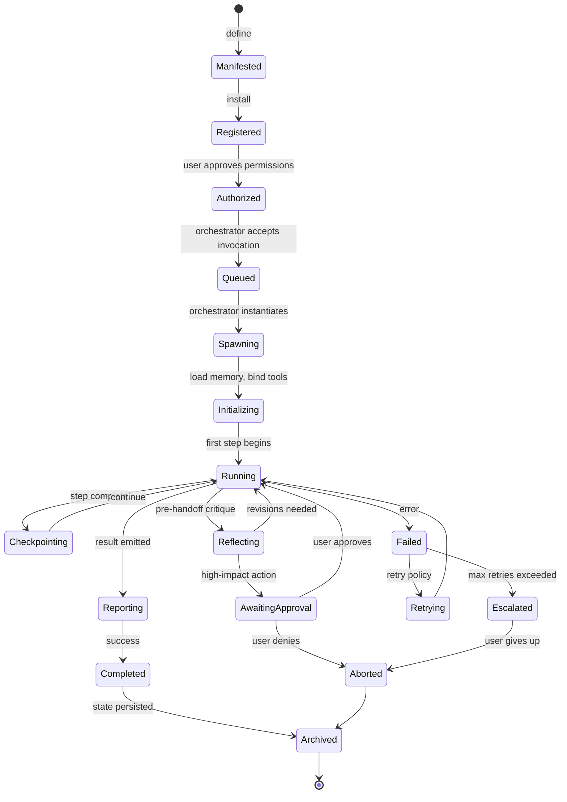
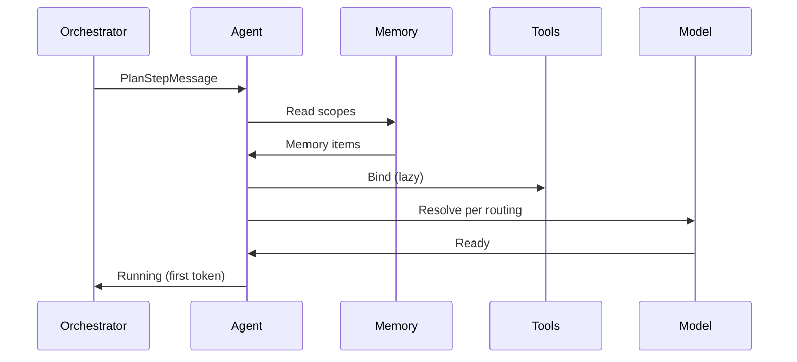
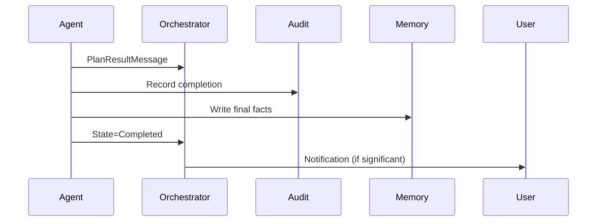
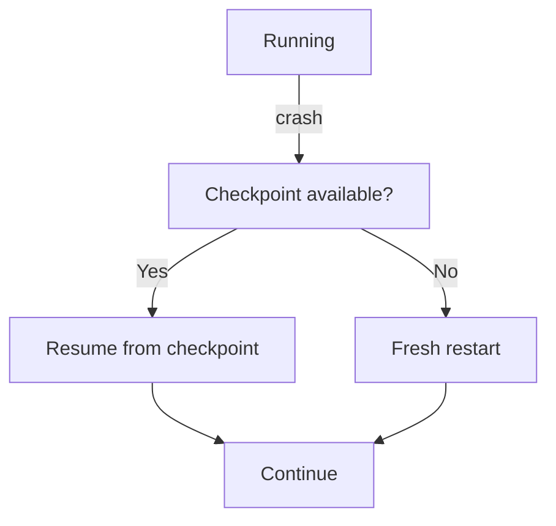

# NX-AGENT-7013 — Agent Lifecycle

| Field | Value |
|-------|-------|
| **Document ID** | NX-AGENT-7013 |
| **Title** | Agent Lifecycle |
| **Phase** | 4 — AI Brain |
| **Owner** | Backend AI |
| **Status** | 🟢 Complete |
| **Version** | 0.1.0 |
| **Created** | 2026-06-30 |
| **Depends on** | NX-AGENT-7001 (Contract), NX-FEAT-1413 (Durable Execution) |

---

## 1. Purpose

This document defines the **complete lifecycle** of an agent instance — from spawn to termination — and how state persists across engine restarts. Agents are durable; crashes don't lose work.

## 2. Lifecycle states

Per NX-AGENT-7001 §5, but expanded with transitions:



## 3. State detail

| State | Description | Persisted? |
|-------|-------------|------------|
| **Manifested** | Definition exists | Manifest in registry |
| **Registered** | Installed in user's NEXUS | Installed manifest |
| **Authorized** | Permissions granted | Permission grant record |
| **Queued** | Awaiting spawn | Invocation record |
| **Spawning** | Resources allocated | Run record |
| **Initializing** | Loading context | – |
| **Running** | Actively executing | Step state |
| **Checkpointing** | Saving progress | Checkpoint |
| **Reflecting** | Self-critique in progress | – |
| **AwaitingApproval** | User decision needed | Approval request |
| **Reporting** | Emitting result | – |
| **Completed** | Success | Run record |
| **Failed** | Error | Error details |
| **Retrying** | Recovery in progress | – |
| **Escalated** | User/operator attention | Escalation record |
| **Aborted** | Stopped by user or policy | – |
| **Archived** | Terminal, persisted | Run record |

## 4. The spawn lifecycle in detail

### 4.1 From invocation to running



Latency target: <500ms from plan step to first token.

### 4.2 Mid-execution

Each meaningful step:

1. **Execute** step.
2. **Checkpoint** to durable storage.
3. **Emit progress** to plan viewer.
4. **Reflect** (if enabled) per NX-AGENT-7012.
5. **Continue** to next step.

### 4.3 Handoff

When handing off to another agent:

1. **Package** structured result.
2. **Serialize** to durable storage.
3. **Emit** handoff message.
4. **Mark** current step as completed-with-handoff.
5. **Terminate** after handoff accepted.

### 4.4 Awaiting approval

When action requires human approval:

1. **Pause** execution.
2. **Emit** approval request (per NX-AGENT-7009).
3. **Persist** state.
4. **Wait** for user response (timeout: 24h default).
5. **Resume** or **abort** based on response.

### 4.5 Completion



## 5. Durable execution

Per NX-FEAT-1413, agent runs survive:

- Engine restart.
- Network failure mid-step.
- User closes app.

The checkpoint format:

```typescript
interface AgentCheckpoint {
  run_id: string;
  agent_id: string;
  plan_id: string;
  step_id: string;
  state: 'running' | 'paused' | 'awaiting_approval';
  context: Record<string, any>;  // trimmed for size
  memory_snapshot_id?: string;
  tool_state: Record<string, any>;
  last_token: number;             // for resume
  reflection_state?: ReflectionState;
  created_at: timestamp;
  ttl_ms: number;                // default 7 days
}
```

Checkpoints are stored in the durable queue (Temporal-style). Re-drive resumes from the last checkpoint.

## 6. Termination

An agent terminates when:

| Trigger | Outcome |
|---------|---------|
| Work complete | Completed → Archived |
| User cancels | Aborted → Archived |
| Approval denied | Aborted → Archived |
| Max retries | Escalated → Aborted → Archived |
| Engine shutdown | Checkpointed; resume on restart |
| Crash | Resumed on restart |

Termination cleans up:

- Memory snapshot.
- Tool bindings.
- Network connections.

But preserves:

- Run record (audit).
- Final output (artifact).
- Reflection history (memory).

## 7. Resource lifecycle

Per agent run:

| Resource | Bound | Released |
|----------|-------|----------|
| Model connection | At spawn | At completion |
| Tool handles | Lazy | At completion |
| Memory snapshot | At init | At completion (or 7d) |
| Cloud Browser session | Lazy | At completion |
| Sub-agent links | At spawn | At completion |

## 8. Concurrency

- Up to 10 concurrent agent runs per Workspace.
- Up to 25 per user (Pro); 100 (Business); custom (Enterprise).
- Per-agent instance: single-threaded.

## 9. Failure recovery



Failures by class:

| Class | Recovery |
|-------|----------|
| Transient (network, model) | Retry with backoff |
| Permanent (auth, schema) | Escalate |
| Crash | Resume from checkpoint |
| Out of cost | Pause, notify |
| Out of time | Abort with partial result |

## 10. Observability

Every state transition emits an event:

```typescript
interface LifecycleEvent {
  run_id: string;
  agent_id: string;
  from_state?: LifecycleState;
  to_state: LifecycleState;
  duration_ms?: number;
  reason?: string;
  timestamp: timestamp;
}
```

Events stream to:

- Activity Log (per NX-FEAT-2205).
- Plan viewer (live).
- Telemetry (per NX-FEAT-A0016).

## 11. Acceptance criteria

- [ ] All transitions defined and emitted.
- [ ] Checkpoints written on every step.
- [ ] Recovery from crash without data loss.
- [ ] Approval pause/resume works.
- [ ] Resource cleanup on termination.

## 12. Open questions

- Q: How long should archived runs be queryable?
- Q: Should we expose lifecycle as a public API?

## 13. Reading list

- **Agent Contract** — NX-AGENT-7001
- **Plan Execution Engine** — NX-FEAT-1402
- **Durable Execution** — NX-FEAT-1413
- **Communication Protocol** — NX-AGENT-7009

---

*End NX-AGENT-7013.*