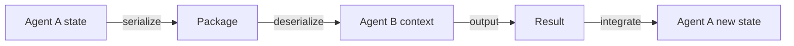
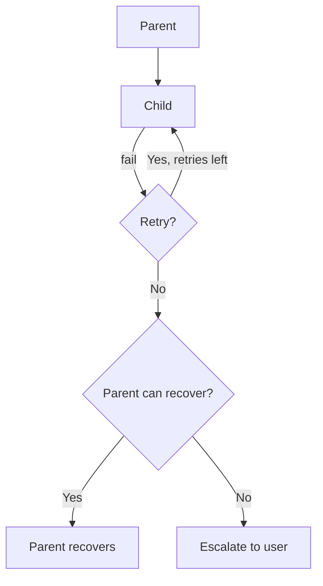
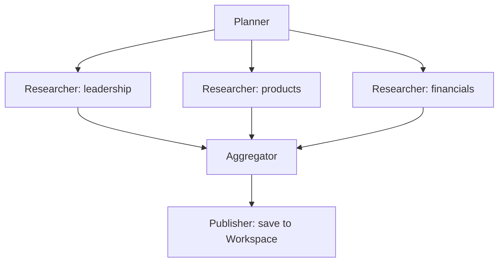
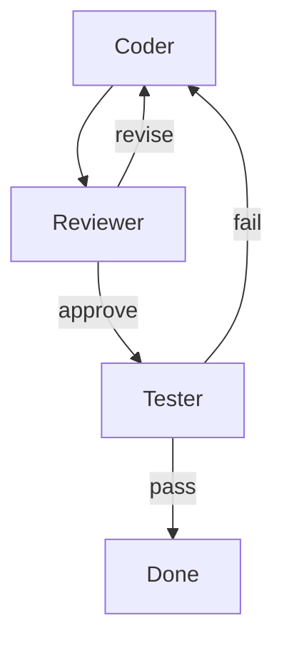
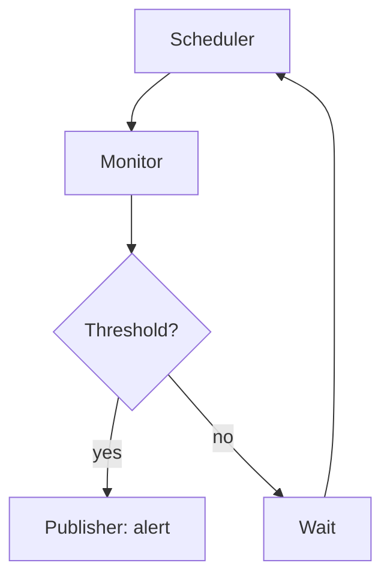

# NX-AGENT-7014 — Multi-Agent Composition

| Field | Value |
|-------|-------|
| **Document ID** | NX-AGENT-7014 |
| **Title** | Multi-Agent Composition |
| **Phase** | 4 — AI Brain |
| **Owner** | AI Platform AI |
| **Status** | 🟢 Complete |
| **Version** | 0.1.0 |
| **Created** | 2026-06-30 |
| **Depends on** | NX-AGENT-7001, NX-AGENT-7013, NX-FEAT-1404 (Sub-Agent Spawning), NX-FEAT-1411 (Structured Disagreement) |

---

## 1. Purpose

Agents rarely work alone. This document defines how agents **compose**: how parent and child agents relate, how work is delegated, how state and context flow, and how disagreements are resolved.

## 2. Composition patterns

### 2.1 Linear (sequential)

```
A → B → C
```

Default for plans. Each agent produces output that feeds the next.

### 2.2 Parallel (fan-out)

```
       ┌─ B ─┐
A ──────┼─ C ─┼─── aggregator
       └─ D ─┘
```

Used for research, monitoring, batch operations.

### 2.3 Hierarchical (parent → child)

```
A (parent)
├── A1 (child)
├── A2 (child)
└── A3 (child)
```

Parent spawns children, aggregates results.

### 2.4 Loop

```
A → B → C → (if criteria not met) → A
```

Used for refinement, retry, monitoring.

### 2.5 Critique

```
A (producer) → B (critic) → (if approved) done
                              ↓ (if not) → A
```

Used for quality enforcement.

### 2.6 Negotiation

```
A proposes → B counters → A revises → accept
```

Used in structured disagreement (NX-FEAT-1411).

## 3. Parent-child relationships

When an agent spawns a child:

```typescript
interface AgentParent {
  parent_run_id: string;
  parent_agent_id: string;
  child_run_id: string;
  child_agent_id: string;
  spawned_at: timestamp;
  reason: string;               // 'decomposition', 'delegation', 'critique'
  scope: MemoryScope;
  shared_state_keys: string[];
  inherited_permissions: string[];
}
```

Children inherit:

- Workspace scope.
- Read access to parent's memory (filtered).
- A subset of parent's permissions (declared).

Children do NOT inherit:

- Write access to parent's memory (must request).
- Approval grants.
- Secrets.

## 4. Delegation

When work is delegated:

```typescript
interface DelegationRequest {
  from: AgentInstance;
  to: AgentInstance;
  task: PlanStep;
  context: any;
  expected_output: string;
  deadline_ms: number;
}

interface DelegationResponse {
  status: 'accepted' | 'rejected';
  reason?: string;
  estimated_completion_ms?: number;
}
```

Delegation rules:

- Agent can only delegate to agents listed in `handoff` (per NX-AGENT-7001).
- Recipient can refuse (overloaded, no permission).
- Recipient owns the delegated task until done or escalated.

## 5. Context flow

When A → B:



Context includes:

- Relevant memory items (filtered).
- Task description.
- Expected output schema.
- Constraints (time, cost, tools).

Context size limit: 100K tokens (default).

## 6. State sharing

| State | Shared by default? |
|-------|-------------------|
| Conversation history | Yes (filtered) |
| Workspace memory | Read-only |
| Style profile | Yes |
| Tool state | No |
| Sub-agent links | No |

## 7. Aggregating results

When a parent aggregates child outputs:

```typescript
interface AggregationStrategy {
  strategy: 'first' | 'concat' | 'merge' | 'vote' | 'custom';
  custom_aggregator_agent_id?: string;
  dedup?: boolean;
  sort_by?: string;
  filter_criteria?: any;
}
```

Default strategies per pattern:

| Pattern | Strategy |
|---------|----------|
| Linear | implicit (next agent consumes) |
| Parallel | merge or vote (configurable) |
| Hierarchical | concat + parent summarize |
| Loop | last successful |
| Critique | pass / fail |

## 8. Failure propagation



Failures bubble up unless the parent has a recovery strategy.

## 9. Composition limits

| Limit | Default |
|-------|---------|
| Max depth | 5 levels |
| Max siblings | 10 |
| Max total agents per plan | 25 (Pro) / 50 (Business) |
| Max concurrent children per agent | 5 |

Limits are enforced by the orchestrator.

## 10. Composition examples

### 10.1 Research dossier (parallel)



### 10.2 Code change (critique loop)



### 10.3 Monitoring (loop)



## 11. Observability

Each composition generates:

- A composition graph (visualized in plan viewer).
- Lifecycle events per agent.
- Aggregated cost.
- Aggregated duration.

## 12. Acceptance criteria

- [ ] All composition patterns supported.
- [ ] Parent-child relationships enforced.
- [ ] Delegation rules enforced.
- [ ] Aggregation configurable per pattern.
- [ ] Composition limits enforced.

## 13. Open questions

- Q: Should we support agent "leases" for delegation?
- Q: How do we handle long-running compositions (>1 day)?

## 14. Reading list

- **Agent Contract** — NX-AGENT-7001
- **Agent Lifecycle** — NX-AGENT-7013
- **Sub-Agent Spawning** — NX-FEAT-1404
- **Structured Disagreement** — NX-FEAT-1411
- **Plan Visualization** — NX-FEAT-1414

---

*End NX-AGENT-7014.*