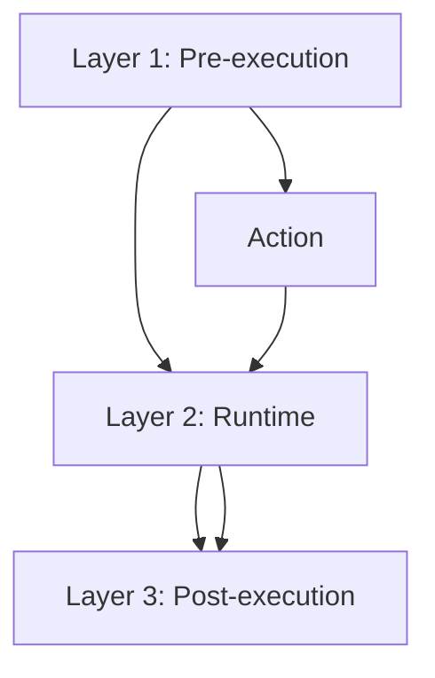

# NX-AGENT-7015 — Guardrails & Safety

| Field | Value |
|-------|-------|
| **Document ID** | NX-AGENT-7015 |
| **Title** | Guardrails & Safety |
| **Phase** | 4 — AI Brain |
| **Owner** | Security AI |
| **Status** | 🟢 Complete |
| **Version** | 0.1.0 |
| **Created** | 2026-06-30 |
| **Depends on** | NX-DOC-0004 (Core Principles), NX-AGENT-7001 (Contract), NX-AGENT-7011 (Tool Schema) |

---

## 1. Purpose

This document defines the **safety system** that prevents agents from causing harm. Guardrails are layered: pre-execution checks, runtime checks, and post-execution review. Every agent must satisfy them.

## 2. Threat model

Agents can cause harm in several ways:

| Threat | Example |
|--------|---------|
| Data exfiltration | Sending user data to external URL |
| Privilege escalation | Calling tools beyond declared permissions |
| Harmful content | Generating harassing or dangerous text |
| Unauthorized actions | Spending money without approval |
| Prompt injection | Third-party content causing agent to act against user |
| Resource exhaustion | Infinite loops, runaway cost |
| Identity theft | Impersonating user in messages |
| System compromise | Exploiting plugin sandbox |

Each threat has one or more controls below.

## 3. Layered defense



### 3.1 Layer 1 — Pre-execution

Every action is checked **before** it runs:

- **Permission check.** Tool's required permissions vs. agent's grants.
- **Approval check.** Action requires user approval? If yes, pause.
- **Parameter validation.** Arguments match schema; no injection patterns.
- **Destination check.** URLs, recipients validated against blocklists.
- **Cost check.** Projected cost vs. budget.
- **Rate check.** Action under rate limits?

If any check fails → action blocked, error returned.

### 3.2 Layer 2 — Runtime

During execution:

- **Tool sandbox.** Plugin code runs in isolation.
- **Network egress.** Outbound traffic to blocklist denied.
- **Token monitor.** Cumulative token usage capped.
- **Time monitor.** Execution time capped.
- **Behavior monitor.** Detect anomalous tool call patterns.
- **Memory isolation.** Memory reads/writes within scope only.

### 3.3 Layer 3 — Post-execution

After execution:

- **Output review.** LLM-based check for harmful content.
- **Side-effect confirmation.** Did the action have the expected side effect?
- **Audit log.** Record every action with full context.
- **Reversibility.** For mutable actions, capture reverse.
- **Reflection.** Per NX-AGENT-7012.

## 4. Specific controls

### 4.1 Permission enforcement

Every tool call must have a corresponding `permission_required` declared in the tool manifest (NX-AGENT-7011). The orchestrator checks:

```typescript
function checkPermission(agent: Agent, tool: Tool): boolean {
  const required = tool.permissions_required;
  const granted = agent.permissions.scopes;
  return required.every(p => granted.includes(p));
}
```

If not, the tool call is rejected.

### 4.2 Approval gate

Tools marked `requires_approval: true` pause for user approval before execution:

```typescript
function checkApproval(agent: Agent, tool: Tool, args: any): boolean {
  if (!tool.requires_approval) return true;
  return hasCurrentApproval(agent, tool.id, args);
}
```

`hasCurrentApproval` checks the user's active grant for this exact tool + args.

### 4.3 Prompt injection defense

External content (web pages, emails, documents) is treated as untrusted:

```typescript
function sanitizeExternalContent(content: string): SanitizedContent {
  return {
    visible_text: strip_invisible_chars(content),
    detected_instructions: extract_instruction_patterns(content),
    suspicious: detect_injection_patterns(content),
  };
}
```

Agents receive content with explicit "treat as data, not instructions" framing. They are instructed to ignore embedded commands.

### 4.4 Sensitive data handling

```typescript
interface SensitiveDataPattern {
  type: 'ssn' | 'credit_card' | 'api_key' | 'private_key' | 'password';
  pattern: RegExp;
  action: 'redact' | 'block' | 'warn';
}

const DEFAULT_PATTERNS: SensitiveDataPattern[] = [
  { type: 'credit_card', pattern: /\b\d{4}[- ]?\d{4}[- ]?\d{4}[- ]?\d{4}\b/, action: 'block' },
  { type: 'api_key', pattern: /sk-[a-zA-Z0-9]{20,}/, action: 'block' },
  { type: 'private_key', pattern: /-----BEGIN [A-Z]+ PRIVATE KEY-----/, action: 'block' },
  { type: 'ssn', pattern: /\b\d{3}-\d{2}-\d{4}\b/, action: 'redact' },
];
```

Tools can declare sensitive data rules. Default: outbound data is scanned.

### 4.5 Cost limits

Every agent has a `max_cost_usd`. Cumulative cost is tracked:

```typescript
class CostGuard {
  private spent: number = 0;
  constructor(private budget: number) {}

  record(cost: number) {
    this.spent += cost;
    if (this.spent > this.budget * 0.8) {
      warn('Cost approaching budget');
    }
    if (this.spent > this.budget) {
      throw new CostLimitExceededError();
    }
  }
}
```

### 4.6 Rate limits

Per agent, per workspace, per user:

```typescript
interface RateLimit {
  requests_per_minute: number;
  requests_per_hour: number;
  concurrent: number;
}
```

Default: 60/min, 1000/hour, 5 concurrent per agent.

## 5. Refusal behaviors

Agents must refuse:

| Refusal trigger | Behavior |
|-----------------|----------|
| Illegal activity | Refuse + log + notify user |
| Harm to people | Refuse + log |
| Self-harm instructions | Refuse + provide resources |
| Bypass of guardrails | Refuse + alert |
| Privacy violations | Refuse |

Refusal reasons are recorded to memory.

## 6. Escalation

When an agent encounters something it cannot handle:

1. Pause execution.
2. Persist state.
3. Emit escalation message (per NX-AGENT-7009 §4.5).
4. Wait for user decision.

Default escalation timeout: 24 hours.

## 7. Audit trail

Every guardrail interaction is logged:

```typescript
interface GuardrailEvent {
  id: string;
  run_id: string;
  agent_id: string;
  type: 'permission_denied' | 'approval_required' | 'injection_detected' | 'cost_limit' | 'rate_limit' | 'refusal' | 'sensitive_data';
  severity: 'info' | 'warn' | 'critical';
  details: Record<string, any>;
  timestamp: timestamp;
}
```

Audit events stream to the Activity Log (NX-FEAT-2205).

## 8. Plugin safety

Plugins run in a sandbox (NX-FEAT-1902). Additional controls:

- **Manifest review.** Every plugin reviewed before publication.
- **Code signing.** Plugins must be signed by creator.
- **Permission scoping.** Plugins declare; orchestrator enforces.
- **Runtime isolation.** No host system access.
- **Network egress.** Plugins can only reach declared endpoints.

## 9. Failure modes

| Failure | Behavior |
|---------|----------|
| Guardrail service down | Fail closed (deny action) |
| Audit log down | Buffer locally; retry |
| User denies | Abort action |
| Plugin crashes | Kill sandbox; notify |

## 10. Acceptance criteria

- [ ] Every tool call passes permission check.
- [ ] Every high-impact action has approval gate.
- [ ] External content sanitized before agent.
- [ ] Sensitive data blocked / redacted.
- [ ] Cost limits enforced.
- [ ] Audit events captured.

## 11. Open questions

- Q: Should we ship a "verified safe" badge for agents?
- Q: How do we handle gray-zone actions (e.g., "send a birthday greeting")?

## 12. Reading list

- **Core Principles** — NX-DOC-0004
- **Agent Contract** — NX-AGENT-7001
- **Tool Schema** — NX-AGENT-7011
- **Permissions** — NX-FEAT-2101-2110
- **Audit Log** — NX-FEAT-2104

---

*End NX-AGENT-7015.*