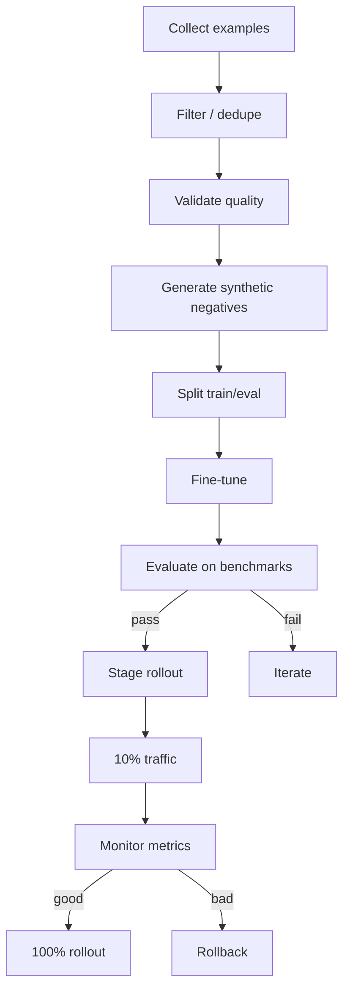

# NX-AGENT-7016 — Agent Fine-Tuning Strategy

| Field | Value |
|-------|-------|
| **Document ID** | NX-AGENT-7016 |
| **Title** | Agent Fine-Tuning Strategy |
| **Phase** | 4 — AI Brain |
| **Owner** | AI Platform AI |
| **Status** | 🟢 Complete |
| **Version** | 0.1.0 |
| **Created** | 2026-06-30 |
| **Depends on** | NX-AGENT-7001, NX-AGENT-7017 (Evaluation) |

---

## 1. Purpose

This document defines **when and how** NEXUS fine-tunes its own agents. Fine-tuning is a powerful lever but expensive; we use it deliberately.

## 2. When to fine-tune

Fine-tune when:

| Condition | Rationale |
|-----------|-----------|
| Prompting can't reach quality bar | The capability isn't achievable via prompt alone |
| Specific style / format | Style is highly consistent and prompt-fragile |
| Latency matters | Smaller fine-tuned model > larger prompted model |
| High-volume task | Cost of prompts > cost of fine-tune |
| Domain specialization | Tasks are domain-specific (e.g., legal, medical) |

Don't fine-tune when:

- The task is generic.
- Prompts work fine.
- Quality variance is acceptable.
- Few-shot examples suffice.

## 3. What we fine-tune

NEXUS fine-tunes:

- **First-party agents** (Planner, Researcher, etc.) — to enforce NEXUS style and policy.
- **Domain-specific variants** (e.g., a Legal Researcher).
- **Style profiles** (per Workspace or per user).

NEXUS does NOT fine-tune:

- Third-party agents.
- Foundation models themselves.

## 4. Data sources

Training data comes from:

| Source | Use |
|--------|-----|
| Synthetic prompts | Cold-start training |
| User interactions (opt-in) | Style learning |
| Curated examples | Edge cases |
| Agent reflections | Self-improvement loop |
| Marketplace usage | Top-performing patterns |

All training data is opt-in or anonymized.

## 5. Training pipeline

## 6. Model selection

| Task type | Base model | Tuning method |
|-----------|-----------|---------------|
| Style-consistent generation | Mid-tier LLM | LoRA |
| Tool selection | Small LLM | Full fine-tune |
| Code completion | Code-specialized | LoRA |
| Routing decisions | Small classifier | Head-only |
| Style embedding | Sentence transformer | Full |

## 7. Evaluation

Every fine-tuned model must:

- Pass the agent's evaluation harness (NX-AGENT-7017).
- Not regress on safety benchmarks.
- Not regress on general capabilities.

A regression on any of these blocks rollout.

## 8. Rollout

Fine-tuned models roll out gradually:

1. **Internal.** NEXUS team only.
2. **Canary.** 5% of users.
3. **Beta.** 25% of users.
4. **General.** 100%.

Each stage requires sign-off from AI Platform AI + Security AI.

## 9. Rollback

Rollback criteria:

- Eval regression > 5%.
- User-reported quality drop.
- Safety incident.

Rollback is fast: model swap in orchestrator.

## 10. User control

Users can:

- Opt out of personalized fine-tuning (default: opt-in).
- View what training data includes from them.
- Request deletion.

These controls live in Settings → Privacy (NX-UI-6009).

## 11. Privacy

Training data:

- Encrypted at rest.
- Never shared with third parties.
- Never used to train foundation models (only NEXUS-specific adapters).
- Deletable per user request.

## 12. Cost

Fine-tuning costs:

- Compute: per-job (depends on data size).
- Eval: $X per benchmark run.
- Storage: training data retention 90 days.

We budget <$5K/month for fine-tuning infrastructure at H1 scale.

## 13. Acceptance criteria

- [ ] Clear decision criteria for when to fine-tune.
- [ ] Training pipeline reproducible.
- [ ] Eval gates enforce quality.
- [ ] Rollback tested.
- [ ] User controls in place.

## 14. Open questions

- Q: Should we support user-uploaded fine-tuning data?
- Q: How do we prevent fine-tuning from drifting away from policy?

## 15. Reading list

- **Agent Contract** — NX-AGENT-7001
- **Agent Evaluation Harness** — NX-AGENT-7017
- **Memory Schema** — NX-AGENT-7010

---

*End NX-AGENT-7016.*