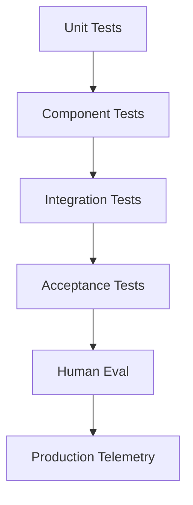
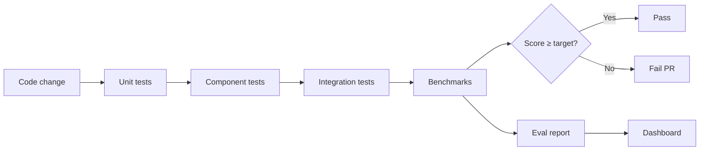

# NX-AGENT-7017 — Agent Evaluation Harness

| Field | Value |
|-------|-------|
| **Document ID** | NX-AGENT-7017 |
| **Title** | Agent Evaluation Harness |
| **Phase** | 4 — AI Brain |
| **Owner** | AI Platform AI |
| **Status** | 🟢 Complete |
| **Version** | 0.1.0 |
| **Created** | 2026-06-30 |
| **Depends on** | NX-AGENT-7001, NX-AGENT-7016 (Fine-Tuning) |

---

## 1. Purpose

This document defines how NEXUS **measures agent quality**. Without measurement, we cannot improve. The harness runs continuously in CI and against production traffic.

## 2. The evaluation pyramid



Each layer tests different things. All layers are required.

## 3. Test categories

### 3.1 Unit tests

Per-agent functions tested in isolation:

- Intent parsing.
- Plan generation (per category).
- Memory read/write.
- Tool selection.
- Confidence calibration.

Framework: standard unit test framework per language.

### 3.2 Component tests

Each agent tested end-to-end with mocked dependencies:

- Researcher: search → read → synthesize → cite.
- Coder: read repo → generate diff → test.
- Reviewer: take work → critique → decide.
- Publisher: verify approval → send → confirm.

Mocks for: tools, memory, models.

### 3.3 Integration tests

Multi-agent flows tested:

- Linear: Planner → Researcher → Coder → Reviewer.
- Parallel: 3 Researchers → aggregator.
- Loop: Coder → Reviewer (revise) → Coder.
- Handoff: Researcher → Coder with structured input.

Integration tests run against real models in CI.

### 3.4 Acceptance tests

Per-NEXUS-AT-9501:

- Validate PRD criteria end-to-end.
- Run nightly.

### 3.5 Human eval

Periodic human review:

- Sample 50 outputs per agent per week.
- Rate quality 1–5.
- Aggregate metrics tracked.

### 3.6 Production telemetry

Continuous:

- Task success rate.
- User edits per agent output.
- Re-run rate.
- Time to success.

## 4. Benchmark catalog

Each agent has a benchmark suite:

```yaml
benchmark_suite: researcher-v1
benchmarks:
  - name: search-quality-v1
    description: Quality of search results for known queries
    dataset_size: 200
    metric: relevance_score
    target: 0.85
    last_run: 2026-06-15
    
  - name: citation-accuracy-v1
    description: Citations resolve to valid sources
    dataset_size: 100
    metric: accuracy
    target: 0.95
    
  - name: coverage-v1
    description: Coverage of all required aspects
    dataset_size: 100
    metric: coverage_score
    target: 0.85
```

Benchmark suites per agent:

| Agent | Benchmark |
|-------|-----------|
| Planner | `planner.intent-coverage-v1`, `planner.decomposition-quality-v1`, `planner.calibration-v1` |
| Researcher | `researcher.search-quality-v1`, `researcher.citation-accuracy-v1`, `researcher.coverage-v1` |
| Coder | `coder.correctness-v1`, `coder.style-match-v1`, `coder.test-discipline-v1` |
| Reviewer | `reviewer.critical-catch-v1`, `reviewer.calibration-v1` |
| Tester | `tester.criterion-coverage-v1`, `tester.flakiness-v1` |
| Publisher | `publisher.idempotency-v1`, `publisher.approval-gate-v1` |

## 5. Metrics framework

### 5.1 Quality metrics

| Metric | Definition | Target |
|--------|-----------|--------|
| Accuracy | Correct outputs / total | ≥0.9 |
| Relevance | Mean relevance score | ≥4/5 |
| Coverage | Required aspects covered | ≥0.85 |
| Faithfulness | No hallucinations | ≥0.95 |
| Style match | Match to reference | ≥4/5 |

### 5.2 Cost metrics

| Metric | Target |
|--------|--------|
| Cost per task | ≤ target |
| Cost per success | ≤ target |
| Token efficiency | baseline ±10% |

### 5.3 Latency metrics

| Metric | Target |
|--------|--------|
| First-token latency | <500ms p95 |
| Step completion | ≤3s p95 |
| Full task completion | varies |

### 5.4 Reliability metrics

| Metric | Target |
|--------|--------|
| Crash rate | <0.1% |
| Timeout rate | <1% |
| Retry success rate | ≥70% |

## 6. Eval pipeline



Eval runs:

- **Per PR.** Unit, component, integration.
- **Nightly.** All benchmarks + acceptance.
- **Weekly.** Human eval sample.
- **Continuous.** Production telemetry.

## 7. Eval datasets

Datasets are:

- **Versioned.** Snapshots with commit hashes.
- **Diverse.** Cover edge cases.
- **Curated.** Manual review quarterly.
- **Synthetic.** Generated for edge cases.

Storage: `05_AI_PLATFORM/Evaluation/datasets/`.

## 8. Eval reports

Each eval run produces a report:

```typescript
interface EvalReport {
  run_id: string;
  agent_id: string;
  benchmark_suite: string;
  started_at: timestamp;
  completed_at: timestamp;
  results: BenchmarkResult[];
  summary: {
    pass: number;
    fail: number;
    regressions: string[];
  };
}

interface BenchmarkResult {
  benchmark_id: string;
  score: number;
  target: number;
  passed: boolean;
  samples_evaluated: number;
  failures: EvalFailure[];
}
```

Reports are published to internal dashboard.

## 9. Regression detection

A run is flagged if:

- Any metric drops by >5% from prior baseline.
- A new failure mode appears.
- Latency increases by >20%.
- Cost increases by >30%.

Regressions block PR merge.

## 10. Acceptance criteria

- [ ] Each agent has a benchmark suite.
- [ ] Eval runs in CI on every PR.
- [ ] Nightly eval covers full suite.
- [ ] Human eval weekly.
- [ ] Production telemetry continuous.
- [ ] Regressions block release.

## 11. Open questions

- Q: Should we ship a public leaderboard?
- Q: How do we handle benchmark gaming?

## 12. Reading list

- **Agent Contract** — NX-AGENT-7001
- **Fine-Tuning Strategy** — NX-AGENT-7016
- **Acceptance Test Suite** — NX-AT-9501 (Phase 5)

---

*End NX-AGENT-7017.*