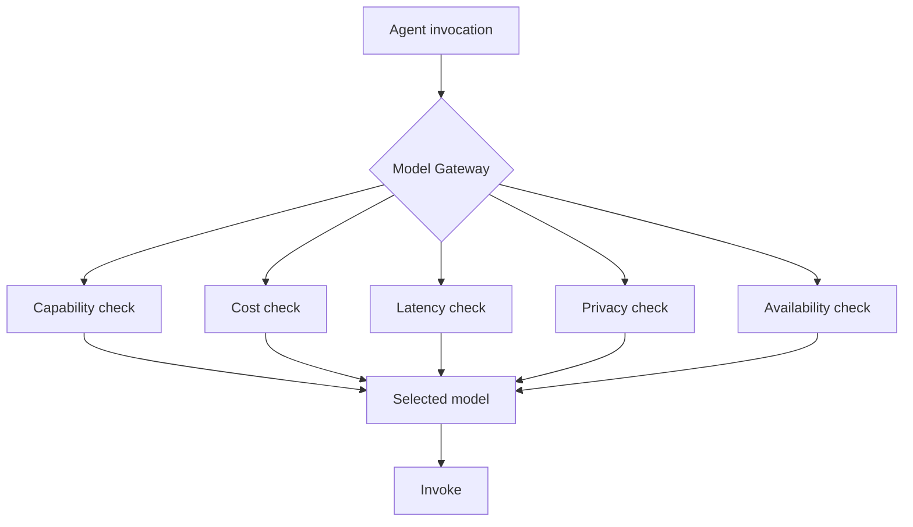

# NX-AGENT-7018 — Model Routing Strategy

| Field | Value |
|-------|-------|
| **Document ID** | NX-AGENT-7018 |
| **Title** | Model Routing Strategy |
| **Phase** | 4 — AI Brain |
| **Owner** | AI Platform AI |
| **Status** | 🟢 Complete |
| **Version** | 0.1.0 |
| **Created** | 2026-06-30 |
| **Depends on** | NX-AGENT-7001, NX-AGENT-7017, NX-FEAT-2604 (Model Routing) |

---

## 1. Purpose

This document defines **how NEXUS selects which model** to use for each agent invocation. Routing balances cost, latency, quality, and privacy.

## 2. The model gateway



The gateway is a single abstraction over multiple model providers.

## 3. Model tiers

| Tier | Strength | Latency | Cost | Examples |
|------|----------|---------|------|----------|
| **Local small** | Fast, private | <200ms | Free | Llama 3.1 8B, Phi-3 |
| **Local medium** | Balanced | <500ms | Free | Llama 3.1 70B, Qwen 2.5 32B |
| **Cloud standard** | Strong | <1s | $0.005/1K | GPT-4.1-mini, Claude Sonnet |
| **Cloud premium** | Strongest | <2s | $0.05/1K | GPT-5, Claude Opus 4 |
| **Cloud specialist** | Domain-tuned | <1s | varies | Legal, medical, code |

## 4. Routing rules

### 4.1 Per-agent defaults

| Agent | Default tier | Override allowed? |
|-------|-------------|-------------------|
| Planner | Local medium → Cloud standard | yes |
| Researcher | Cloud standard → premium | yes |
| Coder | Cloud premium | yes |
| Reviewer | Cloud standard → premium | yes |
| Tester | Local small | yes |
| Publisher | Local small | yes |

### 4.2 Per-task requirements

Each invocation declares:

```typescript
interface ModelRequirements {
  min_capability: 'basic' | 'reasoning' | 'expert' | 'domain_specific';
  max_latency_ms: number;
  max_cost_usd: number;
  requires_privacy: boolean;     // local-only
  preferred_models?: string[];
  fallback_models?: string[];
}
```

The gateway picks the best match.

### 4.3 Routing algorithm

```typescript
function selectModel(requirements: ModelRequirements): Model {
  const candidates = filterByCapability(allModels, requirements);
  const ranked = candidates.sort((a, b) => {
    const scoreA = scoreModel(a, requirements);
    const scoreB = scoreModel(b, requirements);
    return scoreB - scoreA;
  });
  return ranked[0];
}

function scoreModel(model: Model, req: ModelRequirements): number {
  let score = 0;
  if (req.requires_privacy && !model.local) return -Infinity;
  if (model.capability >= req.min_capability) score += 100;
  if (model.latency_p95 <= req.max_latency_ms) score += 50;
  if (model.cost_per_1k <= req.max_cost_usd / expected_tokens) score += 30;
  if (req.preferred_models?.includes(model.id)) score += 20;
  return score;
}
```

## 5. Fallback chains

Each model has a fallback:

```yaml
model_routing:
  planner:
    primary: claude-sonnet-4
    fallback: gpt-4.1
    local: llama-3.1-70b
  researcher:
    primary: claude-opus-4
    fallback: gpt-5
    local: llama-3.1-70b
```

On failure: try fallback. After all fallbacks exhausted: escalate.

## 6. Privacy modes

| Mode | Routing |
|------|---------|
| Standard | Any tier |
| Local-only | Local only |
| Privacy-sensitive (per NX-FEAT-2603) | Local only; no cloud |
| Hybrid | Cloud for non-sensitive, local for sensitive |

## 7. Cost optimization

Strategies:

- **Caching.** Same prompt + same context → cached response.
- **Batching.** Multiple small requests → one large.
- **Routing down.** If task is simple, use cheaper tier.
- **User opt-out of premium.** Free tier uses standard.

## 8. Performance

- Routing decision: <10ms.
- Model invocation: per-model latency.
- Total agent latency: routing + invocation.

## 9. Observability

Each routing decision logs:

```typescript
interface RoutingDecision {
  run_id: string;
  agent_id: string;
  requirements: ModelRequirements;
  candidates: ModelCandidate[];
  selected: string;
  reason: string;
  cost_usd: number;
  latency_ms: number;
}
```

Used for:

- Cost analysis.
- Quality tracking.
- Routing optimization.

## 10. Acceptance criteria

- [ ] Routing <10ms.
- [ ] All tiers supported.
- [ ] Fallback chains configured.
- [ ] Privacy modes respected.
- [ ] Routing observable.

## 11. Open questions

- Q: Should routing adapt based on cost budgets?
- Q: How do we handle model deprecation?

## 12. Reading list

- **Agent Contract** — NX-AGENT-7001
- **Tool Schema** — NX-AGENT-7011
- **Model Routing leaf** — NX-FEAT-2604
- **Local AI** — NX-FEAT-2601-2606

---

*End NX-AGENT-7018.*