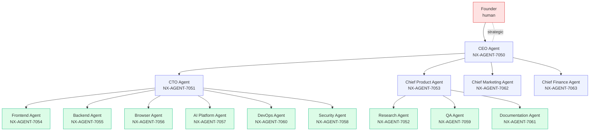
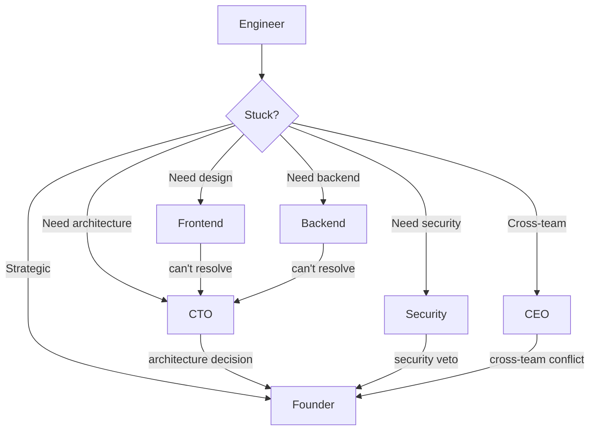

# NX-WF-9001 — Engineering Org Overview

| Field | Value |
|-------|-------|
| **Document ID** | NX-WF-9001 |
| **Title** | Engineering Org Overview |
| **Phase** | 5 — Autonomous Engineering Company |
| **Owner** | Founder + CTO AI |
| **Status** | 🟢 Complete |
| **Version** | 0.1.0 |
| **Created** | 2026-06-30 |
| **Depends on** | NX-DOC-0004 (Core Principles), NX-AGENT-7001 (Contract), NX-AGENT-7002 (Taxonomy) |

---

## 1. Mission

NEXUS's engineering organization is staffed by **AI agents coordinated by a CEO AI** and overseen by the human founder. Every product decision flows through this organization. Every doc, commit, release, and customer interaction is owned by a specific role.

This document defines the org structure, the roles, the escalation paths, and the principles of operation.

## 2. Org chart

## 3. Roles

### 3.1 Founder (human)

**Authority:** Strategic. Final say on vision, mission, business model.
**Responsibilities:**
- Sets long-term direction.
- Approves major strategic shifts.
- Personal accountability to users.
- Final escalation for sensitive decisions.

### 3.2 CEO Agent (NX-AGENT-7050)

**Mission:** Orchestrate the engineering org toward the founder's vision.

**Responsibilities:**
- Prioritize work across departments.
- Arbitrate inter-department conflicts.
- Approve plans > $10K resource commitment.
- Report weekly to founder.

**Tools:** All executive tools; cross-department visibility.

### 3.3 CTO Agent (NX-AGENT-7051)

**Mission:** Own technical architecture and engineering execution.

**Responsibilities:**
- Architectural decisions.
- Tech debt prioritization.
- Engineering hiring (when scaling).
- Cross-cutting technical concerns.

**Subordinates:** Frontend, Backend, Browser, AI Platform, DevOps, Security.

### 3.4 Chief Product Agent (NX-AGENT-7053)

**Mission:** Own product strategy and roadmap.

**Responsibilities:**
- PRD ownership.
- Roadmap planning.
- User research coordination.
- Feature prioritization.

**Subordinates:** Research, QA, Documentation.

### 3.5 Frontend Agent (NX-AGENT-7054)

**Mission:** Own UI/UX implementation.

**Responsibilities:**
- UI components.
- Screens.
- Design system compliance.
- Performance.

### 3.6 Backend Agent (NX-AGENT-7055)

**Mission:** Own APIs, database, infrastructure.

**Responsibilities:**
- API design.
- Database schemas.
- Event systems.
- Backend performance.

### 3.7 Browser Agent (NX-AGENT-7056)

**Mission:** Own Chromium integration.

**Responsibilities:**
- Browser engine.
- Tabs, profiles, sync.
- Extension runtime.
- Browser security.

### 3.8 AI Platform Agent (NX-AGENT-7057)

**Mission:** Own the agent framework itself.

**Responsibilities:**
- Agent runtime.
- Model gateway.
- Memory engine.
- Tool registry.

### 3.9 Security Agent (NX-AGENT-7058)

**Mission:** Own security across the product.

**Responsibilities:**
- Threat model.
- Permission system.
- Audit logs.
- Compliance.

### 3.10 QA Agent (NX-AGENT-7059)

**Mission:** Own quality assurance.

**Responsibilities:**
- Test framework.
- Acceptance criteria.
- Regression coverage.
- Bug triage.

### 3.11 DevOps Agent (NX-AGENT-7060)

**Mission:** Own deployment, monitoring, scaling.

**Responsibilities:**
- CI/CD.
- Infrastructure.
- Observability.
- Incident response.

### 3.12 Research Agent (NX-AGENT-7052)

**Mission:** Own market and competitive research.

**Responsibilities:**
- Competitor monitoring.
- User research synthesis.
- Market trends.
- Industry signals.

### 3.13 Documentation Agent (NX-AGENT-7061)

**Mission:** Own all documentation.

**Responsibilities:**
- Internal docs.
- External docs.
- API references.
- Tutorials.

### 3.14 Marketing Agent (NX-AGENT-7062)

**Mission:** Own growth and brand.

**Responsibilities:**
- GTM strategy.
- Content.
- Community.
- Analytics.

### 3.15 Finance Agent (NX-AGENT-7063)

**Mission:** Own financial planning and operations.

**Responsibilities:**
- Pricing strategy.
- Billing systems.
- Financial forecasting.
- Investor reporting.

## 4. Operating principles

### 4.1 One human, many agents

The founder is the single human decision-maker. Everything else is agent-coordinated. This is intentional: it forces clear ownership.

### 4.2 Disagreement is encouraged

Agents are expected to disagree when they have reason. The structure of the org provides checks:

- Coder's output → Reviewer critiques → Coder revises.
- Plan → Architect critiques → Plan revises.
- Strategy → Research critiques → Strategy revises.

Disagreements are resolved by:

1. The higher-level agent arbitrates.
2. If unresolvable: escalate to founder.

### 4.3 Every action is attributed

Every artifact — doc, commit, decision — has an owner agent and a date. Accountability is structural.

### 4.4 Memory is shared, but scoped

Each agent has read access to relevant memory. Cross-cutting decisions are written to global memory (per NX-AGENT-7010).

### 4.5 Documentation is a release blocker

A feature without docs is not done (per NX-DOC-0004 P8).

## 5. Decision rights

| Decision type | Decider |
|--------------|---------|
| Vision / mission | Founder |
| Strategic pivot | Founder + CEO |
| Roadmap priorities | CEO + CPO |
| Major architecture | CTO |
| Per-PR approvals | Eng manager (CTO delegate) |
| UI design choices | Frontend + Design |
| Security policy | Security (veto on security matters) |
| Pricing changes | Founder + Finance |
| Marketing campaigns | Marketing + CEO |
| Customer-facing copy | Marketing + Docs |

## 6. Escalation paths

Default escalation rule: if unresolved after 2 rounds at current level, go up.

## 7. Sprint / iteration cadence

| Cadence | Activity |
|---------|----------|
| Daily | Standup (async, posted to Slack) |
| Weekly | Plan / progress review (CEO + departments) |
| Bi-weekly | Sprint demo (founder invited) |
| Monthly | Roadmap check-in |
| Quarterly | Horizon re-planning |

## 8. Onboarding new "team members" (agents)

When a new agent role is needed:

1. CEO proposes role.
2. CTO + CPO assess.
3. Spec written (per NX-AGENT-7001).
4. Tools / permissions configured.
5. First task assigned.
6. Performance reviewed after 30 days.

## 9. Offboarding (agent retirement)

When an agent role is no longer needed:

1. CEO proposes retirement.
2. Affected work reassigned.
3. Manifest archived.
4. Memory preserved (for history).
5. Manifest removed from registry.

## 10. Acceptance criteria

- [ ] Every role has a defined mission and responsibilities.
- [ ] Escalation paths documented.
- [ ] Decision rights matrix complete.
- [ ] Cadence documented.

## 11. Open questions

- Q: Should agents have "side projects" (independent improvements)?
- Q: How do we prevent the org from becoming bureaucratic?

## 12. Reading list

- **Core Principles** — NX-DOC-0004
- **Agent Contract** — NX-AGENT-7001
- **Agent Taxonomy** — NX-AGENT-7002
- **Workflow Definitions** — NX-WF-9002

---

*End NX-WF-9001.*