# NX-WF-9002 — Workflow Definitions

| Field | Value |
|-------|-------|
| **Document ID** | NX-WF-9002 |
| **Title** | Workflow Definitions |
| **Phase** | 5 — Autonomous Engineering Company |
| **Owner** | CEO AI |
| **Status** | 🟢 Complete |
| **Version** | 0.1.0 |
| **Created** | 2026-06-30 |
| **Depends on** | NX-WF-9001 (Org Overview), NX-AGENT-7014 (Multi-Agent Composition) |

---

## 1. Mission

This document defines the **standard operating procedures (SOPs)** for the engineering organization. Every repeatable task has a defined workflow. Workflows are versioned and updated.

## 2. The 12 standard workflows

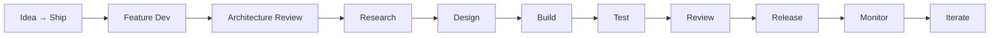

| # | Workflow | Purpose |
|---|----------|---------|
| 1 | Idea → Ship | From user idea to released feature |
| 2 | Bug Triage | From report to fix |
| 3 | Architecture Review | From proposal to decision |
| 4 | Security Review | From request to approval |
| 5 | Documentation Update | From change to published docs |
| 6 | Release | From green CI to public release |
| 7 | Incident Response | From alert to resolution |
| 8 | Customer Escalation | From complaint to resolution |
| 9 | Roadmap Update | From market signal to plan |
| 10 | Pricing Change | From hypothesis to published |
| 11 | Onboarding Update | From feedback to flow update |
| 12 | Quarterly Review | From data to decisions |

## 3. Workflow: Idea → Ship

**Trigger:** User feedback, market signal, internal proposal.

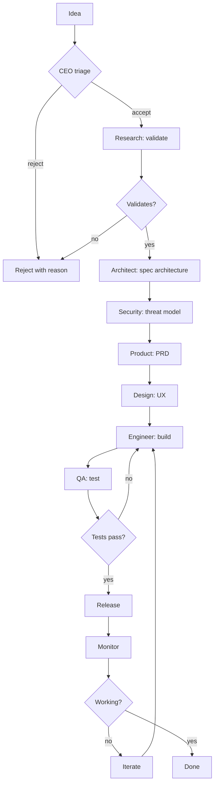

**SLA:** 4 weeks for typical feature; 12 weeks for major.

**Roles:** Research, Architect, Security, Product, Design, Engineer, QA.

**Quality gates:** PRD approved; Architecture reviewed; Security approved; Tests pass; Docs updated.

## 4. Workflow: Bug Triage

**Trigger:** Bug report.

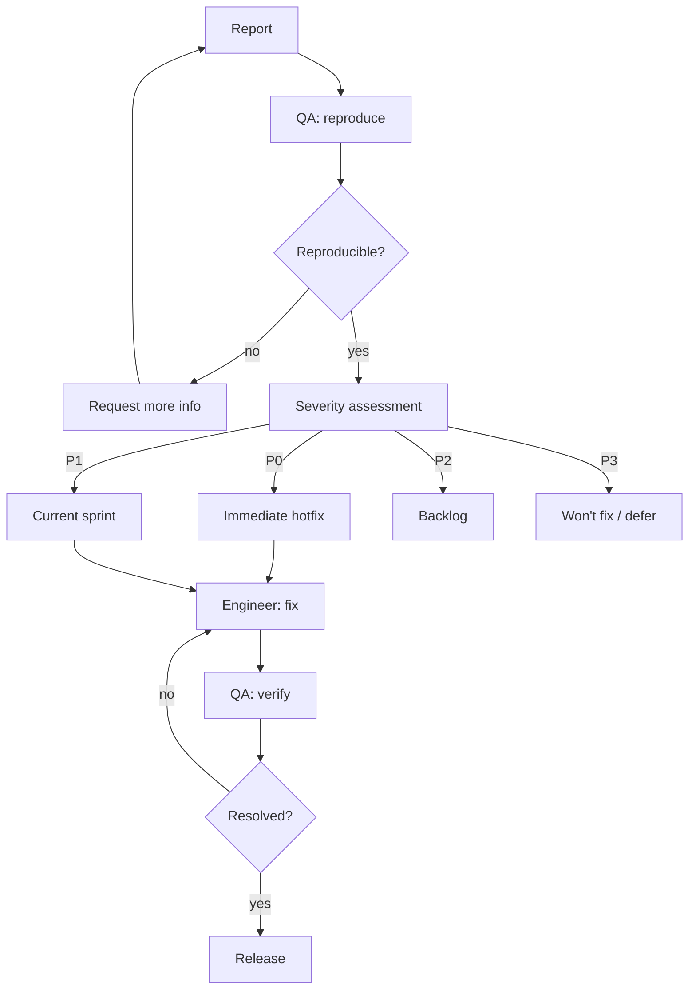

**SLA:** P0 = 4 hours; P1 = 1 week; P2 = next sprint; P3 = backlog.

## 5. Workflow: Architecture Review

**Trigger:** Major architectural decision needed.

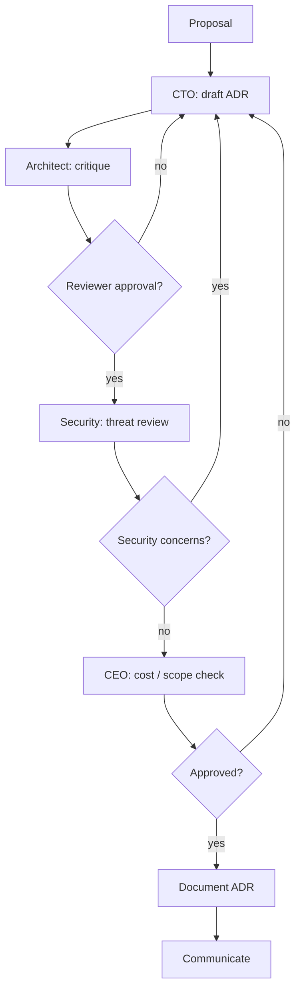

**Output:** Architecture Decision Record (ADR) in `12_DEVELOPER_GUIDE/ADRs/`.

## 6. Workflow: Security Review

**Trigger:** New feature with security implications; major dependency change.

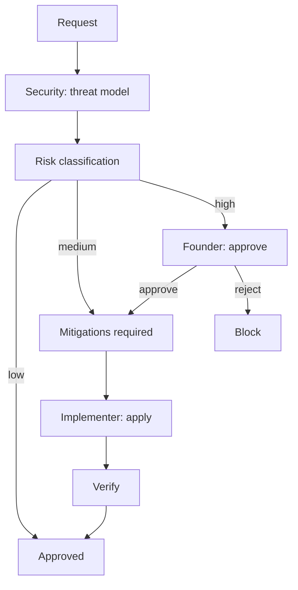

**Output:** Security review record + mitigations tracked.

## 7. Workflow: Documentation Update

**Trigger:** Any code change.

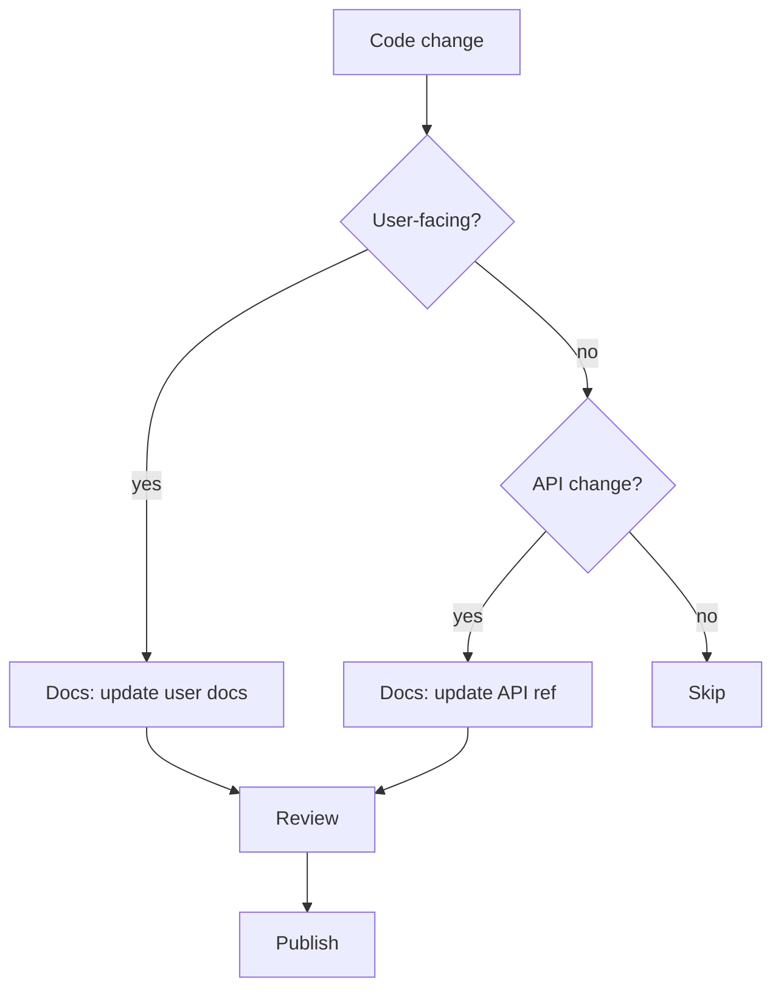

**Rule:** PR without docs does not merge.

## 8. Workflow: Release

**Trigger:** Sprint end with approved changes.

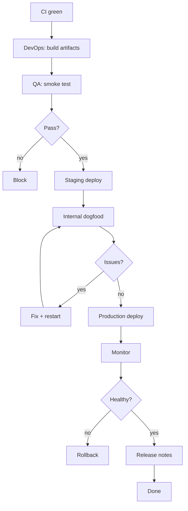

## 9. Workflow: Incident Response

**Trigger:** P0 alert.

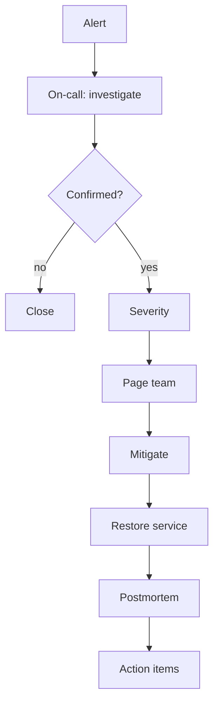

**SLA:** Mitigation within 1 hour; full resolution within 24 hours; postmortem within 5 days.

## 10. Workflow: Customer Escalation

**Trigger:** Customer complaint.

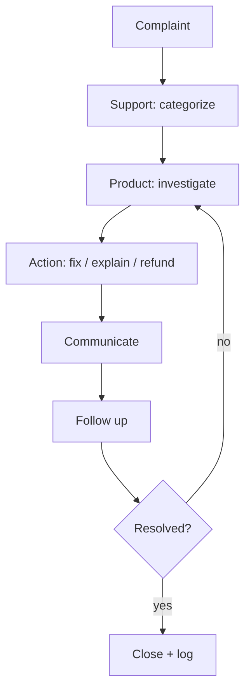

## 11. Workflow: Roadmap Update

**Trigger:** Quarterly, or major market signal.

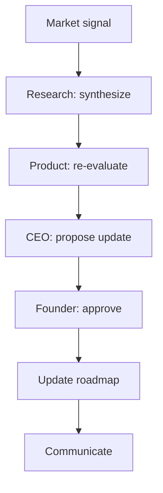

## 12. Workflow: Pricing Change

**Trigger:** Cost pressure, market shift, A/B test results.

```mermaid
graph TD
    A[Hypothesis] --> B[Finance: model]
    B --> C[Product: validate UX]
    C --> D[Marketing: communicate]
    D --> E[Founder: approve]
    E --> F[A/B test (optional)]
    F --> G[Roll out]
    G --> H[Monitor]
```

## 13. Workflow: Onboarding Update

**Trigger:** Activation metric regression or qualitative feedback.

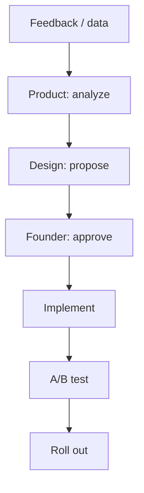

## 14. Workflow: Quarterly Review

**Trigger:** Every 90 days.

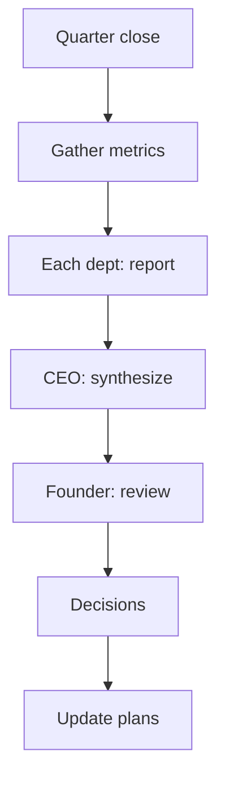

## 15. Workflow inputs and outputs

Every workflow has:

- **Trigger.** What starts it.
- **Inputs.** Required context.
- **Steps.** Ordered activities.
- **Quality gates.** Pass / fail criteria.
- **Outputs.** Artifacts produced.
- **SLA.** Time and quality expectations.
- **Owners.** Which roles.

## 16. Acceptance criteria

- [ ] All 12 workflows documented.
- [ ] Each has trigger / inputs / steps / outputs / SLA.
- [ ] Quality gates identified.
- [ ] Owners identified.

## 17. Open questions

- Q: Should workflows themselves be agent-managed (suggested improvements)?
- Q: How do we handle cross-workflow dependencies?

## 18. Reading list

- **Org Overview** — NX-WF-9001
- **Quality Gates** — NX-WF-9003
- **Escalation Paths** — NX-WF-9004

---

*End NX-WF-9002.*