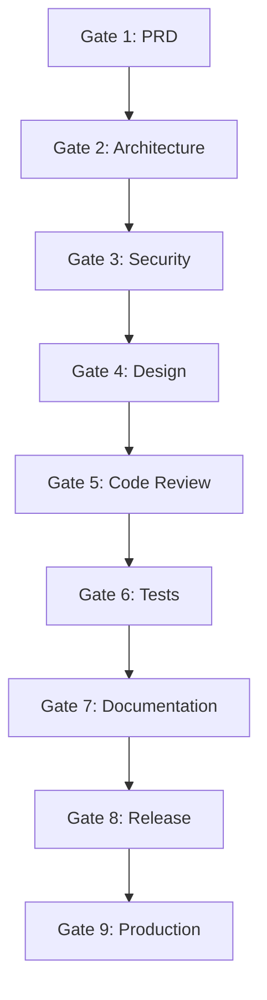

# NX-WF-9003 — Quality Gates

| Field | Value |
|-------|-------|
| **Document ID** | NX-WF-9003 |
| **Title** | Quality Gates |
| **Phase** | 5 — Autonomous Engineering Company |
| **Owner** | QA AI |
| **Status** | 🟢 Complete |
| **Version** | 0.1.0 |
| **Created** | 2026-06-30 |
| **Depends on** | NX-WF-9001, NX-WF-9002, NX-AGENT-7017 (Evaluation) |

---

## 1. Purpose

Quality gates are the **checks** every artifact must pass before moving forward. They prevent bad work from propagating. This document defines each gate, its criteria, and who enforces it.

## 2. The gate hierarchy

Every gate is binary: pass or fail. No "pass with notes."

## 3. Gate 1 — PRD Approved

**When:** Before architecture work begins.
**Owner:** CPO Agent.
**Enforced by:** CPO.

**Criteria:**
- [ ] Goal stated (one sentence).
- [ ] User stories for primary personas.
- [ ] Functional requirements with acceptance criteria.
- [ ] Non-functional requirements (perf, security, accessibility).
- [ ] Out of scope explicitly listed.
- [ ] Cross-references to upstream docs resolved.
- [ ] Open questions resolved or deferred.

**Pass:** All checkboxes.
**Fail:** Any checkbox unchecked.

## 4. Gate 2 — Architecture Reviewed

**When:** Before implementation begins.
**Owner:** CTO Agent.
**Enforced by:** CTO + Architect (CTO delegate).

**Criteria:**
- [ ] System impact analyzed.
- [ ] Alternatives considered.
- [ ] ADR written (per 12_DEVELOPER_GUIDE).
- [ ] Migration plan (if breaking).
- [ ] Cost estimate provided.
- [ ] Scalability considered.
- [ ] No critical unknowns.

**Pass:** CTO + Architect agree.

## 5. Gate 3 — Security Approved

**When:** Before user-facing surfaces are built.
**Owner:** Security Agent (veto power).
**Enforced by:** Security Agent.

**Criteria:**
- [ ] Threat model completed.
- [ ] Permission scopes defined.
- [ ] Sensitive data identified.
- [ ] Audit events defined.
- [ ] No P0 / P1 security issues open.
- [ ] Dependencies scanned (no critical CVEs).
- [ ] Encryption requirements met.

**Pass:** Security Agent approves.
**Veto:** Security Agent can block regardless of other gates.

## 6. Gate 4 — Design Approved

**When:** Before implementation of user-facing surfaces.
**Owner:** Frontend Agent + Design.
**Enforced by:** Frontend Agent.

**Criteria:**
- [ ] User flow diagrammed.
- [ ] Empty / loading / error states designed.
- [ ] Accessibility (WCAG AA) addressed.
- [ ] Responsive variants (laptop, desktop, wide).
- [ ] Copy approved.
- [ ] Animations specced.
- [ ] Edge cases handled.

**Pass:** Frontend Agent + Design agree.

## 7. Gate 5 — Code Review Approved

**When:** Before merge.
**Owner:** Engineer + Reviewer.
**Enforced by:** PR review.

**Criteria:**
- [ ] CI green (build, lint, types).
- [ ] Code Reviewer approved (per NX-AGENT-7006).
- [ ] No unresolved comments.
- [ ] Test coverage meets threshold.
- [ ] No introduced regressions.
- [ ] Style matches repo.
- [ ] No secrets committed.

**Pass:** ≥1 approval from reviewer; CI green.

## 8. Gate 6 — Tests Pass

**When:** Before release.
**Owner:** QA Agent.
**Enforced by:** CI + manual review.

**Criteria:**
- [ ] Unit tests: 100% pass; coverage ≥80%.
- [ ] Integration tests: 100% pass.
- [ ] Acceptance tests: 100% pass for new criteria.
- [ ] Regression suite: 100% pass.
- [ ] Smoke tests on staging: 100% pass.
- [ ] Manual QA: scenarios covered.

**Pass:** All test categories pass.

## 9. Gate 7 — Documentation Updated

**When:** Before release.
**Owner:** Documentation Agent.
**Enforced by:** PR review.

**Criteria:**
- [ ] User docs updated for user-facing changes.
- [ ] API docs updated for API changes.
- [ ] Internal docs updated for architectural changes.
- [ ] Changelog entry added.
- [ ] Links verified.
- [ ] Spelling / grammar checked.

**Pass:** Docs Agent approval.

## 10. Gate 8 — Release Approved

**When:** Before deployment to production.
**Owner:** DevOps Agent + CEO.
**Enforced by:** Manual sign-off.

**Criteria:**
- [ ] All prior gates passed.
- [ ] Release notes written.
- [ ] Rollback plan documented.
- [ ] Stakeholders notified.
- [ ] Monitoring in place.
- [ ] Feature flags configured (if applicable).

**Pass:** CEO + DevOps sign-off.

## 11. Gate 9 — Production Healthy

**When:** After release, monitoring period.
**Owner:** DevOps + on-call.
**Enforced by:** Automated + manual review.

**Criteria:**
- [ ] Error rate < 0.5%.
- [ ] Latency within SLO.
- [ ] No P0 incidents.
- [ ] User feedback not regressing.
- [ ] Metrics stable.

**Pass:** 24 hours of healthy metrics.

## 12. Gate enforcement matrix

| Gate | Owner | Enforcement | Override authority |
|------|-------|-------------|-------------------|
| 1. PRD | CPO | CPO review | CEO |
| 2. Architecture | CTO | CTO + Architect | Founder (rare) |
| 3. Security | Security | Security Agent | Founder (rare) |
| 4. Design | Frontend | Frontend Agent | CPO |
| 5. Code Review | Engineer | PR review | CTO |
| 6. Tests | QA | CI + manual | CTO |
| 7. Documentation | Docs | Docs Agent | CPO |
| 8. Release | CEO + DevOps | Manual sign-off | Founder |
| 9. Production | DevOps | Auto + on-call | Founder |

## 13. Bypass policy

In emergencies, gates can be bypassed with explicit approval:

- Up to Gate 6: CTO can approve with documented reason.
- Gates 7-8: CEO approval.
- Gate 9: not bypassable.

Bypassed gates must be remediated within 7 days.

## 14. Gate metrics

Tracked across the org:

| Metric | Target |
|--------|--------|
| Gate 1 pass rate | ≥80% |
| Gate 2 pass rate | ≥70% |
| Gate 3 pass rate | ≥90% (high bar) |
| Gate 5 pass rate | ≥85% |
| Gate 6 pass rate | ≥90% |
| Bypass rate | <5% |

## 15. Acceptance criteria

- [ ] All 9 gates defined.
- [ ] Each has criteria + owner + enforcement.
- [ ] Bypass policy documented.
- [ ] Metrics tracked.

## 16. Open questions

- Q: Should gates be configurable per project?
- Q: How do we handle "soft" gate failures (e.g., style)?

## 17. Reading list

- **Org Overview** — NX-WF-9001
- **Workflow Definitions** — NX-WF-9002
- **Escalation Paths** — NX-WF-9004
- **Acceptance Test Suite** — NX-AT-9501

---

*End NX-WF-9003.*