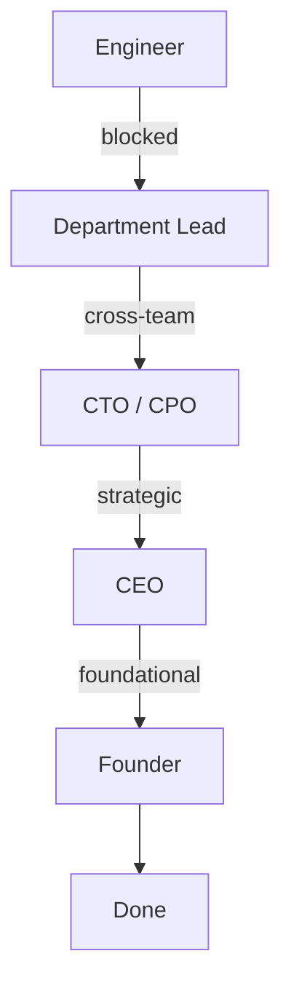
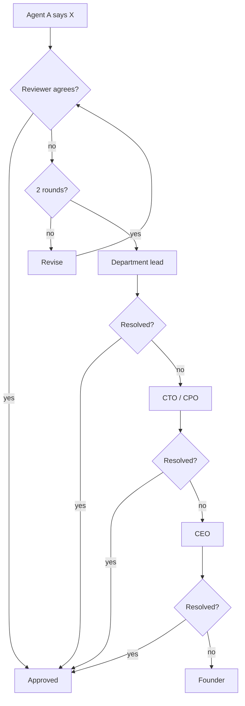
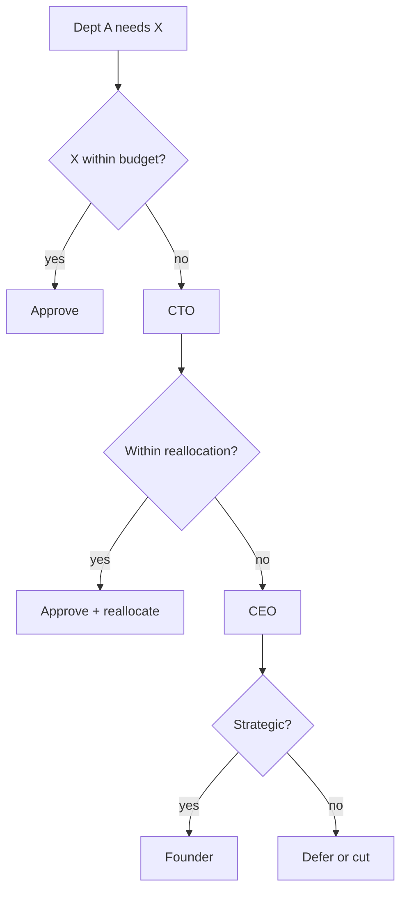
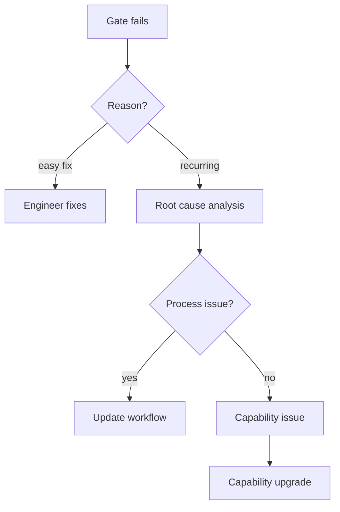
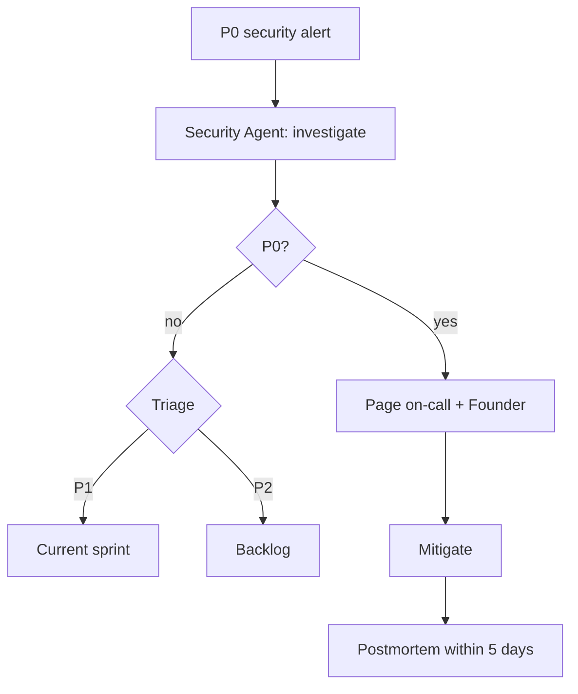
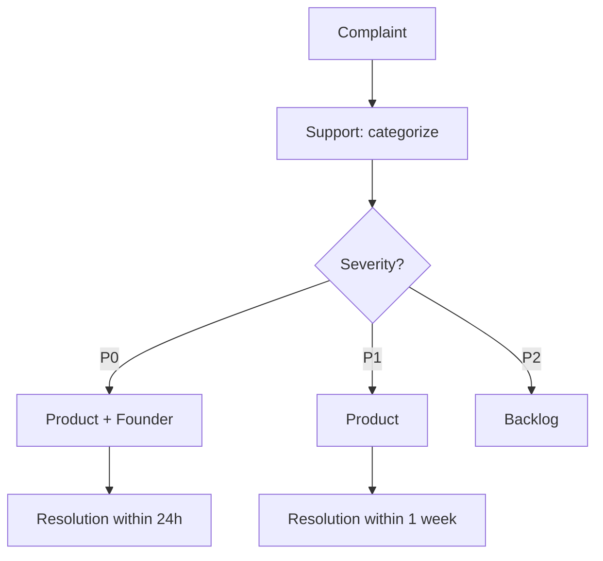

# NX-WF-9004 — Escalation Paths

| Field | Value |
|-------|-------|
| **Document ID** | NX-WF-9004 |
| **Title** | Escalation Paths |
| **Phase** | 5 — Autonomous Engineering Company |
| **Owner** | CEO AI |
| **Status** | 🟢 Complete |
| **Version** | 0.1.0 |
| **Created** | 2026-06-30 |
| **Depends on** | NX-WF-9001, NX-WF-9003 |

---

## 1. Purpose

This document defines **how problems escalate** in the engineering organization. When an agent or workflow is stuck, there is a clear path upward. When something requires human attention, the founder is reached efficiently.

## 2. Escalation principles

1. **Escalate when blocked, not when struggling.** Effort ≠ escalation.
2. **Escalate with context.** Bring analysis, options, recommendation.
3. **Escalate to the level that can decide.** Not higher.
4. **Escalate quickly.** A 24-hour delay is worse than a slightly imperfect decision.
5. **Track escalations.** Patterns reveal systemic issues.

## 3. The escalation pyramid



| Level | Decides | Examples |
|-------|---------|----------|
| Engineer | Technical within scope | Implementation detail |
| Department Lead | Cross-feature within dept | Browser vs. AI Platform conflict on cookies |
| CTO / CPO | Cross-department | Frontend + Backend API disagreement |
| CEO | Resource / priority | New feature needs Cloud Browser resources |
| Founder | Strategy / values | Pivot, principle violation, sensitive user issue |

## 4. Common escalation scenarios

### 4.1 Disagreement between agents



### 4.2 Resource conflict



### 4.3 Quality gate failure



### 4.4 Security incident



### 4.5 Customer complaint



## 5. Communication format

Every escalation message includes:

```yaml
escalation:
  from: agent_id
  to: target_agent_or_human
  context: |
    What is happening
  tried: |
    What has been tried
  options:
    - option_1
    - option_2
    - option_3
  recommendation: option_1
  urgency: high | medium | low
  deadline: timestamp
```

The rec sends context, not just questions.

## 6. Response SLAs

| Urgency | Response SLA |
|---------|--------------|
| High (security, P0) | <1 hour |
| Medium | <4 hours |
| Low | <24 hours |

If no response within SLA, escalate further automatically.

## 7. Escalation tracking

All escalations logged:

```typescript
interface Escalation {
  id: string;
  from: AgentId;
  to: AgentId | 'founder';
  reason: string;
  context: string;
  options: string[];
  recommendation: string;
  urgency: 'high' | 'medium' | 'low';
  status: 'pending' | 'resolved' | 'escalated_further';
  resolution?: string;
  resolved_at?: timestamp;
  resolved_by?: AgentId | 'founder';
}
```

Logged in `06_ENGINEERING_TEAM/escalations.md`.

## 8. Pattern analysis

Weekly, CEO reviews escalations:

- Recurring reasons → systemic issue.
- Same agent escalating → capability gap.
- Same topic → training or process improvement.

Output: actions assigned.

## 9. The founder's escalation policy

The founder is reserved for:

- Strategic pivots.
- Principle violations (NX-DOC-0004).
- Sensitive user issues (legal, ethical).
- Final architectural disagreements.
- Money > $10K commitment.
- Hiring.

The founder is NOT for:

- Implementation details.
- Routine disagreements (those escalate to CEO).
- Process questions (those are department-internal).

## 10. Anti-patterns

- **Boy-who-cried-wolf.** Escalating trivial issues. Track and correct.
- **Skipping levels.** Going to founder instead of CEO. Discuss in retros.
- **Escalating without context.** Forces decider to gather info themselves. Always include analysis.
- **Waiting too long.** 24 hours of struggle should escalate.
- **Escalating decisions you can make.** Confidence in role boundaries.

## 11. Acceptance criteria

- [ ] Escalation paths defined per scenario.
- [ ] Communication format documented.
- [ ] SLAs defined.
- [ ] Tracking in place.
- [ ] Anti-patterns documented.

## 12. Open questions

- Q: Should we have an automated escalation bot that monitors timeouts?
- Q: Should the founder's calendar be visible to escalation routing?

## 13. Reading list

- **Org Overview** — NX-WF-9001
- **Workflow Definitions** — NX-WF-9002
- **Quality Gates** — NX-WF-9003

---

*End NX-WF-9004.*