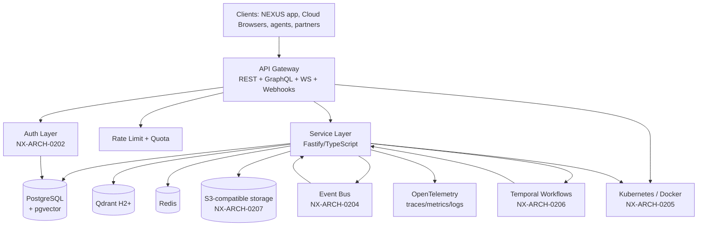
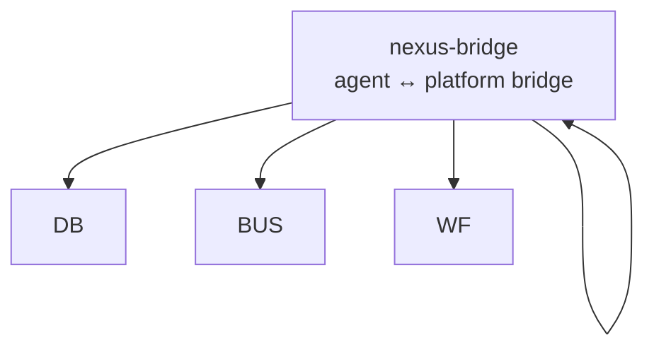

# NX-ARCH-0002 — Backend Architecture Overview

| Field | Value |
|-------|-------|
| **Document ID** | NX-ARCH-0002 |
| **Title** | Backend Architecture Overview |
| **Phase** | 7 — AI Infrastructure |
| **Owner** | Backend AI (NX-AGENT-7055) + AI Platform AI (NX-AGENT-7057) |
| **Status** | 🟢 Complete |
| **Version** | 0.1.0 |
| **Created** | 2026-07-02 |
| **Depends on** | NX-DOC-0002 (Vision), NX-DOC-0011 (Tech Principles), NX-ARCH-0001 (Browser Arch), NX-EM-9603 (Backend AI) |

---

## 1. Mission

Define the architecture of NEXUS's server-side substrate — the system that makes every user-facing feature durable, observable, and safe, and that makes AI agents a first-class workload alongside humans.

## 2. Architectural principles

These principles are concrete instantiations of NX-DOC-0011 for the backend.

1. **API is the contract.** The REST/GraphQL/WebSocket APIs (NX-ARCH-0201) are the public surface; everything internal is implementation. The OpenAPI spec is the source of truth (per NX-DOC-0011 P10).
2. **Data integrity is non-negotiable.** Per NX-DOC-0011 P9 (idempotency) and P13 (backwards compatibility), every write is idempotent, every migration is reversible, and every read has a defined consistency guarantee.
3. **Agents are first-class clients.** API rate limits, observability, and authentication don't distinguish "agent" from "user" at the transport layer; both go through the same API gateway. (Permissioning happens at the action layer — NX-AGENT-7015.)
4. **Local-first, cloud-optional.** Where the data layer can serve a user request from the local app, it does. The cloud is the sync target, not the runtime of last resort.
5. **Workflows are durable.** Per the cloud browser dependency on "Agent Orchestrator for executing scheduled workflows" (NX-FEAT-1600 §10), anything that can be interrupted must be a Temporal workflow.
6. **Observability is built-in.** Per NX-DOC-0011 P6, every service emits OpenTelemetry traces, metrics, and logs by default. No opt-in required for backend services.
7. **Security at every boundary.** Per NX-DOC-0011 P7, every layer has explicit authn/authz. No implicit trust between services.

## 3. Layered architecture

| Layer | Doc | Doc ID |
|-------|-----|--------|
| Edge | API Surface (REST/GraphQL/WS/Webhooks) | NX-ARCH-0201 |
| Edge | Authentication, sessions, tokens | NX-ARCH-0202 |
| Data | Database (Postgres + pgvector + Qdrant) | NX-ARCH-0203 |
| Data | Event System (pub/sub, webhooks) | NX-ARCH-0204 |
| Platform | Infrastructure (K8s, Docker, networking) | NX-ARCH-0205 |
| Platform | Queues & Workflows (Temporal) | NX-ARCH-0206 |
| Data | Storage (S3-compatible, blob) | NX-ARCH-0207 |

## 4. The two workloads: user and agent

NEXUS's backend serves two kinds of clients, and the architecture must serve both well.

| Workload | Pattern | Latency target | Throughput target |
|----------|---------|---------------:|------------------:|
| **User** | Interactive, request/response | < 200ms p95 for reads, < 500ms p95 for writes | Tens of thousands concurrent |
| **Agent** | Long-running, durable, batch | N/A (workflows) | Hundreds of concurrent workflows |
| **System** | Background (cleanup, sync, billing) | N/A | Throughput-oriented |

The architecture separates these into:

- **Synchronous path** (REST/GraphQL): for user and agent short-lived actions. Fastify in TypeScript.
- **Asynchronous path** (Temporal workflows): for anything that can fail, retry, sleep, or run longer than 30 seconds.
- **Streaming path** (WebSocket/SSE): for AI token streaming, live view, real-time updates.

## 5. Service topology

NEXUS is not a microservice zoo. Per NX-DOC-0011 §6 (anti-patterns: "Microservices for everything — premature distribution"), we use a **modular monolith** for H1, with explicit seams to extract services later if scale demands.

The monolith is modular: each module has clear boundaries, and the bus is the only allowed cross-module call for asynchronous work. A module can be extracted into its own service in H2+ if it has its own scaling profile, its own team, or its own data store.

## 6. What this phase does NOT cover

- **Browser architecture (Phase 6)** — that's the local/cloud browser runtime, not the server side.
- **Marketplace mechanics (Phase 8)** — billing flows, plugin SDK surface, agent store UX.
- **Business/enterprise concerns (Phase 9)** — pricing pages, financial models, investor reporting.
- **Deployment specifics (Phase 10)** — K8s manifests, CI/CD, monitoring dashboards. Phase 7's `Infrastructure` doc is *what* runs; Phase 10's `Deployment` is *how* it gets there.

## 7. Acceptance criteria for the phase

- [ ] All 7 leaf architecture documents (NX-ARCH-0201..0207) complete.
- [ ] Every leaf doc cross-references this overview.
- [ ] Tech stack matches NX-DOC-0011 §5.
- [ ] API surface doc includes NX-API-#### ID allocation strategy.

## 8. Reading list

- **Vision** — NX-DOC-0002
- **Technical Principles** — NX-DOC-0011
- **Browser Architecture Overview** — NX-ARCH-0001
- **Backend AI Manifest** — NX-EM-9603
- **AI Platform AI Manifest** — NX-EM-9612
- **All 7 leaf architecture docs** — NX-ARCH-0201..0207

---

*End NX-ARCH-0002.*
