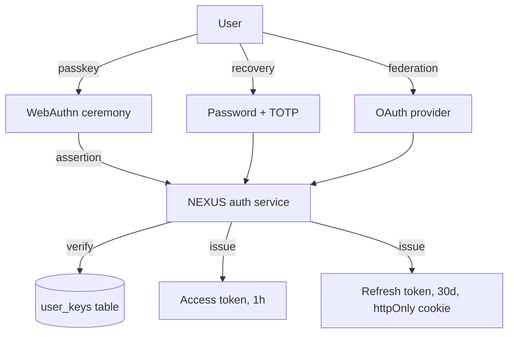

# NX-ARCH-0202 — Authentication

| Field | Value |
|-------|-------|
| **Document ID** | NX-ARCH-0202 |
| **Title** | Authentication |
| **Phase** | 7 — AI Infrastructure |
| **Owner** | Backend AI (NX-AGENT-7055) + Security AI (NX-AGENT-7058) |
| **Status** | 🟢 Complete |
| **Version** | 0.1.0 |
| **Created** | 2026-07-02 |
| **Depends on** | NX-ARCH-0002, NX-ARCH-0201, NX-EM-9605 (Security AI) |

---

## 1. Mission

Define how NEXUS authenticates humans, devices, agents, and partners — the chain of trust from a user typing a passphrase to an API request being authorized — so every action is attributed, no action is spoofed, and credentials are never exposed.

## 2. Identity types

NEXUS recognizes four identity types, each with a distinct authentication model.

| Type | What it represents | Auth method | Lifetime |
|------|-------------------|-------------|----------|
| **User** | A human with a NEXUS account | Passkey (primary) + password (recovery) + OAuth federation | Long-lived |
| **Device** | A specific install of NEXUS (local app, Cloud Browser runtime) | Device key bound to user account | Long-lived; revocable |
| **Agent** | An AI agent (per NX-AGENT-70##) | Agent token (issued by user) with scoped capabilities | Configurable; default 90 days, max 1 year |
| **Partner** | A third-party integration | OAuth 2.0 client credentials | Per-integration; revocable |

## 3. The user authentication flow

Primary: **passkey (WebAuthn)**. Recovery: **password**. Federation: **OAuth 2.0 / OIDC**.



### 3.1 Passkey (primary)

- WebAuthn with platform authenticator (TouchID, Windows Hello) and roaming authenticator (YubiKey, phone).
- Required for new accounts in H2; in H1, optional but encouraged.
- The passkey signs the challenge; NEXUS verifies the public key against the user's enrolled authenticators.
- **The NEXUS server never sees the private key** — it cannot decrypt user data without the user's passkey.

### 3.2 Password (recovery)

- Argon2id-hashed; cost tuned to ~500ms on reference hardware.
- Mandatory TOTP (RFC 6238) for accounts without a passkey.
- 12-character minimum, breach-list checked (Have I Been Pwned API on signup and password change).
- Rate-limited: 5 failed attempts → 15-minute lockout; 10 → 1-hour lockout; 20 → 24-hour lockout + alert.

### 3.3 Federation (OAuth 2.0 / OIDC)

- Google, Microsoft, GitHub at H1; SAML in H2 (NX-FEAT-2901).
- NEXUS treats federated identity as a verified email + a name; the user is still required to set a recovery method (passkey or password).
- Federation token is exchanged for a NEXUS-native session; NEXUS does not call back to the IdP on every request.

## 4. Tokens

NEXUS uses **JWTs** (RFC 7519) for access tokens and **opaque tokens** for refresh tokens.

### 4.1 Access token (JWT)

- Algorithm: EdDSA (Ed25519) — fast, small, secure.
- Lifetime: 1 hour.
- Claims: `sub` (user_id), `aud` (nxs-api), `iss` (auth.nexus.ai), `iat`, `exp`, `jti`, `workspace_id`, `profile_id` (optional), `agent_id` (if acting as agent), `scopes`, `tier`.
- Signature: verified at the API gateway (NX-ARCH-0201) before any service sees the request.
- Revocation: short lifetime means we don't need a global revocation list; revoked tokens are blocked via a `jti` deny list in Redis (10-minute cache, then naturally expire).

### 4.2 Refresh token (opaque)

- 256-bit random; stored hashed in DB.
- Lifetime: 30 days. Rotated on use.
- Stored in httpOnly, Secure, SameSite=Strict cookie.
- Sliding window: each refresh extends by 30 days from the refresh time, capped at 1 year from initial issue.
- Revocable: user can revoke all sessions, single device, or single agent from the security panel.

### 4.3 Agent token

A special case: a long-lived token issued by the user (via the security panel or API) that grants an agent a specific set of capabilities.

```json
{
  "agent_id": "NX-AGENT-7052",
  "scopes": ["workspaces.read", "agents.invoke", "memory.read"],
  "expires_at": "2026-12-31T00:00:00Z",
  "rate_limit": { "requests_per_minute": 60 },
  "audit": "verbose"
}
```

Agent tokens:

- Are scoped to specific capabilities (least privilege).
- Are audit-logged for every use.
- Are revocable by the user at any time.
- Cannot be escalated — gaining access to the token does not give the holder new capabilities.
- Have a hard expiration (max 1 year).

## 5. Session management

A **session** is the server-side state associated with an authenticated client.

- **Web sessions** (browser): cookie-based, SameSite=Strict, Secure. Server tracks session metadata (IP, user agent, last seen, device).
- **Mobile / local app sessions**: device-bound token; stored in OS keystore.
- **Cloud Browser sessions**: per-browser, with the agent acting on behalf.
- **API sessions**: bearer token; no server-side session needed beyond the token's claims.

The user can list, name, and revoke all active sessions from the security panel. Revocation is immediate; the token's `jti` is added to the deny list, and the refresh token is invalidated.

## 6. Authorization (scopes)

Authentication answers "who is this?"; authorization answers "what can they do?". NEXUS uses **scoped tokens** for authorization.

Scopes follow the pattern `<resource>.<action>`:

- `workspaces.read`, `workspaces.write`, `workspaces.delete`
- `agents.invoke`, `agents.install`, `agents.publish`
- `cloud_browsers.read`, `cloud_browsers.create`, `cloud_browsers.run`
- `memory.read`, `memory.write`, `memory.export`
- `billing.read`, `billing.manage`
- `admin.workspace`, `admin.organization`, `admin.platform`

Every API request checks the token's scopes against the endpoint's required scopes. The check is at the gateway; the service does not need to re-check (defense in depth: services also re-check critical scopes).

For team and business tiers, **RBAC** adds a layer: roles in a workspace (admin, member, viewer) further restrict what scopes a token can use. The role check happens *after* the scope check.

## 7. Multi-factor authentication

MFA is required for:

- All accounts (H2+); in H1, encouraged but optional.
- Accounts without a passkey (mandatory TOTP).
- High-value actions: changing billing, adding a payment method, deleting an account, publishing an agent to the marketplace.

MFA methods supported: passkey (preferred), TOTP (RFC 6238), WebAuthn roaming authenticators, SMS (H2, deprecated path).

## 8. Federation and SSO

### 8.1 Consumer federation (H1)

- Google, Microsoft, GitHub.
- Maps to NEXUS user; first login creates the account; subsequent logins log in.

### 8.2 Enterprise SSO (H2 — NX-FEAT-2901)

- SAML 2.0 and OIDC for workspace-level identity.
- Just-in-time provisioning: a new SSO user gets a NEXUS account on first login.
- Group mapping: SSO groups → NEXUS workspace roles.
- SCIM 2.0 for user lifecycle (create, update, deactivate).

## 9. Security considerations

- **No passwords in logs, errors, or telemetry.** Ever.
- **No tokens in URLs.** Tokens go in `Authorization` header or httpOnly cookies.
- **No token echoing.** Error responses never include the token.
- **Constant-time comparisons** for all secret checks.
- **Rate limiting at the auth layer** is independent of the API gateway rate limits.
- **Anomaly detection** on auth events: impossible-travel detection, unusual device detection, burst detection.
- **Audit logging** of every auth event: login, logout, token refresh, MFA challenge, session revocation.
- **No password hints.** Hints weaken passwords.
- **No email-based password reset without a verified channel.** The user must verify control of the recovery email; recovery codes are also supported.
- **Phishing-resistant by default.** Passkeys are the primary path; they are phishing-resistant by design.

## 10. Compliance

- **GDPR** — user data is deletable; account deletion is irreversible.
- **CCPA** — same as GDPR plus the right to know what data is collected.
- **SOC 2** — controls documented for access management, audit logging, and incident response.
- **HIPAA** — Business Associate Agreement (BAA) available for Enterprise tier; PHI handling governed by separate policy.

## 11. Performance budgets

- **Login (passkey):** p95 < 300ms.
- **Login (password + TOTP):** p95 < 500ms.
- **Token refresh:** p95 < 100ms.
- **Token verification (gateway):** p95 < 5ms (cached keys).
- **Session list:** p95 < 200ms.

## 12. Open questions

- Q: Do we support passwordless email links for low-friction onboarding? (H2+; security tradeoff vs. friction.)
- Q: Should agent tokens be IP-restricted? (Adds friction for Cloud Browsers; security benefit uncertain.)
- Q: How do we handle compromised partner tokens? (Standard OAuth revocation flow; documented but not implemented.)
- Q: Should we ship a hardware security key requirement for high-trust accounts? (H3+.)

## 13. Reading list

- **Overview** — NX-ARCH-0002
- **API Surface** — NX-ARCH-0201
- **Security AI Manifest** — NX-EM-9605
- **Guardrails & Safety** — NX-AGENT-7015
- **Subscription Model** — NX-PRD-0005
- **Single Sign-On (H2)** — NX-FEAT-2901
- **Technical Principles** — NX-DOC-0011 (P7)

---

*End NX-ARCH-0202.*
