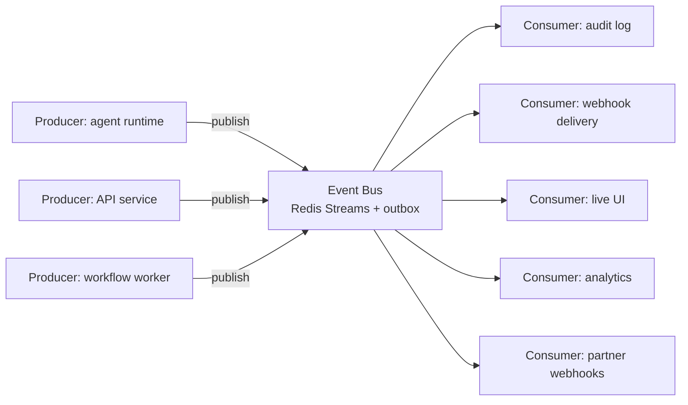
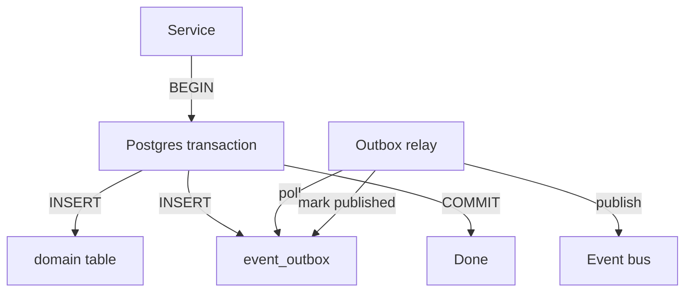
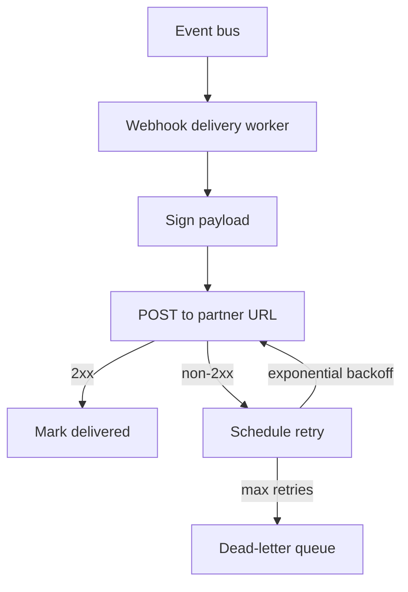
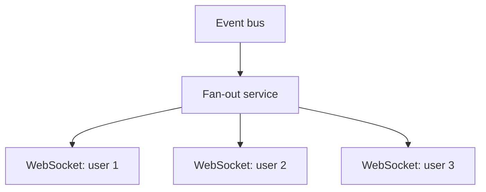

# NX-ARCH-0204 — Event System

| Field | Value |
|-------|-------|
| **Document ID** | NX-ARCH-0204 |
| **Title** | Event System |
| **Phase** | 7 — AI Infrastructure |
| **Owner** | Backend AI (NX-AGENT-7055) |
| **Status** | 🟢 Complete |
| **Version** | 0.1.0 |
| **Created** | 2026-07-02 |
| **Depends on** | NX-ARCH-0002, NX-ARCH-0201 (APIs), NX-ARCH-0203 (Database) |

---

## 1. Mission

Define the eventing substrate for NEXUS — the in-process bus, the external webhook delivery, and the pub/sub model — so events flow reliably from producers to consumers, are observable end-to-end, and never silently disappear.

## 2. Event taxonomy

NEXUS events fall into three categories:

| Category | Examples | Audience | Persistence |
|----------|----------|----------|-------------|
| **Domain events** | `agent.run.completed`, `workspace.created` | Internal services, webhooks, activity log | Persistent (Postgres + event store) |
| **System events** | `cloud_browser.idle`, `sync.completed` | Internal services, monitoring | Persistent |
| **UI events** | `notification.created`, `tab.opened` | User's connected clients (live) | Ephemeral (Redis pub/sub) |

Each event has an `NX-API-####` ID (per NX-ARCH-0201) and a documented schema.

## 3. The event bus



### 3.1 Redis Streams (H1)

The H1 event bus is **Redis Streams**. Rationale:

- Durable (append-only log).
- Consumer groups for fanout.
- Replayable from any point.
- Low operational overhead.
- Adequate for tens of millions of events per day.

### 3.2 Migration to a dedicated broker (H2+)

When Redis Streams becomes a bottleneck (typically > 100M events/day or strict ordering requirements), migrate to **NATS** or **Kafka**. The migration is API-compatible from the consumer side (events have a stable contract); only the producer side changes.

## 4. The outbox pattern

To guarantee no event is lost, every write to Postgres is paired with a write to an outbox table in the same transaction. A separate process tails the outbox and publishes to the bus.



The outbox relay:

- Polls every 100ms (configurable).
- Publishes in order within a partition.
- Retries on failure with exponential backoff.
- Marks events as published only after the bus acknowledges.
- Survives crashes (the outbox is the source of truth).

This pattern is critical for **at-least-once delivery** with no gaps.

## 5. Webhook delivery

External webhooks (per NX-ARCH-0201 §10) are delivered via a dedicated worker that consumes from the bus and posts to partner URLs.



### 5.1 Delivery guarantees

- **At-least-once.** The same event may be delivered more than once (partner must dedupe via the `event_id` header).
- **Ordered within a subscription.** No global ordering across subscriptions.
- **Retries with backoff.** 1s, 5s, 30s, 2m, 10m, 1h, 6h, 24h (8 attempts over ~31 hours).
- **Dead-letter queue.** After max retries, the event is moved to a DLQ; partner is notified; user can re-trigger manually.

### 5.2 Signing

Every webhook payload is signed:

```
X-Nexus-Signature: t=<unix_ts>,v1=<hex_hmac_sha256>
```

The signature is `HMAC-SHA256(secret, "${t}.${body}")`. The `t` prevents replay; NEXUS rejects webhooks with `t` more than 5 minutes off.

## 6. Live UI events

For real-time UI updates (notifications, agent progress, collaborative state), NEXUS uses **WebSocket fanout**.



The fan-out service:

- Subscribes to the bus.
- Filters events by recipient (user_id, workspace_id, channel).
- Pushes to the user's connected WebSocket clients.
- Maintains a presence list (who's online; what they're viewing).

This is the path for "another user just joined your workspace" or "your agent run completed" notifications.

## 7. Event schemas

Every event has a schema, version, and `NX-API-####` ID. Schemas are defined in a central registry and validated on the bus:

```typescript
// Example: NX-API-8301 (agent.run.completed)
interface AgentRunCompletedEvent {
  event_id: string;            // unique per delivery
  event_type: 'agent.run.completed';
  event_version: 1;
  occurred_at: string;          // ISO 8601
  workspace_id: string;
  user_id: string;
  agent_id: string;             // NX-AGENT-70##
  run_id: string;
  status: 'succeeded' | 'failed' | 'canceled';
  duration_ms: number;
  result?: any;                 // typed per agent
  error?: { code: string; message: string };
}
```

Schemas are versioned; consumers can request a specific version. The bus can hold multiple versions simultaneously during transitions.

## 8. Event sourcing (selective)

NEXUS does **not** use full event sourcing. The system of record is Postgres. However, for specific high-value domains, we keep a per-entity event log:

- **Agent runs** (every state change, every tool call) — for replay and debugging.
- **Workflow runs** — for audit and postmortem.
- **Billing events** — for reconciliation and disputes.
- **Cloud Browser lifecycle** — for cost attribution and incident analysis.

These are stored in the `audit_events` table (Postgres) and replicated to ClickHouse in H2 for analytics.

## 9. Observability

Every event:

- Has a trace ID (the originating request, if any).
- Is counted in metrics: `events.produced.count`, `events.consumed.count`, `events.delivered.count`, `events.failed.count`.
- Has a delivery latency metric: `events.delivery.duration_ms`.
- Is logged at `info` level (not `debug`) for at least 30 days.

The bus is itself a service with a health check. Outbox lag, consumer lag, and DLQ depth are all metric'd.

## 10. Security considerations

- **No PII in event payloads by default.** Sensitive data goes in the resource (which the event references by ID), not in the event itself.
- **Webhook secrets** are per-subscription, generated and shown once on creation, stored hashed.
- **Replay protection** via the `t` timestamp in the signature.
- **Encryption in transit** for all bus traffic (TLS for Redis Streams, mTLS for H2 broker).
- **Encryption at rest** for persistent event storage (ClickHouse in H2; Postgres now).
- **Access control**: only services in the NEXUS VPC can read the bus. The webhook delivery worker is the only public-facing component.

## 11. Performance budgets

- **End-to-end event latency** (producer → bus → consumer): p95 < 200ms.
- **Webhook delivery** (producer → partner URL): p95 < 5s.
- **Live UI event latency** (producer → user WebSocket): p95 < 500ms.
- **Outbox lag**: < 1s in steady state.
- **Consumer lag** (per consumer group): < 5s.

## 12. Failure modes

| Failure | Behavior |
|---------|----------|
| Bus unreachable | Producers buffer in the outbox; relay resumes when bus returns |
| Consumer crashes | Redis Streams consumer group rebalances; another consumer picks up |
| Partner URL down | Retries per §5.1; eventually DLQ |
| Outbox relay crashes | New relay instance picks up via Postgres advisory lock |
| Schema mismatch | Event is rejected at the boundary; producer is alerted |
| Replay storm | Rate-limited at the bus; user notified |

## 13. Open questions

- Q: When do we add a dedicated dead-letter inspection UI? (H2; for now, it's a Postgres table the user can query via SQL or a thin admin tool.)
- Q: Should we expose event subscriptions as a first-class API resource, or only as webhooks? (Both; webhooks are the simple form, subscriptions are the rich form with filtering.)
- Q: How do we handle cross-region event delivery for global deployments? (H2+; H1 is single-region.)

## 14. Reading list

- **Overview** — NX-ARCH-0002
- **API Surface** — NX-ARCH-0201
- **Database** — NX-ARCH-0203
- **Queues & Workflows** — NX-ARCH-0206
- **Storage** — NX-ARCH-0207
- **Backend AI Manifest** — NX-EM-9603
- **Memory Schema** — NX-AGENT-7010
- **Technical Principles** — NX-DOC-0011 (P6)

---

*End NX-ARCH-0204.*
