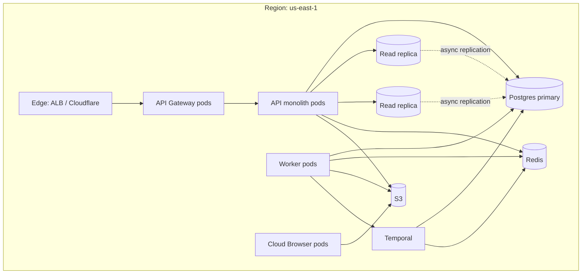

# NX-ARCH-0205 — Infrastructure

| Field | Value |
|-------|-------|
| **Document ID** | NX-ARCH-0205 |
| **Title** | Infrastructure |
| **Phase** | 7 — AI Infrastructure |
| **Owner** | Backend AI (NX-AGENT-7055) + DevOps AI (NX-AGENT-7060) |
| **Status** | 🟢 Complete |
| **Version** | 0.1.0 |
| **Created** | 2026-07-03 |
| **Depends on** | NX-ARCH-0002, NX-ARCH-0206 (Queues), NX-ARCH-0207 (Storage), NX-ARCH-0201 (APIs), NX-EM-9613 (DevOps AI) |

---

## 1. Mission

Define the runtime substrate on which every NEXUS service runs — compute, network, container orchestration, secrets, configuration, and multi-region topology — so services are portable across clouds, scale horizontally without redesign, and fail predictably.

## 2. Cloud philosophy

Per NX-DOC-0011 §5, H1 deploys on a single cloud (AWS or Fly.io, decided per region). H2+ adds a second cloud for resilience. NEXUS avoids cloud-specific services wherever possible:

- **Compute**: containers (Kubernetes) — not Lambda, Cloud Run, App Engine.
- **Database**: managed PostgreSQL with the standard wire protocol — not Aurora, not Spanner.
- **Object storage**: S3-compatible API — works on AWS, Cloudflare R2, MinIO, GCS (with adapter).
- **Cache**: standard Redis protocol — works on any provider.
- **Queue**: standard protocols (Redis, gRPC) — Temporal is multi-cloud.

This is the concrete instantiation of P14 (open formats) and the anti-pattern "Single-region single-cloud → vendor lock-in."

## 3. The container layer

Every NEXUS service runs as a container. Per NX-DOC-0011 §5, containerization is Docker; orchestration is Kubernetes (H2+). For H1, a subset of services runs on Fly.io's container platform for simpler ops, with the long-term path being K8s.

### 3.1 Base image

- **Language**: multi-stage Dockerfiles, distroless final image.
- **Base**: `gcr.io/distroless/nodejs20-debian12` for TypeScript; `gcr.io/distroless/cc-debian12` for Rust.
- **No shell** in the final image (distroless). No `apt`, no `curl`. Reduces attack surface.
- **Pinned base**: every image references a specific base image digest, not a tag. Reproducible builds.

### 3.2 Image registry

- **H1**: GitHub Container Registry (`ghcr.io/nexus/...`). No additional cost; integrated with CI.
- **H2+**: mirrored to a second registry (e.g., AWS ECR or self-hosted Harbor) for resilience.

### 3.3 Image signing

Every image is signed with **Cosign**. The signature is verified by the admission controller in Kubernetes before a pod is allowed to start. Unsigned images are rejected.

## 4. The compute platform

### 4.1 H1: Fly.io + small K8s

- **API monolith, workers, schedulers**: deployed on Fly.io's container platform. Apps are deployed via `fly deploy`; the platform handles TLS, regional placement, and rolling restarts.
- **Postgres, Redis, Temporal**: managed services on Fly.io or equivalent (e.g., Supabase, Upstash). All with TLS and private networking.
- **Why Fly.io for H1**: low ops burden, regions worldwide, simple pricing, fine for H1's scale.

### 4.2 H2+: Kubernetes

When scale demands, NEXUS migrates to Kubernetes. The migration is portable: the same Docker images run; the same Helm charts deploy. The K8s cluster runs on:

- **H2**: a single managed K8s (EKS, GKE, or AKS) per region.
- **H3+**: self-managed K8s on spot/preemptible nodes for cost.

K8s-specific concerns:

- **Cluster autoscaling** with Karpenter or cluster-autoscaler.
- **Pod disruption budgets** for safe rolling restarts.
- **Node pools** per workload type (general, memory-optimized for Memory Engine, GPU for local models).
- **Network policies** for service-to-service isolation.

### 4.3 Workload types

| Workload | Compute profile | Notes |
|----------|----------------|-------|
| **API monolith** | CPU-balanced, 1–4 vCPU, 2–8 GB RAM | Horizontally scaled; stateless |
| **Workers** | CPU-balanced, 1–4 vCPU, 2–8 GB RAM | Horizontally scaled; Temporal/BullMQ |
| **Schedulers** | CPU-balanced, 0.5–1 vCPU, 1 GB RAM | Lightweight; leader-elected |
| **Cloud Browser hosts** | CPU-optimized, 4–16 vCPU, 8–32 GB RAM, GPU optional | One pod per browser; see NX-ARCH-0101 |
| **Memory Engine** | Memory-optimized, 4–16 vCPU, 32–128 GB RAM | Hot embeddings |
| **Vector DB (Qdrant)** | Memory-optimized, 4–16 vCPU, 32–128 GB RAM | Indexes in memory |
| **Local model runtime** | GPU (H100/A100/M4), 16–80 GB VRAM | Per-user when active |

## 5. Networking

### 5.1 Edge

- **TLS termination** at the edge (managed by Fly.io or a cloud load balancer).
- **TLS 1.3 minimum**; HTTP/2 enabled; HTTP/3 (QUIC) for static assets.
- **WAF**: managed WAF (Cloudflare or AWS WAF) in front of the API.
- **DDoS protection**: provider-level (Cloudflare, AWS Shield).
- **Rate limiting**: at the edge (per IP) and at the gateway (per token) — see NX-ARCH-0201.

### 5.2 Service-to-service

- **East-west traffic** is encrypted (mTLS via Linkerd or Istio in H2; simple TLS in H1).
- **Service mesh** in H2+ for traffic shifting, retries, and observability.
- **Private networking**: services in the same VPC/region talk over private IPs. No public IPs on internal services.

### 5.3 WebSocket scaling

WebSocket connections (NX-ARCH-0201) are stateful and need a sticky load balancer. NEXUS uses:

- **H1**: Fly.io's built-in WebSocket support with session affinity.
- **H2+**: dedicated WebSocket gateway pods behind a TCP load balancer with consistent hashing by connection ID.

### 5.4 DNS

- **Primary**: Route 53 (AWS) or Cloudflare DNS.
- **Health checks** on the API endpoint; automatic failover to a healthy region.
- **DNSSEC** enabled.
- **CAA records** restrict CAs that can issue certs.

## 6. Configuration and secrets

### 6.1 Configuration

Configuration is **12-factor**: environment variables, never files. Three scopes:

| Scope | Source | Example |
|-------|--------|---------|
| **Build-time** | Dockerfile `ARG` | Image tag, commit SHA |
| **Deploy-time** | Helm values / Fly secrets | Database URL, region |
| **Runtime** | Env vars injected at pod start | Feature flags, log level |

A `config` service (TypeScript) loads, validates (with Zod), and exposes typed configuration to the rest of the code. Misconfiguration fails fast at startup.

### 6.2 Secrets

Secrets are stored in **HashiCorp Vault** (H2+) or **Fly secrets** (H1). The service:

- Authenticates to the secret store with a short-lived token (e.g., Kubernetes service account, Fly machine identity).
- Reads the secret on startup, not per request.
- Never logs secrets; never writes secrets to the database.
- Rotates automatically: every 90 days for DB passwords, every 30 days for API keys.

Secrets never appear in:

- Container images
- Logs
- Error reports
- Telemetry
- Git

## 7. Multi-region

### 7.1 H1: single region

H1 deploys in a single region (e.g., `us-east-1` or `iad` for Fly). Rationale:

- Lower ops complexity.
- Lower cost.
- Most user actions don't need global presence (browser, agent, Cloud Browser all live close to the user).
- Edge services (CDN, WebSocket) are regional; regional failover is H2.

### 7.2 H2+: active-active multi-region

When H2 ships, NEXUS deploys in at least 3 regions (e.g., US, EU, APAC) with:

- **Active-active** API tier (any region can serve any user; routing by user locale and latency).
- **Active-passive** database tier (Postgres primary + read replicas per region; writes go to primary).
- **Cloud Browser Fleet** is regional: a user's browsers live in the region they choose (per FR-1).
- **Data residency** is configurable per user/workspace: data can be pinned to a region (compliance).

Routing is by:

1. **Health** — route away from unhealthy regions.
2. **Latency** — route to the lowest-latency healthy region.
3. **Policy** — respect data-residency constraints.
4. **Capacity** — avoid overloading a single region.

### 7.3 Disaster recovery

- **RPO** (Recovery Point Objective): 5 minutes (Postgres WAL shipped to S3 continuously).
- **RTO** (Recovery Time Objective): 1 hour (restore from backup + replay WAL).
- **Backups**: Postgres base backups daily; WAL archived continuously. Tested monthly.
- **Game days**: quarterly DR drill in a non-prod environment.

## 8. Service mesh (H2+)

In H2, NEXUS adopts a service mesh (Linkerd is the current preference; Istio is an alternative). The mesh provides:

- **mTLS** between every service, automatic.
- **Retries** with backoff for transient failures.
- **Timeouts** per route.
- **Traffic shifting** for canary and blue-green.
- **Telemetry** (golden signals per service, automatically).

H1 skips the mesh for simplicity; mTLS is added at the application layer (H1 workers verify each other's certs manually).

## 9. The cluster layout (H2+)

Each region is a self-contained unit. Cross-region traffic is for replication only, not for serving (except for explicit cross-region failover).

## 10. Cost posture

Per NX-DOC-0011 P12, cost is a first-class concern. NEXUS tracks:

- **Cost per active user** (target: < $0.50/month at H1 scale).
- **Cost per agent run** (target: < $0.05 average).
- **Cost per Cloud Browser hour** (target: < $0.05 idle, < $0.10 active — per NFR-5).
- **Database cost** as a % of revenue (target: < 15%).
- **Bandwidth cost** (egress is the silent killer; cached aggressively).

Cost dashboards are part of the standard observability stack. Alerts fire when burn rate exceeds the monthly budget's daily run-rate.

## 11. Observability (infrastructure-level)

In addition to the application-level observability in NX-ARCH-0206, the infrastructure layer emits:

- **Cluster metrics**: node CPU/memory/disk, pod count, restart count.
- **Network metrics**: bytes in/out per service, p99 latency, error rate.
- **DNS metrics**: query rate, NXDOMAIN rate, response time.
- **TLS metrics**: cert expiry, handshake errors, OCSP failures.
- **Secret store metrics**: secret fetch latency, rotation success rate.

These flow into the same Prometheus/Grafana stack. Dashboards are templated per service.

## 12. Security at the infrastructure layer

- **No public IPs on internal services.**
- **Security groups / NetworkPolicies** deny by default; explicit allow per service-to-service flow.
- **Bastion / SSH** via IAP (Identity-Aware Proxy) or Tailscale. No public SSH.
- **Patch SLA**: critical CVEs patched within 24h; high within 7 days; medium within 30 days.
- **Image scanning**: every push scanned by Trivy; high/critical findings block deployment.
- **Runtime security**: Falco (or equivalent) detects anomalous syscalls (e.g., unexpected outbound connections from a pod).

## 13. Failure modes

| Failure | Behavior |
|---------|----------|
| Region outage (H1) | Service unavailable until region returns; status page updated |
| Region outage (H2+) | Edge routes to other healthy regions; data-loss window bounded by RPO |
| Worker node failure | Kubernetes reschedules pods; in-flight work resumes from last checkpoint (Temporal) |
| Database primary failure | Replica promoted; ~30s of writes lost (RPO) |
| S3 / object store outage | Reads/writes fail; service degrades (no images, no agent attachments) |
| Secret store outage | Service starts fail; existing services continue with cached secrets (TTL-bounded) |
| TLS cert expiry | Auto-renewal via cert-manager; alert 14 days before expiry |
| Network partition | Service mesh detects; affected services degrade; status page updated |
| Resource exhaustion (OOM, CPU throttling) | Pod killed; new pod scheduled; alerts fire |

## 14. Open questions

- Q: AWS vs. Fly.io for H1 — final decision per region. (Tracking in NX-FEAT-9000 once Phase 9 starts.)
- Q: Karpenter vs. cluster-autoscaler for H2+? (Karpenter is the current preference; revisit at H2 planning.)
- Q: Do we run our own Temporal cluster, or use Temporal Cloud? (Cloud for H1; self-hosted for H2 if cost-effective.)
- Q: Service mesh: Linkerd vs. Istio vs. none? (Linkerd preferred for simplicity; will be re-evaluated at H2.)

## 15. Reading list

- **Overview** — NX-ARCH-0002
- **API Surface** — NX-ARCH-0201
- **Database** — NX-ARCH-0203
- **Event System** — NX-ARCH-0204
- **Queues & Workflows** — NX-ARCH-0206
- **Storage** — NX-ARCH-0207
- **Browser Architecture Overview** — NX-ARCH-0001
- **Cloud Browser Fleet anchor** — NX-FEAT-1600
- **Backend AI Manifest** — NX-EM-9603
- **DevOps AI Manifest** — NX-EM-9613
- **Security AI Manifest** — NX-EM-9605
- **Technical Principles** — NX-DOC-0011 (P1, P12, P14)

---

*End NX-ARCH-0205.*
