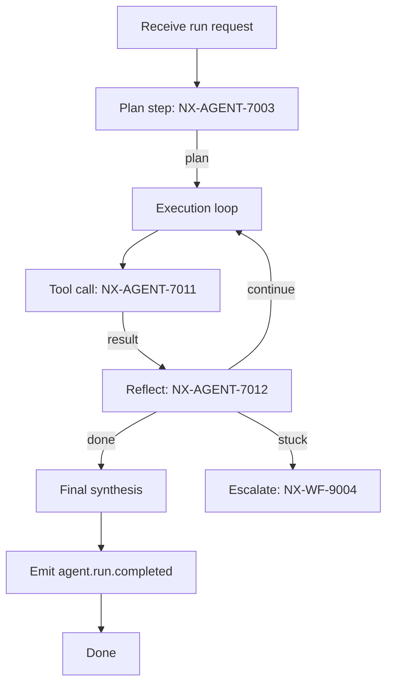
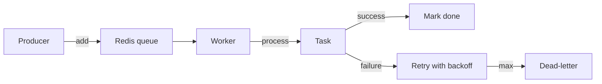
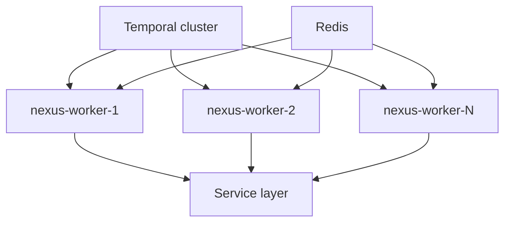

# NX-ARCH-0206 — Queues & Workflows

| Field | Value |
|-------|-------|
| **Document ID** | NX-ARCH-0206 |
| **Title** | Queues & Workflows |
| **Phase** | 7 — AI Infrastructure |
| **Owner** | Backend AI (NX-AGENT-7055) + AI Platform AI (NX-AGENT-7057) |
| **Status** | 🟢 Complete |
| **Version** | 0.1.0 |
| **Created** | 2026-07-03 |
| **Depends on** | NX-ARCH-0002, NX-ARCH-0201 (APIs), NX-ARCH-0203 (Database), NX-ARCH-0204 (Event System), NX-AGENT-7003 (Planner), NX-AGENT-7013 (Agent Lifecycle), NX-FEAT-1600 (Cloud Browser Fleet) |

---

## 1. Mission

Define NEXUS's asynchronous substrate — the durable workflows, scheduled tasks, and short-lived job queues — so any work that can be interrupted, retried, slept, paused, or run longer than 30 seconds has a well-defined execution model, survives crashes, and is observable end-to-end.

## 2. The two patterns: workflows vs. jobs

NEXUS distinguishes two asynchronous patterns, and the choice is a deliberate design call.

| Pattern | Lifetime | Examples | Tech | When to use |
|---------|----------|----------|------|-------------|
| **Workflow** | Minutes to days | "Run agent on Cloud Browser every hour", "Onboard a new user end-to-end", "Index user's Memory in background" | **Temporal** | Anything stateful, multi-step, must survive crashes |
| **Job** | Seconds to minutes | "Send a transactional email", "Render a thumbnail", "Reprocess a webhook" | **Redis BullMQ** | Fire-and-forget, single-step, no long state |

The boundary is exactly: **if it has more than one step, or its state matters across a crash, it is a workflow.** Everything else is a job.

This is the concrete answer to the Cloud Browser Fleet anchor's FR-8 (scheduled tasks) and §10 (Agent Orchestrator for executing scheduled workflows) — every scheduled task is a Temporal workflow.

## 3. Why Temporal (H1)

Per NX-DOC-0011 §5, the durable workflow engine is Temporal. Rationale:

- **Durable execution**: workflows resume from the last successful step after any crash.
- **Versioning**: workflow definitions can be versioned; in-flight runs use the version they started with.
- **Signals & queries**: external systems can inject events or query state of running workflows.
- **Schedules**: cron-like schedules are first-class.
- **Batteries-included observability**: every workflow has a full event history.
- **TypeScript SDK**: native fit for the Node-based backend (NX-DOC-0011 §5).

Alternatives considered and rejected:

- **AWS Step Functions** — vendor lock-in, limited SDK ergonomics, weak TypeScript story. (Violates P14.)
- **Home-grown state machine** — would require us to reimplement signals, retries, and history. (Violates P1 — boring where possible.)
- **LangGraph** — fits single-agent orchestration but is not a general durable execution engine. Used for in-agent planning, not for backend workflows.

## 4. Workflow taxonomy

NEXUS defines four workflow families. Each is a `NX-WF-####` ID space (covered in Phase 5 and Phase 9, cross-referenced here).

| Family | Description | Typical duration | Example |
|--------|-------------|-----------------|---------|
| **Cloud browser workflows** | Lifecycle of a Cloud Browser (provision, idle, resume, snapshot, destroy) | Hours to days | `CBLifecycleWorkflow` |
| **Agent workflows** | A full agent run from plan to completion, including all tool calls and checkpoints | Seconds to hours | `AgentRunWorkflow` |
| **User workflows** | User-defined multi-step automations (Visual Workflow Builder output) | Minutes to days | `UserWorkflow_<id>` |
| **System workflows** | Backend jobs that need durability (indexing, billing reconciliation, audit log archival) | Minutes to hours | `MemoryIndexWorkflow`, `BillingReconcileWorkflow` |

Every workflow has a name, an input schema, an output schema, a versioning strategy, and a documented retry policy. Workflows are registered in a central catalog (`workflows/catalog.ts`) and their types live in a single repo (`@nexus/workflows`).

## 5. The agent workflow

The agent workflow is the most important. It is the spine of every agent run — local or cloud.



Key properties:

- **Durable**: every state transition is checkpointed. A crash at any point resumes from the last checkpoint.
- **Cancellable**: the user can cancel; cancellation propagates to in-flight tool calls.
- **Pausable**: long-running steps (e.g., waiting for a Cloud Browser) are waits, not blocks. The worker is free to do other work.
- **Observable**: the workflow's event history is queryable via API; the UI can show a live timeline.
- **Bounded**: timeouts and activity-heartbeat checks prevent zombie workflows.

The full agent lifecycle is in NX-AGENT-7013; this doc is the queue/wrapper side.

## 6. Schedules

Temporal schedules are how NEXUS implements cron-like behavior (FR-8 of Cloud Browser Fleet, plus many others). A schedule is a registered workflow with a cron expression.

```typescript
// Example: scheduled cloud browser task
const handle = await client.workflow.startSchedule('CBRunSchedule', {
  workflowId: `cb-${browserId}-${taskId}`,
  scheduleId: `cb-${browserId}-${taskId}`,
  cronExpression: '0 * * * *', // every hour
  args: [{ browserId, taskId, agent: 'linkedin-outreach' }],
  timezone: 'America/Los_Angeles',
  policies: {
    overlap: 'SKIP',           // don't run if previous is still running
    catchupWindow: '1h',
  },
});
```

Properties:

- **Overlap policies**: `SKIP` (default for most user tasks), `BUFFER_ONE` (queues one), `BUFFER_ALL`, `CANCEL_OTHER` (cancels in-flight, runs new).
- **Timezone-aware**: schedules respect the user's timezone (per FR-8).
- **Catch-up window**: missed runs within the window are backfilled; older are dropped.
- **Misfire policy**: configurable per schedule.
- **Pause/resume**: users can pause schedules; the schedule resumes from the next cron tick.

Schedule metadata is mirrored in Postgres (`schedules` table) for UI listing; Temporal is the source of truth for firing.

## 7. Jobs (BullMQ)

For non-workflow async work, NEXUS uses **BullMQ** on Redis. BullMQ is fast, simple, and a good fit for the H1 scale.



Job categories (H1):

| Queue | Purpose | Retries | Timeout |
|-------|---------|---------|---------|
| `email` | Transactional email | 5 | 30s |
| `webhook-delivery` | Outbound webhook POSTs | 8 | 30s |
| `thumbnail` | Image rendering | 3 | 60s |
| `transcription` | Audio/video transcription | 2 | 10m |
| `indexing` | Search index updates | 3 | 5m |
| `notifications` | Push notifications | 5 | 15s |
| `cleanup` | Background cleanup (sessions, logs) | 2 | 5m |

Each queue has:

- **Retry policy**: exponential backoff with jitter; max attempts per the table.
- **Concurrency limit**: per worker (default 10; per-queue override).
- **Rate limit**: per worker (e.g., `email` is limited by the upstream provider).
- **DLQ**: dead-letter queue in Redis; inspectable via admin tool.
- **Observability**: queue depth, processing time, failure count, all in metrics.

If we outgrow BullMQ (typically > 1M jobs/day or strict ordering across jobs), we migrate to a dedicated queue (NATS or Kafka) using the same producer/consumer abstraction.

## 8. Worker fleet

NEXUS runs a worker fleet that consumes both Temporal workflows and BullMQ jobs.



Properties:

- **Horizontal scaling**: workers are stateless; add more pods to scale.
- **Task routing**: each worker advertises which workflow/job types it handles; Temporal routes accordingly.
- **Graceful shutdown**: workers drain in-flight tasks before exiting (SIGTERM → finish current → exit).
- **Heartbeating**: long activities heartbeat to Temporal; missed heartbeats trigger timeouts.
- **Resource limits**: per-worker CPU/memory limits enforced by Kubernetes (NX-ARCH-0205).

The worker fleet is deployed alongside the API monolith (NX-ARCH-0002 §5) as the second of three top-level services.

## 9. Idempotency

Per NX-DOC-0011 P9, every workflow and every job is idempotent. Specifically:

- **Workflows**: the workflow ID is deterministic from inputs; re-running with the same ID is a no-op.
- **Jobs**: every job has an `idempotency_key`; the worker checks the key in Redis before processing. Duplicates are skipped.
- **Activities**: every activity checks whether its side effect has already happened (e.g., "has this email been sent?" via the `email_id` in the email provider's API).

This is what makes "at-least-once delivery" safe — even if the bus redelivers, the work is done exactly once.

## 10. Observability

Per NX-DOC-0011 P6, every workflow and job is observable.

- **Temporal UI**: built-in UI for workflow history, schedules, and DLQ. Exposed to admins.
- **Metrics**:
  - `workflows.started.count`
  - `workflows.completed.count` (by status)
  - `workflows.duration_ms` (histogram)
  - `workflows.in_flight` (gauge)
  - `jobs.queue_depth` (per queue)
  - `jobs.processing.duration_ms` (histogram)
  - `jobs.dlq.depth` (per queue)
- **Traces**: every workflow has a trace ID; every activity is a span. Spans include workflow ID, run ID, attempt number.
- **Logs**: structured JSON, includes workflow ID, run ID, attempt. INFO level for state transitions, DEBUG for activity internals (sampled).
- **Alerts**:
  - DLQ depth > threshold
  - Workflow stuck > N minutes
  - Worker heartbeat lost
  - Queue depth growing for > 10 minutes

## 11. Security

- **No secrets in workflow inputs/outputs** — secrets are referenced by ID and resolved at activity time from the secret store (NX-ARCH-0202 §Secrets).
- **Worker isolation**: workers run in a separate Kubernetes namespace with strict NetworkPolicies; they can only talk to the data stores they need.
- **Code-signed workflows**: the `@nexus/workflows` package is built and signed in CI; only signed artifacts are deployed.
- **Tenant boundaries**: workflows carry a `tenant_id`; activities enforce it. Cross-tenant access requires an explicit override logged as a security event.
- **PII handling**: workflows that touch PII emit a `workflow.touched_pii` event; the audit log (NX-ARCH-0204 §8) captures it.

## 12. Performance budgets

- **Workflow start latency** (API request → workflow started): p95 < 500ms.
- **Activity heartbeat cadence**: 30s default (configurable per activity).
- **Worker poll latency** (job available → worker picks up): p95 < 100ms.
- **Schedule firing accuracy**: within 1 minute of target time (per FR-8 NFR).
- **End-to-end queue throughput**: ≥ 10,000 jobs/minute sustained.
- **Workflow throughput**: ≥ 1,000 concurrent active workflows per worker pod.

## 13. Failure modes

| Failure | Behavior |
|---------|----------|
| Worker crash | Temporal reassigns workflow/activity to another worker; resumes from last checkpoint |
| Temporal cluster outage | Workflows are blocked; once cluster returns, executions continue. Buffer jobs in Redis if Redis is still up |
| Redis outage | BullMQ is paused; workflows continue (they don't depend on Redis); jobs queue in memory and spill to disk on workers |
| Workflow exceeds timeout | Temporal cancels; status set to `TIMED_OUT`; user is notified |
| Activity throws non-retryable error | Workflow fails fast; no retries; user is notified |
| Activity throws retryable error | Backoff and retry; max attempts per policy; DLQ after |
| Schedule missed (worker down at fire time) | Temporal's catchup window backfills; older runs are dropped with notification |
| Dead-letter accumulation | Alerted; manual re-drive via admin tool or auto-cleanup policy |

## 14. Open questions

- Q: Do we want per-tenant Temporal namespaces from H1, or shared? (Decision: shared H1, per-tenant H2 for enterprise.)
- Q: Should schedules be discoverable in the public API for partner integrations, or only internally? (Decision: internal in H1, public read-only in H2.)
- Q: When do we add a workflow versioning strategy for hot-swapping logic on in-flight runs? (Decision: workflow code versioning from H1; full hot-swap is a Temporal feature we'll enable H2.)

## 15. Reading list

- **Overview** — NX-ARCH-0002
- **API Surface** — NX-ARCH-0201
- **Database** — NX-ARCH-0203
- **Event System** — NX-ARCH-0204
- **Infrastructure** — NX-ARCH-0205
- **Storage** — NX-ARCH-0207
- **Agent Contract** — NX-AGENT-7001
- **Planner Agent** — NX-AGENT-7003
- **Agent Lifecycle** — NX-AGENT-7013
- **Multi-Agent Composition** — NX-AGENT-7014
- **Cloud Browser Fleet anchor** — NX-FEAT-1600
- **Backend AI Manifest** — NX-EM-9603
- **AI Platform AI Manifest** — NX-EM-9612
- **Technical Principles** — NX-DOC-0011 (P1, P6, P9)

---

*End NX-ARCH-0206.*
