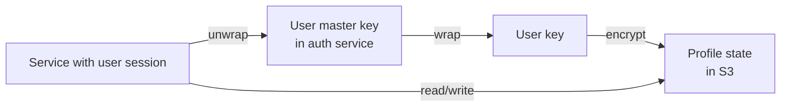

# NX-ARCH-0207 — Storage

| Field | Value |
|-------|-------|
| **Document ID** | NX-ARCH-0207 |
| **Title** | Storage |
| **Phase** | 7 — AI Infrastructure |
| **Owner** | Backend AI (NX-AGENT-7055) + Security AI (NX-AGENT-7058) |
| **Status** | 🟢 Complete |
| **Version** | 0.1.0 |
| **Created** | 2026-07-03 |
| **Depends on** | NX-ARCH-0002, NX-ARCH-0203 (Database), NX-ARCH-0202 (Auth), NX-FEAT-1600 (Cloud Browser Fleet) |

---

## 1. Mission

Define NEXUS's object and file storage layer — what goes in object storage, how it's organized, encrypted, served, and lifecycle-managed — so files (downloads, snapshots, attachments, exports, uploads) are durable, fast to retrieve, cheap at scale, and safe to hold.

## 2. The two layers

NEXUS uses two storage technologies, each for a clear purpose.

| Layer | Tech | Purpose | Examples |
|-------|------|---------|----------|
| **Object storage** | S3-compatible (R2 / S3 / MinIO) | Files, blobs, large unstructured data | Browser downloads, agent attachments, Cloud Browser snapshots, profile backups, exports |
| **Database blobs** | PostgreSQL `bytea` + `large_objects` | Small binary data tied to a row | Avatar images (≤ 256 KB), inline thumbnails, small JSON |
| **CDN cache** | CloudFront / Cloudflare / Bunny | Hot content close to users | Public assets, generated images, exported PDFs |

Postgres is appropriate for small blobs (≤ 1 MB) that are always retrieved with a row. S3 is appropriate for anything larger, anything that has its own URL, or anything that needs a CDN in front of it.

This document covers **object storage**. Postgres BLOB usage is in NX-ARCH-0203.

## 3. Bucket layout

Object storage is organized as one bucket per environment, with prefixes for content type.

```
s3://nexus-prod/
├── users/
│   └── {user_id}/
│       ├── avatar.jpg
│       ├── exports/
│       │   └── {export_id}.zip
│       └── attachments/
│           └── {attachment_id}/{filename}
├── workspaces/
│   └── {workspace_id}/
│       ├── shared/
│       └── assets/
├── cloud-browsers/
│   └── {browser_id}/
│       ├── profile/
│       │   ├── cookies.sqlite
│       │   ├── storage.tar
│       │   └── history.json
│       ├── snapshots/
│       │   └── {snapshot_id}/
│       │       ├── full.tar.zst
│       │       └── manifest.json
│       ├── downloads/
│       │   └── {download_id}/{filename}
│       └── recordings/
│           └── {recording_id}.webm
├── agents/
│   └── {agent_id}/
│       ├── artifacts/
│       └── logs/
├── workflows/
│   └── {workflow_id}/
│       └── runs/{run_id}/
├── marketplace/
│   ├── agents/{agent_id}/icon.png
│   ├── agents/{agent_id}/banner.jpg
│   └── plugins/{plugin_id}/...
└── telemetry/
    ├── traces/{date}/{trace_id}.json
    └── audit/{date}/{audit_id}.json
```

Properties:

- **One bucket per environment**: dev, staging, prod are separate. No cross-environment access.
- **One bucket per region** (H2+): data residency is per-prefix within a regional bucket.
- **Prefixes by resource type**: enables per-prefix IAM policies and lifecycle rules.
- **Object keys are immutable**: an object at a key is never modified in place; new versions get a new key (or versioning is enabled, see §6).

## 4. Naming and addressing

- **Keys** are namespaced by resource type and ID. The full key is the canonical address.
- **Content-addressed blobs** use SHA-256 of content: `blobs/{sha256}` (deduplication across the system).
- **Public URLs** are only generated for explicitly-public content (marketplace icons, exported public reports). Everything else uses signed URLs (see §7).
- **Object IDs** are ULIDs (sortable, URL-safe, unique).

```typescript
// Key generation
const userAvatarKey = (userId: string, hash: string) =>
  `users/${userId}/avatar.${hash.slice(0, 2)}/${hash.slice(2)}`;

const cloudBrowserSnapshotKey = (browserId: string, snapshotId: string) =>
  `cloud-browsers/${browserId}/snapshots/${snapshotId}/full.tar.zst`;
```

## 5. Upload and download paths

### 5.1 Upload (user → S3)

For files > 5 MB, NEXUS uses **presigned URLs** to upload directly from the client to S3 (the file never traverses the API). For files ≤ 5 MB, the API can accept the body directly.

```mermaid
sequenceDiagram
    participant C as Client
    participant API as API
    participant S3 as S3
    C->>API: POST /v1/uploads (filename, size, content_type)
    API->>API: Validate; generate object key; create upload session
    API->>S3: Presign PUT URL
    API-->>C: { upload_url, object_key, expires_at }
    C->>S3: PUT upload_url (binary body)
    C->>API: POST /v1/uploads/{upload_id}/complete (sha256)
    API->>S3: HEAD object (verify exists + size + hash)
    API->>DB: INSERT file row (refs object_key)
    API-->>C: 200 OK { file_id, url }
```

For very large files (> 5 GB), NEXUS uses **multipart upload** with presigned URLs per part.

### 5.2 Download (S3 → user)

For public content, a CDN URL is returned. For private content, a **presigned GET URL** is generated with a short expiry (default 5 minutes, max 1 hour). Long-lived access is via a proxy endpoint that re-signs.

```mermaid
sequenceDiagram
    participant C as Client
    participant API as API
    participant S3 as S3
    C->>API: GET /v1/files/{file_id}/download
    API->>DB: Lookup file; check permission
    API->>S3: Presign GET URL
    API-->>C: { url, expires_at }
    C->>S3: GET url
    S3-->>C: File body
```

### 5.3 Server-side copy

For internal operations (e.g., duplicating a Cloud Browser from a snapshot, copying a marketplace agent's assets to a user's install), NEXUS uses server-side `COPY` rather than download-and-reupload. This is fast and bandwidth-free.

## 6. Versioning and immutability

### 6.1 Versioning for critical prefixes

Versioning is enabled for these prefixes:

- `cloud-browsers/{id}/profile/` — every profile state save is a new version.
- `cloud-browsers/{id}/snapshots/` — snapshots are immutable; "delete" is a soft-delete.
- `agents/{id}/artifacts/` — agent artifacts are versioned.
- `marketplace/agents/{id}/` — every published version is a new S3 version.

Versioning is disabled for:

- `telemetry/` — write-once, read-rarely; lifecycle moves to cold storage.
- `cloud-browsers/{id}/downloads/` — user-downloaded content; not critical to keep history.

### 6.2 Object Lock for compliance

For prefixes that need tamper-evidence (audit logs, billing records, legal holds), NEXUS uses **S3 Object Lock** in compliance mode. Once written, these objects cannot be deleted or overwritten for the retention period (default 7 years for audit).

## 7. Access control

### 7.1 IAM model

- **NEXUS service account** has `s3:GetObject`, `s3:PutObject`, `s3:DeleteObject` (for non-versioned prefixes) on the production bucket.
- **Per-prefix policies** restrict the service account: it cannot delete versioned or locked objects.
- **Partner / read-only** access uses separate IAM users with explicit allowlists.
- **Cross-account access** (e.g., CDN) uses bucket policies with explicit source IPs.

### 7.2 Presigned URLs

- **PUT URLs** (uploads): default 15-minute expiry; max 1 hour. Scoped to a single key and content-type.
- **GET URLs** (downloads): default 5-minute expiry; max 1 hour.
- **POST URLs** (multipart): per-part URLs with the same constraints.
- **CORS**: only the NEXUS app domains can call presigned URLs.

### 7.3 Application-layer authz

Presigned URLs are scoped to an object; they don't carry user identity. Every application-layer fetch (via the API) still goes through the auth/permission check in NX-ARCH-0202. The presigned URL only authorizes the **transport**; it does not authorize **the user**.

## 8. Encryption

### 8.1 Encryption at rest

- **S3-managed keys (SSE-S3)** for non-sensitive content.
- **Customer-managed keys (SSE-KMS)** for sensitive content (Cloud Browser profile state, agent secrets, audit logs).
- **Client-side encryption** is not used in H1 (added in H2 for enterprise tier).

### 8.2 Encryption in transit

- **TLS 1.3** for all S3 API calls.
- **TLS 1.3** for all presigned URL transfers.
- **HSTS** on the API domain; the CDN enforces HTTPS-only.

### 8.3 Per-user encryption (Cloud Browser profile state)

Cloud Browser profile state (cookies, local storage, IndexedDB) is encrypted **per user** with a user-derived key. The key is wrapped by the user's master key (which never leaves the auth service). NEXUS staff cannot decrypt a user's profile state without the user's active session.



This is the answer to NFR-3 of NX-FEAT-1600 ("per-user encryption of stored state").

## 9. Lifecycle and tiering

Object storage is tiered by access pattern.

| Tier | Storage class | Use | Cost (relative) |
|------|---------------|-----|-----------------|
| **Hot** | Standard | Active content (last 30 days) | 1× |
| **Warm** | Standard-IA (Infrequent Access) | 30–90 days | ~0.5× |
| **Cold** | Glacier Instant Retrieval | 90 days – 1 year | ~0.2× |
| **Archive** | Glacier Deep Archive | > 1 year; legal hold | ~0.05× |

Lifecycle rules per prefix:

- `cloud-browsers/{id}/downloads/`: hot 7 days → warm 30 days → cold 90 days → delete at 1 year (configurable per user).
- `cloud-browsers/{id}/snapshots/`: hot forever (user-controlled retention).
- `cloud-browsers/{id}/profile/`: hot 30 days → warm indefinite.
- `telemetry/`: hot 7 days → warm 30 → cold 90 → archive 1 year → delete 2 years.
- `marketplace/agents/{id}/`: hot forever.
- `users/{id}/exports/`: hot 7 days (user downloads within a week) → delete at 30 days.

Lifecycle rules are user-overridable in H2 (a user can pin a download to "never expire" for a small fee).

## 10. Replication

### 10.1 H1: single region

H1 deploys in one region; no cross-region replication. Backups are cross-region (daily snapshot to a second region for DR).

### 10.2 H2+: cross-region

For data residency and DR, H2+ replicates prefixes to other regions:

- `cloud-browsers/`: pinned to the user's chosen region (no replication).
- `users/`, `workspaces/`: replicated to all regions the user is active in.
- `marketplace/`: replicated to all regions (read-mostly).
- `telemetry/`: replicated to the analytics region.

Replication is **async**, with a 5-minute lag. Strongly-consistent cross-region reads are not provided in H1 (added in H2 for compliance tier).

## 11. Specific workloads

### 11.1 Cloud Browser snapshots

Per FR-10 of NX-FEAT-1600, snapshots capture the full browser state.

- **Format**: Zstandard-compressed tarball (`full.tar.zst`) plus a `manifest.json` with the file list and SHA-256 of each file.
- **Size**: 50 MB – 5 GB typical; can be 20 GB for a heavy user.
- **Encryption**: per-user encryption (see §8.3).
- **Storage**: hot tier; user-pinned.
- **Restore**: download to a fresh Cloud Browser pod, extract, mount, verify hashes.
- **Deduplication**: block-level dedup (using Zstandard's `--long` mode) within a user's snapshots; cross-user dedup is not done in H1 (privacy implications).

### 11.2 Browser downloads

Per NX-ARCH-0106 (Download Manager), browser downloads are stored per user, with:

- A row in Postgres referencing the S3 key.
- A presigned GET URL for the user to download.
- A "save to my cloud" option that persists the file across devices.
- Optional virus scan (ClamAV) on upload (H2 for downloads; H1 for attachments only).

### 11.3 Agent attachments

When an agent attaches a file to its output (e.g., a generated report, a screenshot, a CSV export), the file goes to `agents/{agent_id}/artifacts/{run_id}/`. The agent run row references the artifact; the user-facing UI shows a download link (presigned GET).

### 11.4 Marketplace assets

Agent icons, banners, and sample media are stored in `marketplace/agents/`. These are public, CDN-cached, and immutable per version.

### 11.5 Telemetry and audit

Traces, logs, and audit events are batched and uploaded to `telemetry/`. The full event body is in S3; only the searchable index lives in Postgres/ClickHouse. This keeps the database small and the audit log durable.

## 12. Observability

- **Bucket-level metrics**: requests, bytes in/out, errors, 4xx/5xx counts.
- **Per-prefix metrics**: same, broken down by prefix.
- **Lifecycle metrics**: transitions between tiers, deletions.
- **Latency**: upload/download latency from the API's perspective.
- **Alerts**:
  - Sudden spike in 5xx (storage backend issue).
  - Sudden spike in size (potential runaway upload).
  - Lifecycle transition failures.
  - Cross-region replication lag > 10 minutes.

## 13. Security

- **Bucket policies**: deny all by default; explicit allow only.
- **Public access blocks**: enabled on every bucket.
- **Server access logs**: enabled, written to a separate log bucket.
- **Object-level audit**: every read/write/delete of an object is logged (who, what, when) for compliance.
- **Per-prefix policies**: separate IAM roles per resource type (users vs. cloud-browsers vs. agents). Compromise of one role doesn't affect others.
- **Encryption rotation**: per-user master keys are rotated annually; old key versions remain decryptable for the retention period.

## 14. Failure modes

| Failure | Behavior |
|---------|----------|
| S3 region outage (H1) | Uploads/downloads fail; service degrades; status page updated |
| S3 region outage (H2+) | Read traffic shifts to replicated region; writes fail or buffer |
| Presigned URL misuse | The key isn't authorized; S3 returns 403; logged as suspicious |
| Object corruption (bit rot) | Detected by SHA-256 on read; restore from backup or version |
| Lifecycle transition failure | Retry with backoff; alert if persistent |
| Cross-region replication lag | Reads may serve stale data; UI shows version timestamp |
| KMS key disabled | Decryption fails; service cannot read encrypted content; emergency rotation |
| Quota / spend limit | Hard cap at the bucket level; alerts before; rejections after |

## 15. Open questions

- Q: Do we add client-side encryption for the enterprise tier in H1, or defer to H2? (Likely defer; KMS-side per-user keys cover the H1 threat model.)
- Q: Block-level dedup across users — privacy implications need a decision. (Likely: per-user dedup only, with the option for enterprise to opt out for compliance.)
- Q: Virus scanning: should H1 downloads get scanned, or only attachments? (Decision: attachments in H1; downloads in H2.)

## 16. Reading list

- **Overview** — NX-ARCH-0002
- **API Surface** — NX-ARCH-0201
- **Database** — NX-ARCH-0203
- **Event System** — NX-ARCH-0204
- **Queues & Workflows** — NX-ARCH-0206
- **Infrastructure** — NX-ARCH-0205
- **Authentication** — NX-ARCH-0202
- **Browser Architecture Overview** — NX-ARCH-0001
- **Download Manager** — NX-ARCH-0106
- **Cloud Browser Fleet anchor** — NX-FEAT-1600
- **Backend AI Manifest** — NX-EM-9603
- **Security AI Manifest** — NX-EM-9605
- **Technical Principles** — NX-DOC-0011 (P7, P12, P13, P14)

---

*End NX-ARCH-0207.*
