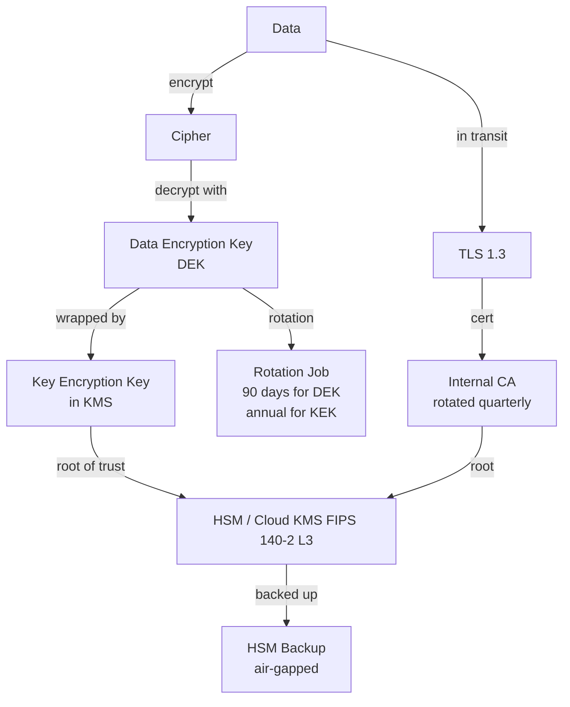

# NX-ARCH-0705 — Encryption (at Rest & in Transit)

| Field | Value |
|-------|-------|
| **Document ID** | NX-ARCH-0705 |
| **Title** | Encryption (at Rest & in Transit) |
| **Phase** | 8 — Marketplace |
| **Owner** | Security AI (NX-AGENT-7058) + DevOps AI (NX-AGENT-7060) |
| **Status** | 🟢 Complete |
| **Version** | 0.1.0 |
| **Created** | 2026-07-03 |
| **Depends on** | NX-ARCH-0004, NX-ARCH-0701 (Threat Model), NX-ARCH-0704 (Privacy), NX-ARCH-0202 (Auth), NX-ARCH-0207 (Storage) |

---

## 1. Mission

Define the encryption posture of NEXUS: the algorithms, key lengths, key-management architecture, rotation policy, and operational practices for data at rest and data in transit — and the human and machine controls that keep the keys safe from compromise. Encryption is the **last line of defense**; the rest of the security model (auth, permissions, zero trust) is the first.



| Concept | Definition |
|---------|------------|
| **At rest** | Data persisted to disk, SSD, or object storage |
| **In transit** | Data moving over a network (LAN, WAN, internet) |
| **In use** | Data in CPU/registers; protected by memory-safe runtimes and enclaves (NX-ARCH-0205) |
| **DEK** | Data Encryption Key — encrypts the data |
| **KEK** | Key Encryption Key — encrypts the DEK |
| **HSM** | Hardware Security Module — physical tamper-resistant device for key storage and crypto operations |
| **Envelope encryption** | Encrypt data with a DEK; encrypt the DEK with a KEK in the HSM |
| **mTLS** | Mutual TLS — both client and server present certificates |
| **Perfect forward secrecy (PFS)** | A session key compromise cannot decrypt past sessions |

## 2. Threat model recap

The encryption posture defends against (from NX-ARCH-0701):

| Adversary | Defense |
|-----------|---------|
| **Disk theft** | Disk-level encryption (LUKS / cloud-provider default) |
| **Database snapshot leak** | Application-level encryption with per-row keys for sensitive fields |
| **Backup theft** | Backup encryption; backups stored in a separate account with no human access |
| **Network eavesdropping** | TLS 1.3 everywhere; mTLS for service-to-service |
| **Compromised CA** | Internal CA is short-lived (24h), rotated quarterly; CT-log monitored; pinning on critical paths |
| **Key compromise** | Envelope encryption; KEK in HSM; rotation on a schedule and on suspected compromise; per-tenant keys |
| **Quantum adversary (future)** | Hybrid post-quantum KEX (X25519MLKEM768) where supported; classic algorithms retained as fallback |
| **Insider** | No human has access to plaintext keys; break-glass is logged, alerted, and rate-limited |

## 3. Algorithms and key lengths

### 3.1 Symmetric

| Use | Algorithm | Key length | Mode |
|-----|-----------|-----------|------|
| Disk encryption (servers) | AES-256 | 256 bits | XTS |
| Disk encryption (laptops, by MDM) | AES-256 | 256 bits | XTS |
| Object storage (S3) | AES-256 | 256 bits | GCM (envelope) |
| Database (per-row, sensitive) | AES-256 | 256 bits | GCM (envelope) |
| Backup archives | AES-256 | 256 bits | GCM (envelope) |
| Memory encryption (enclaves) | AES-256 | 256 bits | XTS inside enclave |

### 3.2 Asymmetric

| Use | Algorithm | Key length | Notes |
|-----|-----------|-----------|-------|
| TLS 1.3 KEX (preferred) | X25519MLKEM768 | hybrid | Post-quantum forward secrecy |
| TLS 1.3 KEX (fallback) | X25519 | 256 bits | Classic |
| TLS 1.3 signature | ECDSA P-256 or Ed25519 | 256/128 bits | Per CA |
| Service-to-service mTLS | ECDSA P-256 | 256 bits | Per service |
| SSH host key | Ed25519 | 256 bits | Rotated annually |
| SSH user key | Ed25519 | 256 bits | Per user; FIDO2 preferred |
| Plugin signing | Ed25519 | 256 bits | See NX-ARCH-0602 |
| Manifest signing | Ed25519 | 256 bits | Per publisher |

### 3.3 Hashing and MAC

| Use | Algorithm | Notes |
|-----|-----------|-------|
| Password hashing (storage) | Argon2id | m=64MB, t=3, p=4; per-user salt |
| Password hashing (legacy migration) | bcrypt cost 12 | Migration path to Argon2id on next login |
| File integrity (signing) | SHA-512 | Or BLAKE3 for performance |
| HMAC (session tokens) | HMAC-SHA-256 | With server-side secret in HSM |
| TLS MAC | AEAD (AES-GCM, ChaCha20-Poly1305) | Built into TLS 1.3 |

### 3.4 What is **not** used

- MD5, SHA-1, RC4, DES, 3DES, RSA-1024, RSA-2048-only signatures, CBC mode without authentication, raw XOR.
- Custom ciphers, custom key derivation, or custom randomness.
- ECB mode in any context.
- Long-lived shared secrets in code or config.

## 4. Key management

### 4.1 The key hierarchy

```
HSM (FIPS 140-2 Level 3) — root
 └─ KEK (per region, per class)   — annual rotation, HSM-resident
     ├─ DEK (per user, per workspace)   — 90-day rotation, KMS-resident
     │   └─ DEKs (per object)            — per-write rotation
     ├─ DEK (per agent package)         — 1-year rotation
     ├─ TLS private key (per service)   — annual rotation
     └─ mTLS CA signing key             — annual rotation
```

The HSM is the **only** place where the root KEKs and the CA keys live. The cloud provider's KMS (AWS KMS / GCP KMS / Azure Key Vault) acts as the HSM gateway — its API returns ciphertext, never plaintext, for any key wrapped by the HSM.

### 4.2 Key access

| Principal | Access |
|-----------|--------|
| Application service | DEK wrap/unwrap via KMS API; never sees plaintext KEK |
| DevOps human | None to KEK or CA; break-glass to rotate, with multi-party approval |
| Security human | None to plaintext; access to rotation logs and audit |
| Auditor (read-only) | Read access to key metadata, rotation history, policy |

No human has direct access to plaintext application keys. This is a hard rule.

### 4.3 Rotation

| Key | Rotation cadence | Rotation method | Allowed downtime |
|-----|------------------|-----------------|------------------|
| HSM KEK | Annual | Generate new KEK; re-wrap all DEKs | 0 (online re-wrap) |
| User DEK | 90 days | Generate new DEK; re-encrypt data; re-wrap | 0 |
| Object DEK | Per write | New DEK per object write | N/A |
| TLS server key | Annual | New cert; re-issue | 0 (overlap period) |
| mTLS CA | Annual | New root + intermediate; re-issue all | Overlap period of 30 days |
| SSH host key | Annual | New key, distribute via config mgmt | Brief |
| Plugin signing key | Annual | New key; re-sign on next publish | 0 |

Rotation is **online** for application data; no user-visible downtime is allowed. The rotation job runs in the background, batched by user/tenant, with per-batch rate limits to avoid overloading the KMS.

### 4.4 Key compromise

If a key is suspected to be compromised:

1. **Disable** the key in KMS (instantly; no future ops succeed).
2. **Generate** a new key.
3. **Re-encrypt** all data that was encrypted with the compromised key; users see no impact.
4. **Audit**: who had access, when was it used, was it exfiltrated.
5. **Notify**: if exfiltration is confirmed, follow the breach response protocol (NX-ARCH-0704 §13).

The disable step is fast enough that an attacker who exfiltrates a key material from memory has minutes, not hours, before it is useless.

## 5. Data at rest

### 5.1 Storage tiers

| Tier | Encryption | Where |
|------|------------|-------|
| Block storage (DB disks, app disks) | Disk-level (LUKS / cloud default AES-256) + envelope for sensitive tables | EBS / Persistent Disk |
| Object storage (S3) | SSE-KMS with per-bucket KEK; per-object DEK envelope for sensitive prefixes | S3 |
| Database tables (sensitive columns) | Column-level AES-256-GCM with per-row DEK; the column never appears in plaintext on disk | Postgres |
| Backups | AES-256-GCM with a backup-specific KEK; stored in a separate account, no human access | S3 Glacier |
| Logs | PII-redacted at ingest; remaining fields are not separately encrypted (the disk is) | ClickHouse / Loki |
| Laptops (employees) | FileVault / BitLocker; MDM-enforced | Per device |
| Mobile devices | iOS / Android default + app-level envelope for sensitive data | Per device |

### 5.2 Per-tenant key isolation

For Enterprise and Business customers, the platform supports a **per-tenant KEK**:

| Property | Default | Per-tenant KEK |
|----------|---------|---------------|
| KEK | Shared per region | Per-tenant; HSM-wrapped |
| DEK wrapping | Per region | Per tenant |
| Crypto-erase on tenant offboarding | Re-encrypt with new KEK (slow) | Destroy tenant KEK (instant) |

The per-tenant KEK is the recommended pattern for any tenant with contractual data-segregation obligations. Smaller customers use the per-region KEK.

### 5.3 Bring Your Own Key (BYOK)

Enterprise customers can supply their own root key in their own HSM or cloud KMS. The platform wraps DEKs with the customer's KEK; if the customer revokes the KEK, the data is cryptographically erased from NEXUS's perspective.

BYOK is an Enterprise feature; the SLA, the operational playbooks, and the support tier are Enterprise-only.

## 6. Data in transit

### 6.1 External (client ↔ platform)

- **TLS 1.3** only. TLS 1.2 is disabled.
- Cipher suites: `TLS_AES_256_GCM_SHA384`, `TLS_CHACHA20_POLY1305_SHA256`, `TLS_AES_128_GCM_SHA256`. AES-CBC is disabled.
- HSTS with `max-age=63072000; includeSubDomains; preload`.
- Certificate Transparency (CT) monitoring for all public-facing certs.
- OCSP stapling, with OCSP must-staple.
- **Post-quantum KEX** preferred (`X25519MLKEM768`); classic X25519 fallback.
- HTTP → HTTPS redirect at the edge.
- HSTS preload submission maintained.

### 6.2 Internal (service ↔ service)

- **mTLS** for every service-to-service call, using SPIFFE identities (see NX-ARCH-0706).
- The service mesh enforces mTLS at the sidecar; plaintext on the cluster network is rejected.
- The cluster network itself is encrypted (in AWS, this is transparent; in K8s on bare metal, an overlay such as Cilium with WireGuard is used).
- Cross-region traffic is encrypted at the application layer (TLS) in addition to the cloud provider's link encryption.

### 6.3 Database

- **TLS 1.3** for every DB connection, with the server certificate verified against the internal CA.
- Client certificates required for service accounts (mTLS at the DB).
- Replication traffic is TLS-encrypted.

### 6.4 Storage

- S3 endpoints are HTTPS-only; HTTP is rejected.
- Pre-signed URLs use HTTPS; expiry is short (≤ 15 min for user-facing; ≤ 5 min for internal).

### 6.5 Email and notifications

- SMTP TLS (opportunistic MTA-STS).
- Webhooks are signed (HMAC-SHA-256) and delivered over HTTPS.

## 7. Application-level cryptography

The platform uses a small set of vetted libraries:

| Library | Used for |
|---------|----------|
| `libsodium` (via libs) | Symmetric, MAC, password hashing (where Argon2id is not available) |
| `BoringSSL` / `OpenSSL 3.x` | TLS, X.509 |
| `aws-sdk-encryption` / GCP KMS client | Envelope encryption |
| Web Crypto API (browser) | Client-side key derivation, password hashing |
| `argon2-cffi` | Argon2id password hashing |
| `tink` (Google) | Multi-language envelope encryption |

Custom crypto is **forbidden** by policy (NX-DOC-0011) and is detected by static analysis in CI.

## 8. Random number generation

- **CSPRNG** (cryptographically secure PRNG) for all secrets: tokens, session IDs, password reset codes, API keys.
- Source: `getrandom(2)` on Linux, `BCryptGenRandom` on Windows, `SecRandomCopyBytes` on macOS / iOS.
- **Never** use `rand(3)`, `Math.random()`, or any user-space PRNG for secrets.
- A static analysis check fails the build if `Math.random` is used to generate a secret-shaped value.

## 9. Operational practices

| Practice | Cadence | Owner |
|----------|---------|-------|
| Key rotation | Per schedule (this doc §4.3) | Security AI + DevOps AI |
| Key inventory audit | Monthly | Security AI |
| TLS configuration scan | Weekly | DevOps AI |
| Cert expiry check | Daily | DevOps AI |
| mTLS coverage scan | Weekly | Security AI |
| HSM firmware update | Per vendor | DevOps AI |
| Backup restore drill (encrypted) | Quarterly | DevOps AI + Security AI |
| Tabletop: key compromise | Annually | Security AI + CEO AI |
| Tabletop: CA compromise | Annually | Security AI + Legal AI |
| Code review: every crypto change | Every PR | Security AI |
| Static analysis: detect weak crypto | Every PR | CI |
| Penetration test: crypto posture | Annually | External firm |

## 10. Observability

| Metric | Target |
|--------|--------|
| `tls.negotiated_version_distribution` | > 99.9% TLS 1.3 |
| `mtls.service_to_service_unencrypted_count` | 0 |
| `cert.days_until_expiry_min` | > 30 (alert at 14) |
| `key.rotation_overdue_count` | 0 |
| `kms.errors_per_minute` | < 0.1 |
| `kms.latency_p99_ms` | < 50 |
| `pfs.negotiated_fraction` | > 99% |
| `pqc.negotiated_fraction` | Track; trend up |

## 11. Acceptance criteria

- [ ] All customer data is encrypted at rest; verified by an automated nightly scan.
- [ ] All customer data in transit is TLS 1.3; verified by an automated external scan (Qualys SSL Labs, A+ rating).
- [ ] All service-to-service traffic is mTLS; verified by the service mesh.
- [ ] HSM-backed keys are used for all KEKs; no plaintext KEK leaves the HSM.
- [ ] A simulated key compromise triggers a 60-minute end-to-end rotation drill.
- [ ] A customer-supplied BYOK key can be rotated by the customer; the platform detects and re-wraps within 5 minutes.
- [ ] Custom crypto is blocked at PR time; a planted custom hash function is caught by CI.
- [ ] The org passes an external crypto-penetration test (annually).

## 12. Open questions

- Q: When do we move all customers to per-tenant KEK by default? (Cost: ~3x KMS spend.)
- Q: Should we offer a "post-quantum-only" TLS option for high-security customers that disables classic KEX?
- Q: When does the platform require HSM-backed keys for customer DEKs (currently: per-region KEK + per-row DEK)?

## 13. Change log

| Date | Change | Author |
|------|--------|--------|
| 2026-07-03 | Initial spec | Security AI (NX-AGENT-7058) |

---

*End NX-ARCH-0705.*
