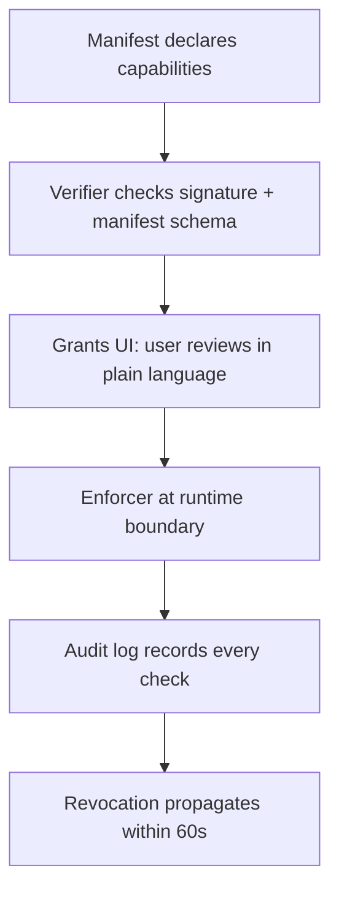

# NX-ARCH-0703 — Permissions & Capability Model

| Field | Value |
|-------|-------|
| **Document ID** | NX-ARCH-0703 |
| **Title** | Permissions & Capability Model |
| **Phase** | 8 — Marketplace |
| **Owner** | Security AI (NX-AGENT-7058) + Backend AI (NX-AGENT-7055) |
| **Status** | 🟢 Complete |
| **Version** | 0.1.0 |
| **Created** | 2026-07-03 |
| **Depends on** | NX-ARCH-0004, NX-ARCH-0701 (Threat Model), NX-AGENT-7015 (Guardrails), NX-ARCH-0202 (Auth) |

---

## 1. Mission

Define how NEXUS grants, scopes, enforces, and revokes the capabilities of every principal — user, agent, plugin, partner integration, internal service — so untrusted code can run productively in user environments without overreaching, and so the user always knows what is allowed and can change it.

## 2. The principle: least authority, explicit consent

Every action that crosses a trust boundary is gated by a permission. Permissions are:

1. **Declared** by the requester (manifest, OAuth scope, or signed grant).
2. **Granted** by an authority (the user, the org admin, the platform).
3. **Scoped** to a specific context (workspace, install, session, time window).
4. **Enforced** at the boundary, not the call site.
5. **Revocable** without notice; revocation takes effect within seconds.
6. **Audited** — every grant and use is logged.

The model is inspired by capability systems (OCaml, Capsicum, Android, iOS), but adapted for an AI-native browser where principals include autonomous agents.

## 3. Principals

| Principal | Identity | Authority | Lifecycle |
|-----------|----------|-----------|-----------|
| **User** | Account, passkey | Owner of data, org member | Persistent |
| **Workspace** | Subset of user's data | Bound to user | Per-workspace |
| **Agent (first-party)** | NX-AGENT-#### | Granted by NEXUS platform | Per run |
| **Plugin (third-party)** | Signed package id | Granted by user per install | Per install, revocable |
| **Partner integration** | OAuth client id | Granted by user per OAuth flow | Per grant, expirable |
| **Internal service** | Service account (mTLS) | Granted by platform | Per service |

A principal can have a *role* (user, org-admin, platform-admin) which is a shortcut for a default permission set, but the runtime check is always capability-based, not role-based.

## 4. Capability taxonomy

Capabilities are namespaced strings, hierarchical, with explicit `read` / `write` / `*` qualifiers where applicable.

```
<resource>:<action>[:<scope>]
```

Examples:

| Capability | Meaning |
|------------|---------|
| `workspace:read` | Read all data in the current workspace |
| `workspace:write:notes` | Edit notes only |
| `workspace:execute:agent` | Run an agent in this workspace |
| `tabs:read` | Read tab titles + URLs (no content) |
| `tabs:control` | Open, close, focus tabs |
| `tabs:content:read` | Read page DOM (prompt-injection surface) |
| `downloads:write` | Initiate downloads |
| `cloud-browser:spawn` | Start a new Cloud Browser |
| `cloud-browser:control:{browser_id}` | Control a specific Cloud Browser |
| `agent:invoke:{agent_id}` | Invoke a specific agent |
| `agent:tool:browser.click` | Use the browser.click tool |
| `agent:tool:email.send` | Use the email.send tool |
| `email:read:inbox` | Read inbox (no send) |
| `email:send` | Send email as user |
| `calendar:read` | Read calendar events |
| `calendar:write` | Create/modify events |
| `contacts:read` | Read contacts |
| `finance:read:accounts` | Read linked financial accounts (read-only) |
| `finance:write:transactions` | Initiate transactions (requires elevation) |
| `payout:receive` | Receive creator payouts (creator only) |
| `marketplace:install` | Install marketplace plugins |
| `marketplace:publish` | Publish plugins (creator only) |
| `audit:read:self` | Read your own audit log |

The full list is in `_assets/security/capability_taxonomy.json` (generated, version-controlled). Adding a new capability is a security-review event.

## 5. The four enforcement layers



### 5.1 Manifest declaration

A plugin manifest (NX-ARCH-0602) declares the *minimum* capabilities it needs. The platform verifier rejects manifests that:
- Use unknown capabilities
- Use capabilities outside the platform's permission set
- Use wildcard capabilities (`*`) in a way that defeats least-privilege
- Request `finance:write` without additional justification metadata

### 5.2 Grant prompt (user-facing)

On install (or first invocation of a tool requiring a new capability), the user sees a plain-language prompt:

> **"Email Campaigns" wants to:**
> - Read your inbox
> - Send email as you
> - Create calendar events
>
> *You can change these anytime in Settings → Apps.*

The prompt is generated from the manifest by mapping capability strings to user-readable text. The mapping is curated by Documentation AI + Security AI and lives in `_assets/security/capability_translations.json`.

The user can:
- **Allow all** — for the install lifetime
- **Allow once** — for the current run only
- **Allow with reduced scope** — pick a subset
- **Deny** — block the action; plugin continues if it can degrade

### 5.3 Runtime enforcement

Every action that crosses a trust boundary hits the **enforcer**:

```typescript
// Pseudocode at the boundary
async function enforce(capability, principal, context) {
  const grant = await grants.findOne({
    principal_id: principal.id,
    capability,
    context: matchContext(context),
    revoked_at: null,
    expires_at: { $gt: now() }
  });
  if (!grant) throw new PermissionDenied(capability, principal, context);
  await audit.log({ capability, principal, context, grant_id: grant.id, decision: 'allow' });
  return grant;
}
```

The enforcer runs in the API gateway and the agent tool broker. It is the only path; there is no "internal API" that bypasses it.

### 5.4 Audit + revocation

Every check is logged to the audit log (NX-ARCH-0706). Revocation is a row update on `grants`; subsequent checks fail. Cache TTL on grants is 60 seconds; revocation propagates within that window.

## 6. Capability groups (the "permissions" the user sees)

For the user, capabilities are grouped into ~12 named permission buckets. The user toggles *buckets*, not raw capabilities; the platform expands the bucket to the underlying capability set on grant.

| Group | Display name | Underlying capabilities |
|-------|--------------|------------------------|
| **Files & tabs** | "Read your open tabs and files" | `tabs:read`, `workspace:read:files` |
| **Tab control** | "Open, close, and switch tabs" | `tabs:control` |
| **Page content** | "Read the content of pages you visit" | `tabs:content:read` |
| **Cloud Browsers** | "Use Cloud Browsers" | `cloud-browser:spawn`, `cloud-browser:control:*` |
| **Email** | "Read and send email" | `email:read:*`, `email:send` |
| **Calendar** | "Read and create events" | `calendar:read`, `calendar:write` |
| **Contacts** | "Access contacts" | `contacts:read`, `contacts:write` |
| **Marketplace** | "Install and update agents" | `marketplace:install` |
| **Publishing** | "Publish agents" (creator) | `marketplace:publish`, `payout:receive` |
| **Finance** | "Access linked financial accounts" | `finance:read:*`, `finance:write:transactions` (elevation) |
| **Memory** | "Read and write your memory" | `memory:read`, `memory:write` |
| **AI actions** | "Take actions on your behalf" | umbrella for high-impact agent tools |

The user can drill into any bucket to see the underlying capabilities, the apps that have been granted, and revoke per-app.

## 7. Elevation: when a high-risk action is requested

Some capabilities are *elevation-required* — the user must explicitly confirm each use, not just the grant:

| Elevated action | Elevation prompt |
|------------------|------------------|
| `email:send` to > N recipients | "Send to 247 recipients?" |
| `finance:write:transactions` | "Transfer $X to Y. Confirm with passkey." |
| `cloud-browser:spawn` (paid tier overage) | "This will count against your Cloud Browser hours. Continue?" |
| `agent:invoke` that costs > $0.10 in model credits | "This will use ~$0.15 in model credits. Continue?" |
| `agent:tool:shell.exec` | "Run a shell command in your workspace?" (with command preview) |
| `agent:tool:file.delete` outside `~/.nexus/tmp` | "Delete file X? This cannot be undone." |

Elevation requires **a fresh passkey / WebAuthn assertion** for finance actions, and **a click + 5-second hold** for medium-risk. The cost of elevation is intentional friction against drive-by prompt-injection attacks.

## 8. Time and scope bounds

Every grant has:

| Bound | Default | Override |
|-------|---------|----------|
| **Lifetime** | Install lifetime | Per-run, per-day, per-week |
| **Workspace scope** | Install's workspace | User-global |
| **Resource scope** | All of type | Specific IDs (`cloud-browser:control:cb_abc123`) |
| **Action scope** | All of bucket | Read-only subsets |
| **Rate limit** | Per-minute, per-hour, per-day | Higher for trusted first-party agents |
| **Cost cap** | $0.50/day for `finance:write:transactions` | User can raise |

The enforcer checks all bounds per call. A grant expiring or hitting a cap triggers a re-prompt.

## 9. Per-install data and "right to be forgotten"

Each install has a data namespace (`installs/{install_id}/...`) in the user's encrypted storage. Uninstall deletes:
- All data in that namespace
- The grant row (or marks `revoked_at`)
- Any background work scheduled by the install (cancellable)
- Memory entries tagged with the install id (NX-AGENT-7010 §6)

The platform retains:
- Audit log entries (with PII redacted post-30 days)
- Aggregate metrics (install count, rating) — these are de-identified
- Tax records (for paid installs) — required by law

## 10. Org-level overrides (Business / Enterprise tier)

For Business and Enterprise tiers (NX-DOC-0012 §4), the org admin can:
- **Set org-wide policy** that blocks certain capabilities entirely (e.g. "no agent can `email:send` to domains outside the company's allowlist")
- **Pre-approve** certain capabilities (skip the user prompt for low-risk actions)
- **Require approval** for certain capabilities (user requests, admin approves)
- **Mandate step-up auth** for elevated actions

Org policy is evaluated *after* the user grant — the stricter of the two wins. This is a deliberate choice: org policy is a ceiling, not a floor.

## 11. Plugin ↔ user escalation paths

The most dangerous class of attack is a plugin that escalates beyond its grant. Defenses:

1. **No `eval`** in the plugin runtime; the only dynamic execution is the sandbox itself.
2. **No ambient authority** — every cross-boundary call goes through the enforcer.
3. **Tool broker** — plugins cannot call internal APIs directly; they get a *brokered* version that strips capabilities (NX-AGENT-7015 §5).
4. **Watchdog** — a runtime monitor looks for: capability-stuffing attempts, exfiltration patterns, runaway loops, identity mismatches.
5. **Kill switch** — the platform can disable a plugin across all installs in < 60 seconds.

## 12. Failure modes

| Failure | Mitigation |
|---------|------------|
| Enforcer bypassed | Defense-in-depth: enforcer is the only path; every internal call re-checks |
| Grant cache stale | 60s TTL; revocation invalidates |
| Manifest lies about capabilities | Code review + sandbox runtime check (declared vs observed capability use) |
| User grants too broadly | UI surfaces the bucket in plain language; "Allow all" requires scroll-to-bottom |
| Org policy race | Org policy is the authoritative source; cached for 5s only |
| Capability taxonomy change | Versioned; old grants grandfathered for 30 days; new capabilities require new grant |

## 13. Performance

| Check | Latency budget |
|-------|----------------|
| Enforcer check (cached grant) | < 5ms p95 |
| Enforcer check (DB read) | < 20ms p95 |
| Revocation propagation | < 60s p99 |
| Audit log write | async; non-blocking |

Grants are cached in Redis with the principal as the key. Revocation is a `DEL` of the relevant cache keys; the next call misses and re-reads.

## 14. Open questions

- **Capability inheritance for sub-agents**: when the Planner agent (NX-AGENT-7003) spawns a Coder agent, what capabilities does the Coder inherit? Current answer: the *intersection* of Planner's grants and the Coder's manifest. To be formalized in NX-AGENT-7014.
- **Delegation chains**: can a plugin delegate a capability to another plugin? Default: no. Use case may emerge.
- **Capability budgets**: should there be a per-day "capability spend" the user sets, like a calorie budget? Deferred; rate limits cover most cases.

## 15. Reading list

| Doc | Read if you want to understand… |
|-----|---------------------------------|
| NX-ARCH-0701 | The threat model that motivates least-privilege |
| NX-ARCH-0702 | AI-specific threats (prompt-injection of capability) |
| NX-AGENT-7015 | The guardrails that wrap agent execution |
| NX-ARCH-0602 | The manifest format plugins use to declare capabilities |
| NX-ARCH-0604 | How trust signals (verification, ratings) complement permissions |

---

*End NX-ARCH-0703.*
