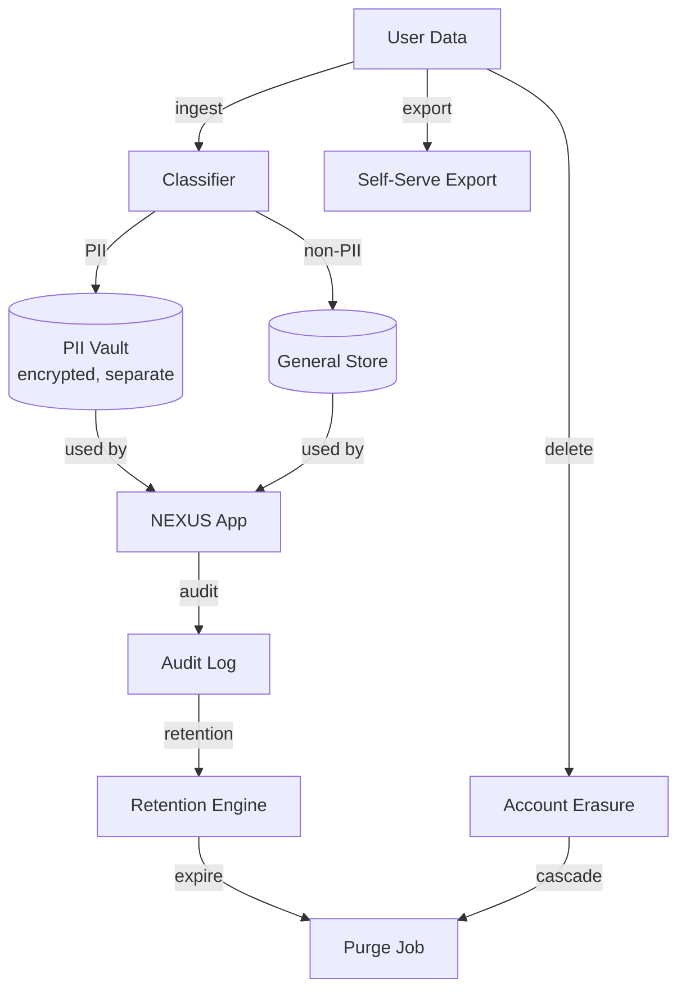

# NX-ARCH-0704 — Privacy, PII & Data Residency

| Field | Value |
|-------|-------|
| **Document ID** | NX-ARCH-0704 |
| **Title** | Privacy, PII & Data Residency |
| **Phase** | 8 — Marketplace |
| **Owner** | Security AI (NX-AGENT-7058) + Legal AI |
| **Status** | 🟢 Complete |
| **Version** | 0.1.0 |
| **Created** | 2026-07-03 |
| **Depends on** | NX-ARCH-0004, NX-ARCH-0701 (Threat Model), NX-ARCH-0705 (Encryption), NX-ARCH-0202 (Auth) |

---

## 1. Mission

Define how NEXUS handles personal data — what is collected, how it is classified, where it lives, how it is used, how it is shared, how long it is retained, how it is deleted, and how it complies with GDPR, CCPA, LGPD, PIPL, and the rest of the world's privacy law. Privacy is not a feature; it is a constraint that shapes every other architectural decision.

| Concept | Definition |
|---------|------------|
| **Personal data** | Any information that identifies a person (GDPR §4(1)) |
| **PII** | A subset of personal data that is sensitive: SSN, financial, health, biometric, precise location, children |
| **Sensitive PII** | PII that requires explicit consent: race, religion, health, sex life, criminal record |
| **Data subject** | The person the data is about |
| **Controller** | NEXUS (determines the purposes and means of processing) |
| **Processor** | A third party (Stripe, AWS, etc.) that processes on NEXUS's behalf |
| **Lawful basis** | The legal reason for processing (GDPR §6): consent, contract, legal obligation, vital interest, public task, legitimate interest |
| **Data residency** | The geographic location in which data is stored |

## 2. The classification

Every piece of data in NEXUS is tagged with a **sensitivity class** and a **retention rule**. The class is set at ingest and inherited by every derived copy. The class is enforced at the storage layer (NX-ARCH-0207) and at the query layer (NX-ARCH-0201).

| Class | Examples | Default retention | Storage |
|-------|----------|------------------|---------|
| **Public** | Marketing copy, public agent listings | Indefinite | Standard |
| **Internal** | Telemetry, internal docs, dashboards | 2 years | Standard |
| **Confidential** | User content, workspaces, memory | Per user setting (default: account lifetime) | Encrypted at rest with user-key |
| **Sensitive PII** | SSN, payment instrument, KYC docs | Per consent; default: account lifetime + 30 days post-closure | Encrypted + tokenized; separate access control |
| **Credential** | Passwords, OAuth tokens, API keys | Per credential type; passwords: never (hash only) | HSM-backed |
| **Biometric** | Voice prints (if used) | 90 days; opt-in only | Encrypted; HSM-backed key |

Every data table has a `sensitivity_class` column; the row-level access policy is keyed off it. Sub-objects within a row (e.g., a user's KYC document embedded in their account row) are encrypted with a per-class key, and access is gated by the class.

## 3. The lawful basis matrix

| Data | Lawful basis (GDPR) | Consent required | Notes |
|------|---------------------|------------------|-------|
| Account identity (email, phone) | Contract | Yes (TOS) | Cannot use product without this |
| Login state (sessions) | Contract | Yes (TOS) | Operational |
| Workspaces, files, notes, memory | Contract | Yes (TOS) | Core product |
| Conversation history with AI | Contract + legitimate interest | Yes (TOS) | Used for memory, security, abuse detection |
| Telemetry (events, errors) | Legitimate interest | No (TOS, opt-out possible) | Anonymous; aggregated |
| Marketing email | Consent | Yes (explicit) | Double opt-in |
| Payment info | Contract + legal obligation | Yes (TOS) | Required for paid plans |
| KYC for payouts | Legal obligation | Yes (explicit) | Required by law |
| Voice biometrics (if used) | Consent | Yes (explicit, revocable) | Optional |
| Cookies (non-essential) | Consent | Yes (banner) | Granular |

## 4. Data residency

Users can select a **data residency** at signup. The choice is sticky; the user can migrate once per 12 months (a slow, audited operation).

| Region | Sub-regions | Available plans |
|--------|-------------|-----------------|
| **United States** | us-east-1, us-west-2 | All |
| **European Union** | eu-west-1, eu-central-1 | All; default for EU users |
| **United Kingdom** | uk-south-1 | All |
| **Asia-Pacific** | ap-northeast-1, ap-southeast-1, ap-south-1 | All |
| **Canada** | ca-central-1 | All |
| **Australia** | ap-southeast-2 | All |

**Hard rules:**

- A user's data **never** leaves their residency region. The platform runs regional Postgres, regional S3, regional model API endpoints, and regional search indexes.
- The control plane (billing, telemetry, audit) is global, but PII stays in-region.
- The Cloud Browser Fleet runs in-region for in-region users; cross-region traffic is encrypted and logged.
- Marketplace listings (public) are global; only the creator's KYC data and the customer's purchase metadata are regional.
- For US Government customers, a separate GovCloud region (us-gov-west-1) is offered with FedRAMP Moderate controls and US-person-only operations.

## 5. The PII vault

Sensitive PII is stored in a **separate, encrypted, access-controlled vault**. The vault is a logical partition (Postgres schema + S3 prefix + KMS key); the physical infrastructure is the same, but the access policy is different.

| Property | Vault | General store |
|---------|-------|---------------|
| Encryption | Per-class key, KMS-managed, HSM-backed root | Per-user key |
| Access | Break-glass only; every read is audited; no app queries it directly except via a thin, audited proxy | Normal app queries |
| Schema | Wide rows; PII columns are tokenized; the token maps to the row via a separate index | Normalized |
| Backup | Encrypted with the vault's key; not in the general backup | Per normal retention |
| Retention | Per consent + legal; default tied to user account lifetime | Per table |
| Deletion | Cryptographic erasure: vault key is destroyed; the encrypted rows become unreadable | Normal delete |

The vault contains: payment instruments (card tokens held by Stripe, not NEXUS), KYC documents, biometric templates (if used), and any data the user has explicitly flagged as sensitive.

## 6. User rights

GDPR and equivalent laws grant users rights. NEXUS implements all of them.

| Right | Implementation | SLA |
|-------|----------------|-----|
| **Access** | Self-serve export (NX-FEAT-2009) — full account export in JSON + zip, signed URL | Immediate |
| **Rectification** | Self-serve edit in the app; for any field the app does not expose, request via Privacy Center | 30 days |
| **Erasure** | Self-serve account deletion; cascade to all regions; cryptographic erasure of vault | 30 days, immediate on request |
| **Restriction** | Self-serve "freeze my data" — turns the account read-only; data is preserved but not processed | Immediate |
| **Portability** | JSON export under a standard schema; import is via the same schema | Immediate |
| **Object** | Opt-out of any consent-based processing; objection to legitimate-interest processing handled manually | 30 days |
| **Withdraw consent** | One-click per consent category; propagates immediately to processors | Immediate |
| **Automated decision-making** | Users have the right to a human review of any decision that affects them (e.g., takedown) | 30 days |

The Privacy Center is a self-serve page in the app (NX-FEAT-2806) that exposes all of the above without contacting support. A human Privacy team handles escalations.

## 7. Data subject requests (DSARs)

DSARs come from three sources:

1. **Self-serve** in the app (export, delete, freeze).
2. **Email** to privacy@nexus.example.
3. **Legal request** from a regulator (e.g., a court, an EU DPA).

| Source | SLA | Verification |
|--------|-----|--------------|
| Self-serve | Immediate for export; 30 days for delete | Account login |
| Email | 30 days (GDPR Art. 12(3)) | Email match + identity verification (last-4 of card, copy of ID for high-risk requests) |
| Regulator | Per law (often 30 days, sometimes 72h for breach notification) | Verified channel; Legal AI signs off |

The Privacy team's queue is on the same T&S AI surface as marketplace moderation. The identity verification step is essential — it prevents an attacker from deleting a victim's account by emailing a "delete me" request.

## 8. Processors (subprocessors)

NEXUS uses a small set of subprocessors. The list is published at `privacy.nexus.example/subprocessors` and updated within 30 days of any change; users are notified in-product for material changes and can opt out (typically by closing their account).

| Subprocessor | Purpose | Region |
|--------------|---------|--------|
| AWS (or GCP, Azure) | Compute, storage, KMS | Per user residency |
| Stripe | Payments, KYC, tax | US, EU; data regionalized |
| Cloudflare | CDN, WAF, DDoS | Per request routing |
| Twilio / MessageBird | SMS, email delivery | Per user region |
| OpenAI, Anthropic, Google | Model API (per user consent) | US, EU inference regions |
| Postmark / SendGrid | Transactional email | US, EU |
| Sentry | Error tracking | EU for EU users |
| Mixpanel / Amplitude | Product analytics | Anonymized, regionalized |

Each subprocessor is governed by a Data Processing Addendum (DPA) that includes: purpose limitation, security obligations, audit rights, breach notification (within 72h), and data deletion on termination.

## 9. Children's data

NEXUS is not directed at children under 16 (EU) or 13 (US, COPPA). The signup flow requires a date-of-birth gate; users below the threshold are blocked. The platform does not knowingly collect data from children; if it is discovered, the data is deleted within 7 days and the parent or guardian is notified.

For users in the 16-18 range in the EU, parental consent is required for the consent-based processing categories; the platform surfaces a parental-consent flow at signup.

## 10. International transfers

When data must cross borders (e.g., a US customer's support ticket is handled by an EU-based support agent), the transfer is governed by:

| Mechanism | When |
|-----------|------|
| **Standard Contractual Clauses (SCCs)** | EU ↔ US, EU ↔ APAC |
| **Adequacy decision** | EU ↔ UK, EU ↔ Canada, EU ↔ some APAC countries |
| **EU-US Data Privacy Framework** | EU ↔ US, for US-DPF-certified subprocessors |
| **Binding Corporate Rules** | For NEXUS's own intra-group transfers (when applicable) |

The legal basis for any cross-border transfer is logged; the user can request a copy of the relevant clauses from the Privacy Center.

## 11. Data minimization and purpose limitation

The platform collects only what it needs, and uses data only for the purpose it was collected for. New use cases require a privacy review by the Legal AI and a re-consent flow if the use case is materially different from the original.

Telemetry is collected with PII redaction at ingest (NX-ARCH-0304). Logs are scrubbed of PII; if a log line contains a user's email or ID, the redaction layer masks it before the log is stored.

## 12. Retention

| Data class | Default retention | On account closure |
|------------|-------------------|---------------------|
| Account identity | Account lifetime + 30 days | 30 days, then crypto-erased |
| Workspaces, memory, files | Account lifetime + 30 days | 30 days, then deleted |
| Conversation history | Account lifetime + 30 days; user can set shorter | 30 days, then deleted |
| Billing records | 7 years (legal obligation) | Retained (legal) |
| Tax forms | 7 years | Retained (legal) |
| Audit logs | 2 years | Retained |
| Telemetry | 13 months | 13 months |
| KYC documents | 5 years post-payout end | Retained (legal) |
| Backups | 35 days rolling; encrypted | Included in erasure |

A user can request "purge everything except legal-requirement records" — that is the default behavior on account closure. The Privacy Center exposes a "what will be retained" list before the user confirms deletion.

## 13. Breach response

A personal-data breach triggers the following protocol:

| Step | Owner | SLA |
|------|-------|-----|
| 1. Detect and contain | Security AI | 1 hour |
| 2. Assess scope and severity | Security AI + Legal AI | 24 hours |
| 3. Notify DPA (if high risk) | Legal AI | 72 hours from awareness |
| 4. Notify affected users | Marketing AI | 72 hours from awareness |
| 5. Post-mortem and remediation | Security AI + Backend AI | 14 days |
| 6. Public disclosure (if material) | Marketing AI + CEO AI | Same as user notification |

The platform maintains a breach register; the Legal AI is responsible for the regulator relationship and the disclosure language.

## 14. Observability

| Metric | Target |
|--------|--------|
| `dsar.sla_met_rate` | 100% (zero missed SLAs) |
| `export.generation_lag_minutes_p95` | < 30 |
| `erasure.completion_lag_hours_p99` | < 24 |
| `consent.withdraw_propagation_seconds_p99` | < 60 |
| `pII_vault.break_glass_count_per_month` | 0 (audit and remediate any) |
| `cross_border.transfer_count` | Logged; alerted on anomaly |

## 15. Acceptance criteria

- [ ] A user can export their full account data in < 30 minutes.
- [ ] An account deletion completes within 30 days; the PII vault is crypto-erased; legal-required records are retained with a clear inventory returned to the user.
- [ ] A user in the EU residency region never has data leave the EU; verified by an automated nightly test.
- [ ] A privacy-request email triggers an identity-verification flow and is responded to within 30 days.
- [ ] The subprocessor list is updated within 30 days of any change; users are notified in-product.
- [ ] A simulated breach notification is sent to the DPA within 72 hours.
- [ ] Children below the age threshold cannot create an account.
- [ ] A user can withdraw consent for any consent-based processing with one click; the change propagates within 60 seconds.

## 16. Open questions

- Q: Should we offer a "Bring Your Own KMS" option for Enterprise, where the customer holds the root key?
- Q: Should the platform offer a "Privacy Mode" (no telemetry, no model improvement use) on the Pro plan, or only Business+?
- Q: How do we handle privacy law in new jurisdictions as we expand (e.g., India DPDP, 2023)?

## 17. Change log

| Date | Change | Author |
|------|--------|--------|
| 2026-07-03 | Initial spec | Security AI (NX-AGENT-7058) |

---

*End NX-ARCH-0704.*
