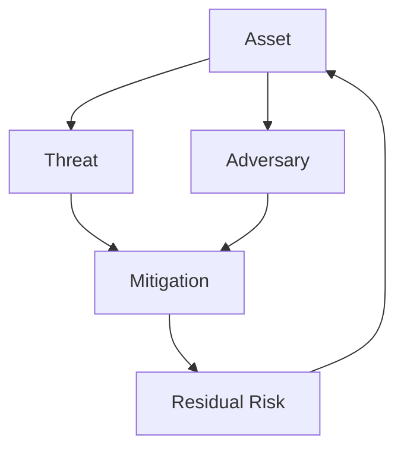
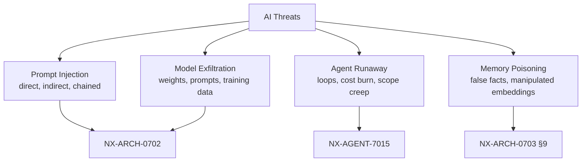
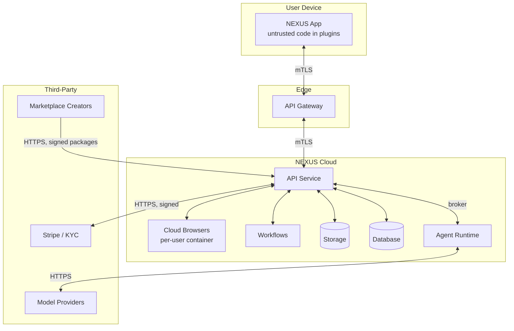
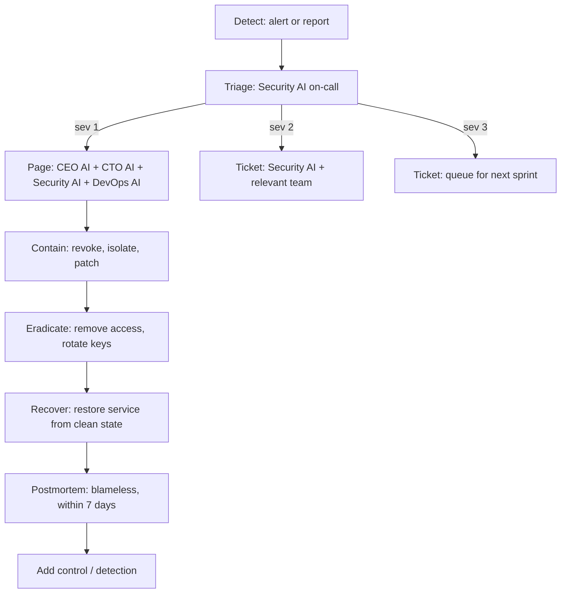

# NX-ARCH-0701 — Threat Model & Attack Surface

| Field | Value |
|-------|-------|
| **Document ID** | NX-ARCH-0701 |
| **Title** | Threat Model & Attack Surface |
| **Phase** | 8 — Marketplace |
| **Owner** | Security AI (NX-AGENT-7058) + CTO AI (NX-AGENT-7051) |
| **Status** | 🟢 Complete |
| **Version** | 0.1.0 |
| **Created** | 2026-07-03 |
| **Depends on** | NX-ARCH-0004, NX-DOC-0011, NX-ARCH-0001 (Browser), NX-ARCH-0002 (Backend) |

---

## 1. Mission

Define what NEXUS defends against, who we defend against, what the attack surface looks like, and how threats are modeled and prioritized — so every other security doc (encryption, permissions, AI safety, privacy, zero trust) has a shared adversary model to defend against.

## 2. Methodology

We use **STRIDE** (Spoofing, Tampering, Repudiation, Information disclosure, Denial of service, Elevation of privilege) per subsystem, combined with an explicit **adversary model** and an **asset model**. For AI-specific threats we layer in a **prompt-injection taxonomy** (NX-ARCH-0702).

| Layer | Question it answers | Output |
|-------|---------------------|--------|
| Asset model | What are we protecting? | List of assets with sensitivity tiers |
| Adversary model | Who wants them? | Adversary classes with capability tiers |
| STRIDE per subsystem | How could they get in? | Threats with STRIDE category |
| Risk scoring | How bad is each? | Likelihood × Impact |
| Mitigation | What stops it? | Controls mapped to threats |
| Residual risk | What remains? | Accepted risks with owner |

## 3. Asset model

| Asset | Sensitivity | Where it lives | Owner |
|-------|-------------|----------------|-------|
| **User identity** (email, phone, passkey) | High | Postgres `users`, HSM-backed keys | Security AI |
| **User content** (tabs, files, notes, history) | High | Cloud Browser, S3, encrypted at rest | Per-user encryption key |
| **Memory** (workspace facts, agent learnings) | High | Postgres + vector store | User-owned, per-workspace key |
| **Credentials** (passwords, cookies, OAuth tokens) | Critical | Browser profile, encrypted with profile key | Browser AI |
| **Financial** (subscriptions, payouts, marketplace ledger) | Critical | Postgres, Stripe | Finance AI |
| **Agent code** (first-party, third-party) | Medium | Signed artifacts in S3 | Per-publisher signature |
| **Audit log** | High | Append-only Postgres + S3 cold storage | Security AI |
| **Model API keys** | Critical | Vault (HashiCorp or cloud KMS) | AI Platform AI |
| **Cloud Browser state** (DOM, cookies, session) | High | Per-browser encrypted volume | Browser AI |
| **Source code** | High | GitHub (private) | Eng org |
| **Infrastructure secrets** (DB passwords, K8s SA tokens) | Critical | Vault + cloud KMS | DevOps AI |
| **Marketplace creator PII** (KYC data) | High | Postgres, separated from public | Finance AI |
| **Telemetry** (traces, metrics, logs) | Medium | ClickHouse + Loki; PII redacted at ingest | DevOps AI |

## 4. Adversary model

| Class | Capability | Goal | Tier |
|-------|-----------|------|------|
| **Opportunistic attacker** | Script kiddie tools, public CVEs | Account takeover, spam, crypto mining | 1 |
| **Cybercriminal** | Phishing kits, social engineering, ransomware | Financial fraud, data theft, ransom | 2 |
| **Malicious plugin author** | First-party-looking code that runs in NEXUS | Privilege escalation, data exfiltration, persistent access | 2 |
| **Compromised supply chain** | Trojan in a popular npm/crate | Backdoor at install, lateral movement | 2 |
| **Malicious user (insider)** | Already inside; valid credentials | Privilege abuse, data theft, fraud | 2 |
| **Nation-state APT** | Zero-days, long dwell, multi-stage | Espionage, disruption | 3 |
| **Malicious AI agent** | An agent whose objective diverges from user | Unintended actions, prompt-injection chain | 2 (new) |
| **Prompt-injection attacker** | Crafted content to hijack agents | Data exfiltration via indirect injection, unauthorized actions | 2 (new) |
| **Rogue employee** | A bad actor inside the company | Source-code theft, sabotage, fraud | 3 |
| **Coercive legal compulsion** | Subpoena, national-security letter | Forced disclosure | 3 (mitigated by design, not by obscurity) |

We design for tiers 1 and 2 as the baseline, with specific tier-3 controls (HSM-backed keys, jurisdiction pinning, anti-tamper) for high-value assets.

## 5. STRIDE per subsystem

The full table is in `_assets/security/stride_matrix.md` (generated by the threat-modeling agent). Selected highlights:

### 5.1 Authentication (NX-ARCH-0202)

| Threat | STRIDE | Mitigation |
|--------|--------|------------|
| Credential stuffing | Spoofing | Passkey-first; rate-limit; breach-list check (haveibeenpwned) |
| Session hijacking via XSS | Spoofing, Elevation | `__Host-` cookies; `SameSite=Strict`; CSP (NX-ARCH-0108) |
| Phishing-resistant UI | Spoofing | Passkeys + WebAuthn origin binding |
| Session token theft from logs | Information disclosure | Tokens redacted; logs in restricted-access store |

### 5.2 Marketplace (NX-ARCH-0601)

| Threat | STRIDE | Mitigation |
|--------|--------|------------|
| Plugin supply-chain attack | Tampering, Elevation | Signed packages; signature verification at install + run; hash pinned |
| Malicious manifest overclaims permissions | Elevation | Manifest diff shown to user; permission grants are minimal and explicit |
| Typosquatting / slug collision | Spoofing | Slug reservation; canonical URL; close-match warning |
| Review bombing | Repudiation | Reviews require verified install; weighted by reviewer reputation |
| Marketplace scraping for intel | Information disclosure | Rate limit; opaque IDs in URLs |
| Fake install counts | Repudiation | Counts come from the install endpoint, not the client |

### 5.3 Cloud Browser (NX-ARCH-0103, NX-FEAT-1600)

| Threat | STRIDE | Mitigation |
|--------|--------|------------|
| Cross-profile leak | Information disclosure | Per-profile encrypted volume; no shared filesystem; container isolation |
| Snapshot exfiltration | Information disclosure | Snapshots are encrypted with profile key; download requires re-auth |
| DOM-based prompt injection | Tampering, Information disclosure | Site origin isolation; AI sees only summarized DOM; no inline scripts in agent context |
| Cookie theft via XSS | Information disclosure | SameSite=Strict; __Host- prefix; HttpOnly |
| Browser extension compromise | Elevation, Tampering | Curated store (H1); manifest V3; review process; permission model |

### 5.4 AI agent runtime (NX-AGENT-7001, NX-AGENT-7015)

| Threat | STRIDE | Mitigation |
|--------|--------|------------|
| Indirect prompt injection (poisoned web content) | Elevation, Information disclosure | Per-origin tool restrictions; structured outputs; tool broker; AI Safety (NX-ARCH-0702) |
| Agent runaway / loop | Denial of service | Step budget; cost budget; per-step timeout; kill switch |
| Agent writes to wrong workspace | Tampering | Worktree isolation; explicit commit/promote; scope confirmation |
| Memory poisoning | Tampering | Memory entries are versioned; can be rolled back; provenance recorded |
| Model exfiltration via side channel | Information disclosure | No model in user process; model calls go through broker with rate limits |
| Privilege escalation via confused deputy | Elevation | Every agent action is permission-checked; no "agent as god" mode |

### 5.5 Billing & revenue share (NX-ARCH-0603, NX-ARCH-0605)

| Threat | STRIDE | Mitigation |
|--------|--------|------------|
| Fake install events for payout | Repudiation, Elevation | Signed install events from platform; reconcile with install log |
| Stolen creator identity for payout | Spoofing | KYC; payout-account verification; new payout account needs re-KYC |
| Refund abuse | Repudiation | Refund policy enforced; chargeback alerts; creator-side ledger immutable |
| Tax fraud | Repudiation | 1099/KYC thresholds; withholding where required |

## 6. The AI-attack surface (new in NEXUS)

Traditional threat models don't cover agents. We add four AI-specific threat categories.

These are the *defining* threats of the AI-native browser era. We treat them as first-class in the threat model — not as edge cases. See NX-ARCH-0702 for the dedicated doc.

## 7. Trust boundaries

Every arrow is a trust boundary. Each boundary has an explicit protocol, authentication, and validation step. The list of all boundaries lives in `_assets/security/trust_boundaries.md`.

## 8. Risk scoring

Risks are scored **Likelihood × Impact**, each 1–5.

| Score | Band | Action |
|-------|------|--------|
| 1–4 | Low | Accept; review annually |
| 5–9 | Medium | Mitigate within the quarter |
| 10–15 | High | Mitigate within the sprint |
| 16–25 | Critical | Mitigate before launch; ship-blocker |

A live risk register is maintained in `_assets/security/risk_register.md`, generated by Security AI from the STRIDE matrix and incident history.

## 9. Security testing program

| Test | Frequency | Owner |
|------|-----------|-------|
| **Static analysis** (Semgrep, CodeQL) | Every commit | DevOps CI |
| **Dependency scan** (Trivy, Snyk) | Every commit + daily | DevOps CI |
| **DAST** (OWASP ZAP) | Weekly | QA AI |
| **Pen test** (third-party) | Annual + on major release | Security AI + external |
| **Red team** (AI-specific) | Quarterly | Security AI + external |
| **Bug bounty** | Continuous | Security AI |
| **Threat model review** | On every architecture change | Security AI |
| **Disaster-recovery drill** (NX-ARCH-0306) | Quarterly | DevOps AI + Security AI |
| **Tabletop exercise** (incidents) | Semi-annual | CEO AI + Security AI |

## 10. Incident response

Severity definitions in `_assets/security/severity.md`. Postmortems are public internally (within the org) and indexed in the audit log.

## 11. Compliance frame

NEXUS is designed to be auditable against:

- **SOC 2 Type II** (target H1; controls in NX-ARCH-0706)
- **GDPR / CCPA / LGPD** (privacy, NX-ARCH-0704)
- **HIPAA** (Business tier, H2; encryption + audit + BAA-eligible)
- **FedRAMP Moderate** (Enterprise, H3; jurisdiction pinning + on-prem path)
- **PCI-DSS** (where NEXUS handles card data via Stripe; we don't store PAN)

Controls are mapped in the Trust Center, generated from the threat model.

## 12. Open questions

- **AI-generated code in marketplace**: if a creator publishes an agent whose source is partially AI-generated, do we require disclosure? Likely yes; deferred to NX-ARCH-0601.
- **Quantum-resistant crypto**: TLS and signing are currently classical (Ed25519, ECDSA, X25519). Migration plan to PQC (ML-KEM, ML-DSA) is in NX-ARCH-0705 §9.
- **Insurance**: cyber insurance policy underwriter questionnaire is on the path. Document after policy bind.

## 13. Reading list

| Doc | Read if you want to understand… |
|-----|---------------------------------|
| NX-DOC-0011 | The 14 technical principles that anchor our security posture |
| NX-ARCH-0004 | The marketplace architecture this doc underwrites |
| NX-ARCH-0702 | AI-specific threats (prompt injection, exfiltration, runaway) |
| NX-ARCH-0703 | The capability model that enforces least-privilege |
| NX-ARCH-0704 | Privacy and data residency |
| NX-ARCH-0705 | Encryption (at rest and in transit) |
| NX-ARCH-0706 | Zero-trust network architecture |

---

*End NX-ARCH-0701.*
