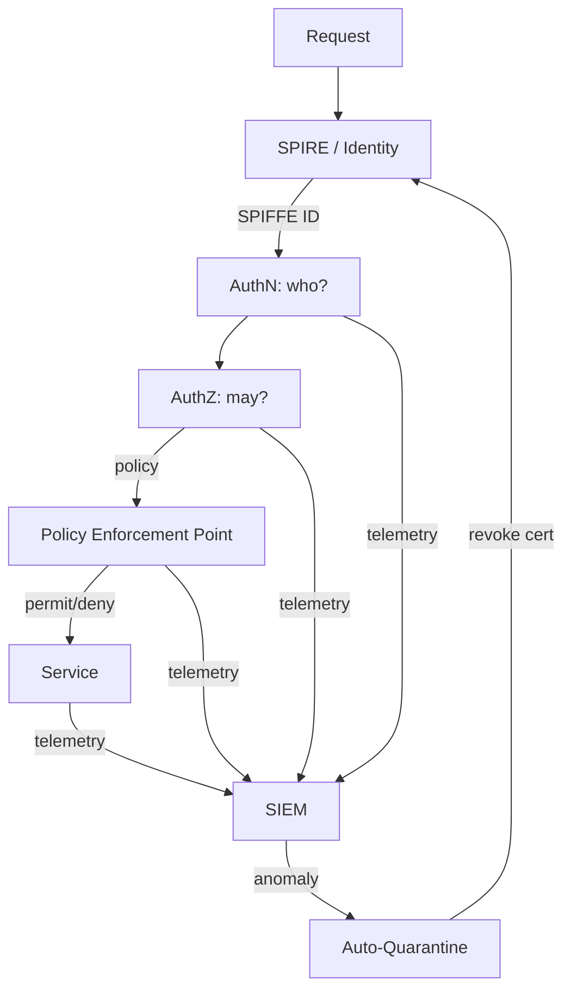

# NX-ARCH-0706 — Zero-Trust Architecture

| Field | Value |
|-------|-------|
| **Document ID** | NX-ARCH-0706 |
| **Title** | Zero-Trust Architecture |
| **Phase** | 8 — Marketplace |
| **Owner** | Security AI (NX-AGENT-7058) + DevOps AI (NX-AGENT-7060) + CTO AI (NX-AGENT-7051) |
| **Status** | 🟢 Complete |
| **Version** | 0.1.0 |
| **Created** | 2026-07-03 |
| **Depends on** | NX-ARCH-0004, NX-ARCH-0701 (Threat Model), NX-ARCH-0705 (Encryption), NX-ARCH-0202 (Auth), NX-ARCH-0203 (Database), NX-ARCH-0205 (Infrastructure) |

---

## 1. Mission

Define how NEXUS implements the **zero-trust** model: every request is authenticated, authorized, and encrypted; no implicit trust based on network location; continuous verification; least-privilege access; assume breach. The result is an architecture in which a single compromised component does not yield a lateral path to the rest of the system, and in which the blast radius of any one failure is bounded by design.

Zero trust is not a product; it is a posture. This document is the engineering substrate of that posture.



| Concept | Definition |
|---------|------------|
| **Zero trust** | A security model where no actor (user, service, network) is trusted by default; every request is verified |
| **SPIFFE** | Secure Production Identity Framework for Everyone — a standard for workload identity |
| **SVID** | SPIFFE Verifiable Identity Document — an X.509 or JWT document proving a workload's identity |
| **mTLS** | Mutual TLS — both client and server present SVIDs (see NX-ARCH-0705) |
| **PEP** | Policy Enforcement Point — the place where every request is checked |
| **PDP** | Policy Decision Point — the engine that decides permit/deny |
| **PAP** | Policy Administration Point — the surface humans use to author policy |
| **Identity-aware proxy** | A PEP in front of every service that injects identity and enforces policy |
| **Microsegmentation** | Network-level isolation between services and tenants |
| **Continuous verification** | Re-checking identity and policy throughout a session, not just at the start |

## 2. The trust model

### 2.1 What is trusted

| Trusted | Not trusted |
|---------|-------------|
| A workload's mTLS identity (SPIFFE ID) | A workload's IP address |
| A user's authenticated session (passkey / FIDO2) | A user's network location |
| A signed request from a known publisher | The contents of a request without a signature |
| A policy decision from the PDP | A direct connection to a database |
| An audit log entry | A log entry without integrity protection |

The network is **untrusted by default**. There is no "inside" the firewall that gets a free pass. Every request — from a user, from a service, from an admin, from an internal tool — proves who it is at the boundary, is authorized by the PDP, and is logged.

### 2.2 The control plane and the data plane

| Plane | Trust | Encryption | Identity |
|-------|-------|------------|----------|
| **Data plane** (user requests, service-to-service) | Zero trust; every request verified | mTLS | SPIFFE for services, JWT for users |
| **Control plane** (admin, infra automation) | Zero trust + hardware MFA + short-lived credentials | mTLS, SSH | SPIFFE, FIDO2, short-lived SSH certs |
| **Telemetry plane** (logs, metrics, traces) | Read-only for the SIEM; write-only for sources | mTLS, signed batches | SPIFFE |

## 3. Identity

### 3.1 Workload identity (SPIFFE)

Every workload (container, VM, function) has a **SPIFFE ID** of the form:

```
spiffe://nexus.example/ns/<namespace>/sa/<service-account>
```

| Field | Meaning |
|-------|---------|
| `nexus.example` | The trust domain (NEXUS) |
| `ns/<namespace>` | The Kubernetes namespace (or equivalent isolation boundary) |
| `sa/<service-account>` | The service account (the workload's identity) |

The SVID is an X.509 certificate issued by **SPIRE** (the SPIFFE Runtime Environment). Certificates are short-lived (default 1 hour, max 24 hours) and rotated automatically. The private key never leaves the workload.

### 3.2 User identity

| Method | When | Notes |
|--------|------|-------|
| **Passkey (FIDO2)** | Default for all plans | Phishing-resistant; required for admin |
| **TOTP** | Fallback for users without FIDO2-capable devices | Less secure; encouraged to enroll a passkey |
| **OAuth 2.0 / OIDC** | SSO (NX-FEAT-2901) | Per org |
| **SAML** | Legacy SSO | Per org |
| **API token (long-lived)** | Deprecated; replaced by short-lived tokens | Migration deadline: H2 |
| **API token (short-lived, scoped)** | Programmatic access (NX-ARCH-0201) | Default 1 hour, max 24 hours, audience-scoped |

The session itself is a short-lived JWT (15 min) refreshed by a refresh token bound to the device; revocation propagates within 60 seconds.

### 3.3 Identity lifecycle

| Event | Action |
|-------|--------|
| Workload starts | SPIRE issues an SVID; workload presents it on every connection |
| Workload restarts | New SVID; old SVID is invalidated |
| Workload compromised | Operator revokes the SVID; the workload is locked out within 1 minute |
| User logs out | Session JWT and refresh token are invalidated; SVIDs for any spawned work are also invalidated |
| User account suspended | All sessions and refresh tokens are invalidated; SVIDs are revoked at the next rotation (≤ 1 hour) |
| Service account compromised | Operator revokes; the SVID is blocked at the PDP; the workload is quarantined |

## 4. Authentication and authorization

### 4.1 Authentication

Authentication is the verification of identity. The PDP only sees authenticated requests.

| Request source | AuthN method |
|----------------|--------------|
| User → web/mobile | Session JWT in a Secure, HttpOnly, SameSite=Strict cookie; refresh token bound to device |
| User → API | Bearer token (short-lived JWT) or mTLS (for high-security contexts) |
| Service → service | mTLS with SPIFFE SVIDs |
| Admin → control plane | FIDO2 passkey + IP allowlist + short-lived SSH cert |
| Workload → database | mTLS with a DB-specific client cert, scoped to the workload's role |
| CI/CD → registry | mTLS with a CI-specific SVID, scoped to the pipeline |

### 4.2 Authorization

Authorization is the decision of "may this principal perform this action on this resource?" The decision is made by the **PDP** (OPA / Cedar) and enforced by the **PEP** (the service mesh sidecar or the application).

| Question | Where answered |
|----------|----------------|
| "May this user read this workspace?" | PDP with policy `user.id == workspace.owner_id OR workspace.shared_with.includes(user.id)` |
| "May this service read this DB row?" | PDP with policy `db.row.tenant_id == spiffe.id.tenant_id AND spiffe.id.role in [reader, writer, admin]` |
| "May this admin run this destructive action?" | PDP with policy `mfa.fido2_recent AND ip.in_admin_allowlist AND time.within_business_hours` |
| "May this plugin call this tool?" | Permission enforcer (NX-ARCH-0703) with policy `manifest.permissions.includes(tool.required_capability) AND user.granted` |

The PDP is centralized (one per region) and has a single, versioned, auditable policy. Policy changes go through code review and a Security AI signoff.

### 4.3 Continuous verification

A session is not a one-time check. The PDP re-evaluates on every request, and a sidecar re-verifies the identity and policy at a configurable interval (default 5 minutes for long-lived sessions).

| Signal | Re-evaluation trigger |
|--------|----------------------|
| User behavior anomaly (impossible travel, unusual tool use) | Forced re-auth (passkey tap) within 5 minutes |
| Risk score increases | Step-up auth or session termination |
| Device posture changes (lost MDM check) | Session termination within 60 seconds |
| Workload behavior anomaly (unusual DB queries) | Service quarantine, SVID revocation |
| Geolocation changes | Re-auth if distance/time impossible |

The risk engine is an AI model trained on user / workload baselines; it is owned by Security AI and audited quarterly for false-positive and false-negative rates.

## 5. The service mesh

Every service runs in a service mesh (Istio or Linkerd) with the following sidecar behavior:

| Capability | Behavior |
|------------|----------|
| mTLS | Enforced; plaintext is rejected |
| Authorization | L4 (port, IP) and L7 (path, method) policy from the PDP |
| Telemetry | Every request emits a span with identity, policy decision, latency, status |
| Retries | Bounded; circuit-broken on policy denials |
| Rate limiting | Per-principal; defaults from the policy |
| Fault injection | Test-only, never in production |

The service mesh is the **PEP for service-to-service** traffic. The PDP is centralized; the PEP is local to each pod for latency.

## 6. Microsegmentation

Network-level isolation is layered on top of the service mesh.

| Layer | What it does |
|-------|--------------|
| **Kubernetes namespace** | Per-service-account namespace; default deny at the namespace boundary |
| **Network policy** | Per-namespace ingress/egress allowlist; default deny |
| **Cloud security group** | Per-service SG; only the service mesh control plane can reach the service port |
| **VPC / subnet** | Per-environment (prod, staging) VPC; no peer; only egress via NAT |
| **Tenant VPC** (Enterprise) | Single-tenant VPC for the customer's traffic |

| Default | Behavior |
|---------|----------|
| Ingress | Default deny; allowlist by SPIFFE ID and path |
| Egress | Default deny; allowlist by SPIFFE ID and destination |

Egress allowlists are a critical control: a compromised workload cannot reach arbitrary internet destinations (e.g., a C2 server) by default.

## 7. Secrets

Secrets (DB passwords, API keys, signing keys) are **never** in code, env vars, or config files. They are fetched at runtime from Vault, scoped to the workload's SPIFFE ID, and rotated automatically.

| Secret type | Storage | Access | Rotation |
|-------------|---------|--------|----------|
| DB password | Vault | Per service, scoped to DB role | 30 days |
| API key (third-party) | Vault | Per service, scoped to the API | 90 days |
| Signing key | HSM (NX-ARCH-0705) | Per publisher | Annual |
| TLS cert | SPIRE / Vault | Auto-issued | 1 hour (workload), 90 days (ingress) |
| SSH cert | SPIRE | Per session, short-lived | 1 hour |

A workload that needs a secret presents its SVID to Vault; Vault authorizes the read based on the SVID's identity and the policy. The secret is returned in memory only; never written to disk.

## 8. The identity-aware proxy (IAP)

The IAP sits in front of every user-facing service. It terminates the user session, calls the PDP, and forwards an identity-annotated request to the service. The service does not see the user's auth credentials; it sees an authenticated identity.

| Component | Role |
|-----------|------|
| **Edge load balancer** | TLS termination, DDoS protection |
| **IAP** | AuthN (validates the session JWT), AuthZ (calls the PDP), injects identity headers |
| **Service** | Trusts the IAP; checks identity headers; does not re-authenticate the user |
| **PDP** | Decides permit/deny; returns the policy decision and the reason |

The IAP is the single chokepoint for user requests; if a request bypasses the IAP, it never reaches the service.

## 9. Admin and break-glass

The control plane (admin actions) is subject to **stricter** zero-trust than the data plane.

| Property | Default |
|----------|---------|
| AuthN | FIDO2 passkey (no TOTP, no password) |
| IP allowlist | Yes; corp IP ranges or a corp-managed VPN |
| Step-up auth | Required for destructive actions (e.g., revoke a tenant's keys) |
| Time window | Allowed only during business hours by default; can be opened with a CEO AI approval |
| Session | 15 minutes, no extension without re-auth |
| Audit | Every action logged with reason; reviewed daily by Security AI |
| Just-in-time access | Admin roles are granted for a fixed window (≤ 8 hours), then auto-revoked |

Break-glass (e.g., revoking a compromised key in an emergency) is allowed but:

1. Requires a second human (the AI pair, e.g., CEO AI for Security AI).
2. Generates a high-priority alert to the security team.
3. Is reviewed in a post-mortem within 24 hours.
4. The break-glass action has a hard 60-minute expiry.

## 10. Tenant isolation

| Layer | Isolation |
|-------|-----------|
| Compute | Per-tenant VPC (Enterprise) or per-tenant namespace (default) |
| Data | Per-tenant DEK (NX-ARCH-0705) |
| Identity | Per-tenant OIDC issuer; per-tenant SPIFFE trust domain (Enterprise) |
| Network | Per-tenant security group; per-tenant service mesh |
| Telemetry | Per-tenant log streams; shared SIEM, with tenant-id enforced in queries |

A compromised tenant cannot read another tenant's data, cannot reach another tenant's services, and cannot impersonate another tenant's identity.

## 11. Continuous verification in practice

A user logs in. The platform:

1. Validates the FIDO2 assertion.
2. Issues a 15-min session JWT and a refresh token bound to the device.
3. The IAP admits the request; the PDP returns a policy decision.
4. The user works for 10 minutes. After 5 minutes of activity, the risk engine observes a tool call that is unusual for the user (e.g., a script-runner command they have never used). The risk score increases.
5. The IAP issues a step-up auth challenge: a passkey tap. The user taps. AuthN re-validates. The PDP re-decides. The session continues.

A service starts. The platform:

1. SPIRE issues an SVID. The workload presents it on every outbound call.
2. The service mesh sidecar enforces mTLS and authorization policy.
3. The workload fetches a DB password from Vault (authorized by its SVID).
4. The workload runs for 1 hour. The SVID is rotated; the new SVID is presented seamlessly.
5. The workload's risk score increases (e.g., a query pattern that is unusual for the service). The service mesh quarantines the pod; the SVID is revoked; the workload is killed.

## 12. Observability

| Metric | Target |
|--------|--------|
| `mtls.coverage_percent` | 100% service-to-service |
| `policy.decision_latency_p99_ms` | < 5 |
| `policy.deny_rate_baseline` | Track; alert on > 2x |
| `risk_engine.false_positive_rate` | < 1% |
| `risk_engine.false_negative_rate` | < 0.1% |
| `break_glass.count_per_month` | 0 (audit any) |
| `egress_blocked_count` | Track; spike = probe activity |
| `tenant_isolation.cross_tenant_attempt_count` | 0 |

## 13. Acceptance criteria

- [ ] No service-to-service traffic is plaintext; verified by the service mesh and by an external scan.
- [ ] No workload has a long-lived secret on disk; verified by a nightly scan.
- [ ] A user session is terminated within 60 seconds of a high-risk signal.
- [ ] A workload is quarantined within 60 seconds of a high-risk signal.
- [ ] An admin action requires a passkey + IP allowlist + just-in-time role; verified in a penetration test.
- [ ] A compromised tenant cannot reach another tenant's services, even within the same cluster.
- [ ] A simulated compromised service account is locked out within 5 minutes end-to-end.
- [ ] The PDP policy is versioned in git; every change has Security AI signoff; verified by audit.
- [ ] The org passes an external zero-trust maturity assessment (annually) at Level 4 or higher.

## 14. Open questions

- Q: When do we move all admin actions to a dedicated, air-gapped control-plane cluster?
- Q: Should the risk engine's decisions be reviewable by the user ("We asked you to re-auth because...")?
- Q: Should we expose the SPIFFE ID of a workload to the user (so they can audit "what is this service doing?")?

## 15. Change log

| Date | Change | Author |
|------|--------|--------|
| 2026-07-03 | Initial spec | Security AI (NX-AGENT-7058) |

---

*End NX-ARCH-0706.*
